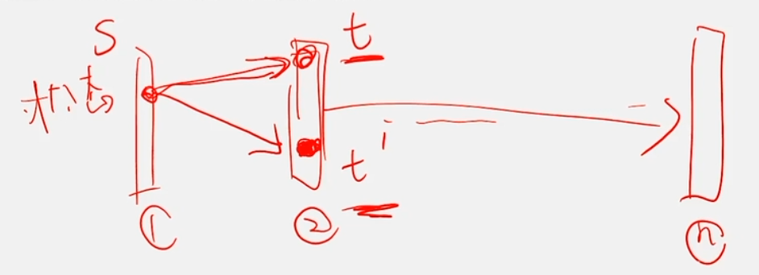
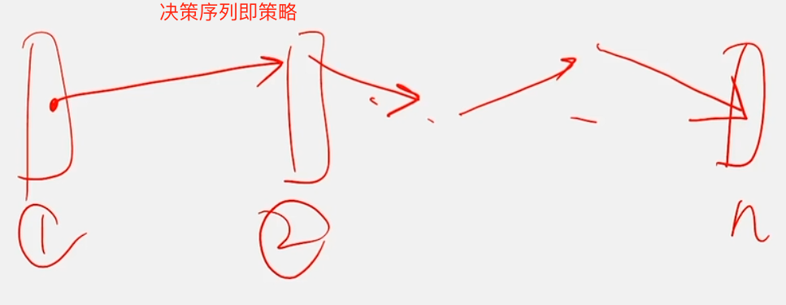

# 第1章 课程介绍
> 动态规划是运筹学课程的一部分
## 多阶段决策问题
有一类活动的过程，可以分成若干个互相联系的阶段，在它的每一阶段都需要作出决策，从而使整个过程达到最好的活动效果  

当然，每个阶段的决策的选取不是任意确定的，它依赖于当前的状态，又会影响以后的发展

> 如下图，`①、②...n`这些长条代表整体过程按指定条件划分的**阶段**，$s、t、t_1$代表阶段中对象的**状态**，$s--> t$或$s-->t_1$的箭头线代表阶段的转移即**决策**，可以看出**一个阶段到下一个阶段的决策是可能有多种的**，所以称为**多阶段决策问题**

当各个阶段决策决定以后，就组成一个**决策序列**，因而也就确定了整个过程的一个活动路线。

这种把一个问题看做事一个前后关联、具有链状结构的多阶段过程就称为多阶段决策过程，这种问题就称为**多阶段决策问题**

## 动态规划问题
> 寻找上述多阶段决策过程中**最优策略**(即最优链路)的过程就是动态规划

各个阶段采取的决策，一般来说是与阶段有关的。

决策依赖于当前的状态，又随即引起状态的转移。

一个决策序列就是在变化的状态中产生出来的。

称这种解决多阶段决策最优化的过程为**动态规划(Dynamic Programming，即DP)**

**动态规划**是对解最优化问题的一种途径、一种方法，而不是一种特殊方法

由于各种问题的性质不同，确定最优解的条件也各不相同，因此**不存在一种万能的动态规划算法可以解决各类最优化问题**

在学习动态规划问题时，除了要对基本概念和方法正确理解之外，还必须要对**具体问题具体分析**，以丰富的想象力去建立模型，用创造性的技巧去求解

我们将通过对若干有代表性的问题的动态规划算法进行分析、讨论，逐渐学会并掌握这一设计方法

进一步地，还会介绍一些常见的优化动态规划的时空复杂度的做法，从而冲刺高分，希望他同学们最好能够掌握

## 常见的DP问题类型
> 参考博客：[基本DP模型总结](https://blog.csdn.net/hzk_cpp/article/details/95927489)
+ **线性DP**：在一个序列上划分n个阶段求最佳策略
+ **区间DP**：以区间为状态，即$f[l][r]$表示区间$[l,r]$的答案.
+ **背包DP**：固定体积的背包，如何装不同价值的物品来达到价值最大
+ **数位DP**：统计满足一定条件的数的数量
  > 数位：把一个数字按照个、十、百、千等等一位一位地拆开，关注它每一位上的数字。如果拆的是十进制数，那么每一位数字都是 0~9，其他进制可类比十进制。
+ **状态压缩DP**：记录DP中简单状态(能用0和1表示)，一个最简单的方法是记录n个0/1，但这样子太麻烦了，可以把这n个0/1压成一个数，进而利用计算机中方便的二进制操作进行转移.
+ **树状DP**：简单的树形DP通常是设f[i]表示以i为根的子树，然后直接把所有儿子合并到父亲身上.

## 常见的DP优化方法
+ **节省时间**的优化方法
  + 矩阵乘法优化
  + 斜率优化
  + 四边形不等式优化
  + 决策单调性优化
+ **节省空间**的优化方法
  + 滚动数组优化
    > 滚动数组实际就是滑动窗口
+ 同时**优化时间和空间**的方法
  + 数据结构优化