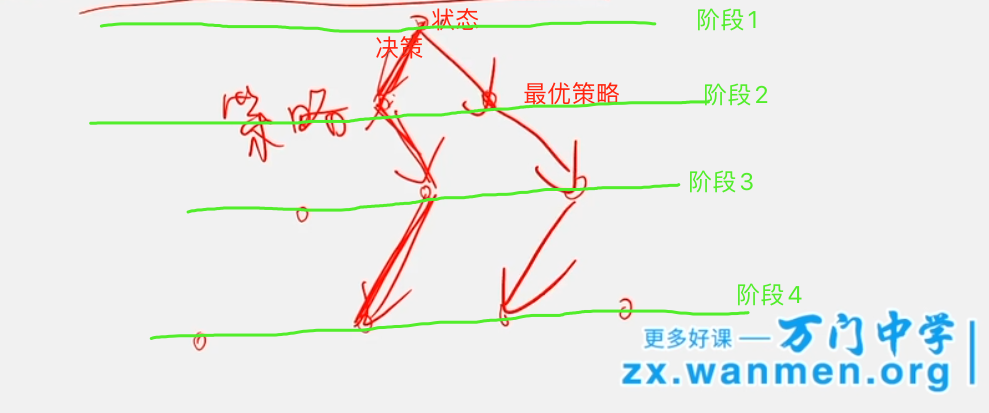
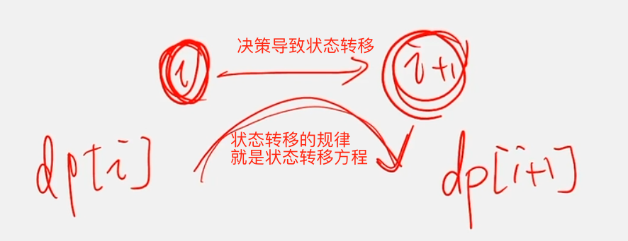
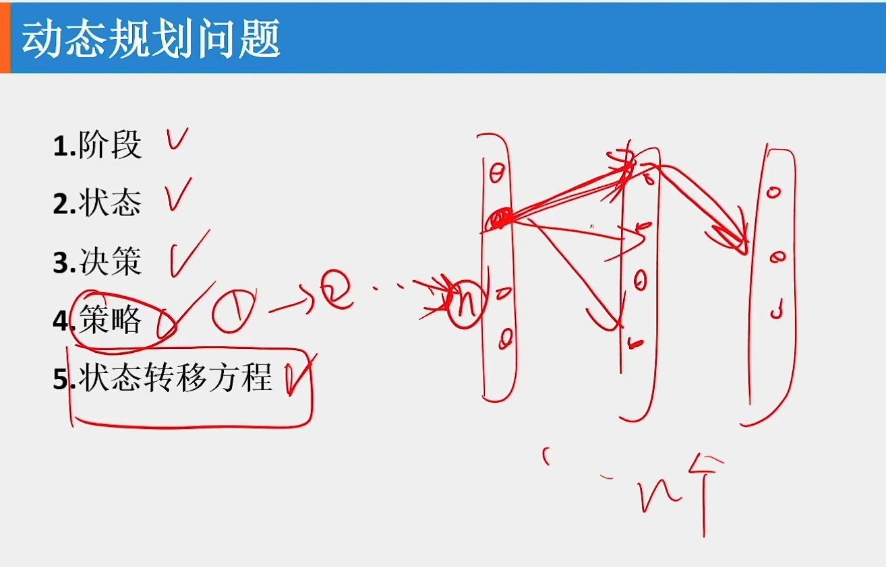

# 第02章 动态规划简介

## 2.1 动态规划的基本概念
> 阶段、状态、决策、策略、状态转移方程

### 1) 阶段和阶段变量
+ 将问题的全过程恰当地分成若干个相互联系的阶段`闫氏DP分析法：对应f[i][j]的ij遍历时形成的所有f[i][j]`
+ 阶段的划分一般根据时间和空间的自然特征去划分
+ 阶段的划分便于把问题转化成**多阶段决策**问题

### 2) 状态和状态变量
+ 通常一个阶段包含**若干**状态
  > 闫氏DP分析法：每个阶段分多种情况
+ 状态可由变量来描述

### 3) 决策、决策变量和决策允许集合
+ **决策**：在对问题的处理中作出的每种选择性的行动`闫氏DP分析法：对应状态计算`
  > 即从该阶段的每一个状态出发，通过一次选择性的行动转移至下一阶段的相应状态`对应闫氏DP分析法：即状态转移`

+ **决策变量**：一个实际问题可能需要有多次决策和多个决策点，在`每个阶段`的`每个状态`中都需要有一次决策，决策可以用变量来描述，称这种变量为决策变量

+ **决策允许集合**：在实际问题中，决策变量的取值范围

### 4) 策略和最优策略
> 对应闫式DP分析法的"属性：max、min、cnt"

+ **策略**：所有阶段依次排列构成问题的全过程，全过程中各阶段决策变量所组成的有序总体称为策略
  > 策略一般对应实际问题的一种解。简单说就是每个阶段选一个状态按照某种决策规律连起来组成的一条链路
+ **最优策略**：在实际问题中，从允许决策集合中找出最优效果的策略称为最优策略
  > 最优策略一般对应实际问题的最优解，这个也是大部分DP题目的目标

以数塔问题为例，举例如下：


### 5) 状态转移方程
> 上个阶段状态到下个阶段状态的决策规律
+ 前一阶段的终点的就是后一阶段的起点
+ 对前一阶段的状态做出某种决策，产生后一种阶段的状态
+ 这种关系描述了从i阶段到i+1阶段的演变规律，称为状态转移方程

> 即从dp[i]到dp[i+1]的计算公式



### 6) 举例


+ 1.阶段：长条
+ 2.状态：小圆圈
+ 3.决策：长条内的小圆圈转移到下一个长条内的小圆圈
    > 决策集合就是所有的转移可能，即图中的箭头
+ 4.策略：从第一个长条(`阶段`)到最后一个长条，每个长条选一个状态(`小圆圈`)用箭头(`决策`)连接起来的一条链路
    > 最优策略就是所有策略中满足最值的一条链路(最大值max、最小值min、计数cnt、是否存在exist的等)
+ 5.状态转移方程：从上一个状态到下一个状态的转移方程式，按照这个方程式得到的策略就是最优策略

> 结合上面总结的5个概念，来尝试解决两个问题

#### 举例1：从n个数的数组$a[n]$中取出k个数，使得他们的和最大
> $f[i][j]$表示从第1个数到第i个数之间，已经选取了j个数，其和最大的值

+ **阶段**：`阶段[i]`(即$f[i]$)指前i个数组成的序列
+ **状态**：j，即前i个数中选取了j个数，$0≤j≤i$
+ **决策**：可选的`决策集合`如下,`第i个数`表示前i个数的最后一个数，闫氏分析法叫"最后一个不同点"
  + A.**取**  $第i个数a[i]$到最终的j个数中：&nbsp;&nbsp; $f[i][j] = f[i - 1][j - 1] + f[i]$
  + B.**不取**$第i个数a[i]$到最终的j个数中：$f[i][j] = f[i - 1][j]$
+ **策略**：使得f[i][j]尽量大，即取决策A和B的较大者
  > 对应闫氏分析法的max
+ **状态转移方程**：满足最优策略的方程，即$f[i][j] = max\lbrace a[i] + f[i - 1][j - 1], f[i - 1][j]\rbrace$

#### 举例2：从n个数的数组a[n]中找出最长上升子序列的元素个数
> f[i]表示[a[0]~a[i]]组成的序列中且最后一个数是a[i]的最长上升子序列的长度
+ **阶段**：`阶段[i]`(即$f[i]$)指前i+1个数组成的序列，注意下标从0开始
+ **状态**：i前面某个位置j处的数a[j]，作为最长上升子序列的**前一个值**(`因为a[i]必须是最长上升子序列的最后一个值`)
  > 阶段内的多个状态就是指j在范围$0≤j<i$内取变所有值的对应a[j]
+ **决策**：根据a[j]是否小于a[i]，决定**a[j]是否在以a[i]结尾的上升子序列中**
  + $a[j] < a[i]$: 满足最长上升子序列要求，即**a[j]在以a[i]结尾的上升子序列中**，所以更新以a[i]结尾的最长子序列长度$f[i] = max\lbrace f[i], f[j] + 1 \mid 0≤j<i\rbrace$
  + $a[j] >= a[i]$：不满足最长上升子序列的要求，即**a[j]不在以a[i]结尾的上升子序列中**，不更新以a[i]结尾的最长子序列长度，直接跳过即可
+ **策略**：在$0≤j<i$范围内，不断根据a[j]的值刷新f[i]，获取f[i]的最大值
+ **状态转移方程**：$f[i] = max\lbrace f[i], f[j] + 1 \mid  0≤j<i\rbrace$

题目见：[300. 最长上升子序列](https://leetcode-cn.com/problems/longest-increasing-subsequence/)

```cpp
class Solution {
public:
    int lengthOfLIS(vector<int> &a) {
        if (a.empty()) return 0;

        int N = a.size();
        // f[i]表示[a[0]~a[i]]组成的序列中且最后一个数是a[i]的最长上升子序列的长度
        vector<int> f(N, 1); // 初始化一个都为1的二维数组,即每个元素至少自己都是一个上升子序列
        int res = 1; // 初始化最小值为1
        for (int i = 1; i < N; i++) {
            for (int j = 0; j < i; j++) {
                if (a[j] < a[i]) {
                    f[i] = max(f[i], f[j] + 1);
                }
            }
            res = max(res, f[i]);
        }
        return res;
    }
};
```

## 2.2 动态规划的性质
### 动态规划适用的问题需要满足的条件？
> 什么样的"多阶段决策问题"才可以用动态规划的方法来求解呢？前提是能**划分阶段**，然后必须满足下面两个条件
+ 1） **最优化原理**
  > 作为整个过程的最优策略，具有：无论过去的状态和策略如何，对前面的决策所形成的状态而言，余下的所有决策必须构成最优策略的性质，即
  + 子问题的局部最优会促成整个问题的全局最优
  + 问题具有最优子结构的性质
  + 一个问题的最优解只取决于其子问题的最优解
+ 2） **无后效性原则**
  + 某阶段的状态一旦确定，则此后过程的演变不再受此前各状态及决策的影响，即“**未来与过去无关**"
  + 当前的状态是此前历史的一个完整的总结，此前的历史只能通过当前的状态去影响过程在未来的演变，即"**未来只会被现在影响**”

### 不能用动态规划来做的题
> 误用动态规划会得到错误的结果
+ 对于不能划分阶段的题，不能用动态规划来解
+ 不符合最优化原理，不能用动态规划来解
+ 不具备无后效性原则的，不能用动态规划来解

### 动态规划的设计方法
+ **正推**：从**初始**状态开始，通过对中间阶段的决策的选择，达到**结束**状态，我们也称**递推**
+ **倒推**：从**结束**状态开始，通过对中间阶段的决策的选择，达到**开始**状态。我们可以把这种方法看成**记忆化搜索**

### 动态规划设计方法的一般模式
> 1和2相当于闫氏DP分析法的确定集合(即明确f[i][j]的含义，即状态表示)；3相当于闫氏DP分析法里的状态计算，即确定每个阶段的所有转移可能情况，然后获取目标的属性值(max、min、cnt等)
+ 1）划分阶段
+ 2）确定状态和状态变量
  > 一般是确定f[i][j]中j的**定义**(即`状态`)和**范围**(如$a≤j<b$即状态变量)
+ 3）确定决策并写出状态转移方程
  > 按照f[i][j]中i的定义确定决策集合，根据目标属性(max、min、cnt、存在等)得出状态转移方程
+ 4）寻找边界条件
  > 根据题目给出的变量范围，小心带入状态变量和决策集合的值到状态转移方程中，得到最终的目标属性值
+ 5）设计并实现程序
  > 写好、实现好1~4的步骤对应的代码，并通过一些动态规划的优化技巧进行性能提升

## 2.3 动态规划与记忆化搜索
### 记忆化搜索的概念
> 实现一个函数，用"搜索"的方式实现DP的更新，通常用于解决**状态转移顺序不方便人为确定**的DP

### 例题：[AcWing898:数字三角形](https://ac.nowcoder.com/acm/problem/107773)
> 题目大意：

输入一个n层的三角形，第i层有i个数，求从第1层到第n层的所有路线中，权值之和最大的路线。
规定：第i层的某个数只能连线走到第i+1层中与它位置相邻的两个数中的一个。

#### 普通递归实现，会超时，给的例子进入递归217次
```cpp
/**
 * 数塔问题
 * https://www.acwing.com/problem/content/900/
 */

#include <iostream>
#include <vector>

using namespace std;

#define INF 0x3f3f3f3f

/**
 * 分解为最优子结构问题，先求局部最优解
 * @param i 第i行(下标从0开始)
 * @param j 第j列(下标从0开始)
 * @return 从上往下到达元素nums[i][j]的最大路径和
 */
int SubSolve(vector<vector<int>> &nums, int i, int j) {
    if (i < 0 || j < 0) return 0; // 必须保证退出
    // 决策
    if (j - 1 >= 0) {
        if (j <= i - 1) { // 左上和右上元素都有
            return nums[i][j] + max(SubSolve(nums, i - 1, j), SubSolve(nums, i - 1, j - 1)); // 决策集合包括左上和右上两个元素
        } else { // 没有右上元素
            return nums[i][j] + SubSolve(nums, i - 1, j - 1); // 决策集合只有左上元素
        }
    } else { // 没有左上元素
        return nums[i][j] + SubSolve(nums, i - 1, j); // 决策集合只有右上元素
    }
}

/**
 * 统计最后一行的所有子问题最优解，其中最大的就是最终结果
 * @param nums 存储三角形的数组
 * @return 最大的路径和
 */
int Solve(vector<vector<int>> &nums) {
    int res = -INF;
    int n = nums.size();
    for (int j = 0; j < n; j++) {
        res = max(res, SubSolve(nums, n - 1, j));
    }
    return res;
}

int main() {
    int N;
    cin >> N;
    vector<vector<int>> v(N, vector<int>(N, 1e9)); // 二维数组初始化为很大的数，防止干扰数据判断
    for (int i = 0; i < N; i++) {
        for (int j = 0; j <= i; j++) {
            cin >> v[i][j];
        }
    }
    cout << Solve(v) << endl;
    return 0;
}
```

#### 记忆化搜索，虽然提高了效率，进入递归次数变成了87次，但是仍然超时
```cpp
/**
 * 数塔问题
 * https://www.acwing.com/problem/content/900/
 */

#include <iostream>
#include <vector>

using namespace std;

#define INF 0x3f3f3f3f

/**
 * 分解为最优子结构问题，先求局部最优解
 * @param i 第i行(下标从0开始)
 * @param j 第j列(下标从0开始)
 * @return 从上往下到达元素nums[i][j]的最大路径和
 */
int SubSolve(vector<vector<int>> &nums, int i, int j, vector<vector<int>> &dp) {
    if (i < 0 || j < 0) return 0; // 必须保证退出
    // 决策
    if (j - 1 >= 0) {
        if (j <= i - 1) { // 左上和右上元素都有
            dp[i][j] = nums[i][j] + max(SubSolve(nums, i - 1, j, dp), SubSolve(nums, i - 1, j - 1, dp)); // 决策集合包括左上和右上两个元素
        } else { // 没有右上元素
            dp[i][j] = nums[i][j] + SubSolve(nums, i - 1, j - 1, dp); // 决策集合只有左上元素
        }
    } else { // 没有左上元素
        dp[i][j] = nums[i][j] + SubSolve(nums, i - 1, j, dp); // 决策集合只有右上元素
    }
    return dp[i][j];
}

/**
 * 统计最后一行的所有子问题最优解，其中最大的就是最终结果
 * @param nums 存储三角形的数组
 * @return 最大的路径和
 */
int Solve(vector<vector<int>> &nums) {
    int res = -INF;
    int n = nums.size();
    vector<vector<int>> dp(n, vector<int>(n, -INF)); // 记忆数组，初始化为最小值
    for (int j = 0; j < n; j++) {
        res = max(res, SubSolve(nums, n - 1, j, dp));
    }
    return res;
}

int main() {
    int N;
    cin >> N;
    vector<vector<int>> v(N, vector<int>(N, 1e9)); // 二维数组初始化为很大的数，防止干扰数据判断
    for (int i = 0; i < N; i++) {
        for (int j = 0; j <= i; j++) {
            cin >> v[i][j];
        }
    }
    cout << Solve(v) << endl;
    return 0;
}
```

#### 动态规划实现，唯一不超时的实现
```cpp
/**
 * 数塔问题
 * https://www.acwing.com/problem/content/900/
 */

#include <iostream>
#include <vector>

#define INF 0x3f3f3f3f

using namespace std;

/**
 * 统计最后一行的所有子问题最优解，其中最大的就是最终结果
 * @param nums 存储三角形的数组
 * @return 最大的路径和
 */
int Solve(vector<vector<int>> &nums) {
    int res = -INF;
    int n = nums.size();
    vector<vector<int>> dp(n, vector<int>(n, -INF)); // 求最大距离，因此初始化为最小值
    dp[0][0] = nums[0][0];
    for (int i = 1; i < n; i++) { // 阶段
        for (int j = 0; j <= i; j++) { // 状态(变量)
            // 决策
            if (j - 1 >= 0) {
                if (j <= i - 1) { // 左上和右上元素都有
                    dp[i][j] = nums[i][j] + max(dp[i - 1][j], dp[i - 1][j - 1]); // 决策集合包括左上和右上两个元素
                } else { // 没有右上元素
                    dp[i][j] = nums[i][j] + dp[i - 1][j - 1]; // 决策集合只有左上元素
                }
            } else { // 没有左上元素
                dp[i][j] = nums[i][j] + dp[i - 1][j]; // 决策集合只有右上元素
            }
        }
    }
    for (int j = 0; j < n; j++) {
        res = max(res, dp[n - 1][j]);
    }
    return res;
}

int main() {
    int N;
    cin >> N;
    vector<vector<int>> v(N, vector<int>(N, -INF)); // 二维数组初始化为很大的数，防止干扰数据判断
    for (int i = 0; i < N; i++) {
        for (int j = 0; j <= i; j++) {
            cin >> v[i][j];
        }
    }
    cout << Solve(v) << endl;
    return 0;
}
```

#### 本问题的动态规划浅析
> $dp[i][j]$表示第i行第j列对应的最长路径和

+ **阶段**：$dp[i]$即第i行，每行为一个阶段
+ **状态**：$dp[i][j]$第j列，状态变量为j，其取值范围为$0≤j≤i$
+ **决策**：决策为当前状态dp[i][j]从哪个状态转移过来(不同的转移点即为`决策集合`)，分析题目可知可选的`决策集合`如下
  + A.从左上角转移过来：$dp[i][j] = nums[i][j] + dp[i - 1][j - 1]$
  + B.从右上角转移过来：$dp[i][j] = nums[i][j] + dp[i - 1][j]$
+ **策略**：最优策略是使得dp[i][j]尽量大，即取决策A和B的较大者
  > 对应闫氏分析法的max
+ **状态转移方程**：满足最优策略的方程，即$$dp[i][j] = max\lbrace nums[i][j] + dp[i - 1][j - 1], nums[i][j] + dp[i - 1][j]\rbrace$$，提取出$nums[i][j]$得到$$dp[i][j] = nums[i][j] + max\lbrace dp[i - 1][j - 1], dp[i - 1][j]\rbrace$$
+ **边界条件**：注意左上角点或右上角点不存在的情况，区分三种情况计算$dp[i][j]$


### 例题：[AcWing901：滑雪](https://www.acwing.com/problem/content/903/)
> 该题不能用动态规划做，因为没法划分状态
#### 纯递归，会超时
> 累计进入递归912次
```cpp
/**
 * 滑雪：不好划分阶段，只能用记忆化搜索做，不能用动态规划做
 * https://www.acwing.com/problem/content/903/
 */

#include <iostream>
#include <vector>

using namespace std;

int R, C;
int dirs[4][2] = {
        {0,  1},
        {1,  0},
        {-1, 0},
        {0,  -1}
};
vector<vector<int>> grid;
vector<vector<bool>> visited;

bool inGrid(int r, int c) {
    return r >= 0 && r < R && c >= 0 && c < C;
}

/**
 * 从位置(r, c)开始滑雪，看能滑的长度距离
 */
int solve(int r, int c) {
    visited[r][c] = true;

    int dis = 0; // (r, c的邻接点中可以滑雪的最大长度
    for (auto &dir : dirs) {
        int rNext = r + dir[0];
        int cNext = c + dir[1];
        if (inGrid(rNext, cNext) && !visited[rNext][cNext] && grid[rNext][cNext] < grid[r][c]) {
            int childMax = solve(rNext, cNext);
            dis = max(dis, childMax);
            visited[rNext][cNext] = false;
        }
    }
    return dis + 1; // + 1是因为当前点(r, c)也算一个距离
}

int main() {
    /** 1.初始化数据 */
    cin >> R >> C;
    grid.resize(R, vector<int>(C, 0));
    for (int i = 0; i < R; i++) {
        for (int j = 0; j < C; j++) {
            cin >> grid[i][j];
        }
    }

    /** 2.从每个点开始尝试DFS */
    int res = 0; // 求最大值，所以初始化为最小值
    for (int r = 0; r < R; r++) {
        for (int c = 0; c < C; c++) {
            visited.clear();
            visited.resize(R, vector<bool>(C, false)); // 访问数据重新初始化
            res = max(res, solve(r, c));
        }
    }
    cout << res << endl;
    return 0;
}
```

#### 记忆数组，仍然超时
> 累计进入递归65次
```cpp
/**
 * 滑雪：不好划分阶段，只能用记忆化搜索做，不能用动态规划做
 * https://www.acwing.com/problem/content/903/
 */

#include <iostream>
#include <vector>

using namespace std;

int R, C;
int dirs[4][2] = {
        {0,  1},
        {1,  0},
        {-1, 0},
        {0,  -1}
};
vector<vector<int>> grid;
vector<vector<bool>> visited;
vector<vector<int>> dp;

bool inGrid(int r, int c) {
    return r >= 0 && r < R && c >= 0 && c < C;
}

/**
 * 从位置(r, c)开始滑雪，看能滑的长度距离
 */
int solve(int r, int c) {
    visited[r][c] = true;
    if (dp[r][c] > 0) {
        return dp[r][c];
    }

    int dis = 0; // (r, c的邻接点中可以滑雪的最大长度
    for (auto &dir : dirs) {
        int rNext = r + dir[0];
        int cNext = c + dir[1];
        if (inGrid(rNext, cNext) && !visited[rNext][cNext] && grid[rNext][cNext] < grid[r][c]) {
            int childMax = solve(rNext, cNext);
            dis = max(dis, childMax);
            visited[rNext][cNext] = false;
        }
    }
    dp[r][c] = dis + 1; // + 1是因为当前点(r, c)也算一个距离
    return dp[r][c];
}

int main() {
    /** 1.初始化数据 */
    cin >> R >> C;
    grid.resize(R, vector<int>(C, 0));
    dp.resize(R, vector<int>(C, 0)); // 记忆每个子节点的状态
    for (int i = 0; i < R; i++) {
        for (int j = 0; j < C; j++) {
            cin >> grid[i][j];
        }
    }

    /** 2.从每个点开始尝试DFS */
    int res = 0; // 求最大值，所以初始化为最小值
    for (int r = 0; r < R; r++) {
        for (int c = 0; c < C; c++) {
            visited.clear(); // 如果之前赋值过，重新resize前务必记得clear一下，否则之前的数据仍然会存在
            visited.resize(R, vector<bool>(C, false)); // 访问数据重新初始化
            res = max(res, solve(r, c));
        }
    }
    cout << res << endl;
    return 0;
}
```

#### 记忆数组，去掉访问数组，通过
> 看来访问数组还挺耗性能呀
```cpp
/**
 * 滑雪：不好划分阶段，只能用记忆化搜索做，不能用动态规划做
 * https://www.acwing.com/problem/content/903/
 */

#include <iostream>
#include <vector>

using namespace std;

int R, C;
int dirs[4][2] = {
        {0,  1},
        {1,  0},
        {-1, 0},
        {0,  -1}
};
vector<vector<int>> grid;
vector<vector<int>> dp;

bool inGrid(int r, int c) {
    return r >= 0 && r < R && c >= 0 && c < C;
}

/**
 * 从位置(r, c)开始滑雪，看能滑的长度距离
 */
int solve(int r, int c) {
    if (dp[r][c] > 0) { // 遍历过直接返回了，起到了访问数组的作用
        return dp[r][c];
    }

    int dis = 0; // (r, c的邻接点中可以滑雪的最大长度
    for (auto &dir : dirs) {
        int rNext = r + dir[0];
        int cNext = c + dir[1];
        if (inGrid(rNext, cNext) && grid[rNext][cNext] < grid[r][c]) {
            int childMax = solve(rNext, cNext);
            dis = max(dis, childMax);
        }
    }
    dp[r][c] = dis + 1; // + 1是因为当前点(r, c)也算一个距离
    return dp[r][c];
}

int main() {
    /** 1.初始化数据 */
    cin >> R >> C;
    grid.resize(R, vector<int>(C, 0));
    dp.resize(R, vector<int>(C, 0)); // 记忆每个子节点的状态
    for (int i = 0; i < R; i++) {
        for (int j = 0; j < C; j++) {
            cin >> grid[i][j];
        }
    }

    /** 2.从每个点开始尝试DFS */
    int res = 0; // 求最大值，所以初始化为最小值
    for (int r = 0; r < R; r++) {
        for (int c = 0; c < C; c++) {
            res = max(res, solve(r, c));
        }
    }
    cout << res << endl;
    return 0;
}
```

#### 本问题不能用动态规划来做的原因浅析
> 因为**状态转移顺序不方便人为确定**，所以此题不能用动态规划来做。下面按照动态规划的步骤进行分析

> dp[i][j]表示第i行第j列的元素作为起点开始滑雪，能滑的最远距离

+ **阶段**：$dp[i]$即第i行，每行为一个阶段
+ **状态**：$dp[i][j]$第j列，状态变量为j，其取值范围为$0≤j＜C$
+ **决策**：决策为当前状态dp[i][j]从哪个状态转移过来(不同的转移点即为`决策集合`)，分析题目可知可选的`决策集合`如下(假设满足题目要求的其他限制条件地前提下，如必须高度递减往下滑和不能出边界等)
  + A.从左边转移过来：$dp[i][j] = grid[i][j - 1] + 1$
  + B.从右边转移过来：$dp[i][j] = grid[i][j + 1] + 1$
  + C.从上面转移过来：$dp[i][j] = grid[i - 1][j] + 1$
  + D.从下面转移过来：$dp[i][j] = grid[i + 1][j] + 1$

  > 从上面四种决策可知，要得到dp[i][j]，必须要先计算出i+1、i-1、j+1、j-1四种状态对应的值，但是dp中的for循环都是单向递增或递减的，不可能同时算出`i前面和后面`、`j前面和后面`的状态值，因此这四种决策无法同时得到，因此也就没有下面的最优策略计算了，故动态规划不能用了
