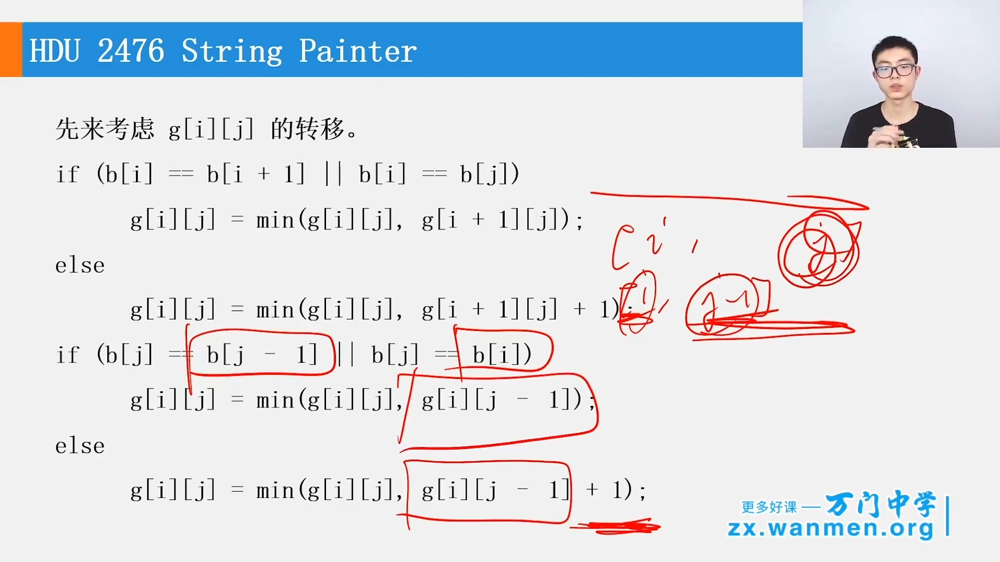
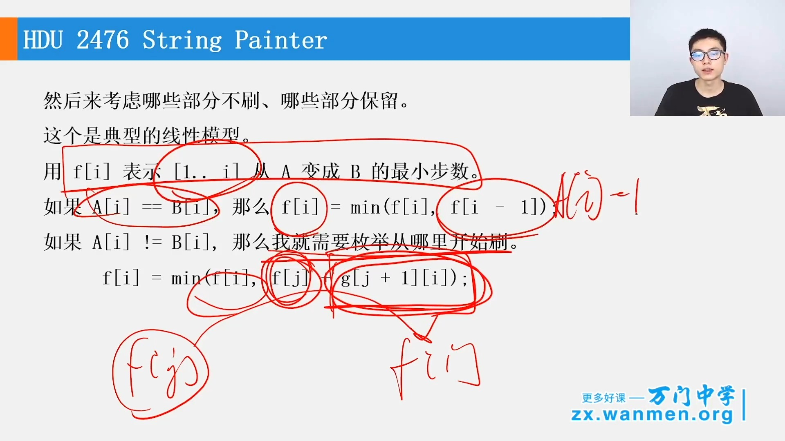

# 第03章_线性模型与区间DP
## 3.1 第03章_线性模型
### 基本概念
+ 这里的线性是指**状态的排布**是线性的
+ 线性模型是动态规划中最常用的模型

一般的代码模型是：
```java
for(int i = 0; i < n; i++) {
    for(j = 0; j < i; j++) {
        // Todo: 更新dp的具体逻辑
    }
}
```

### 最典型的一个例题：最长上升子序列
> 见[第02章_动态规划简介.md#举例2从n个数的数组a中找出最长上升子序列的元素个数](第02章_动态规划简介.md#举例2从n个数的数组an中找出最长上升子序列的元素个数)

### 另一个例题：[POJ3486 买电脑](https://ac.nowcoder.com/acm/problem/108083)
> 假设上一次买电脑是第j年，那么`1~j-1`年就是一个子问题，我们已经算出了`f[j-1]`是满足这个问题的最优解，后面我们就不用考虑前`j-1`年的情况，且他们也不会影响我们后面的决策，即满足`最优子问题`和`无后效性原则`，所以可以用动态规划来做

#### 题干概括
要求n年中每年你都要有电脑可用，每年你都可以选择购买一台新电脑，其固定费用是c。同时维护这台电脑从当前第x年到第y年的总费用是m(x,y)  （也就是在第x年到第y年内不需要再花费别的钱维护或者购置）。问最少花费多少才能满足要求。

题目数据多组，先输入费用c，之后输入n，后面输入n行数据，假设行号为$0≤x＜n$，则每行的数据表示第x年买电脑后，后面[x, n)期间几年的累计维修费。

#### 示例数据解析
```yaml
3 # 买一台新电脑的花费
3 # 打算在3年间都保持有电脑可用
5 7 50 # 第0年(即一开始)就买电脑，在1、2、3年间时累计的维修费
6 8 # 第1年买电脑，在第2、3年间的维修费
10 # 第2年买电脑，在第3年的维修费
```

#### 动态规划分析
> dp[i]表示第i年产生的所有电脑花费(不管买多少电脑和花多少维修费)
+ **阶段**：dp[i]即前i年。$0≤i＜n$
+ **状态**：状态变量为j，表示在前i年的第j年买了新电脑，$0≤j<i$
+ **决策**：j所有的取值产生的花费情况
  > 第j年买电脑，则前i年的总花费分为两个阶段
  + [0, j)年：即前j-1年的电脑花费，从dp的定义可知公式为 $dp[j - 1]$
  + [j, i)年：即`此段时间内的维修费用+买一台新电脑的费用`为 $m[j][i] + c$
+ **策略**：求所有决策中花费最小的情况，即最优策略是对应闫氏DP分析法中min情况
+ **状态转移表达式**：满足最优策略，则表达式为$$dp[i] = min\lbrace dp[i], dp[j-1] + m[j][i] + c \mid 0≤i＜n 并且 0≤j<i \rbrace$$


#### 代码实现
```cpp
/**
 * 买电脑
 * https://ac.nowcoder.com/acm/problem/108083
*/
#include <iostream>
#include <vector>

#define INF 0x3f
#define MAX_YEAR 10050

using namespace std;
int c, n;

int m[MAX_YEAR][MAX_YEAR], dp[MAX_YEAR];; // 数组尽量不要用vector，因为用例每次跑回累积上一次的结果的，用vector还得记得清理

int solve() {
    memset(dp, INF, sizeof(dp)); // 初始化为最大值
    dp[0] = 0; // 没有电脑花费自然为0
    for (int i = 1; i <= n; i++) { // 阶段i
        for (int j = 1; j <= i; j++) { // 状态j
            dp[i] = min(dp[i], dp[j - 1] + m[j][i] + c); // 状态j转移中更新最小值
        }
    }
    return dp[n];
}

int main() {
    // 用scanf和printf而不是cin和cout，性能会提高很多(从1563ms降到了344ms)
    while (scanf("%d%d", &c, &n) != EOF) { // 还没读到结尾就继续读,因为可能有多组数据
        for (int i = 1; i <= n; i++) { // 因为题目中说明了m[i][j]中的i和j都是从下标1开始
            for (int j = i; j <= n; j++) {
                scanf("%d", &m[i][j]); // 注意i和j的顺序
            }
        }
        printf("%d\n", solve());
    }
    return 0;
}
```

## 3.2 区间DP
### 基本概念
区间DP，顾名思义，就是在区间上的DP

一般是先算出小区间的DP得到最优解，再去得到大区间的最优解

一般的状态是假设`f[i][j]`是区间`[i, j]`的最优解，那么`f[i][j]`都可以由`[i, j]`的自区间的最优解更新得到

通用的模板如下:
```cpp
 // 直接dp，要先计算小区间的答案
int cal() {
    for (int i = 1; i <= n; i++) f[i][i] = 0; // 区间长度为1，即只有一堆，不需要额外费体力
    for (int len = 2; len <= n; len++) { // 闭区间的区间长度
        for (int i = 1; i + len - 1 <= n; i++) { // 注意是闭区间，所以计算区间长度需要减1。i + len - 1即表示区间右侧端点j，其值要小于总的区间最右端点n
            int j = i + len - 1; // [i, j], j - i + 1 = len，可以推导出j = i + len - 1
            for (int k = i; k < j; k++) { // 枚举区间内的点作为分隔点
                // Todo:根据具体问题更新f的值
            }
        }
    }
    return f[1][n];
}
```

### 例题1：[KOJ6023_合并果子-改](https://www.cnblogs.com/xiao-ju-ruo-xjr/p/5872582.html)
> 注意是**相邻**两堆才能合并，所以不能使用贪心(每次选择质量最小的两堆合并，合并完再加入到优先队列中....如此反复，直到只剩一堆)搞，[148.合并果子](https://www.acwing.com/problem/content/submission/code_detail/5967373/)就是这个思路
#### 试题描述

> 在一个果园里，多多已经将所有的果子打了下来，而且按果子的不同种类分成了不同的堆。多多把这些果子堆排成一排，然后所有的果子合成一堆。

> 每一次合并，多多可以把**相邻**两堆果子合并到一起，消耗的体力等于两堆果子的重量之和。可以看出，所有的果子经过n-1次合并之后，就只剩下一堆了。多多在合并果子时总共消耗的体力等于每次合并所耗体力之和。

> 因为还要花大力气把这些果子搬回家，所以多多在合并果子时要尽可能地节省体力。假定每个果子重量都为1，并且已知果子的种类数和每种果子的数目，你的任务是设计出合并的次序方案，使多多耗费的体力最少，并输出这个最小的体力耗费值。

> 例如有3种果子，数目依次为1，2，9。可以先将1、2堆合并，新堆数目为3，耗费体力为3。接着，将新堆与原先的第三堆合并，又得到新的堆，数目为12，耗费体力为12。所以多多总共耗费体力=3+12=15。可以证明15为最小的体力耗费值。

#### 输入

包括两行，第一行是一个整数n，表示果子的种类数。第二行包含n个整数，用空格分隔，第i个整数$a_i(1≤a_i≤20000)$是第i种果子的数目。

#### 输出

包括一行，这一行只包含一个整数，也就是最小的体力耗费值。输入数据保证这个值小于2^63。

#### 输入示例
```txt
4
1 2 5 2
```
#### 输出示例
```txt
20
```

#### 分析
> 区间DP是上来先把问题缩小为区间$[i, j]$上的问题，本问题中$f[i][j]$来表示合并[i, j]即第i堆到第堆果子合并产生的最小代价
+ **阶段**：区间[i, j]组成的不同区间
  > i和j的枚举通过固定区间长度，变化i和j来实现
+ **状态**：状态变量为k，表示区间的分隔线，$i≤k≤j$，此时区间分割为两部分$[i, k]$和$[k + 1, j]$
+ **决策**：区间分隔点k的不同，决定了$f[i][k]→f[i][j]$和$f[k + 1][j]→f[i][j]的不同转移方向$
+ **策略**：枚举所有的k，获取$f[i][k]→f[i][j]$和$f[k + 1][j]→f[i][j]$的最优转换策略(体力耗费值最小)
+ **状态转移表达式**：
  > 根据$f[i][j]$的定义，生成$[i, k]$和$[k + 1, j]$这两堆本身就会花费$f[i][k] + f[k + 1][j]$的代价(经过这些代价花费，[i, j]区间内的果子才合并成了$[i, k]$和$[k + 1, j]$两堆)。

  > 而合并这两堆过程中新花费的代价与k没有关系，因为就是$a[i] + a[i + 1] + a[i + 2] + ...... + a[j]$，用前缀和s表示就是$s[j] - s[l - 1]$

  > 因此我们得到动态规划的状态转移公式是：$f[i][j] = min \lbrace f[i][j], f[i][k] + f[k + 1][j] + s[j] - s[i - 1] \mid 1 ≤ len ≤ n, 1 ≤ i ≤ n - len + 1, i ≤ k ≤ j \rbrace$

#### 代码实现

```cpp
#include <iostream>
#include <climits>

using namespace std;
#define MAX_N 110
int n, a[MAX_N], s[MAX_N], f[MAX_N][MAX_N];

int solve()
{
    for (int i = 1; i <= n; i++) {
        f[i][i] = 0;  // 区间长度只有1，即只有一堆，不需要额外费体力
    }
    for (int len = 2; len <= n; len++) {  // 枚举闭区间的区间长度
        int j;
        for (int i = 1; (j = i + len - 1) <= n; i++) {  // 注意是闭区间，所以计算区间长度需要减去1. j-i+1=len所以j=i+len-1
            int j = i + len - 1;
            for (int k = i; k < j; k++) {
                f[i][j] = min(f[i][j], f[i][k] + f[k + 1][j] + s[j] - s[i - 1]);
            }
        }
    }
    return f[1][n];
}

int main()
{
    scanf("%d", &n);
    a[0] = 0, s[0] = 0;
    for (int i = 1; i <= n; i++) {
        scanf("%d", &a[i]);
        s[i] = s[i - 1] + a[i];
    }
    for (int i = 0; i <= n; i++) {
        for (int j = 0; j <= n; j++) {
            f[i][j] = INT_MAX;
        }
    }
    printf("%d\n", solve());
    return 0;
}
```

### 例题2：括号匹配
> 给定一个只有`(`、`)`、`[`、`]`四种字符的字符串S，取出一个最长的子序列(`不一定连续`)使得他们满足括号匹配，比如`([]])`结果是4，`([][][)`结果是6

> 区间DP是上来先把问题缩小为区间$[i, j]$上的问题，本问题中$f[i][j]$来表示区间[i, j]中的最长匹配子序列长度
+ **阶段**：区间[i, j]组成的不同区间
  > i和j的枚举通过固定区间长度，变化i和j来实现
+ **状态**：状态变量为k，表示区间的分隔线，$i≤k≤j$，此时区间分割为两部分$[i, k]$和$[k + 1, j]$
+ **决策**：区间分隔点k的不同，决定了$f[i][k]→f[i][j]$和$f[k + 1][j]→f[i][j]的不同转移方向$
+ **策略**：枚举所有的k，获取$f[i][k]→f[i][j]$和$f[k + 1][j]→f[i][j]$的最优转换策略(长度最大max)
+ **状态转移表达式**：
  > 分两种情况，注意这两种情况不是互斥的关系
  + S[i]和S[j]匹配，那么$f[i][j] = f[i + 1][j - 1] + 2$
  + 也可以由两个子区间的答案合并而来，即$f[i][j] = max(f[i][j], f[i][k] + f[k + 1][j])$

> 代码实现如下
```cpp
#include <iostream>

using namespace std;

#define MAX_N 500

int f[MAX_N][MAX_N];

/**
 * ([]])   4
 * ([][][) 6
 */
int solve(string &s)
{
    int n = s.length();
    for (int len = 2; len <= n; len++) {
        int j;  // 区间[i, j]的长度为len = j - i + 1，移项可以得到j = i + len -1
        for (int i = 1; (j = i + len - 1) <= n; i++) {
            if ((s[i] == '(' && s[j] == ')') || (s[i] == '[' && s[j] == ']')) {
                // 如果区间左右端点可以配成一对的话，更新动态规划结果
                f[i][j] = f[i + 1][j - 1] + 2;
            }
            // 经典区间dp过程，枚举区间[i, j]内端点
            for (int k = i; k < j; k++) {  // 注意下面有k+1，所以k不能是k≤j
                f[i][j] = max(f[i][j], f[i][k] + f[k + 1][j]);
            }
        }
    }
    return f[1][n];
}

int main()
{
    string s;
    cin >> s;
    s = " " + s; // 加一个空格是为了下标从1开始
    cout << solve(s) << endl;
    return 0;
}
```

## 3.3~3.6 知识精练

### [POJ1159 Palindrome](https://ac.nowcoder.com/acm/problem/105756)
> 一个字符串最少添加几个字符变成回文串。典型的区间问题，代码如下，注意下标从0开始.

> f[i][j]表示s[i...j]子字符串最少添加几个字符变成回文串

+ **阶段**：区间[i,j]，i和j的不同形成不同的区间，对应不同的子字符串s[i...j]
+ **状态**：s[i]是否等于s[j]
+ **决策**：s[i]等于或者不等于s[j]决定了不同的状态迁移
+ **策略**：枚举所有可能的i和j，$0≤i＜n$ and $i＜j＜n$，在每一对i和j都找到最小的f[i][j]，最终f[0][n-1]就是最优策略对应的值(min：最少插入的字符个数)
+ **状态转移表达式**：把当前阶段根据S[i]和S[j]是否相等来分情况讨论
  + $s[i] == s[j]$时，显然有$f[i][j] = f[i + 1][j - 1]$
    > s[i]==s[j]说明s[i]和s[j]已经对应，这两个字符可以不用管了，问题转换为区间$[i + 1, j - 1]$添加多少个字符变成回文串，根据$f[i][j]$的定义显然就是等效求$f[i+1][j-1]$了
  + $s[i] != s[j]$时，在左侧补上和右端点相同的字符，或者在右侧补上和左端点相同的字符，都可以让新的左右端点满足回文串要求，添加了一个字符，所以最后 + 1。即$f[i][j] = min(f[i][j - 1], f[i + 1][j]) + 1$
    + 在左侧补上和右端点相同的字符，即`补上的字符==s[j]`,这俩字符已经对称，问题转换成区间$[i, j - 1]$补多少个字符变成回文串即$f[i][j - 1]$
    + 在右侧补上和左端点相同的字符，即`补上的字符==s[i]`,这俩字符已经对称，问题转换成区间$[i + 1, j]$补多少个字符变成回文串即$f[i + 1][j]$
    + 状态f[i][j]应该是取上面两种情况的较小值 + 补上的一个字符，即得到状态转移表达式：$$f[i][j] = min(f[i][j - 1], f[i + 1][j]) + 1$$

> 区间DP实现如下，但是没有枚举len，是因为i是从大到小地，`(j = i + len - 1) <= n;`会导致提前退出

```cpp
#include <iostream>

using namespace std;

#define MAX_N 5010
int n; // 字符串长度
string s; // 字符串
// f的初始化隐含了一步，i==j即字符串长度为1时自动初始化为0了，即不需要加字符已经是回文串了，对于下面的if判断很重要
short f[MAX_N][MAX_N];// 如果直接DP，需要开5001*5001的数组，用int会超内存,可以用滚动数组优化将第一维度降为2

int solve() {
    // i == j是表示只有一个字符，区间长度为1的已经在f中自动初始化为0了
    for (int i = n - 1; i >= 0; i--) { // 之所以i从n-1向0从大到小遍历，就是为了能先计算出i+1；
        for (int j = i + 1; j < n; j++) { // j从i向n从小到大遍历，就是为了能先计算出j - 1
            if (s[i] == s[j]) {
                f[i][j] = f[i + 1][j - 1];
            } else {
                // 第一次走到这里不会出错是因为f的初始化隐含了一步，i==j即字符串长度为1时自动初始化为0了
                f[i][j] = min(f[i][j - 1], f[i + 1][j]) + 1; // f[i][j - 1]和f[i + 1][j]肯定都提前算好了
            }
        }
    }
    return f[0][n - 1];
}

int main() {
    cin >> n >> s;
    cout << solve() << endl;
    return 0;
}
```

### [UVA10617 Again Palindrome](https://www.luogu.com.cn/problem/UVA10617)
>给出一个字符串 s，你可以删除一些字符，使得剩下的字符串是一个回文串。求有多少种不同的删字符的方案。其实就是求子串中回文串的个数

> $f[i][j]$表示$s[i..j]$之间的回文串个数

+ **阶段**：区间[i,j]，i和j的不同形成不同的区间，对应不同的子字符串s[i...j]
+ **状态**：s[i]是否等于s[j]
+ **决策**：s[i]等于或者不等于s[j]决定了不同的状态迁移
+ **策略**：枚举所有可能的i和j，$0≤i＜n$ and $i＜j＜n$，在每一对i和j都找到$S[i..j]$之间的回文串个数，目标是cnt(`计数`)，最终$f[0][n-1]$就是最优策略对应的值(cnt：回文串个数)
+ **状态转移表达式**：根据s[i]和s[j]是否相等来分情况讨论
  + 如果$s[i] == s[j]$, 那么
    - ①统计$f[i + 1][j]$和$f[i][j - 1]$，会把$f[i + 1][j - 1]$统计两次，需要扣除一次，表达式为：$$f[i + 1][j] + f[i][j - 1] - f[i + 1][j - 1]$$
    - ② $f[i + 1][j - 1]$中的回文串正好可以再加上S[i]和S[j]再形成$f[i + 1][j - 1]$个与①完全不同的回文串,表达式为：$$f[i + 1][j - 1]$$
    - ③ s[i]和s[j]这两个本身就可以构成1个回文串：1
    - ④ $$f[i][j] = ① + ② + ③$$ $$ = (f[i + 1][j] + f[i][j - 1] - f[i + 1][j - 1]) + (f[i + 1][j - 1]) + 1$$ $$= f[i + 1][j] + f[i][j - 1] + 1$$
  + 如果$S[i] != S[j]$, 那么
    + 要统计$f[i + 1][j]$和$f[i][j - 1]$，会把$f[i + 1][j - 1]$统计两次，此时$f[i + 1][j - 1]$中的回文串就不能可以再加上s[i]和s[j]形成一个新的回文串了，所以需要减掉多算的部分，$$f[i][j] = f[i + 1][j] + f[i][j - 1] - f[i + 1][j - 1]$$
      > s[i]和s[j]两个字符自然也不能形成回文串了，因此+1也不需要了


> 区间DP实现如下：

```cpp
#include <iostream>

using namespace std;
#define MAX_N 70
long long f[MAX_N][MAX_N];

/**
 * 注意下面这个用例，用int的话会溢出的
 * 1
 * AAAAAAAAAAAAAAAAAAAAAAAAAAAAAAAAAAAAAAAAAAAAAAAAAAAAAAAAAAAA
 * 结果：1152921504606846975
 */
long long solve(string &s) {
    int n = s.length();
    for (int i = 0; i < n; i++) {
        f[i][i] = 1; // 字符串只有一个字符时，回文串就是其本身
    }
    for (int len = 2; len <= n; len++) {
        int j;
        for (int i = 0; (j = i + len - 1) < n; i++) {
            if (s[i] == s[j]) {
                f[i][j] = f[i + 1][j] + f[i][j - 1] + 1;
            } else {
                f[i][j] = f[i + 1][j] + f[i][j - 1] - f[i + 1][j - 1];
            }
        }
    }
    return f[0][n - 1];
}

int main() {
    int N;
    cin >> N;
    while (N-- > 0) {
        string s;
        cin >> s;
        cout << solve(s) << endl;
    }
    return 0;
}
```

### [HDU2476 String Painter](https://www.luogu.com.cn/problem/UVA1437)
> 给定两个字符串A和B，和一个刷子，刷子每次可以把一个区间都刷成同一个字符

> 区间DP + 线性DP

>   一开始，我们用f[i][j]表示字符串a[i...j]变成b[i...j]的最小步数，发现这样并不方便转移，因此我们引入一个空串
+ 状态表示与计算：
  + **区间DP**：用g[i][j]表示从空串变成b[i...j]的最小步数
    + 按照边界特征刷新dp值
        + 如果$b[i] == b[j]$，即区间两端点相等，只需要刷区间[i, j - 1]即可，表达式为：$$g[i][j] = g[i][j - 1];$$
        + 如果$b[i] != b[j]$，即区间两端点不等，在刷完区间[i, j - 1]之后，还需要额外刷一次j位置，所以表达式为：$$g[i][j] = g[i][j - 1] + 1;$$
    + 按照区间dp的套路，枚举区间[i, j]的每个点k，不断更新dp值
  > 然后确定哪些部分保留原来的a、哪些部分需要重刷
  + **线性DP**：然后来考虑哪些部分不刷、哪些部分保留，用f[i]表示从a[1...i]变成b[1...i]的最小步数
    + 如果$a[i]==b[i]$，那么$f[i] = f[i - 1]$
    + 如果$a[i]!=b[i]$，那么久需要枚举区间内的点k从哪里开始刷(1...k)步数最少，此时$$f[i] = min(f[i], f[k - 1] + g[k][i]) | i≤k≤j$$

> 区间dp即g[i][j]的计算


> 线性dp即f[i]的实现



> 参考博客：https://blog.csdn.net/ldw201510803006/article/details/60469908
```cpp
#include<cstdio>
#include<cstring>
#include<algorithm>

#define MAXN 105 // 字符串的最大长度

using namespace std;
int g[MAXN][MAXN];
char a[MAXN], b[MAXN];
int f[MAXN];

int main()
{
    while (scanf("%s%s", a + 1, b + 1) == 2) {
        memset(g, 0, sizeof(MAXN)); // 二维数组的初始化，非常值得学习
        int n = strlen(a + 1);

        /* 1.区间DP */
        for (int i = 1; i <= n; i++)g[i][i] = 1;
        for (int len = 2; len <= n; len++) {
            // 长度
            for (int i = 1; i <= n - len + 1; i++) {  // 起点i
                int j = i + len - 1;   // 终点j
                // 1.1 考虑区间[i, j - 1]
                if (b[i] == b[j]) { // 区间端点相等，只需要刷区间[i, j - 1]即可
                    g[i][j] = g[i][j - 1];
                } else { // 不相等，那么j位置需要额外多刷一次
                    g[i][j] = g[i][j - 1] + 1;
                }
                // 1.2 枚举k，k ∈ [i, j]，因为下面有k + 1，所以不能是k≤j
                for (int k = i; k < j; k++) {    //找分割点
                    g[i][j] = min(g[i][j], g[i][k] + g[k + 1][j]);
                }
            }
        }

        /* 2.线性DP */
        for (int i = 1; i <= n; i++) { // 初始化为从空串到a[1...i]的需要的步数，下面刷新后只会更小
            f[i] = g[1][i];
        }

        for (int i = 1; i <= n; i++) {
            if (a[i] == b[i]) {
                f[i] = f[i - 1];
            } else {
                for (int k = 1; k < i; k++) {
                    f[i] = min(f[i], f[k] + g[k + 1][i]);
                }
            }
        }
        printf("%d\n", f[n]);
    }
    return 0;
}
```

### [HDU1421 搬寝室](http://acm.hdu.edu.cn/showproblem.php?pid=1421)
> 先排序，然后用线性DP

因为是n个物品中选2k个，然后分成k组，直接DP不好找状态，需要先挖掘题目的性质，考虑选出了2k个行李后如何分组可以最小化疲惫度之和

如果有四个行李，重量从小到大分别是a、b、c、d，显然(a, b)和(c, d)的分组最优，因此2k个行李一定是先从小到大排序，然后依次取两个配对

这样一开始我就可以对n个物品的重量排序，这样就方便设计状态了

+ 状态表示：
  + 阶段：f[i][j]，表示从前i个物品中选出了j对
  + 目标：min(从前i个物品中选出了j对的疲惫度最小值)

+ 状态计算：计算f[i][j]的时候，一定是考虑了第i个取不取
  + 如果取第i个，那么一定是和第i-1个配对，因此就要求前i-2个物品中选出了j-1对，$f[i][j] = min(f[i][j], f[i - 2][j - 1] + (a[i] - a[i - 1]) * (a[i] - a[i - 1]))$
  + 如果不取第i个，那么$f[i][j] = f[i - 1][j]$

循环所有阶段取上面的最小`f[i][j]`即可

> 下面是Java的实现，注意可能一次会有多个用例，所以需要`sc.hasNext()`进行检测
```java
public class Main {
    public static void main(String[] args) {
        Scanner sc = new Scanner(System.in);
        int INF = 0x3f3f3f3f;
        while (sc.hasNext()) {
            int n = sc.nextInt(), k = sc.nextInt();
            int[] a = new int[n + 1];
            for (int i = 1; i <= n; i++) {
                a[i] = sc.nextInt();
            }
            Arrays.sort(a, 1, n + 1); // 务必记得排序
            int[][] f = new int[n + 1][n + 1];
            for (int[] g : f) {
                Arrays.fill(g, INF);
            }
            for (int i = 0; i <= n; i++) f[i][0] = 0; // 只要取0对，疲惫度肯定为0
            for (int i = 2; i <= n; i++) {
                int tire = (a[i] - a[i - 1]) * (a[i] - a[i - 1]); // 计算这种情况下的疲惫度，即为相邻两个点的差值平方
                for (int j = 1; j * 2 <= i; j++) {
                    f[i][j] = Math.min(f[i - 2][j - 1] + tire, f[i - 1][j]);
                }
            }
            System.out.println(f[n][k]);
        }
    }
}
```