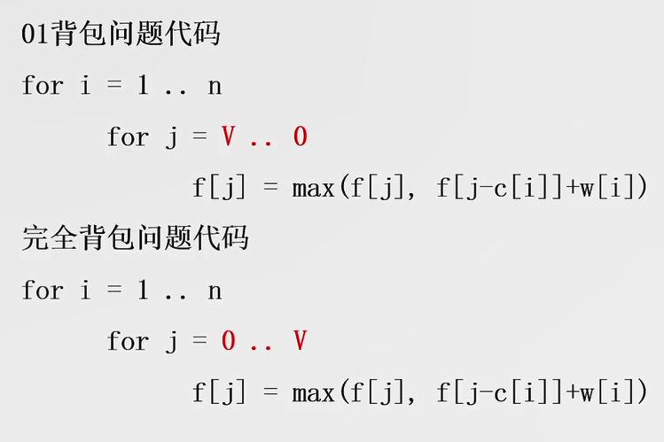

# 01_背包问题
## 一、01背包问题
> 有N件物品和一个容量为V的背包，第i件物品的体积是v[i]、价值是w[i]，**每种物品只可以使用一次**，求将哪些物品放入背包可以使得价值总和最大。这里的w是weight即权重的意思

[题目链接](https://www.acwing.com/activity/content/problem/content/997/1/)

### 闫氏DP分析法的流程如下：

+ **状态表示**：f[i][j]：
  + 集合
    + 所有选法。因为"01"就是指每种物品要么选要么不选
    + 条件：我们定义状态$f[i][j]$表示**从前i件物品中选出容量不超过j的背包能获得的最大价值**
      + i表示：只从前i个物品中选
      + j表示：$总体积 ≤ j$
  + 属性：求最大值max，即所有选法中价值总和最大的价值
+ **状态计算**，集合再次分情况划分子集合，**根据第i个物品选还是不选(`即最后一个不同点，不同之处就是一个含有i一个不含有i`)**，分成两种情况
  + 不选第i个物品，$f[i][j] = f[i - 1][j]$，即从剩余的i-1个物品中选取容量总和为j的物品，其价值即为最大价值
  + 选第i个物品，$f[i][j] = f[i - 1][j - v[i]] + w[i]$，即从剩余的i-1个物品中选取容量总和不超过$j - v[i]$的物品，其价值加上第i个物品的价值w[i]即为最大价值

  取上面**所有情况的最大者**即为f[i][j]的值，即**前i件物品中选出容量不超过j的背包能获得的最大价值**$f[i][j] = max(f[i - 1][j - v[i]] + w[i], f[i - 1][j])$，最终的返回值是$f[N][V]$`前N件物品中选出容量不超过V的背包能获得的最大价值，正是我们的题目要求`

> 初始化与返回值如下：

+ 初始化：$f[0][0] = 0$
+ 返回值：即求最大值，返回$f[N][V]$即可

> 上面的朴素解法如下：
```java
import java.util.*;

public class Main {
    public static void main(String[] args) {
        Scanner s = new Scanner(System.in);
        int N = s.nextInt(), V = s.nextInt();
        int[] v = new int[N + 1];
        int[] w = new int[N + 1];
        for(int i = 1; i <= N; i++) {
            v[i] = s.nextInt();
            w[i] = s.nextInt();
        }
        int[][] f = new int[N + 1][V + 1];
        
        // DP求最大值
        for(int i = 1; i <= N; i++) {
            for(int j = 0; j <= V; j++) {
                // 务必考虑j与v[i]的大小关系
                if(j >= v[i]) f[i][j] = Math.max(f[i - 1][j], f[i - 1][j - v[i]] + w[i]); // 剩下的容量能放地下第i个物品，需要考虑选i和不选i两种情况
                else f[i][j] = f[i - 1][j]; // 当前的容量存不下第i个物品，直接从剩下的i-1个物品中接着选
            }
        }
        // 最终的返回值是f[N][V]前N件物品中选出容量不超过V的背包能获得的最大价值，正是我们的题目要求
        System.out.println(f[N][V]);
    }
}
```

### 上面求f[i][j]的时空复杂度都是$O(NV)$，这是有点高的，如何优化呢？

注意到每次我们都是从$f[i - 1]$递推到$f[i]$，可以只用O(V)的空间存下一步的f吗？即下一轮的i覆盖上一轮的i，i这一维度只保留长度为1即可，进一步可以直接把第一层去掉，只用j这个第二维度，伪代码如下：
```java
for(int i = 1; i <= N; i++) {
    for(int j = V; j >= v[i]; j--) { // 这里的V为什么是从大到小呢？下面会讲解地
        f[j] = Math.max(f[j], f[j - v[i]] + w[i]);
    }
}
```
这里的V为什么是从大到小呢？因为这样每次计算f[j]的时候，f[V...j+1]已经是新的一轮的值了，而$f[j]$和$f[j - v[i]]$(分别压缩前的`f[i - 1][j]`和`f[i - 1][j - v[i]]`)肯定还没被更新，即为上一轮的值，用上一轮的值更新本轮的值，这样才符合动态规划的套路.

如果V从小到大，那么$f[j - v[i]]$就会在计算$f[j]$之前被更新了，这样会导致不能用上一轮的值更新本轮的值，显然不符合动态规划的套路。

> 优化后的初始化和返回值

+ 初始化：$f[0] = 0$
+ 返回值：即求最大值，返回f[V]即可

> 优化后的代码

```java
import java.util.*;

public class Main {
    public static void main(String[] args) {
        Scanner s = new Scanner(System.in);
        int N = s.nextInt(), V = s.nextInt();
        int[] v = new int[N + 1];
        int[] w = new int[N + 1];
        for(int i = 1; i <= N; i++) {
            v[i] = s.nextInt();
            w[i] = s.nextInt();
        }
        int[] f = new int[V + 1];
        
        // DP求最大值
        for(int i = 1; i <= N; i++) {
            for(int j = V; j >= v[i]; j--) { // j必须从大到小遍历，从小到大遍历会导致j - v[i]会先于j被更新，就不满足动态规划用上一个状态更新当前状态的要求了
                // 选i 和 不选i 两种情况，取较大值
                f[j] = Math.max(f[j - v[i]] + w[i], f[j]); 
            }
        }
        
        // 最终的返回值是f[V]前N件物品中选出容量不超过V的背包能获得的最大价值，正是我们的题目要求
        System.out.println(f[V]);
    }
}
```

## 二、完全背包问题
> 有N件物品和一个容量为V的背包，第i件物品的体积是v[i]、价值是w[i]，**每种物品都可以无限次使用**，求将哪些物品放入背包可以使得价值总和最大

> 状态定义:

假设第i个物品被选择了k次，易知k的范围为 $0 ≤ k * v[i] ≤ j$，相对于背包的选或不选，这里需要for循环不断更新选择的次数k，因此，动态规划的状态表达式就变成了

$f[i][j] = max(f[i - 1][j - k * v[i]] + k * w[i]  |  0 ≤ k * v[i] ≤ j)$ 含义是第i个物品选k次，从剩余的i-1个物品中选取物品来满足容量$j - k * v[i]$的限制

> 时间复杂度为$O(NV * ∑(V/v[i]))$，已经是相当大了，类比下01背包的二维降为一维的解法，看看能不能优化

实际只需要把01背包问题的V的倒向循环改成正向循环即可，代码如下：
```java
for(int i = 1; i <=n; i++) {
    for(int j = v[i]; j <= V; j++) { // 这里的V为什么是从小到大呢？下面会讲解地
        f[j] = Math.max(f[j], f[j - v[i]] + w[i]);
    }
}
```
V为什么是从小到大呢？因为每次算f[j]的时候，f[j - v[i]]表示地是用前i个物品(可能已经拿过第i个物品了)凑出体积为`j - v[i]`的最大价值，此时不仅空间复杂度变成了$O(V)$，时间复杂度也变成了$O(NV)$

### 01背包和完全背包问题对比


## 二、多重背包问题与优化
### 多重背包问题
> 有N件物品和一个容量为V的背包，第i件物品的体积是v[i]、价值是w[i]，**每种物品只可以使用a[i]次**，求将哪些物品放入背包可以使得价值总和最大

**多重背包**问题和**01背包**问题、**完全背包**问题的不同之处在于指定了第i个物品的使用次数，即每个物品的使用次数都可能是不同的

> 状态分析

$f[i][j] = max(f[i - 1][j - k * v[i]] + k * w[i]  |  0 ≤ k * v[i] ≤ a[i])$

> 时间复杂度为$O(NV * ∑(a[i]))$了，需要优化

### 多重背包问题二进制拆分优化
拿上面的题的具体化举例，比如一个物品最多有15个可用，15的二进制是1111，那么可以把这个物品拆成4份，分别代表8个物品、4个物品、2个物品、1个物品，此时**不管选出0~15中的任何数量个，都可以由这4份组合出来(`二进制的理解`)**

这样上面的4份，每份要么选要么不选，显然成了一个新的01背包问题，重复`log a[i]`次01背包问题即可

但是上面的15正好可以拆分各位都是1的二进制，如果问题改成一个物品最多有12个可用，12的二进制是1100，按照上面的思路可以拆成1100，即8个和4个，这两个数并不能组成1~12之间所有的数

因此对于任何a[i]，我们都先拆成1个、2个、4个、...、$2^k$个、$a[i] - 2^k$ 个，k是满足$2^k - 1 < n$的最大值。这种拆分就可以拼出$0 ~ a[i]$内的任何值了(即多重背包选择i的个数)。比如12就可以拆分成1、2、4、5

通过上面的二进制拆分，对于一个最大可用数为a[i]的物品来说，我们就把它拆分了$log(a[i])$个只能用一次的物品，体积为$kv[i]$，价值为$kw[i]$，这样问题就变成了01背包问题，只是物品数量变成了$\sum_{i=1}^{N}log(a[i])$个，时间复杂度是O($V\sum_{i=1}^{N}log(a[i])$)

## 三、分组背包问题
> 有 N 组物品和一个容量是 V 的背包。每组物品有若干个，**同一组内的物品最多只能选一个**。每件物品的体积是 $v[i][j]$，价值是 $w[i][j]$，其中 i 是组号，j 是组内编号。求解将哪些物品装入背包，可使物品总体积不超过背包容量，且总价值最大。输出最大价值