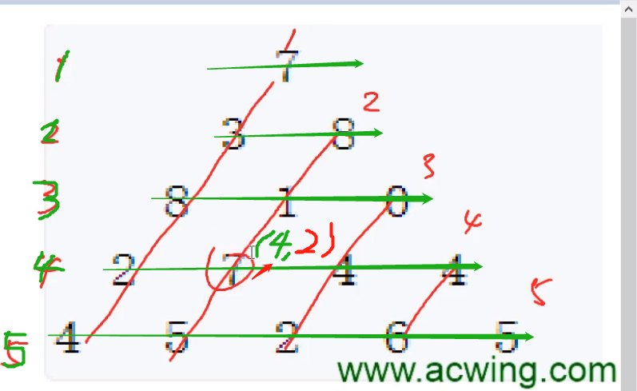

# 02 线性DP
## 一、数字三角形问题
> 题目链接：https://www.acwing.com/problem/content/900/

### 闫氏DP分析法过程
> 行列划分如下，绿色代表行，用i表示；红色代表列，用j表示



+ 状态表示：f[i][j]，表示走到第i行第j列的最大数字和
  + 集合：所有从起点，走到位置(i, j)的路径
  + 属性：max(即求上面集合中所有路径和的最大值)

+ 状态计算：
  + f[i][j]的可能的情况：
    + 从左上角过来：即从起点走到8的最大数字和 + 7，即$f[i - 1][j - 1] + a[i][j]$ 
    + 从右上角过来：即从起点走到1的最大数字和 + 7，即$f[i - 1][j] + a[i][j]$ 
  + 求属性：取上面两种情况的max，即$f[i][j] = max(f[i - 1][j - 1] + a[i][j], f[i - 1][j] + a[i][j])$


> 返回值：返回最后一行中的最大$f[i][j]$即可

### 代码实现

```java
import java.util.*;

public class Main {
    public static void main(String[] args) {
        Scanner sc = new Scanner(System.in);
        int n = sc.nextInt();
        int INF = 0x3f3f3f3f;
        // 因为后面的下标有i-1和j-1的情况，所以这里下标从1开始
        int[][] a= new int[n + 1][n + 1];
        int[][] f = new int[n + 1][n + 1]; // 必须初始化为负无穷大，因为数字可能会有负数
        for(int i = 0; i <= n; i++) {
            Arrays.fill(f[i], -INF);
        }
        for(int i = 1; i <= n; i++) {
            for(int j = 1; j <= i; j++) {
                a[i][j] = sc.nextInt();
            }
        }
        
        f[1][1] = a[1][1]; // 第一个点到第一个点的最大数字和肯定是自己
        for(int i = 2; i <= n; i++) {
            for(int j = 1; j <= i; j++) {
                // 比较左上角和右下角的点那个更大
                f[i][j] = Math.max(f[i - 1][j - 1], f[i - 1][j]) + a[i][j];
            }
        }
        
        // 遍历最后一行，找到最大的数字和
        int res = 0;
        for(int j = 1; j <= n; j++) res = Math.max(res, f[n][j]);
        System.out.println(res);
    }
}
```

## 二、最长上升子序列
> 题目链接：https://www.acwing.com/problem/content/897/
### 闫氏DP分析法过程
+ 状态表示：`f[i]`，以第i个数作为结尾的上升子序列
  + 集合：所有以第i个数作为结尾的上升子序列`1到i之间的元素`
  + 属性：max(所有以第i个数作为结尾的上升子序列中最长的长度)

+ 状态计算：
  + f[i]的可能的情况：从前面哪一种情况f[j]可以转化到f[i]，且$f[j]>f[i]$，此时$f[i] = f[j] + 1$，遍历所有情况不断更新最大的f[i]即可
    + i = 0，即前面没有数了
    + i = 1，即前面只有一个数
    + i = 2，前面有两个数
    + ....
    + i = i，前面一个数是i-1
  + 求属性：取上面两种情况的max，即$f[i] = max(f[j - 1] + 1 | 0 ≤ j ＜ i 并且 a[j] < a[i])$

> 返回值：返回最后一行中的最大$f[i]$即可

### 朴素代码实现如下：
```java
import java.util.*;

public class Main {
    public static void main(String[] args){
        Scanner sc = new Scanner(System.in);
        int N = sc.nextInt();
        int[] a = new int[N + 1];
        for(int i = 1; i <= N; i++) a[i] = sc.nextInt();
        
        int[] f = new int[N + 1]; // f[i]表示以a[i]作为结尾的最长上升子序列的长度
        for(int i = 1; i <= N; i++) {
            f[i] = 1; // 只有一个元素时，最长长度显然为1
            for(int j = 1; j < i; j++) {
                if(a[j] < a[i]) {
                    f[i] = Math.max(f[i], f[j] + 1);
                }
            }
        }
        
        // 枚举下所有的f[i]，找最大长度
        int res = 0;
        for(int i = 1; i <= N; i++) res = Math.max(res, f[i]);
        System.out.println(res);
    }
}
```

### 基于单调栈的优化
> 题目链接：https://www.acwing.com/problem/content/898/
```java
import java.util.*;

// 维护一个单调栈，新来的元素大于栈顶元素就加入进去，否则就用新元素替换掉栈中第一个大于等于新元素的值，这里用
public class Main {
    public static void main(String[] args) {
        Scanner sc = new Scanner(System.in);
        int N = sc.nextInt();
        int[] a = new int[N + 1];
        int[] f = new int[N + 1]; // 这就是要维护的单调递增栈

        for (int i = 1; i <= N; i++) a[i] = sc.nextInt();

        int cnt = 1;
        f[1] = a[1]; // 先把第一个元素加进去
        for (int i = 2; i <= N; i++) {
            if (a[i] > f[cnt]) f[++cnt] = a[i]; // 新来的元素大于栈顶元素就加入进去
            else { // 否则就用新元素替换掉栈中第一个大于等于新元素的值，这里用二分法(单调递增栈中用二分法正好)
                int l = 1, r = cnt;
                while (l < r) {
                    int mid = l + r >> 1;
                    if (f[mid] >= a[i]) r = mid;
                    else l = mid + 1;
                }
                f[l] = a[i]; // 左边界就是第一个大于等于目标值的值，替换成a[i]即可
            }
        }
        System.out.println(cnt);
    }
}

/**
例 n: 7
arr : 3 1 2 1 8 5 6

f : 3

1 比 3 小
f : 1

2 比 1 大
f : 1 2

1 比 2 小
f : 1 2

8 比 2 大
f : 1 2 8

5 比 8 小
f : 1 2 5

6 比 5 大
f : 1 2 5 6

f中有效元素的长度就是最长递增子序列的长度
*/
  
```

## 三、最长公共子序列
> https://www.acwing.com/problem/content/899/
### 闫氏DP分析法过程

+ 状态表示：f[i][j]，第一个序列a的前i个字符和第二个序列b的前j个字符的公共子序列长度
  + 集合：所有在第一个字符串的前i个字符中出现，且在第二个序列的前j个字符中出现的子序列
  + 属性：max(所有的i、j组合中最长的公共字符串长度)

+ 状态计算：
  + f[i][j]的可能的情况：按照`a的第i个字符a[i]`和`b的第j个字符b[j]`是否包含在公共子序列中分为如下4种情况
    + 1）选a[i]也选b[j]：$f[i][j] = f[i - 1][j - 1] + 1$
    + 2）选a[i]不选b[j]：$f[i][j] = f[i][j - 1] + 1$
    + 3）不选a[i]选b[j]：$f[i][j] = f[i - 1][j] + 1$
    + 4）不选a[i]也不选b[j]：$f[i][j] = f[i - 1][j - 1]$
  + 求属性：取上面4种情况的max，第4种情况显然包含在前3中之中的，所以我们只需要考虑前3种即可。即$f[i][j] = max(f[i - 1][j], f[i][j - 1], f[i - 1][j - 1] + 1)$

> 返回值：返回$f[N][M]$即可，N为字符串a的长度，b为字符串b的长度

### 代码实现如下
```java
import java.util.*;

public class Main {
    public static void main(String[] args) {
        Scanner sc = new Scanner(System.in);
        int N = sc.nextInt();
        int M = sc.nextInt();
        // 加上个""是为了让下标从1开始
        char[] a = (" " + sc.next()).toCharArray();
        char[] b = (" " + sc.next()).toCharArray();

        int[][] f = new int[N + 1][M + 1];
        for (int i = 1; i <= N; i++) {
            for (int j = 1; j <= M; j++) {
                f[i][j] = Math.max(f[i - 1][j], f[i][j - 1]); // 情况2和3，无论a[i]和b[j]是否在最终结果里，都需要考虑这两种情况
                if (a[i] == b[j]) {
                    f[i][j] = Math.max(f[i][j], f[i - 1][j - 1] + 1); // 情况1：a[i]和b[j]都在最终结果中才需要考虑这种情况
                }
            }
        }
        System.out.println(f[N][M]);
    }
}
```

## 四、最短编辑距离
> 题目链接：https://www.acwing.com/problem/content/description/904/  题解参考：https://www.acwing.com/solution/content/10499/
### 闫氏DP分析法过程
> a[]表示A拆分出的字符数组；b[]表示字符串B拆分出的字符数组

+ 状态表示：f[i][j]:表示a的前i个字符组成的字符串经过f[i][j]次编辑可以变成b的前i个字符组成的字符串
  + 集合：所有i和j的组合形成的不同字符串对
  + 属性：min(`a[1...i]`变成`b[1..j]`)需要经过的最少次数
+ 状态计算：
  + 状态划分：即所有的状态转移到f[i][j]的情况，这里我们按照对a[i]的3种操作进行划分：
    + 