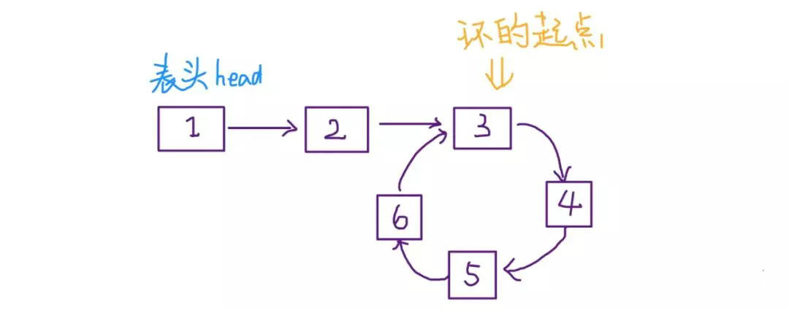
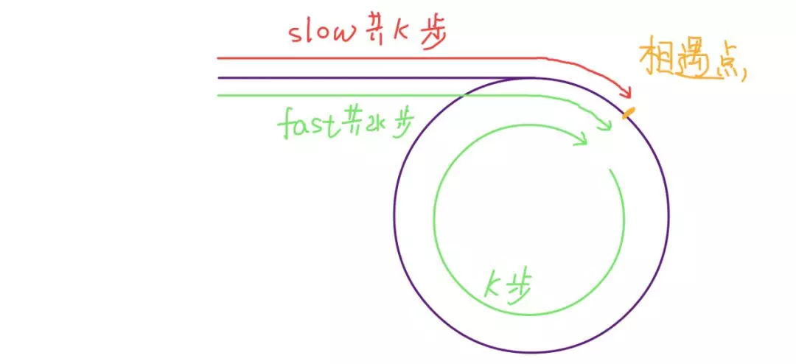
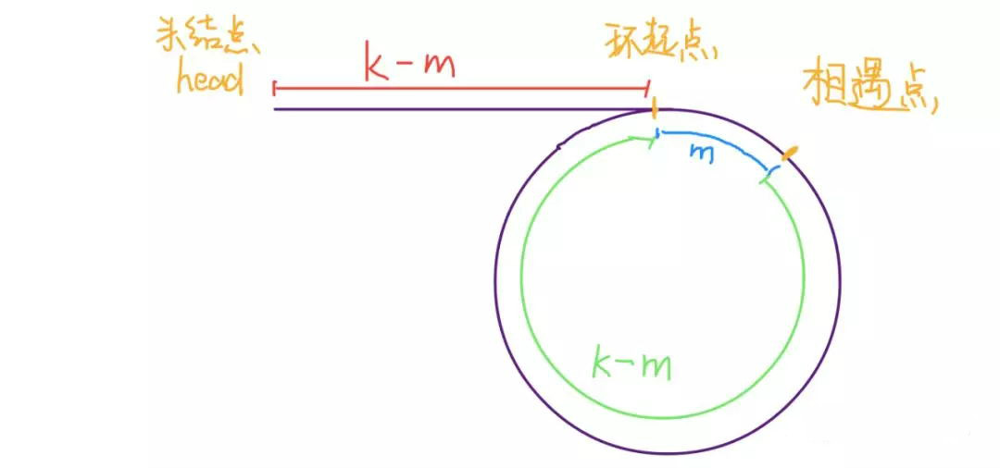
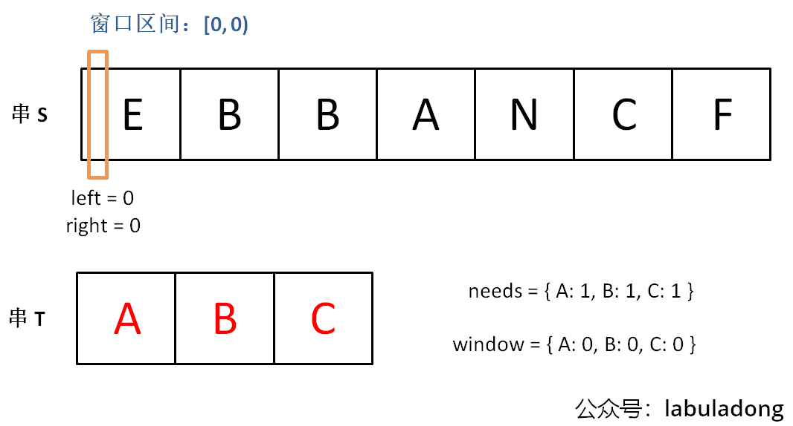
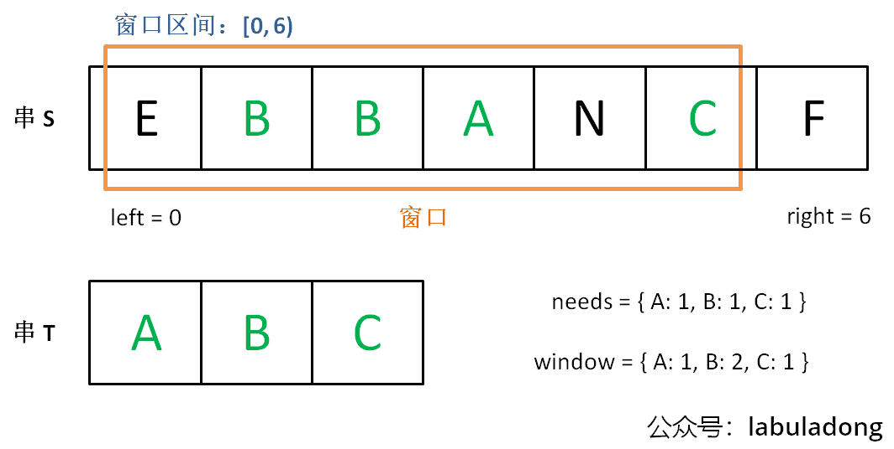
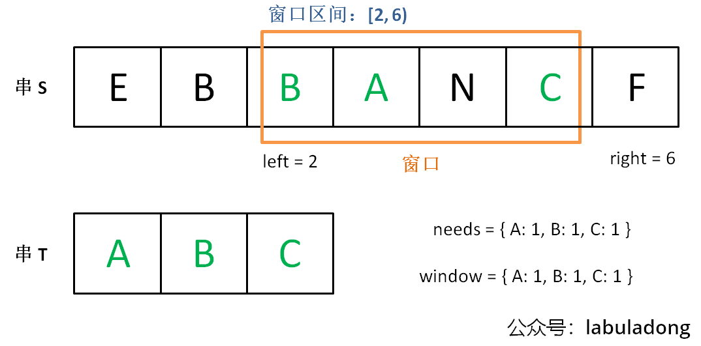
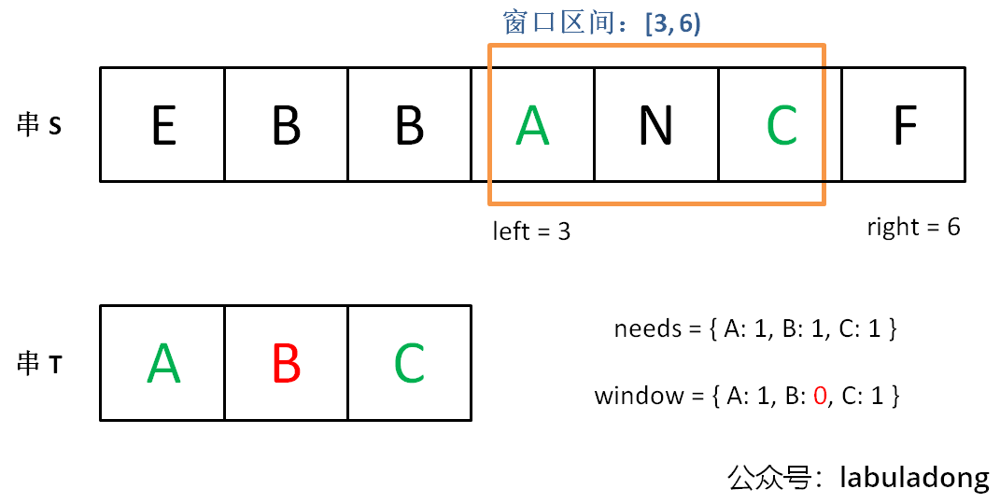

# 双指针算法

## 常见题目类型
> 一共3种，如下

+ 快慢指针
+ 左右指针
+ 滑动窗口

## 口诀
> 来自labuladong

**链表指针数组题**，用双指针别犹豫。  
双指针家三兄弟，各个都是万人迷。  

**快慢指针**最神奇，链表操作无压力。  
归并排序找中点，链表成环搞判定。  

**左右指针**最常见，左右两端相向行。  
反转数组要靠它，二分搜索是弟弟。

**滑动窗口**老猛男，子串问题全靠它。  
左右指针滑窗口，一前一后齐头进。

## 参考两篇不错的文章
> 备份一份到当前目录吧

+ [我写了套框架，把双指针算法变成了默写题](https://blog.csdn.net/fdl123456/article/details/105697625/)
+ [双指针技巧汇总](https://mp.weixin.qq.com/s?__biz=MzAxODQxMDM0Mw%3D%3D&chksm=9bd7fa51aca07347009c591c403b3228f41617806429e738165bd58d60220bf8f15f92ff8a2e&idx=1&mid=2247484505&scene=21&sn=0e9517f7c4021df0e6146c6b2b0c4aba#wechat_redirect)
  > 这篇文档在微信里不方便看，找到了一篇CSDN上转载的[双指针技巧汇总(转)](https://blog.csdn.net/xxdddail/article/details/93735314)

## 1、快慢指针
> 主要解决链表中的问题，比如判定链表中是否包含环。快慢指针一般都初始化指向链表的头结点 head，前进时快指针 fast 在前，慢指针 slow 在后，巧妙解决一些链表中的问题。

### 1.1 应用1：判定链表中是否含有环
这应该属于链表最基本的操作了，如果读者已经知道这个技巧，可以跳过。

单链表的特点是每个节点只知道下一个节点，所以一个指针的话无法判断链表中是否含有环的。

如果链表中不包含环，那么这个指针最终会遇到空指针 null 表示链表到头了，这还好说，可以判断该链表不含环。
```java
boolean hasCycle(ListNode head) {
    while (head != null) head = head.next;
    return false;
}
```
但是如果链表中含有环，那么这个指针就会陷入死循环，因为环形数组中没有 null 指针作为尾部节点。

经典解法就是用两个指针，一个每次前进两步，一个每次前进一步。如果不含有环，跑得快的那个指针最终会遇到 null，说明链表不含环；如果含有环，快指针最终会超慢指针一圈，和慢指针相遇，说明链表含有环。

```java
boolean hasCycle(ListNode head) {
    ListNode fast, slow;
    fast = slow = head;
    while(fast != null && fast.next != null) {
        fast = fast.next.next;
        slow = slow.next;
        if (fast == slow) return true;
    }
    return false;
}
```

### 1.2 应用2：已知链表中有环，返回这个环的起始位置


这个问题其实不困难，有点类似脑筋急转弯，先直接看代码：
```java
ListNode detectCycle(ListNode head) {
    ListNode fast, slow;
    fast = slow = head;
    while (fast != null && fast.next != null) {
        fast = fast.next.next;
        slow = slow.next;
        if (fast == slow) break;
    }
    
    slow = head;
    while (slow != fast) {
        fast = fast.next;
        slow = slow.next;
    }
    return slow;
}
```

可以看到，当快慢指针相遇时，让其中任一个指针重新指向头节点，然后让它俩以相同速度前进，再次相遇时所在的节点位置就是环开始的位置。这是为什么呢？

第一次相遇时，假设慢指针 slow 走了 k 步，那么快指针 fast 一定走了 2k 步，也就是说比 slow 多走了 k 步（也就是环的长度）。



设相遇点距环的起点的距离为 m，那么环的起点距头结点 head 的距离为 k - m，也就是说如果从 head 前进 k - m 步就能到达环起点。

巧的是，如果从相遇点继续前进 k - m 步，也恰好到达环起点。



所以，只要我们把快慢指针中的任一个重新指向 head，然后两个指针同速前进，k - m 步后就会相遇，相遇之处就是环的起点了。

### 1.3 应用3：寻找链表的中点
类似上面的思路，我们还可以让快指针一次前进两步，慢指针一次前进一步，当快指针到达链表尽头时，慢指针就处于链表的中间位置。
```java
ListNode slow, fast;
slow = fast = head;
while (fast != null && fast.next != null) {
    fast = fast.next.next;
    slow = slow.next;
}
// slow 就在中间位置
return slow;
```
当链表的长度是奇数时，slow 恰巧停在中点位置；如果长度是偶数，slow 最终的位置是中间偏右：

寻找链表中点的一个重要作用是对链表进行归并排序。

回想数组的归并排序：求中点索引递归地把数组二分，最后合并两个有序数组。对于链表，合并两个有序链表是很简单的，难点就在于二分。

但是现在你学会了找到链表的中点，就能实现链表的二分了。关于归并排序的具体内容本文就不具体展开了。

### 1.4 应用3：寻找链表的倒数第 k 个元素
我们的思路还是使用快慢指针，让快指针先走 k 步，然后快慢指针开始同速前进。这样当快指针走到链表末尾 null 时，慢指针所在的位置就是倒数第 k 个链表节点（为了简化，假设 k 不会超过链表长度）：
```java
ListNode slow, fast;
slow = fast = head;
while (k-- > 0) fast = fast.next;
while (fast != null) {
    slow = slow.next;
    fast = fast.next;
}
return slow;
```

## 2、左右指针
> 主要解决数组(或者字符串)的问题，比如二分查找。左右指针在数组中实际是两个索引值，一般初始化为`left = 0, right = nums.length - 1`

### 2.1 应用1：二分查找
> 前文 [二分查找算法详解](https://www.cnblogs.com/kyoner/p/11080078.html) 有详细讲解，这里只写最简单的二分算法，旨在突出它的双指针特性：

```java
int binarySearch(int[] nums, int target) {
    int left = 0;
    int right = nums.length - 1;
    while(left <= right) {
        int mid = (right + left) / 2;
        if (nums[mid] == target) return mid;
        else if (nums[mid] < target) left = mid + 1;
        else if (nums[mid] > target) right = mid - 1;
    }
}
```

### 2.2 应用2：两数之和
> 直接看一道 LeetCode 题目吧：[167.两数之和 II - 输入有序数组](https://leetcode-cn.com/problems/two-sum-ii-input-array-is-sorted/)。一定注意要**有序**，这是左右指针使用的前提！！！
```txt
给定一个已按照升序排列 的有序数组，找到两个数使得它们相加之和等于目标数。

函数应该返回这两个下标值 index1 和 index2，其中 index1 必须小于 index2。

说明:

返回的下标值（index1 和 index2）不是从零开始的。
你可以假设每个输入只对应唯一的答案，而且你不可以重复使用相同的元素。
示例:

输入: numbers = [2, 7, 11, 15], target = 9
输出: [1,2]
解释: 2 与 7 之和等于目标数 9 。因此 index1 = 1, index2 = 2 。
```

只要数组有序，就应该想到双指针技巧。这道题的解法有点类似二分查找，通过调节 left 和 right 可以调整 sum 的大小：
```java
class Solution {
    public int[] twoSum(int[] nums, int target) {
        int left = 0, right = nums.length - 1;
        while (left < right) {
            int sum = nums[left] + nums[right];
            if (sum == target) return new int[]{left + 1, right + 1}; // 注意下标从1开始！
            else if (sum < target) left++;
            else if (sum > target) right--;
        }
        return new int[]{-1, -1};
    }
}
```

## 2.3 应用3：反转数组
```java
void swap(int[] nums, int left, int right) {
    int temp = nums[left];
    nums[left] = nums[right];
    nums[right] = temp;
}

void reverse(int[] nums) {
    int left = 0;
    int right = nums.length - 1;
    while (left < right) {
        swap(nums, left, right); // C++自带swap函数，Java得自己实现
        left++;
        right--;
    }
}
```

### 2.4 应用4：滑动窗口算法
这也许是双指针技巧的最高境界了，如果掌握了此算法，可以解决一大类子字符串匹配的问题，不过「滑动窗口」算法比上述的这些算法稍微复杂些。

幸运的是，这类算法是有框架模板的，下篇文章就准备讲解「滑动窗口」算法模板，帮大家秒杀几道 LeetCode 子串匹配的问题。

## 3、滑动窗口

说起滑动窗口算法，很多读者都会头疼。这个算法技巧的思路非常简单，就是维护一个窗口，不断滑动，然后更新答案么。LeetCode 上有起码 10 道运用滑动窗口算法的题目，难度都是中等和困难。该算法的大致逻辑如下：

```java
int left = 0, right = 0;
 
while (right < s.size()) {
    // 增大窗口
    window.add(s[right]);
    right++;
 
    while (window needs shrink) {
        // 缩小窗口
        window.remove(s[left]);
        left++;
    }
}
```

这个算法技巧的时间复杂度是 O(N)，比一般的字符串暴力算法要高效得多。

**其实困扰大家的，不是算法的思路，而是各种细节问题。** 比如说如何向窗口中添加新元素，如何缩小窗口，在窗口滑动的哪个阶段更新结果。即便你明白了这些细节，也容易出 bug，找 bug 还不知道怎么找，真的挺让人心烦的。

所以今天我就写一套滑动窗口算法的代码框架，我连在哪里做输出 debug 都给你写好了，以后遇到相关的问题，你就默写出来如下框架然后`改三个地方`就行，还不会出边界问题：
```cpp
/* 滑动窗口算法框架 */
void slidingWindow(string s, string t) {
    unordered_map<char, int> need, window;
    for (char c : t) need[c]++;
 
    int left = 0, right = 0;
    int valid = 0; 
    while (right < s.size()) {
        // c 是将移入窗口的字符
        char c = s[right];
        // 右移窗口
        right++;
        // Todo：进行窗口内数据的一系列更新
        ...
 
        /*** debug 输出的位置 ***/
        printf("window: [%d, %d)\n", left, right);
        /********************/
 
        // 判断左侧窗口是否要收缩
        while (window needs shrink) {
            // d 是将移出窗口的字符
            char d = s[left];
            // 左移窗口
            left++;
            // Todo：进行窗口内数据的一系列更新
            ...
        }
    }
}
```

其中两处Todo表示的更新窗口数据的地方，到时候你直接往里面填就行了。

而且，这两个Todo处的操作分别是右移和左移窗口更新操作，等会你会发现它们操作是完全对称的。

说句题外话，其实有很多人喜欢执着于表象，不喜欢探求问题的本质。比如说有很多人评论我这个框架，说什么散列表速度慢，不如用数组代替散列表；还有很多人喜欢把代码写得特别短小，说我这样代码太多余，影响编译速度，LeetCode 上速度不够快。

我也是服了，算法看的是时间复杂度，你能确保自己的时间复杂度最优就行了。至于 LeetCode 所谓的运行速度，那个都是玄学，只要不是慢的离谱就没啥问题，根本不值得你从编译层面优化，不要舍本逐末……

labuladong 公众号的重点在于算法思想，你把框架思维了然于心套出解法，然后随你再魔改代码好吧，你高兴就好。

言归正传，下面就直接上四道 LeetCode 原题来套这个框架，其中第一道题会详细说明其原理，后面四道就直接闭眼睛秒杀了。

本文代码为 C++ 实现，不会用到什么编程方面的奇技淫巧，但是还是简单介绍一下一些用到的数据结构，以免有的读者因为语言的细节问题阻碍对算法思想的理解：

unordered_map就是哈希表（字典），它的一个方法`count(key)`相当于 Java 的`containsKey(key)`可以判断键 key 是否存在。

可以使用方括号访问键对应的值map[key]。需要注意的是，如果该key不存在，C++ 会自动创建这个 key，并把map[key]赋值为 0

所以代码中多次出现的map[key]++相当于 Java 的`map.put(key, map.getOrDefault(key, 0) + 1)`。

Java版模板如下：
```java

void slidingWindow(String s, String t) {
    char[] sa = s.toCharArray();
    char[] ta = t.toCharArray();
    Map<Character, Integer> need = new HashMap<>(); // T中字符出现次数
    Map<Character, Integer> window = new HashMap<>(); // 「窗口」中的相应字符的出现次数
    for (char c : ta) {
        if (need.get(c) == null) need.put(c, 0);
        else need.put(c, need.get(c) + 1);
    }

    int left = 0, right = 0; // 使用left和right变量初始化窗口的两端，不要忘了，区间[left, right)是左闭右开的，所以初始情况下窗口没有包含任何元素：
    int valid = 0; // 窗口中满足need条件的字符个数
    while (right < s.length()) {
        char c = sa[right]; // c是将移入窗口的字符
        right++; // 右边界右移，扩大窗口
        // Todo: 进行窗口内数据的一些列更新
        ...
        /*** debug 输出的位置 ***/
        System.out.printf("window: [%d, %d)\n", left, right);
        // 判断左侧窗口是否要收缩
        while (window needs shrink) {
            char d = sa[left]; // d是即将移出窗口的字符
            left++; // 左边界右移，窗口缩小
            // Todo: 在这里更新最小覆盖字符串相关参数
            ...
        }
    }
}
```

### 3.1 例题1：[LeetCode 76.最小覆盖子串](https://leetcode-cn.com/problems/minimum-window-substring/)

如果我们使用暴力解法，代码大概是这样的：
```java
for (int i = 0; i < s.size(); i++) {
    for (int j = i + 1; j < s.size(); j++) {
        if s[i:j] 包含 t 的所有字母: {
            更新答案
        } 
    } 
}
```

思路很直接，但是显然，这个算法的复杂度肯定大于 O(N^2) 了，不好。

滑动窗口算法的思路是这样：

+ 1、我们在字符串S中使用双指针中的左右指针技巧，初始化`left = right = 0`，把索引左闭右开区间[left, right)称为一个「窗口」。
+ 2、我们先不断地增加right指针扩大窗口`[left, right)`，直到窗口中的字符串符合要求（包含了T中的所有字符）。
+ 3、此时，我们停止增加right，转而不断增加left指针缩小窗口[left, right)，直到窗口中的字符串不再符合要求（不包含T中的所有字符了）。同时，每次增加left，我们都要更新一轮结果。
+ 4、重复第 2 和第 3 步，直到right到达字符串S的尽头。

这个思路其实也不难，第 2 步相当于在寻找一个「可行解」，然后第 3 步在优化这个「可行解」，最终找到最优解，也就是最短的覆盖子串。左右指针轮流前进，窗口大小增增减减，窗口不断向右滑动，这就是「滑动窗口」这个名字的来历。

下面画图理解一下，needs和window相当于计数器，分别记录T中字符出现次数和「窗口」中的相应字符的出现次数。

**初始状态：**



**增加right，直到窗口[left, right)包含了T中所有字符：**


**现在开始增加left，缩小窗口[left, right)。**


**直到窗口中的字符串不再符合要求，left不再继续移动。**


之后重复上述过程，先移动right，再移动left…… 直到right指针到达字符串S的末端，算法结束。

如果你能够理解上述过程，恭喜，你已经完全掌握了滑动窗口算法思想。现在我们来看看这个滑动窗口代码框架怎么用：

首先，初始化window和need两个哈希表，记录窗口中的字符和需要凑齐的字符：
```cpp
unordered_map<char, int> need, window;
for (char c : t) need[c]++;
```

然后，使用left和right变量初始化窗口的两端，不要忘了，区间[left, right)是左闭右开的，所以初始情况下窗口没有包含任何元素：

```cpp
int left = 0, right = 0;
int valid = 0; 
while (right < s.size()) {
    // 开始滑动
}
```

其中**valid变量**表示窗口中`满足need条件的字符个数`，如果valid和need.size的大小相同，则说明窗口已满足条件，已经完全覆盖了串T。

现在开始套模板，只需要思考以下四个问题：

+ 1、当移动right扩大窗口，即加入字符时，应该更新哪些数据？
+ 2、什么条件下，窗口应该暂停扩大，开始移动left缩小窗口？
+ 3、当移动left缩小窗口，即移出字符时，应该更新哪些数据？
+ 4、我们要的结果应该在扩大窗口时还是缩小窗口时进行更新？

如果一个字符进入窗口，应该增加window计数器；如果一个字符将移出窗口的时候，应该减少window计数器；当valid满足need时应该收缩窗口；应该在收缩窗口的时候更新最终结果。

```java
class Solution {
    public String minWindow(String s, String t) {
        char[] sa = s.toCharArray();
        char[] ta = t.toCharArray();
        Map<Character, Integer> need = new HashMap<>(); // T中字符出现次数
        Map<Character, Integer> window = new HashMap<>(); // 「窗口」中的相应字符的出现次数
        for (char c : ta) {
            if (need.get(c) == null) need.put(c, 0);
            else need.put(c, need.get(c) + 1);
        }

        int left = 0, right = 0; // 使用left和right变量初始化窗口的两端，不要忘了，区间[left, right)是左闭右开的，所以初始情况下窗口没有包含任何元素：
        int valid = 0; // 窗口中满足need条件的字符个数
        int start = 0, len = Integer.MAX_VALUE; // 最小覆盖子串的起始索引及长度
        while (right < s.length()) {
            char c = sa[right]; // c是将移入窗口的字符
            right++; // 右边界右移，扩大窗口
            // Todo: 进行窗口内数据的一些列更新
            if (need.containsKey(c)) {
                if (window.get(c) == null) window.put(c, 0);
                else window.put(c, window.get(c) + 1);
                if (window.get(c).equals(need.get(c))) valid++; // 一个字符频率相等，说明当前字符c满足情况了
            }

            // 判断左侧窗口是否要收缩
            while (valid == need.size()) { // 所有字符都在滑动窗口内找到了
                // Todo: 在这里更新最小覆盖字符串相关参数
                if (right - left < len) {
                    start = left;
                    len = right - left;
                }
                char d = sa[left]; // d是即将移出窗口的字符
                left++; // 左边界右移，窗口缩小
                if (need.containsKey(d)) {
                    if (window.get(d).equals(need.get(d))) valid--; // 左边界字符正要满足滑动窗口包含目标值，删除一个左边界可能会影响
                    window.put(d, window.get(d) - 1); // 更新当前点的字符d的频率
                }
            }
        }
        return len == Integer.MAX_VALUE ? "" : s.substring(start, start + len); // 注意是开始索引和结束索引取字符串
    }
}

```

需要注意的是，当我们发现某个字符在window的数量满足了need的需要，就要更新valid，表示有一个字符已经满足要求。而且，你能发现，两次对窗口内数据的更新操作是完全对称的。

当valid == need.size()时，说明T中所有字符已经被覆盖，已经得到一个可行的覆盖子串，现在应该开始收缩窗口了，以便得到「最小覆盖子串」。

移动left收缩窗口时，窗口内的字符都是可行解，所以应该在收缩窗口的阶段进行最小覆盖子串的更新，以便从可行解中找到长度最短的最终结果。

至此，应该可以完全理解这套框架了，滑动窗口算法又不难，就是细节问题让人烦得很。以后遇到滑动窗口算法，你就按照这框架写代码，保准没有 bug，还省事儿。

下面就直接利用这套框架秒杀几道题吧，你基本上一眼就能看出思路了

### 3.2 例题2：[LeetCode 567.字符串的排列](https://leetcode-cn.com/problems/permutation-in-string/)

注意哦，输入的s1是可以包含重复字符的，所以这个题难度不小。

这种题目，是明显的滑动窗口算法，相当给你一个S和一个T，请问你S中是否存在一个子串，包含T中所有字符且不包含其他字符？

首先，先复制粘贴之前的算法框架代码，然后明确刚才提出的 4 个问题，即可写出这道题的答案：

```java
class Solution {
    public boolean checkInclusion(String t, String s) {
        char[] sa = s.toCharArray();
        char[] ta = t.toCharArray();
        Map<Character, Integer> need = new HashMap<>(); // T中字符出现次数
        Map<Character, Integer> window = new HashMap<>(); // 「窗口」中的相应字符的出现次数
        for (char c : ta) {
            if (need.get(c) == null) need.put(c, 0);
            else need.put(c, need.get(c) + 1);
        }

        int left = 0, right = 0; // 使用left和right变量初始化窗口的两端，不要忘了，区间[left, right)是左闭右开的，所以初始情况下窗口没有包含任何元素：
        int valid = 0; // 窗口中满足need条件的字符个数
        while (right < s.length()) {
            char c = sa[right]; // c是将移入窗口的字符
            right++; // 右边界右移，扩大窗口
            // Todo: 进行窗口内数据的一些列更新
            if (need.containsKey(c)) {
                if (window.get(c) == null) window.put(c, 0);
                else window.put(c, window.get(c) + 1);
                if (window.get(c).equals(need.get(c))) valid++; // 一个字符频率相等，说明当前字符c满足情况了
            }
            /*** debug 输出的位置 ***/
            // System.out.printf("window: [%d, %d)\n", left, right);
            // 判断左侧窗口是否要收缩
            while (right - left >= t.length()) { // 超出t的长度，肯定要收缩了
                if (valid == need.size()) return true;
                char d = sa[left]; // d是即将移出窗口的字符
                left++; // 左边界右移，窗口缩小
                // Todo: 在这里更新最小覆盖字符串相关参数
                if (need.containsKey(d)) {
                    if (window.get(d).equals(need.get(d))) valid--; // 左边界字符正要满足滑动窗口包含目标值，删除一个左边界可能会影响
                    window.put(d, window.get(d) - 1); // 更新当前点的字符d的频率
                }
            }
        }
        return false; // 没找到合适的字符串，直接退出
    }
}
```

对于这道题的解法代码，基本上和最小覆盖子串一模一样，只需要改变两个地方：

+ 1、本题移动left缩小窗口的时机是窗口大小大于t.size()时，因为排列嘛，显然长度应该是一样的。
+ 2、当发现valid == need.size()时，就说明窗口中就是一个合法的排列，所以立即返回true。

至于如何处理窗口的扩大和缩小，和最小覆盖子串完全相同。

### 3.3 例题3：[LeetCode 438.找到字符串中所有字母异位词](https://leetcode-cn.com/problems/find-all-anagrams-in-a-string/)

呵呵，这个所谓的字母异位词，不就是排列吗，搞个高端的说法就能糊弄人了吗？**相当于，输入一个串S，一个串T，找到S中所有T的排列，返回它们的起始索引。**

直接默写一下框架，明确刚才讲的 4 个问题，即可秒杀这道题：

```java
class Solution {
    public List<Integer> findAnagrams(String s, String t) {
        char[] sa = s.toCharArray();
        char[] ta = t.toCharArray();
        Map<Character, Integer> need = new HashMap<>(); // T中字符出现次数
        Map<Character, Integer> window = new HashMap<>(); // 「窗口」中的相应字符的出现次数
        for (char c : ta) {
            if (need.get(c) == null) need.put(c, 0);
            else need.put(c, need.get(c) + 1);
        }

        int left = 0, right = 0; // 使用left和right变量初始化窗口的两端，不要忘了，区间[left, right)是左闭右开的，所以初始情况下窗口没有包含任何元素：
        int valid = 0; // 窗口中满足need条件的字符个数
        List<Integer> result = new ArrayList<>();
        while (right < s.length()) {
            char c = sa[right]; // c是将移入窗口的字符
            right++; // 右边界右移，扩大窗口
            // Todo: 进行窗口内数据的一些列更新
            if (need.containsKey(c)) {
                if (window.get(c) == null) window.put(c, 0);
                else window.put(c, window.get(c) + 1);
                if (window.get(c).equals(need.get(c))) valid++; // 一个字符频率相等，说明当前字符c满足情况了
            }
            /*** debug 输出的位置 ***/
            // System.out.printf("window: [%d, %d)\n", left, right);
            // 判断左侧窗口是否要收缩
            while (right - left >= t.length()) { // 超出t的长度，肯定要收缩了
                if (valid == need.size()) result.add(left); // 找到满足条件的字符串，加入到结果中
                char d = sa[left]; // d是即将移出窗口的字符
                left++; // 左边界右移，窗口缩小
                // Todo: 在这里更新最小覆盖字符串相关参数
                if (need.containsKey(d)) {
                    if (window.get(d).equals(need.get(d))) valid--; // 左边界字符正要满足滑动窗口包含目标值，删除一个左边界可能会影响
                    window.put(d, window.get(d) - 1); // 更新当前点的字符d的频率
                }
            }
        }
        return result; // 返回所有异构子字符串的开始匹配位置
    }
}
```

跟寻找字符串的排列一样，只是找到一个合法异位词（排列）之后将起始索引加入res即可。

### 3.4 例题4：[LeetCode 3.无重复字符的最长子串](https://leetcode-cn.com/problems/longest-substring-without-repeating-characters/)

这个题终于有了点新意，不是一套框架就出答案，不过反而更简单了，稍微改一改框架就行了：

```java
class Solution {
    public int lengthOfLongestSubstring(String s) {
        char[] sa = s.toCharArray();
        Map<Character, Integer> window = new HashMap<>(); // 「窗口」中的相应字符的出现次数
        
        int left = 0, right = 0; // 使用left和right变量初始化窗口的两端，不要忘了，区间[left, right)是左闭右开的，所以初始情况下窗口没有包含任何元素：
        int valid = 0; // 窗口中满足need条件的字符个数
        int res = 0;
        while (right < s.length()) {
            char c = sa[right]; // c是将移入窗口的字符
            right++; // 右边界右移，扩大窗口
            // Todo: 进行窗口内数据的一些列更新
            if (window.get(c) == null) window.put(c, 1);
            else window.put(c, window.get(c) + 1);
            // 判断左侧窗口是否要收缩
            while (window.get(c) > 1) { // 超出t的长度，肯定要收缩了
                char d = sa[left]; // d是即将移出窗口的字符
                left++; // 左边界右移，窗口缩小
                // Todo: 在这里更新最小覆盖字符串相关参数
                window.put(d, window.get(d) - 1); // 更新当前点的字符d的频率
            }
            res = Math.max(res, right - left); // 不断更新最小长度
        }
        return res; // 不断更新最大的长度
    }
}
```

这就是变简单了，连need和valid都不需要，而且更新窗口内数据也只需要简单的更新计数器window即可。

当window[c]值大于 1 时，说明窗口中存在重复字符，不符合条件，就该移动left缩小窗口了嘛。

唯一需要注意的是，在哪里更新结果res呢？我们要的是最长无重复子串，哪一个阶段可以保证窗口中的字符串是没有重复的呢？

这里和之前不一样，**要在收缩窗口完成后更新res**，因为窗口收缩的 while 条件是存在重复元素，换句话说收缩完成后一定保证窗口中没有重复嘛。


### 梁山广对应滑动窗口算法总结

滑动窗口一般是正数数组或者字符串才用(这两种情形当right++的时候，目标值增加，left++的时候，目标值减少。正数数组目标值是区间和，字符串时字符出现频率)

可以用滑动窗口的典型题目(在LeetCode精选20题中有)：
+ [76.最小子串覆盖](https://leetcode-cn.com/problems/minimum-window-substring/submissions/)
+ [438.找到字符串中所有字母异位词](https://leetcode-cn.com/problems/find-all-anagrams-in-a-string/)
+ [1477.找两个和为目标值且不重叠的子数组](https://leetcode-cn.com/problems/find-two-non-overlapping-sub-arrays-each-with-target-sum/)

不能用滑动窗口但是容易错误用地：
+ [325.和为K的最长子数组长度](https://leetcode-cn.com/problems/maximum-size-subarray-sum-equals-k/)