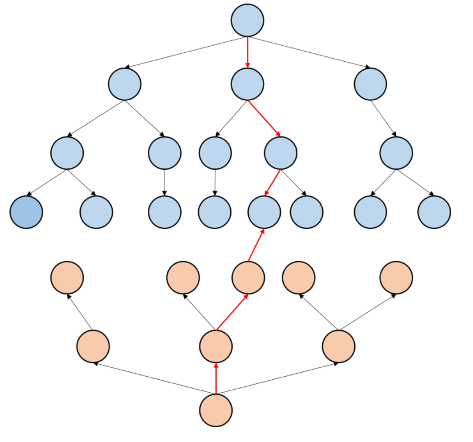

# 06_双向广搜

## 基础介绍
> 参考：https://blog.csdn.net/weixin_43501684/article/details/90147421

## 适用场景和使用方法

+ 双向bfs适用于知道起点和终点的状态下使用，从起点和终点两个方向开始进行搜索，可以非常大的提高单个bfs的搜索效率
+ 同样，实现也是通过队列的方式，可以设置两个队列，一个队列保存从起点开始搜索的状态，另一个队列用来保存从终点开始搜索的状态，如果某一个状态下出现相交的情况，那么就出现了答案
用一张图来进行说明
+ 每次优先选择较小地队列进行BFS扩展




## 题目

### [AcWing 190.字串变换](https://www.acwing.com/problem/content/192/)
> 没用到双端广搜，还得学学怎么用。代码可以参考下：https://leetcode-cn.com/problems/word-ladder/solution/suan-fa-shi-xian-he-you-hua-javashuang-xiang-bfs23/
```java
import java.util.HashSet;
import java.util.LinkedList;
import java.util.Scanner;


public class Main {
    static String src; //源串A
    static String end; //目标串B
    static String[][] rule = new String[25][2];
    static int n = 0; //共有多少条规则

    static class Node {
        String str;
        int steps;

        public Node(String str, int steps) {
            this.str = str;
            this.steps = steps;
        }
    }

    public static void bfs() {
        HashSet<String> visited = new HashSet<>(); //装搜过的字符串。要求重写过hashCode()和equals()方法
        LinkedList<Node> queue = new LinkedList<>();
        queue.add(new Node(src, 0));
        int ans = 0;

        while (!queue.isEmpty()) {
            Node head = queue.removeFirst();
            if (visited.contains(head.str)) continue;
            if (head.steps > 10) break; //ans=0 
            if (head.str.equals(end)) { //若A==B，也属于无解。正好也符合ans=0
                ans = head.steps;
                break;
            }
            visited.add(head.str);
            for (int k = 0; k < n; k++) {  //枚举规则
                int index = 0;
                while ((index = head.str.indexOf(rule[k][0], index)) != -1) {
                    StringBuilder s = new StringBuilder(head.str).replace(index, index + rule[k][0].length(), rule[k][1]);
                    queue.add(new Node(s.toString(), head.steps + 1));
                    index += rule[k][0].length();
                }
            }
        }
        if (ans == 0) System.out.println("NO ANSWER!");
        else System.out.println(ans);

    }

    public static void main(String[] args) {
        Scanner sc = new Scanner(System.in);
        src = sc.next();
        end = sc.next();
        while (sc.hasNext()) {
            rule[n][0] = sc.next();
            rule[n][1] = sc.next();
            n++;
        }
        bfs();
    }
}
```