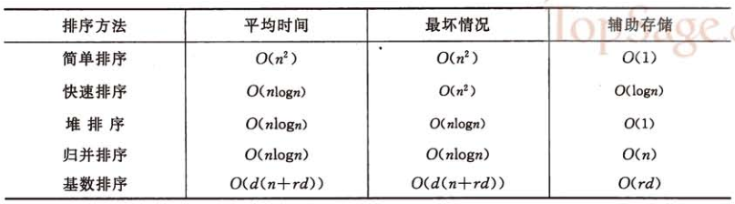

# 常见的排序算法总结

> 参考博文[常见的排序算法——常见的10种排序](https://www.cnblogs.com/flyingdreams/p/11161157.html)

## 常见算法可以分为两大类：

+ **非线性时间比较类排序**：通过比较来决定元素间的相对次序，由于其时间复杂度不能突破O(nlogn)，因此称为非线性时间比较类排序。

+ **线性时间非比较类排序**：不通过比较来决定元素间的相对次序，它可以突破基于比较排序的时间下界，以线性时间运行，因此称为线性时间非比较类排序。

  


## 算法详细阐述

### 1.冒泡排序

> 思路：外层循环从1到n-1，内循环从当前外层的元素的下一个位置开始，依次和外层的元素比较，出现逆序就交换，通过与相邻元素的比较和交换来把小的数交换到最前面。

```java
for(int i=0;i<arr.length-1;i++){//外层循环控制排序趟数
    for(int j=0;j<arr.length-1-i;j++){//内层循环控制每一趟排序多少次
        if(arr[j]>arr[j+1]){
            int temp=arr[j];
            arr[j]=arr[j+1];
            arr[j+1]=temp;
        }
    }
}
```


### 2.选择排序

> 思路：冒泡排序是通过相邻的比较和交换，每次找个最小值。选择排序是：首先在未排序序列中找到最小（大）元素，存放到排序序列的起始位置，然后，再从剩余未排序元素中继续寻找最小（大）元素，然后放到已排序序列的末尾。以此类推，直到所有元素均排序完毕。

```java
private static void sort(int[] array) {
    int n = array.length;
    for (int i = 0; i < n-1; i++) {
        int min = i;
        for (int j = i+1; j < n; j++) {
            if (array[j] < array[min]){//寻找最小数
                min = j; //将最小数的索引赋值
            }  
        }
        int temp = array[i];
        array[i] = array[min];
        array[min] = temp;

    }
}
```


### 3.插入排序

> 思路：通过构建有序序列，对于未排序数据，在已排序序列中从后向前扫描，找到相应位置并插入。可以理解为玩扑克牌时的理牌；

```java
private static void sort(int[] array) {
    int n = array.length;
    // 从第二位数字开始，每一个数字都试图跟它的前一个比较并交换，并重复；直到前一个数字不存在或者比它小或相等时停下来
    for (int i = 1; i < n; i++) {//从第二个数开始
        int key = array[i];
        int j = i -1;
        while (j >= 0 && array[j]>key) {
            array[j + 1] = array[j];  //交换
            j--; //下标向前移动
        }
        array[j+1] = key;
    }
}
```


### 4、希尔排序

> 思路：希尔排序是插入排序的一种高效率的实现，也叫缩小增量排序。先将整个待排记录序列分割成为若干子序列分别进行直接插入排序，待整个序列中的记录基本有序时再对全体记录进行一次直接插入排序。
> 问题：增量的序列取法？
> 　　关于取法，没有统一标准，但最后一步必须是1；因为不同的取法涉及时间复杂度不一样，具体了解可以参考《数据结构与算法分析》；一般以length/2为算法。（再此以gap=gap*3+1为公式）

```java
private static void sort(int[] array) {
    int n = array.length;
    int h = 1;
    while (h<n/3) { //动态定义间隔序列
        h = 3*h +1;
    }
    while (h >= 1) {
        for (int i = h; i < n; i++) {
            for (int j = i; j >= h && (array[j] < array[j - h]); j -= h) {
                int temp = array[j];
                array[j] = array[j - h];
                array[j-h]= temp;
            }
        }
        h /=3;
    }
}
```


### 5、归并排序

> 思路：将已有序的子序列合并，得到完全有序的序列；即先使每个子序列有序，再使子序列段间有序。若将两个有序表合并成一个有序表，称为2-路归并。它使用了递归分治的思想；相当于：左半边用尽，则取右半边元素；右半边用尽，则取左半边元素；右半边的当前元素小于左半边的当前元素，则取右半边元素；右半边的当前元素大于左半边的当前元素，则取左半边的元素。

自顶向下的实现：

```java
// "static void main" must be defined in a public class.
public class Main {
    /**
     * 合并区间[low, mid)和[mid, high]使得区间[low, high)有序
     *
     * @param arr  要排序地数组
     * @param low  区间下界
     * @param mid  区间中间
     * @param high 区间上界
     */
    private void merge(int[] arr, int low, int mid, int high) {
        int[] arrTmp = new int[high - low + 1];
        int i = low, j = mid + 1, k = 0;
        // 区间[low, mid)和[mid, high]同步比较
        while (i <= mid && j <= high) {
            // 按照从小到大防放到辅助数组B[]中
            if (arr[i] <= arr[j]) {
                arrTmp[k++] = arr[i++];
            } else {
                arrTmp[k++] = arr[j++];
            }
        }
        // 把两个区间剩余的元素直接放入临时数组arrTmp中
        while (i <= mid) {
            arrTmp[k++] = arr[i++];
        }
        while (j <= high) {
            arrTmp[k++] = arr[j++];
        }
        // 把临时数组设置回原始数组arr中
        for (i = low, k = 0; i <= high; i++) {
            arr[i] = arrTmp[k++];
        }
    }

    /**
     * 基于归并算法的排序
     *
     * @param arr  原始数组
     * @param low  待排序区间下界
     * @param high 待排序区间上界
     */
    void mergeSort(int[] arr, int low, int high) {
        if (low < high) {
            // 取中点
            int mid = (low + high) / 2;
            // 对左右两部分进行归并排序
            mergeSort(arr, low, mid);
            mergeSort(arr, mid+1, high);
            // 把排好序的左右两部分进行合并，相当于递归回退的时候做，类似回溯法了
            merge(arr, low, mid, high);
        }
    }
    public static void main(String[] args) {
        int[] arr = new int[]{42, 15, 20, 6, 8, 38, 50, 12};
        new Main().mergeSort(arr, 0, arr.length - 1);
        System.out.println(Arrays.toString(arr));
    }
}
```

### 6、快速排序

> 思路：通过一趟排序将待排记录分隔成独立的两部分()，使得左半部分的数字均比右半部分的数字小...然后递归分别对这两部分数字继续进行排序...最终达到整个序列有序

```java
public class Main {

    private void swap(int[] arr, int i, int j) {
        int tmp = arr[i];
        arr[i] = arr[j];
        arr[j] = tmp;
    }

    /**
     * 基准切分，左边小于基准元素，右边大于基准元素
     *
     * @param arr  原始数组
     * @param low  切分区间的下界
     * @param high 切分区间的上界
     * @return 完成最终划分后基准元素所在的位置
     */
    private int partition(int[] arr, int low, int high) {
        // 初始基准元素
        int i = low, j = high, pivot = arr[low];
        while (i < j){
            while (i < j && arr[j] > pivot){
                // 向pivot左侧扫描
                j--;
            }
            if (i < j){
                // arr[i]和arr[j]交换后i向右移动一位
                swap(arr, i++, j);
            }
            while (i < j && arr[i] <=pivot){
                // 向pivot右侧访问
                i++;
            }
            if (i < j){
                // arr[i]和arr[j]交换后j向左移动一位
                swap(arr, i, j--);
            }
        }
        // 返回最终划分完基准元素所在的位置
        return i;
    }

    public void quickSort(int[] arr, int low, int high){
        int mid = 0;
        if (low < high){
            mid = partition(arr, low, high);
            quickSort(arr, low, mid - 1);
            quickSort(arr, mid+1, high);
        }
    }

    public static void main(String[] args) {
        int[] arr = new int[]{30, 24, 5, 58, 18, 36, 12, 42, 39};
        new Main().quickSort(arr, 0, arr.length - 1);
        System.out.println(Arrays.toString(arr));
    }
}
/**
 * [5, 12, 18, 24, 30, 36, 39, 42, 58]
 */
```


### 7、堆排序

> 思路：堆积是一个近似完全二叉树的结构，并同时满足堆积的性质：即子结点的键值或索引总是小于（或者大于）它的父节点。Java自带的优先队列`java.util.PriorityQueue`，默认就是基于大顶堆实现的,具体的优先队列(基于二叉树)的实现参考[Part1Basic的第4章](第4章_堆和堆排序.md)和[Part2Basic的第8章](../Part2Basic/第08章_堆和优先队列.md)

```java
// "static void main" must be defined in a public class.
public class Main {
    public void heapSort(int[] arr){
        // 使用Java自带的优先队列，默认就是基于大顶堆实现的,具体的优先队列(基于二叉树)的实现参考Part1Basic的第4章和Part2Basic的第8章
        PriorityQueue<Integer> pq = new PriorityQueue<>();
        for(int num : arr){
            pq.add(num);
        }
        for(int i = 0; i < arr.length; i++){
            arr[i] = pq.remove();
        }
    }
    public static void main(String[] args) {
        int[] arr = {49, 38, 65, 97, 76, 13, 27, 49};
        new Main().heapSort(arr);
        System.out.println(Arrays.toString(arr));
    }
}
```


### 8、计数排序
> 思路：将输入的数据值转化为键存储在额外开辟的数组空间中。 作为一种线性时间复杂度的排序，计数排序要求输入的数据必须是有确定范围的整数。

+ 找出待排序的数组中最大和最小的元素；
+ 统计数组中每个值为i的元素出现的次数，存入数组C的第i项；
+ 对所有的计数累加（从C中的第一个元素开始，每一项和前一项相加）；
+ 反向填充目标数组：将每个元素i放在新数组的第C(i)项，每放一个元素就将C(i)减去1。

```java
// "static void main" must be defined in a public class.
public class Main {
    private static int[] countsort(int[] arr) {
		int max=arr[0];
		int min=arr[0];
		
		//step1:得到最大值和最小值，确定构建的数组长度
		for (int i = 0; i < arr.length; i++) {
			
			if(arr[i]>max) {
				max=arr[i];
			}
			if(arr[i]<min) {
				min=arr[i];
			}
		}
		
		//step2:构建一个数组，用来存放每一个数对应出现的次数
		int d=max-min;
		int [] countArray=new int [d+1];
		//统计次数
		for (int i = 0; i < arr.length; i++) {
			countArray[arr[i]-min]++;
		}
		System.out.println("统计不同元素出现的次数："+Arrays.toString( countArray));
		
		//step3:对此时的数组做变形,统计数组从第二个元素开始，每一个元素等于它本身都加上前面所有元素之和。
		for(int i=1;i<countArray.length;i++) {
			countArray[i]+=countArray[i-1];
		}
		System.out.println("变形后的数组："+Arrays.toString( countArray));
		
		//step4:倒序遍历原始数列，从统计数组找到正确位置，输出到结果数组,确保稳定性
		int[] sortedArray = new int[arr.length];
		for(int i=arr.length-1;i>=0;i--) {
			
			sortedArray[countArray[arr[i]-min]-1]=arr[i];
			countArray[arr[i]-min]--;
			
		}
		return sortedArray;
	}
	
	public static void main(String[] args) {
		int arr[]={93,95,98,98,94,92,96,91};
		int[] sortedArray=countsort(arr);
		System.out.println("结果输出："+Arrays.toString(sortedArray));
	}
}
```


### 9、桶排序

> 思路：桶排序是计数排序的升级版。它利用了函数的映射关系，高效与否的关键就在于这个映射函数的确定。桶排序 (Bucket sort)的工作的原理：假设输入数据服从均匀分布，将数据分到有限数量的桶里，每个桶再分别排序（有可能再使用别的排序算法或是以递归方式继续使用桶排序进行排）。

+ 设置一个定量的数组当作空桶；
+ 遍历输入数据，并且把数据一个一个放到对应的桶里去；
+ 对每个不是空的桶进行排序；
+ 从不是空的桶里把排好序的数据拼接起来。

```java
public class Main {
    private int[] buckets;
    private int[] array;

    public Main(int range,int[] array){
        this.buckets = new int[range];
        this.array = array;
    }

    /*排序*/
    public void sort(){
        if(array!=null && array.length>1){
            for(int i=0;i<array.length;i++){
                buckets[array[i]]++;
            }
        }
    }

    /*排序输出*/
    public void sortOut(){
        //倒序输出数据
        for (int i = 0; i< buckets.length; i++){
            for(int j=0;j<buckets[i];j++){
                System.out.print(i+"\t");
            }      
        }
    }
    public static void main(String[] args) {
        int[] array = {5,7,3,5,4,8,6,4,1,2};
        Main bs = new Main(10, array);
        bs.sort();
        bs.sortOut();//输出打印排序
    }
}
```


### 10、基数排序
> 思路：基数排序是按照低位先排序，然后收集；再按照高位排序，然后再收集；依次类推，直到最高位。有时候有些属性是有优先级顺序的，先按低优先级排序，再按高优先级排序。最后的次序就是高优先级高的在前，高优先级相同的低优先级高的在前。

+ 取得数组中的最大数，并取得位数；
+ arr为原始数组，从最低位开始取每个位组成radix数组；
+ 对radix进行计数排序（利用计数排序适用于小范围数的特点）；

```java
private static void radixSort(int[] array,int radix, int distance) {
    int length = array.length;
    int[] temp = new int[length];
    int[] count = new int[radix];
    int divide = 1;

    for (int i = 0; i < distance; i++) {

        System.arraycopy(array, 0,temp, 0, length);
        Arrays.fill(count, 0);

        for (int j = 0; j < length; j++) {
            int tempKey = (temp[j]/divide)%radix;
            count[tempKey]++;
        }

        for (int j = 1; j < radix; j++) {
            count [j] = count[j] + count[j-1];
        }
        for (int j = length - 1; j >= 0; j--) {
            int tempKey = (temp[j]/divide)%radix;
            count[tempKey]--;
            array[count[tempKey]] = temp[j];
        }
        divide = divide * radix;
    }
}
```

测试代码例子：

```java
package test;

/**
  * 基数排序
  * 平均O(d(n+r)),最好O(d(n+r)),最坏O(d(n+r));空间复杂度O(n+r);稳定;较复杂
  * d为位数,r为分配后链表的个数
  * 
  *
  */
public class ji_shu {
    //pos=1表示个位，pos=2表示十位
    public static int getNumInPos(int num, int pos) {
        int tmp = 1;
        for (int i = 0; i < pos - 1; i++) {
            tmp *= 10;
        }
        return (num / tmp) % 10;
    }
    //求得最大位数d
    public static int getMaxWeishu(int[] a) {
        int max = a[0];
        for (int i = 0; i < a.length; i++) {
            if (a[i] > max)
                max = a[i];
        }
        int tmp = 1, d = 1;
        while (true) {
            tmp *= 10;
            if (max / tmp != 0) {
                d++;
            } else
                break;
        }
        return d;
    }
    public static void radixSort(int[] a, int d) {
        int[][] array = new int[10][a.length + 1];
        for (int i = 0; i < 10; i++) {
            array[i][0] = 0;
            // array[i][0]记录第i行数据的个数
        }
        for (int pos = 1; pos <= d; pos++) {
            for (int i = 0; i < a.length; i++) {
                // 分配过程
                int row = getNumInPos(a[i], pos);
                int col = ++array[row][0];
                array[row][col] = a[i];
            }
            for (int row = 0, i = 0; row < 10; row++) {
                // 收集过程
                for (int col = 1; col <= array[row][0]; col++) {
                    a[i++] = array[row][col];
                }
                array[row][0] = 0;
                // 复位，下一个pos时还需使用
            }
        }
    }
    public static void main(String[] args) {
        int[] a = { 49, 38, 65, 197, 76, 213, 27, 50 };
        radixSort(a, getMaxWeishu(a));
        for (int i : a)
            System.out.print(i + " ");
    }
}
```


## 上面的10种排序算法的特性总结

排序算法要么简单有效，要么是利用简单排序的特点加以改进，要么是以空间换取时间在特定情况下的高效排序。但是这些排序方法都不是固定不变的，需要结合具体的需求和场景来选择甚至组合使用。才能达到高效稳定的目的。没有最好的排序，只有最适合的排序。
　　下面就总结一下排序算法的各自的使用场景和适用场合。



+ 1.从平均时间来看，快速排序是效率最高的，但快速排序在最坏情况下的时间性能不如堆排序和归并排序。而后者相比较的结果是，在n较大时归并排序使用时间较少，但使用辅助空间较多。

+ 2.上面说的简单排序包括除希尔排序之外的所有冒泡排序、插入排序、简单选择排序。其中直接插入排序最简单，但序列基本有序或者n较小时，直接插入排序是好的方法，因此常将它和其他的排序方法，如快速排序、归并排序等结合在一起使用。

+ 3.基数排序的时间复杂度也可以写成O(d*n)。因此它最使用于n值很大而关键字较小的的序列。若关键字也很大，而序列中大多数记录的最高关键字均不同，则亦可先按最高关键字不同，将序列分成若干小的子序列，而后进行直接插入排序。

+ 4.从方法的稳定性来比较，基数排序是稳定的内排方法，所有时间复杂度为O(n^2)的简单排序也是稳定的。但是快速排序、堆排序、希尔排序等时间性能较好的排序方法都是不稳定的。稳定性需要根据具体需求选择。

+ 5.上面的算法实现大多数是使用线性存储结构，像插入排序这种算法用链表实现更好，省去了移动元素的时间。具体的存储结构在具体的实现版本中也是不同的。