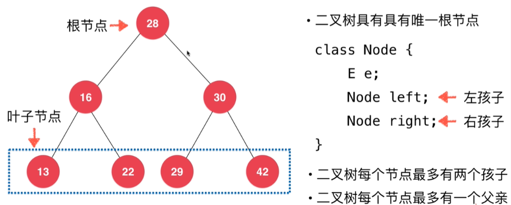
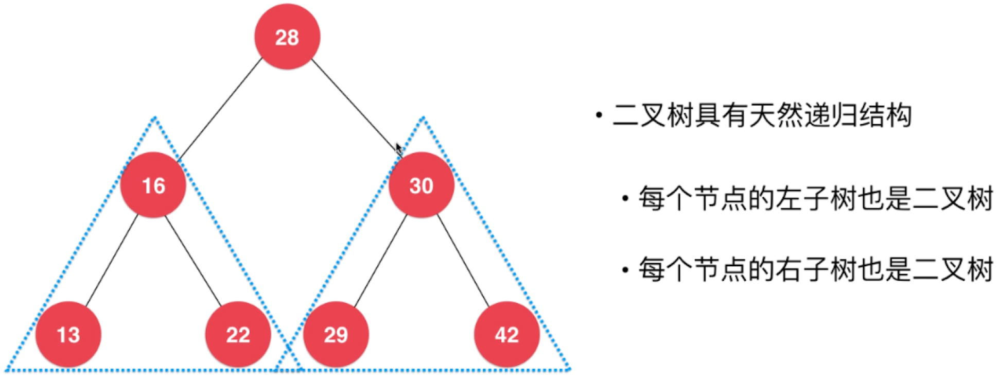
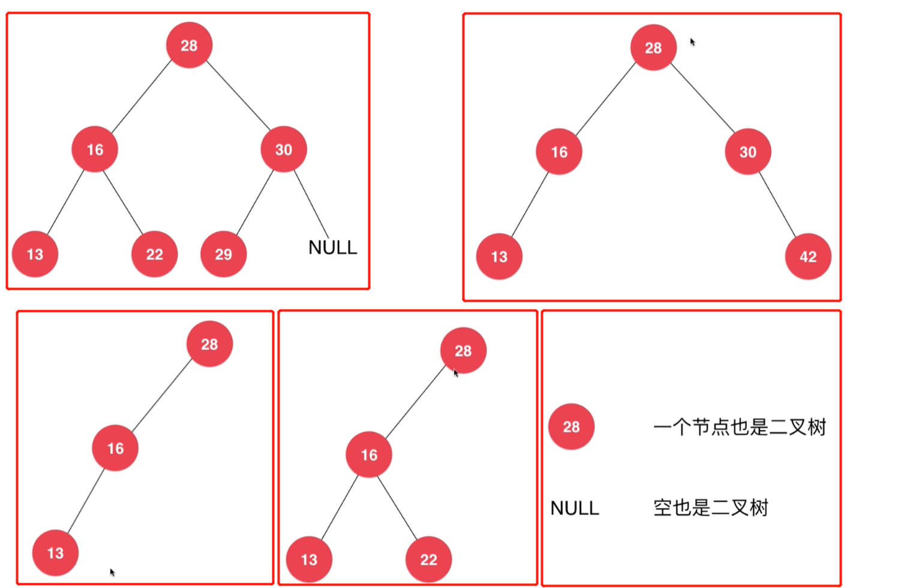
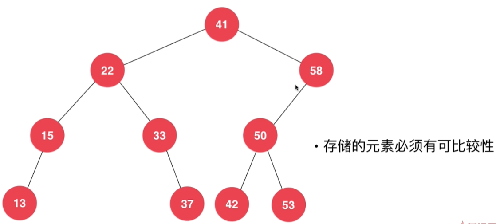

# 第06章_二分搜索树BST
## 6.1 为什么要研究树结构
### 树结构的应用
+ 文件目录树
+ 公司人员组织架构
### 将数据使用树结构存储后，出奇的高校
+ 二分搜索树BST(Binary Search Tree)
+ 平衡二叉树：AVL、红黑树
+ 堆、并查集
+ 线段树、Trie(字典树、前缀树)

## 6.2 二分搜索树基础
> 从二叉树到二分搜索树
### 二叉树的基本结构
+ 和链表一样，是动态数据结构，动态即不需要自己维护容量，能自动扩缩容
+ 二叉树具有唯一的根节点
+ 每个父节点
  + 左边的子节点叫左孩子
  + 右边的子节点叫右孩子
+ 二叉树每个节点最多有两个子节点，可以只有一个左孩子或右孩子，也可以一个孩子节点也没有
+ `一个子节点也没有(即左右子节点均为null)`的节点叫做`叶子节点`，就像现实世界中树的叶子上不会长枝杈一样。
+ 每个节点最多有一个父亲节点。实际除了根节点没有父亲节点，其他节点都有且只有一个父亲节点。

+ 和链表一样，二叉树有天然的递归结构
  + 每个节点的左子树也是二叉树
  + 每个节点的右子树也是二叉树
  + 满二叉树：除了叶子节点，每个节点都有左右两个孩子节点，如下图
    
+ 二叉树不一定都是满二叉树，下面都是例子
  > 

### 二叉树到二分搜索树
> 二分搜索树也被称为二分查找树，它是基于二叉树的一种树形结构，它有着很鲜明的特点：

+ 任意一个节点的左子树中的所有节点都小于这个节点
+ 任意一个节点的右子树中的所有节点都大于这个节点

即`二分搜索树是满足上述两个条件的一种特殊的二叉树`

### 二分搜索树更多的性质

+ 每一颗子树也是二分搜索树
+ 存储的元素必须具有**可比性**(`实现Comparable接口`)

