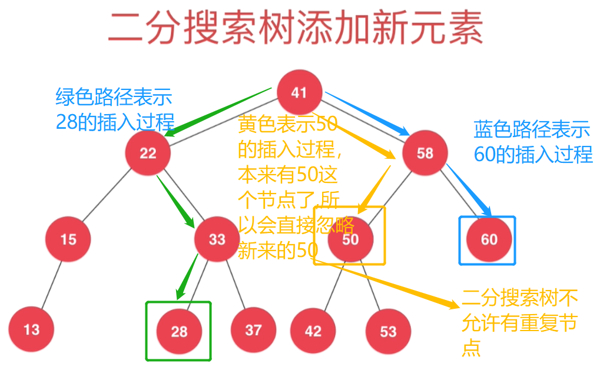

# 第06章_二分搜索树BST
## 6.1 为什么要研究树结构
### 树结构的应用
+ 文件目录树
+ 公司人员组织架构
### 将数据使用树结构存储后，出奇的高校
+ 二分搜索树BST(Binary Search Tree)
+ 平衡二叉树：AVL、红黑树
+ 堆、并查集
+ 线段树、Trie(字典树、前缀树)

## 6.2 二分搜索树基础
> 从二叉树到二分搜索树
### 二叉树的基本结构
+ 和链表一样，是动态数据结构，动态即不需要自己维护容量，能自动扩缩容
+ 二叉树具有唯一的根节点
+ 每个父节点
  + 左边的子节点叫左孩子
  + 右边的子节点叫右孩子
+ 二叉树每个节点最多有两个子节点，可以只有一个左孩子或右孩子，也可以一个孩子节点也没有
+ `一个子节点也没有(即左右子节点均为null)`的节点叫做`叶子节点`，就像现实世界中树的叶子上不会长枝杈一样。
+ 每个节点最多有一个父亲节点。实际除了根节点没有父亲节点，其他节点都有且只有一个父亲节点。

+ 和链表一样，二叉树有天然的递归结构
  + 每个节点的左子树也是二叉树
  + 每个节点的右子树也是二叉树
  + 满二叉树：除了叶子节点，每个节点都有左右两个孩子节点，如下图
    
+ 二叉树不一定都是满二叉树，下面都是例子
  > 

### 二叉树到二分搜索树
> 二分搜索树也被称为二分查找树，它是基于二叉树的一种树形结构，它有着很鲜明的特点：

+ 任意一个节点的左子树中的所有节点都小于这个节点
+ 任意一个节点的右子树中的所有节点都大于这个节点

即`二分搜索树是满足上述两个条件的一种特殊的二叉树`


### 二分搜索树更多的性质

+ 每一颗子树也是二分搜索树
+ 存储的元素必须具有**可比性**(`实现Comparable接口`)


### 二分搜索树的基本代码结构

[二分搜索树的基本代码结构](src/main/java/Chapter06BST/Section02BSTBasic/BST.java)

## 6.3 向二分搜索树中添加节点
向二分搜索树添加新元素
+ 若二叉树为空，直接把要插入的节点作为根节点
+ 若该节点要想插入到一个完整的二分搜索树中，我们需要从根节点出发与其比较，
  + 若比当前节点大则往右走，然后与下一个节点进行比较，
  + 若比当前节点小则往左走，然后与下一个节点进行比较，
  + 找到一个节点的左子节点或右子节点为null，则把要插入的节点插入这个位置
  + 不允许插入重复元素(节点值E相等)，如果遍历过程中发现要插入的节点和已有节点相等，不做任何处理直接返回
    + 但是如果想让其包含重复元素的话也可以实现，只需要对其进行重定义：左子树小于等于节点；或者右子树大于等于节点
    + 我们前两章讲地数组和链表是可以有重复元素的




实现代码如下：
```java
/**
 * 向以节点Node为根节点的二分搜索树树中添加新的元素e，递归实现
 *
 * @param node 二分搜索树的根节点
 * @param e    要加入地元素e
 */
private void add(Node node, E e) {
    if (e.compareTo(node.e) < 0) {
        // e小于根节点，往node的左子树继续遍历
        if (node.left == null) {
            // 执行完节点插入操作递归就会回退到上一层递归
            node.left = new Node(e);
            size++;
        } else {
            // 没找到插入位置就继续往左侧递归
            add(node.left, e);
        }
    } else if (e.compareTo(node.e) > 0) {
        // e大于根节点，往node的右子树继续遍历
        if (node.right == null) {
            // 执行完节点插入操作递归就会回退到上一层递归
            node.right = new Node(e);
            size++;
        } else {
            // 没找到插入位置就继续往右侧递归
            add(node.right, e);
        }
    }
    // 如果和遍历到的节点相等即e.compareTo(node.e)==0，不做插入操作。因为我们实现的二分搜索树不允许有重复元素。
    // 这里我们直接不处理这种情况，递归会直接回退到上一层递归
}

/**
 * 向二分搜索树中添加元素e
 */
public void add(E e) {
    if (root == null) {
        // 如果二分搜索树为空，直接把要加入的节点作为新节点
        root = new Node(e);
        size++;
    } else {
        add(root, e);
    }
}
```
本课程关于二分搜索树的注意点：
+ 我们的课程中实现的二分搜索树不包含重复元素(不会有两个节点的E相等)
+ 二分搜索树添加元素的非递归写法。和链表很像
+ 本课程在二分搜索树方面的实现，关注递归实现
+ 二分搜索树一些方法的非递归实现自己练习下，老师的代码仓库里有参考实现
+ 在二分搜索树方面，递归实现要比非递归实现简单地多


## 6.4 优化添加操作
> 优化后的代码如下(把多种为null的情况合一了，简洁但是不太易懂，好好看下)：

```java
/**
 * 向以节点Node为根节点的二分搜索树树中添加新的元素e，递归实现
 *
 * @param node 二分搜索树的根节点
 * @param e    要加入地元素e
 */
private Node add(Node node, E e) {
    // 只要碰到了为空的node，就一定要把我们的e作为节点添加到这里的，具体是作为左子树、右子树还是根节点到下面再进行设置
    if (node == null) {
        return new Node(e);
    }
    if (e.compareTo(node.e) < 0) {
        // e小于根节点，往node的左子树继续遍历
        node.left = add(node.left, e);
    } else if (e.compareTo(node.e) > 0) {
        // e大于根节点，往node的右子树继续遍历
        node.right = add(node.right, e);
    }
    // 如果和遍历到的节点相等即e.compareTo(node.e)==0则直接跳过，不做任何处理，因为我们实现的二分搜索树不允许有重复元素。
    
    // 当这个node是把e给new出来地就设置到子节点为空的上面去；如果不是new出来地相当于把已有的二分搜索树中的节点关系又设置一次
    return node;
}

/**
 * 向二分搜索树中添加元素e
 */
public void add(E e) {
    root = add(root, e);
}
```

## 6.5 查询操作

