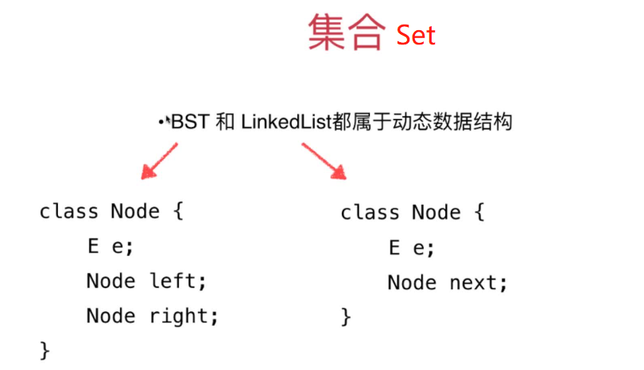
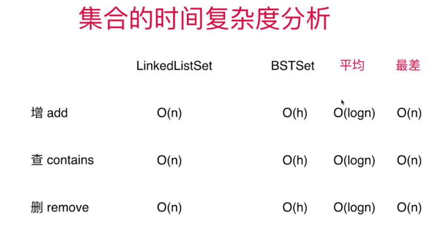
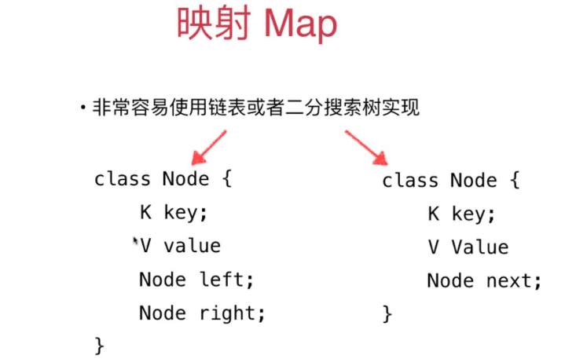
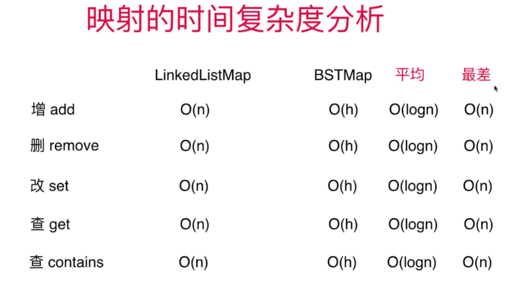

# 第07章 集合Set与映射Map

## 7.1~7.4 集合Set与映射Map

### 二分搜索书BST和链表LinkedList都是动态结构，都可以用于构造集合Set
+ [基于BST的Set](src/main/java/Chapter07SetAndMap/Section1SetBasicAndBSTSet/BSTSet.java)
+ [基于LinkedList的Map](src/main/java/Chapter07SetAndMap/Section2LinkedListSet/LinkedListSet.java)



### BSTSet和LinkedList的时间复杂度比较
> O(h)即O(logn)

+ BSTSet存储节点是有序集合，类似TreeSet
+ LinkedListSet存储节点是无序集合，类似HashSet

### LeetCode上的集合相关问题
+ [804.唯一摩尔斯密码词](https://leetcode-cn.com/problems/unique-morse-code-words/)

```java
class Solution {
    public int uniqueMorseRepresentations(String[] words) {
        String[] codecs = {".-","-...","-.-.","-..",".","..-.","--.","....","..",".---","-.-",".-..","--","-.","---",".--.","--.-",".-.","...","-","..-","...-",".--","-..-","-.--","--.."};
        // 不同的翻译
        Set<String> diffTrans = new TreeSet<>();
        for(String word : words){
            StringBuilder sb = new StringBuilder();
            for(int i = 0; i < word.length(); i++){
                sb.append(codecs[word.charAt(i) - 'a']);
            }
            diffTrans.add(sb.toString());
        }
        return diffTrans.size();
    }
}
```

## 7.5~7.8 映射Map
### 基于BST和LinkedList都可以实现Map，但是节点需要改装下,需要支持键值对
> 基于BST的实现要比基于LinkedList时间复杂度低很多
+ [基于BST的Map实现](src/main/java/Chapter07SetAndMap/Section7BSTMap/BSTMap.java)
+ [基于LinkedList的Map实现](src/main/java/Chapter07SetAndMap/Section7BSTMap/BSTMap.java)
> 

### 基于LinkedList的Map和基于BST的MAP比较


### 测试两种实现的性能
+ [测试代码](src/main/java/Chapter07SetAndMap/Section8TestMap/Main.java)

### 有序映射TreeMap和无序映射HashMap
+ TreeMap基于平衡二分搜索树实现(红黑树)
+ HashMap基于哈希表实现

## 7.9 LeetCode上关于Set和Map的问题
+ [349.求数组交集](https://leetcode-cn.com/problems/intersection-of-two-arrays/)
+ [350.求数组交集II](https://leetcode-cn.com/problems/intersection-of-two-arrays-ii/comments/)