# 第08章 堆和优先队列

## 8.1 什么是优先队列？
### 普通队列和优先队列的比较
+ 普通队列：先进先出；后进后出
+ 优先队列：出队顺序和入队顺序无关，和优先级相关，优先级高地先出队
### 优先队列的应用
+ 医院排队，VIP客户优先
+ Windows任务管理器，系统任务优先
### 优先队列不同实现方式的时间复杂度
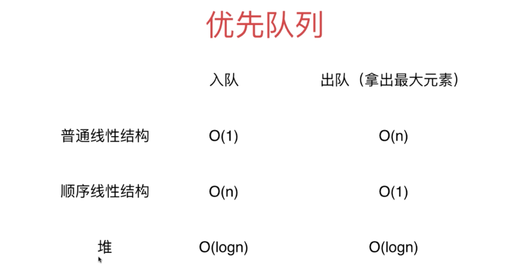

## 8.2 堆的基础
### 二叉堆与二叉树的区别和联系
> 二叉堆是一棵完全二叉树。
### 完全二叉树与满二叉树的比较
+ 满二叉树和完全二叉树的区别：
  > 对于满二叉树，除最后一层无任何子节点外，每一层上的所有结点都有两个子结点二叉树。
                   
  > 而完全二叉树是效率很高的数据结构，完全二叉树是由满二叉树而引出来的。对于深度为K的，有n个结点的二叉树，当且仅当其每一个结点都与深度为K的满二叉树中编号从1至n的结点一一对应时称之为完全二叉树。
+ 满二叉树定义
  > 定义：一个二叉树，如果每一个层的结点数都达到最大值，则这个二叉树就是满二叉树。也就是说，如果一个二叉树的层数为K，且结点总数是(2^k) -1 ，则它就是满二叉树。
  > 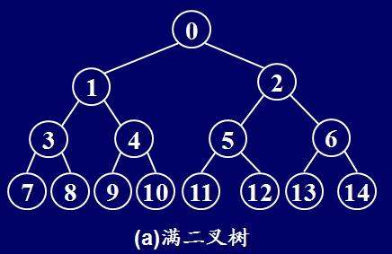
+ 完全二叉树
  > 定义：若设二叉树的深度为h，除第 h 层外，其它各层 (1～h-1) 的结点数都达到最大个数，第 h 层所有的结点都连续集中在最左边，这就是完全二叉树。
  > 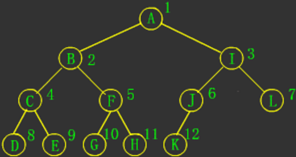

### 二叉堆的性质
> 对比：二分搜索树是左节点小于父节点、右节点大于父节点的二叉树
+ 每个每个节点的值不大于其父亲节点的值--->最大二叉堆，简称最大堆，因为此时根节点肯定是值最大的节点
+ 每个每个节点的值不小于其父亲节点的值--->最小二叉堆，简称最小堆，因为此时根节点肯定是值最小的节点

注意：最大堆中，第k层的节点不一定比第k-1层的节点小，只要保证比自己的父亲节点小即可
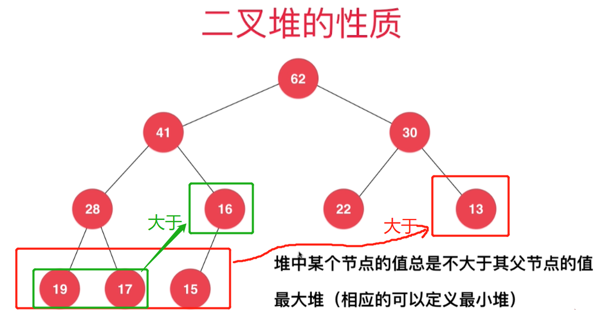

### 最大堆的表示
> 基于数组表示最大堆，注意数组下标是从1开始的
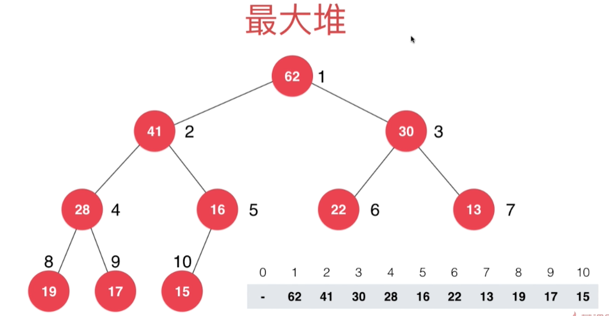

一个节点在数组中的索引为i，则其父亲节点和左右孩子节点在数组中的索引表示如下：
+ 父亲节点索引 = `i / 2`，注意是整除
+ 左孩子的索引 = `2 * i`
+ 右孩子的索引 = `2 * i + 1`
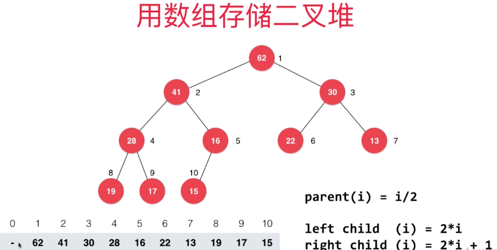

数组下标从0开始存储最大堆时，节点索引公式需要修改如下：
+ 父亲节点索引 = `(i - 1) / 2`，注意是整除
+ 左孩子的索引 = `2 * i + 1`
+ 右孩子的索引 = `2 * i + 2`
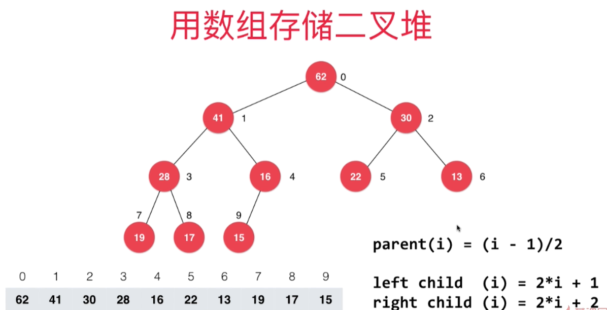

## 8.4 向堆中添加元素ShiftUp
+ 根据完全二叉树的特点，添加元素需要添加到动态数组的最后，即用addLast添加元素
+ 添加完新元素，虽然仍然是完全二叉树，但是已经不满足所有节点都不大于父节点的要求了，所以新加的元素需要上浮ShiftUp
  > 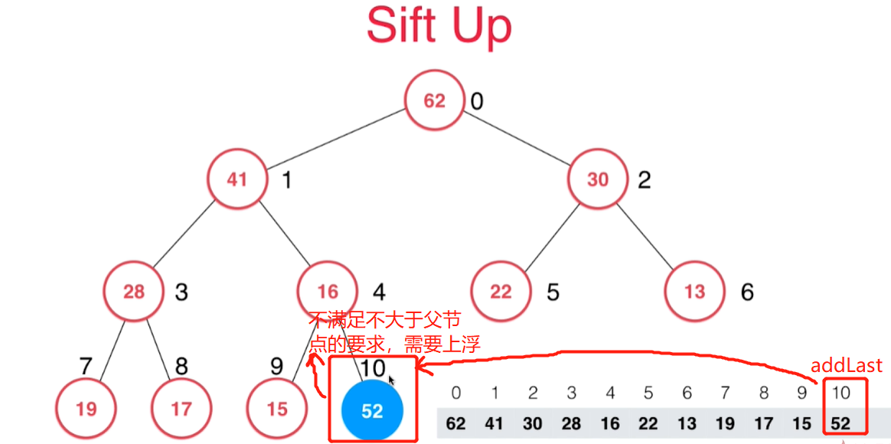
+ 不断把新加入的节点和父节点进行比较，如果大于父节点就和父节点进行进行位置对调，一直到满足不大于父节点的要求
  > 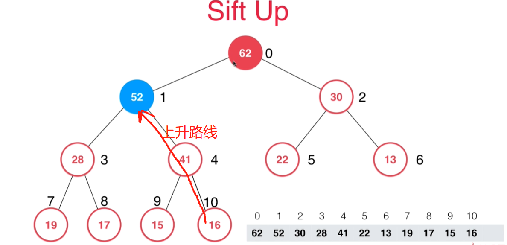
```java
/**
 * 向堆中添加元素
 */
public void add(E e) {
    data.addLast(e);
    // 新加入的元素一定在末尾，所以上浮它即可
    shiftUp(data.getSize() - 1);
}

/**
 * 上浮data中索引为k的元素
 *
 * @param k 索引
 */
private void shiftUp(int k) {
    // 只要k处节点大于其父亲节点，就交换两个节点继续上浮。不断更新k但要保证k>0
    while (k > 0 && data.get(k).compareTo(data.get(parent(k))) > 0) {
        // k和父亲节点交换
        data.swap(k, parent(k));
        // 交换会更新k为父亲节点的索引
        k = parent(k);
    }
}
```

## 8.4 从堆中取出最大元素(即根节点)和ShiftDown
+ 删除根节点后，把数组中最后一个元素覆盖到根节点处，并把最后一个节点位置清空。
  > 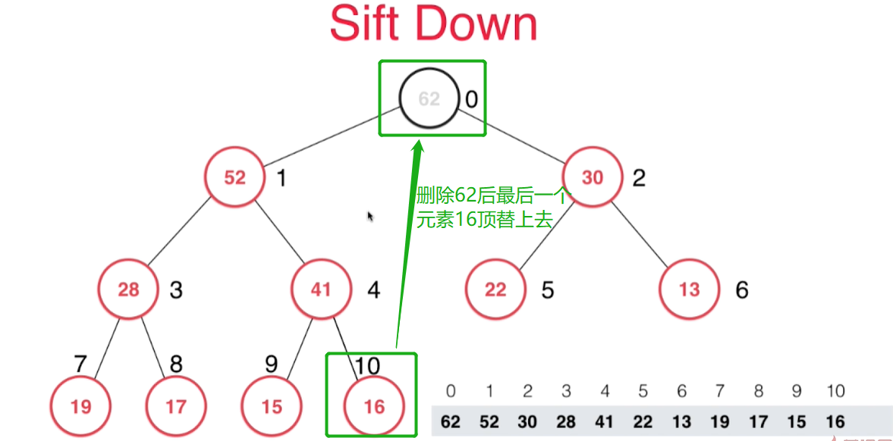
  > 最后位置的元素覆盖根节点后清理最后位置的元素空间
  > 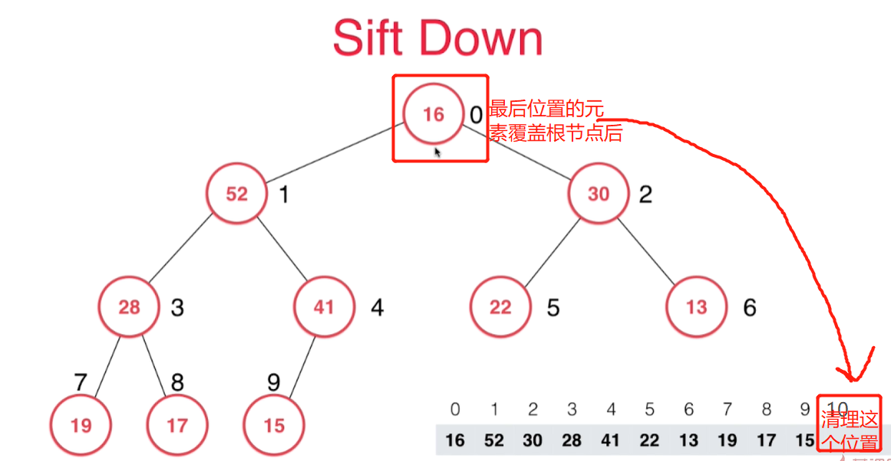
+ 然后新的根节点和左右孩子节点进行比较，不大于左右孩子节点地话，就选择较大的孩子节点进行位置交换。如此一直ShiftDown下沉到合适位置
  > 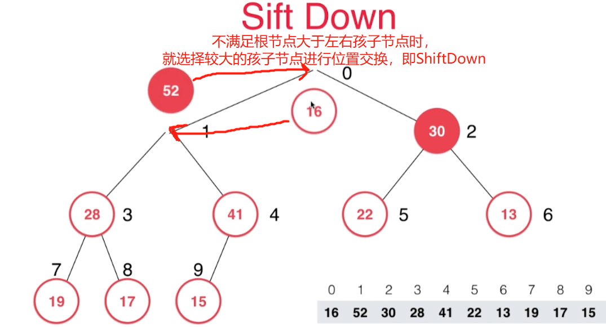
  > 交换一次后还不满足，接着交换
  > 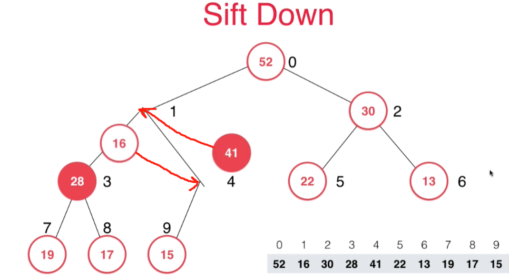
  > 继续下沉到满足最大堆的性质为止
  > 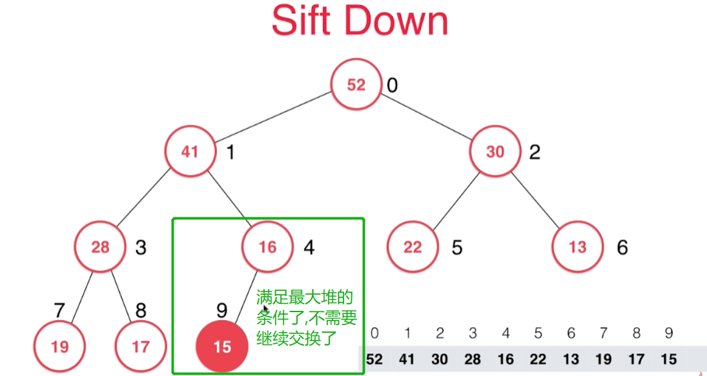

```java
/**
 * 取出堆中最大元素
 */
public E popMax() {
    E ret = getMax();
    // 交换根节点和最后一个节点
    data.swap(0, data.getSize() - 1);
    // 删除最后一个节点，此时最大值就被正式删除了
    data.removeLast();
    // 调整新的二叉堆直到满足最大堆的性质
    siftDown(0);
    // 返回前面暂存的最大节点
    return ret;
}

private void siftDown(int k) {
    while (leftChild(k) < data.getSize()) {
        /* 在此轮循环中,data[k]和data[j]交换位置 */
        int j = leftChild(k);
        // j+1表右孩子，首先要在数组索引范围内，而且右孩子比左孩子大，则j取左右孩子中的较大值即右孩子的索引
        if (j + 1 < data.getSize() && data.get(j + 1).compareTo(data.get(j)) > 0) {
            j++;
        }
        // data[j] 是 leftChild 和 rightChild 中的最大值
        if (data.get(k).compareTo(data.get(j)) >= 0) {
            break;
        }
        data.swap(k, j);
        k = j;
    }
}
```

> add()和popMax()的时间复杂度都是O(logn)

## 8.5 Replace和Heapify

### replace()：取出最大元素后，放入一个新的元素到最大元素的位置上(即根节点上)
> 实现：直接将堆顶元素替换成新元素后shiftDown，一次O(logn)的操作
```java
/**
* 取出堆中的最大元素，并且替换成元素e
*/
public E replace(E e) {
  E ret = getMax();
  data.set(0, e);
  siftDown(0);
  return ret;
}
```

### Heapify：将任意数组整理成堆(最大堆or最小堆)
```java
public MaxHeap(E[] arr) {
   // 直接根据外面传入的数组对整理成最大堆
   data = new Array<>(arr);
   heapify();
}
/**
 * 将任意数组整理成堆
 */
public void heapify() {
    // 初始化的数组，靠上层的节点肯定索引小，所以不断循环进行下沉即可
    // parent(arr.length - 1)表示最后一个非叶子节点
    // i--的过程就是不断向最大堆上面遍历的过程
    int lastNotLeaf = parent(data.getSize() - 1);
    for (int i = lastNotLeaf; i >= 0; i--) {
        siftDown(i);
    }
}
```
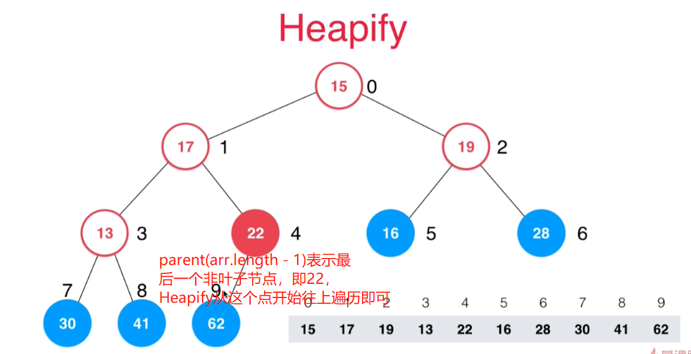

至此我们完成了最大堆和最小堆(仿照最大堆很快就写好啦)
> 其实最大堆和最小堆中大小的定义可以我们自己实现Comparable接口来定义，所以其实只要一个最大堆就能实现弹出真正想要的最大值或最小值的功能。
+ [最大堆代码](src/main/java/Chapter08HeapAndPriorityQueue/Section2to5Heap/MaxHeap.java)
+ [最小堆代码](src/main/java/Chapter08HeapAndPriorityQueue/Section2to5Heap/MinHeap.java)
+ [测试最大堆和最小堆的代码](src/main/java/Chapter08HeapAndPriorityQueue/Section2to5Heap/Main.java)

## 8.6 基于堆的优先队列
> 优先队列即出队时总是出最大或最小元素的队列，是一种特殊的队列

+ [实现代码](src/main/java/Chapter08HeapAndPriorityQueue/Section6PriorityQueueBasedOnOurHeap/PriorityQueue.java)
+ [测试代码](src/main/java/Chapter08HeapAndPriorityQueue/Section6PriorityQueueBasedOnOurHeap/Main.java)

## 8.7 优先队列的常见问题
### 在N那个元素中选取前M名？M远远小于N
> 比如在全国高考成绩中(几百万人)选取前100名？
+ 排序：时间复杂度是NlogN
+ 优先队列：时间复杂度是NlogM，当是百万级别时，显然优先队列性能高地多
  > 维护一个M个元素的优先队列
  + 求最大的前M名就用`容量为M的基于最小堆的优先队列`
    + 当优先队列的size没到M时，直接把新元素加入到优先队列
    + 当优先队列的size到了M时，把要加入的元素和栈顶元素比较
      + 如果新元素比栈顶元素大，就弹出栈顶元素，把新元素加入到优先队列中
      + 如果新元素比栈顶元素小，什么都不做
  + 求最小的前M名就用`容量为M的基于最大堆的优先队列`，每次弹出最大值，遍历N个元素完毕，优先队列中的M的元素就是前M名
    + 当优先队列的size没到M时，直接把新元素加入到优先队列
    + 当优先队列的size到了M时，把要加入的元素和栈顶元素比较
      + 如果新元素比栈顶元素小，就弹出栈顶元素，把新元素加入到优先队列中
      + 如果新元素比栈顶元素大，什么都不做

实际我们不需要指定最大堆和最小堆，因为我们指定堆的Comparator定制比较规则，从而只用最大堆就能得到我们真正想要的最大值或最小值

### 实际应用：[LeetCode347号问题--求前k个高频元素](https://leetcode-cn.com/problems/top-k-frequent-elements/)

```java
public List<Integer> topKFrequent(int[] nums, int k) {
    // 元素和出现频次的映射Map
    Map<Integer, Integer> mapNumFreq = new HashMap<>();
    for (int num : nums) {
        // 更新map里面的值
        if (mapNumFreq.get(num) == null) {
            mapNumFreq.put(num, 1);
        } else {
            mapNumFreq.put(num, mapNumFreq.get(num) + 1);
        }
    }
    PriorityQueue<Integer> pq = new PriorityQueue<>(k, new Comparator<Integer>() {
        @Override
        public int compare(Integer key1, Integer key2) {
            // 自定义比较器，找出现频次较高地需要每次弹出最小值
            return mapNumFreq.get(key1) - mapNumFreq.get(key2);
        }
    });
    for (Integer key : mapNumFreq.keySet()) {
        if (pq.size() == k) {
            // 满了需要和栈顶元素比较，比栈顶元素大就加入到队列中
            if (mapNumFreq.get(key) > mapNumFreq.get(pq.peek())) {
                pq.poll();
                pq.add(key);
            }
        } else {
            // 优先队列没满就直接加入
            pq.add(key);
        }

    }
    List<Integer> result = new ArrayList<>();
    while (!pq.isEmpty()) {
        result.add(pq.poll());
    }
    // 从高频到低频
    Collections.reverse(result);
    return result;
}
```