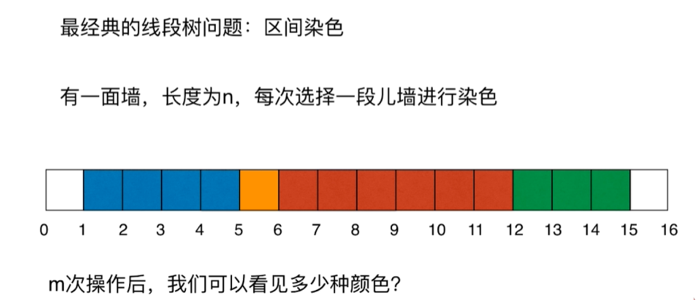
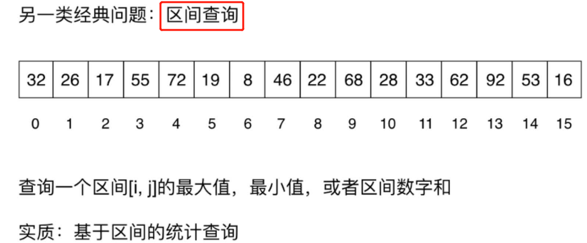
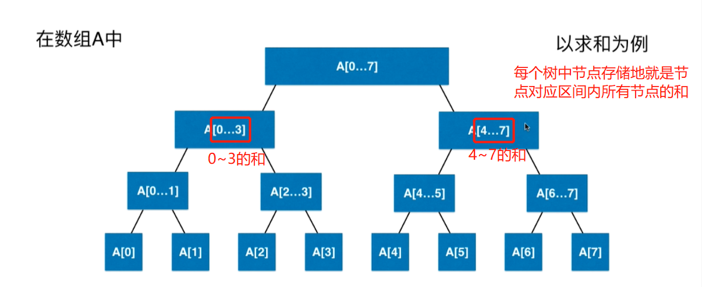
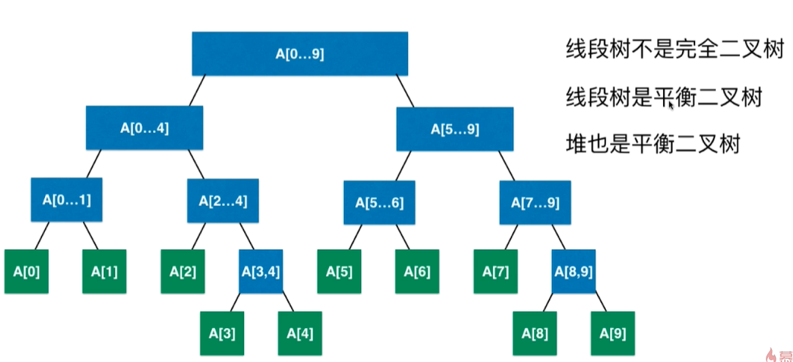
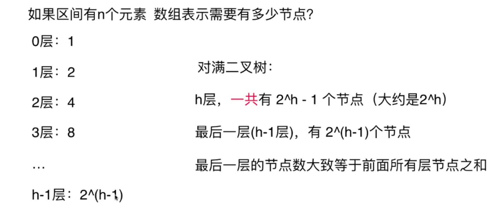
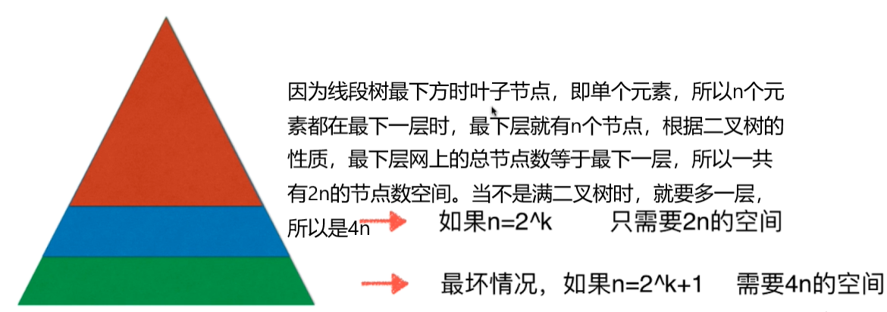
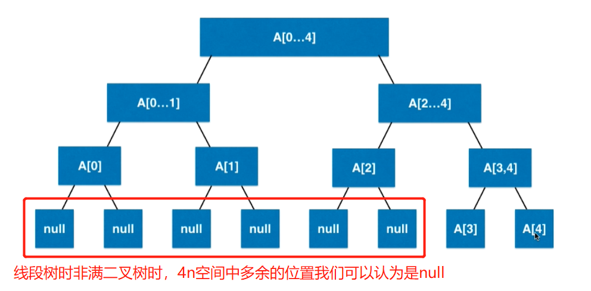

# 第09章 线段树
> 也称区间树，表明我们关系的是一个区间内的问题
## 9.1 什么是线段树
> 对于有一类问题，我们关系地是线段(即区间)

### 线段树的应用举例
+ 染色问题
  > 
  > 
  
  > 染色问题的操作步骤如下：

  | 操作               | 使用数组实现 | 使用线段树实现 |
  | ------------------ | ------------ | -------------- |
  | 染色操作(更新区间) | O(n)         | O(logn)        |
  | 查询操作(查询区间) | O(n)         | O(logn)        |
+ 区间查询问题
  > 
  
  > 线段树的常见操作：
  
  | 操作     | 使用数组实现 | 使用线段树实现 |
  |-------- | ------------ | -------------- |
  | 更新区间 | O(n)         | O(logn)        |
  | 查询区间 | O(n)         | O(logn)        |

### 总结：区间问题的常见操作
| 操作     | 含义 | 使用数组实现 | 使用线段树实现 |
|-------- | ------------ | -------------- | -------------- |
| 更新 | 更新区间中一个元素或者一个区间的值 | O(n)         | O(logn)        |
| 查询 | 查询一个区间[i, j]中的最大值、最小值或区间数字和 | O(n)         | O(logn)        |

显然我们应该用线段树来解决问题

### 线段树举例
> 每个节点存储地就是这个区间的特征值

## 9.2 线段树基础表示

### 线段树不一定是满二叉树
> 上一届的A[0...7]的例子比较特殊，区间长度为2的3次方，正满填满一棵二叉树

下面的例子中，当区间长度不是2的整数次方时，区间没法均分，线段树就不是满二叉树了

不是满二叉树，我们仍然可以用数组来表示线段树，不满的地方我们用空来在数组中表示即可

### 区间有n个元素时，线段树的数组需要多少个节点？

总上：
+ 如果区间有n个元素，表示线段树的数组需要4n的空间
+ 因为线段树不考虑添加元素，即区间固定，所以使用4n的静态空间即可

线段树时非满二叉树时，4n空间中多余的位置我们可以认为是null,如下图：
