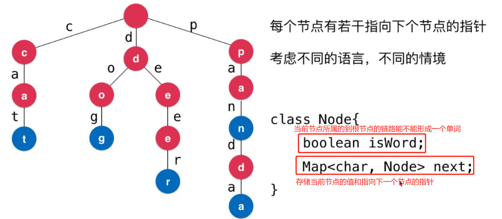
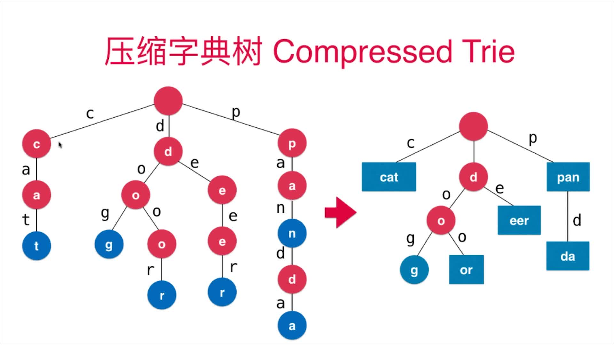

# 第10章 Trie字典树
> 也称前缀树prefix tree
## 10.1 什么是Trie字典树
+ 也称字典树Digital Tree；前缀树Prefix Tree
+ Trie是一个多叉树，通常只用来处理字符串
+ 前面几章我们一直在用的都是二叉树

### Trie与字典在字符串查找中的性能比较
> trie添加和查询字符串只与字符串的长度有关，与有多少个字符串无关


### Trie的结构
> 注意根节点不存储任何字符


## 10.2~10.4 Trie的基础结构、添加单词、单词查询、前缀查询
### 基础结构
> 基础节点表示和构造方法，`TreeMap<Character, Node> children`的某个点的所有子节点，Map是为了快速查询字符与节点的对应关系，好好理解下~~
```java
public class Trie {
    class Node {
        boolean isWord; // 当前节点所属的到根节点的链路能不能形成一个单词
        TreeMap<Character, Node> children; // 当前节点的所有子节点，是一对多的关系，故需要map来存储;此外存Map可以实现快速根据键值选中符合条件的子节点，因此此处必须用Map

        Node() {
            children = new TreeMap<>();
        }
    }

    private Node root; // 整个Trie树的根节点
    private int size; // Trie树种有多少个单词

    public Trie() {
        root = new Node();
        size = 0;
    }

    /**
     * Trie树中有多少个单词
     */
    public int getSize() {
        return size;
    }
}
```
### 添加单词：遍历单词的每个字符，刷新Trie树
```java
/**
 * 向Trie中添加一个新的单词word
 */
public void add(String word) {
    Node cur = root; // 开始从根节点开始
    for (int i = 0; i < word.length(); i++) {
        char c = word.charAt(i);
        if (cur.children.get(c) == null) cur.children.put(c, new Node()); //  当在当前节点指向的孩子节点中不存在要插入的字符c的时候。为null表示不存在，把字符串作为新的Trie节点插入
        cur = cur.children.get(c); // cur节点往后移动一位，这里用map的作用就体现出来了，可以快速找到当前字符c处在哪个子节点上
    }
    if (cur.isWord) return; // 先判断这个单词是不是以前就存在
    cur.isWord = true; // 插入单词后，把这个单词插入后的末尾节点标记为是单词
    size++; // 单词数+1
}   
```

### 单词查询：查询单词是否在Trie树种存在
```java
/**
 * 查询单词word是否在Trie树中
 */
public boolean contains(String word) {
    Node cur = root;
    for (int i = 0; i < word.length(); i++) {
        char c = word.charAt(i);
        if (cur.children.get(c) == null) return false; // 当前节点的子节点是否包含字符c，不包含则肯定不包含单词word了，直接返回即可
        cur = cur.children.get(c); // 循环到下一个点
    }
    return cur.isWord; // 到达字符串的最后一个字符,即使有这个单词，但是isWord不为True也表明没有被标记过。不算包含这个单词
}
```

### 前缀查询：判断某个字符串是否是Trie树种某个单词的前缀
```java
/**
 * 判断某个字符串prefix是否是Trie树种某个单词的前缀(即某个单词以这个字符串开始)
 */
public boolean startsWith(String prefix) {
    Node cur = root;
    for (int i = 0; i < prefix.length(); i++) {
        char c = prefix.charAt(i);
        if (cur.children.get(c) == null) return false; // 当前节点的子节点是否包含字符c，不包含则肯定不包含前缀prefix了，直接返回即可
        cur = cur.children.get(c); // 循环到下一个点
    }
    return true; // 只要找到这个前缀，就可认为包含这个前缀的单词是存在地，不需要判断前缀到达的位置是否是单词
}
```

### 测试代码
```java
public static void main(String[] args) {
    Trie trie = new Trie();
    trie.add("cat");
    trie.add("category");
    trie.add("hello");
    trie.add("world");
    System.out.println(trie.contains("cat")); // true
    System.out.println(trie.contains("wor")); // false
    System.out.println(trie.startsWith("wor")); // true
}
```

### LeetCode上相关问题：[LeetCode208号问题](https://leetcode-cn.com/problems/implement-trie-prefix-tree/)

## 10.5 Trie支持正则表达式
> [LeetCode211号问题](https://leetcode-cn.com/problems/add-and-search-word-data-structure-design/)

核心逻辑如下：
```java
/**
 * 查询单词是否在Trie树中
 *
 * @param word 要查询的单词，支持正则表达式
 * @return 是否包含指定单词
 */
public boolean contains(String word) {
    return match(root, word, 0);
}


/**
 * 从node开始作为根节点检索word在Trie中是否存在
 *
 * @param node  本次递归开始检索的节点
 * @param word  单词或者正则
 * @param index 本次递归检索到了word的第index个字符
 * @return 是否在Trie中匹配到word对应的模式
 */
private boolean match(Node node, String word, int index) {
    // 1.递归终止条件
    if (index == word.length()) {
        // word已经检索到最后一个字符，直接返回其在Trie中的状态即可
        return node.isWord;
    }

    // 2.递归逻辑
    char c = word.charAt(index);
    if (c != '.') {
        // 2.1不是正则匹配，用普通的单词匹配即可
        if (node.next.get(c) == null) {
            // 在当前递归的Trie树中找不到c字符(同时也没有下一个node了，我们的map实际是起到记录当前节点值和下一个节点的指针地作用)，则匹配失败(前面层的递归都匹配上了)
            return false;
        } else {
            return match(node.next.get(c), word, index + 1);
        }
    }else {
        // 2.2 c==. 需要遍历node的所有相邻节点，继续向下递归
        for (Character cNext : node.next.keySet()) {
            if (match(node.next.get(cNext), word, index+1)){
                // 任何一个邻接点向下递归找到了匹配就可以返回true
                return true;
            }
        }
        // 所有的邻接点往下递归都没找到匹配，才返回false
        return false;
    }
}
```

+ [代码实现：支持正则的增强Trie](src/main/java/Chapter10Trie/Section5Leetcode211TrieAndPatternMatch/TrieRegex.java)
+ [代码实现：用增强的TrieRegex来解决211号问题](src/main/java/Chapter10Trie/Section5Leetcode211TrieAndPatternMatch/WordDictionary.java)

## 10.6 带权重的Trie树
> 每个Node节点加一个weight属性，每次加入节点都要更新权重，每个单词都有自己的权重，多个前缀相同单词的相同前缀要把多个单词的权重加起来
+ [代码实现](src/main/java/Chapter10Trie/Section6Leetcode677MapSum/TrieWeighted.java)
+ [实际问题：leetcode677](src/main/java/Chapter10Trie/Section6Leetcode677MapSum/MapSum.java)

## 10.7 更多Trie相关的话题
### 删除操作
### Trie最大的问题：空间
> 可以用压缩字典树(Compressed Trie)来做



### 字符串匹配
+ KMP
+ Boyer-Moore
+ Rabin-Karp

### 文件压缩
+ Huffman

### 模式匹配
### 编译原理

## LeetCode上字典树相关的问题
> https://leetcode-cn.com/tag/trie/

### [421.数组中两个数的最大异或值](https://leetcode-cn.com/problems/maximum-xor-of-two-numbers-in-an-array/)
> 这个题目很巧妙，暴力法能过，但是效率太低了，还是要用字典树来做

```java
import java.util.*;

class Solution {
    // 这里每个节点的邻接子树只有0和1两种情况，实际Map只有两个键
    class Node {
        int val;
        Node left, right; // 左侧为0， 右侧为1

        Node(int x) {
            val = x;
        }
    }

    private Node root;

    public Solution() {
        root = new Node(0); // 初始节点
    }

    public int findMaximumXOR(int[] nums) {
        int maxLevel = 0;
        for (int num : nums) { // 计算最大的层数
            int curLevel = (int) (Math.floor(Math.log(num) / Math.log(2)));
            maxLevel = Math.max(maxLevel, curLevel);
        }

        for (int num : nums) { // 把num的二进制逐位存入到Trie中
            Node cur = root; // 从根节点开始
            for (int i = maxLevel; i >= 0; i--) {
                int ibit = (num >> i) & 1; // num的第位对应的二进制表示
                if (ibit == 0) {
                    if (cur.left == null) cur.left = new Node(ibit);
                    cur = cur.left;
                }
                if (ibit == 1) {
                    if (cur.right == null) cur.right = new Node(ibit);
                    cur = cur.right;
                }
            }
        }
        // DFS求子树的最大值
        return dfs(root.left, root.right, maxLevel);
    }

    // left:左侧取地节点；right：右侧取地节点
    private int dfs(Node left, Node right, int level) {
        if (root == null && left == null) return 0;
        // 走到这里说明左右节点至少一个不为空
        int res = 0;
        int max = 0;
        if (left == null || right == null) {
            if (right != null) max = Math.max(max, dfs(right.left, right.right, level - 1));
            if (left != null) max = Math.max(max, dfs(left.left, left.right, level - 1));
        } else {
            // 左右的节点都不为空，则可以累计一次1了，计算下幂指数即可
            res = left.val == right.val ? 0 : (int) Math.pow(2, level);
            if (left.left != null) {
                if (right.right != null) max = Math.max(max, dfs(left.left, right.right, level - 1));
                else max = Math.max(max, dfs(left.left, right.left, level - 1));
            }
            if (left.right != null) {
                if (right.left !=null) max = Math.max(max, dfs(left.right, right.left, level - 1));
                else max = Math.max(max, dfs(left.right, right.right, level - 1));
            } 
        }
        return res + max;
    }
}
```

+ [212.单词搜索II](https://leetcode-cn.com/problems/word-search-ii/)
