# 第11章 并查集
> 两个点之间在树或图中是否连通的问题。

在[《玩转数据结构C++版 第6章》](../Part1Basic/第6章_并查集.md)和[《图论基础 Java版》第4章](../Part2BasicGraph/第04章_图的深度优先遍历的应用.md#42-求每个连通分量里各自具体有哪些节点)都有讲到相关问题

## 11.1 什么是并查集？
### 连接问题
+ 网络中节点间的连接状态
+ 数学中的集合类实现
### 连接问题与路径问题：
+ 解决路径问题便一定可以解决连接问题，但由于路径问题考虑了更多与连接问题无关的操作，使得用处理路径问题的方式处理连接问题性能较差。
+ 类似的，实现最大/最小堆的数据结构完全可以用有序数组的结构替代，但由于顺序表的每次操作都需要遍历整个数组，因此不仅可以找到最大最小的元素，也可以找到其它的元素，但也因为这样，使用顺序表实现堆的操作性能较差
### 并查集要支持的接口
+ `union(p, q)`:把p和q连接起来，将两个元素连接起来，等效于p、q所在的网络两个连接到了一起，两个网络内的顶点就都连接到一起了，我自己的实现叫`unionElements(p, q)`
+ `isConnected(p, q)`：判断p和q是否是连接的
### [并查集基础的接口](src/main/java/Chapter11UnionFind/UF.java)
```java
/***********************************************************
 * @Description : 并查集的基础接口
 * @author      : 梁山广(Laing Shan Guang)
 * @date        : 2020/1/2 18:58
 * @email       : liangshanguang2@gmail.com
 ***********************************************************/
package Chapter11UnionFind;

public interface UF {
    /**
     * 判断p和q是否是联通
     *
     * @param p 顶点p
     * @param q 顶点q
     * @return p和q是联通返回true，否则返回false
     */
    boolean isConnected(int p, int q);

    /**
     * 把定点p和q联通起来，等效于把p和q所在的联通分量连接到一起，称为一个联通分量
     *
     * @param p 顶点p
     * @param q 顶点q
     */
    void unionElements(int p, int q);

    /**
     * 获取并查集内的元素个数
     * @return  并查集内的元素个数
     */
    int getSize();
}

```

## 11.2 并查集第1版：Quick Find
> 我们把所有的点存入一个`int[] id`数组，联通的点在id内的值相等，比如`id[p]=id[q]`表明p和q在一个联通分量内。id[p]和id[q]可以看做是联通分量的唯一标记即id

比如下面图,
+ 0、1、2、3、4在下面id数组中的值均为0，所以它们都在一个联通分量内
+ 5、6、7、8、9在下面id数组中的值均为1，所以它们都在一个联通分量内
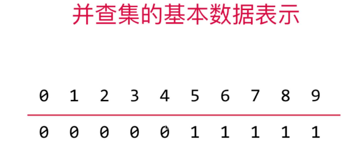

再比如下面的图：
+ 0、2、4、6、8在下面id数组中的值均为0，所以它们都在一个联通分量内
+ 1、3、5、7、9在下面id数组中的值均为1，所以它们都在一个联通分量内
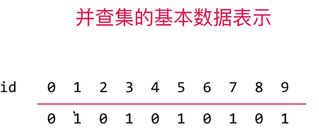

所以实现`isConnected(p, q)`实际就是判断id[p]和id[q]是否相等，由于后面id数组的形式还会优化，所以我们把获取p和q所在联通分量的id的函数封装成find(p)和find(q)，我们直接判断find(p)和find(q)是否相等即可

因为直接在数组中取值，不需要遍历，所以我们的`find()`实现是`O(1)`级别的，不能更高了，所以本节实现的是Quick Find

```java
public class UnionFind implements UF {

    /**
     * 存储每个节点所在的联通分量id的数组
     */
    private int[] id;

    public UnionFind(int size) {
        this.id = new int[size];
        for (int i = 0; i < id.length; i++) {
            // 初始化时每个顶点的联通分量id都不同
            id[i] = i;
        }
    }

    ...

    /**
     * 获取元素e所属的联通分量编号,因为直接在数组中取值，所以是O(1)级别的
     *
     * @param i 元素，即id数组的下标，用来唯一标识一个元素，即id数组的下标既是索引又是元素
     * @return e所属的联通分量编号
     */
    private int find(int i) {
        if (i < 0 || i >= id.length) {
            throw new IllegalArgumentException("传入的索引超出了数组范围！");
        }
        return id[i];
    }
}
```

但是union操作时间复杂度会很高，下面分析下：
如下图，为了把属于两个联通分量的1和4连接起来，即实现`union(1, 4)`，我们把4在id数组中的值改成和1的一样，即id[4]从0改成1，
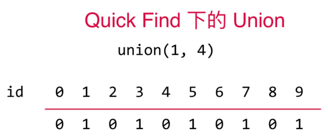
为了保持0、2、6、8和4仍然在一个联通分量内需要把id[0]、id[2]、id[6]、id[8]也从0改成1，为了完成这个操作需要对id数组执行一轮循环，所以此时的union操作是O(n)级别的
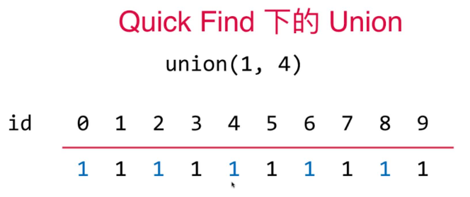

代码实现如下：

```java
@Override
public void unionElements(int p, int q) {
    int pID = find(p);
    int qID = find(q);
    if (pID == qID) {
        return;
    }
    // pID的元素改成qID或者qID改成pID都可以，这里我们把pID的元素改成qID
    for (int i = 0; i < id.length; i++) {
        if (id[i] == pID) {
            id[i] = qID;
        }
    }
}
```

综上，Quick Find一般就意味着Slow Union，基于id数组的UnionFind中的find()和union的操作时间复杂度如下：


| 方法                | 时间复杂度 |
| ------------------- | ---------- |
| find(i)             | O(1)       |
| union(p, q) | O(n)       |

[本节的完整代码实现](src/main/java/Chapter11UnionFind/Section2QuickFind/UnionFind.java)

## 11.3 Quick Union 
> 上一节的union操作unionElements的时间复杂度为O(n)，显然太高，本节我们实现O(logn)的union操作

### Quick Union的思路
> 如下图，两个联通分量，我们可以把每个联通分量用一个从子节点指向父节点的树来表示，左边联通分量内任何一个节点要和右边联通分量内的节点union时，只需要把两个联通分量的根节点2和5进行union即可(`2指向5进行连接`或者`5指向2进行连接`都可以)

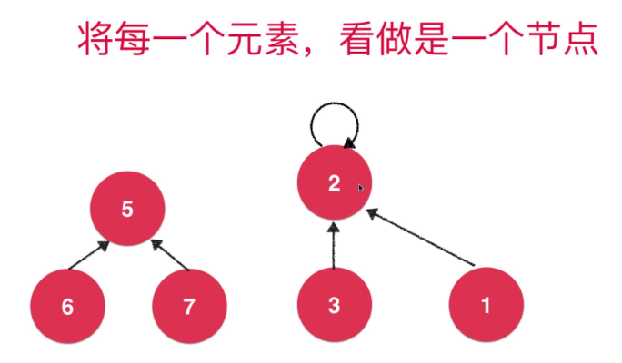

下面我们从5指向2进行了连接，形成了一个新的树，在这个新树上所有的节点都连接在了一起~~任意两个节点是否连通只要判断他们的根节点是否相同即可
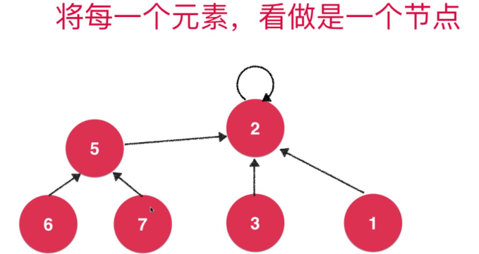

### Quick Union的代码实现
> 定义一个数组`int[] parent`，`parent[i]=j`表示节点i的父亲节点为j。要union(p, q)，只需要不断往前遍历q的父节点直到`parent[i]=i`就说明找到了q所在的连通分量的根节点~然后我们把p指向这个根节点即可

下面演示下Quick Union的过程
> `union(p, q)`一般我们都是把`p所在联通分量的根节点pRoot`指向`q所在联通分量的根节点qRoot`(即pRoot作为子节点，qRoot作为父节点，子节点指向父节点，没有父节点直接用自己)，代码表示为：`parent[pRoot]=qRoot`

+ 定义parent数组，初始每个节点的父节点都是自己，即`parent[i]=i`
  > 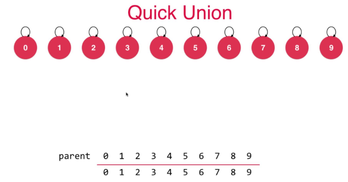
+ `union(4, 3)`:4和3都没父节点(也可以理解为只有一个节点的树，各自都是根节点，父节点都是自己)，直接把4指向3，即设置`parent[4]=3`
  > 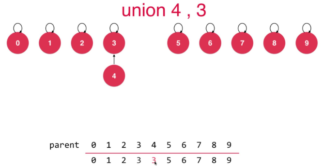
+ `union(3, 8)`:3和8都没父节点(也可以理解为只有一个节点的树，各自都是根节点，父节点都是自己)，直接把3指向8，即设置`parent[3]=8`
  > 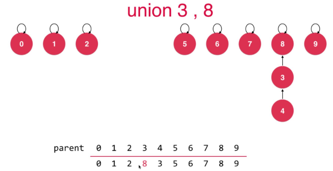
+ `union(6, 5)`:6和5都没父节点(也可以理解为只有一个节点的树，各自都是根节点，父节点都是自己)，直接把6指向5，即设置`parent[6]=5`
  > 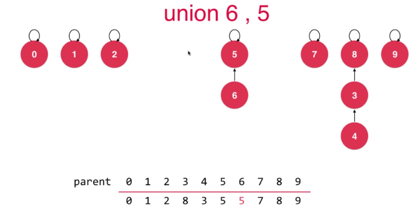
+ `union(9, 4)`:9没父节点(也可以理解为只有一个节点的树，9是根节点，父节点是自己)；4有父节点，通过parent不断向上找，得到`4所在联通分量的根节点qRoot`为8。所以把9指向8，即设置`parent[9]=8`
  > 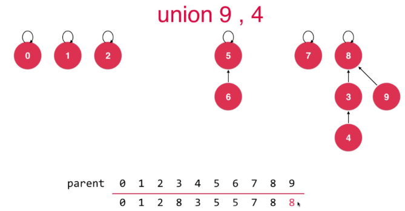
+ `union(2, 1)`:2和1都没父节点(也可以理解为只有一个节点的树，各自都是根节点，父节点都是自己)，直接把2指向1，即设置`parent[2]=1`
  > 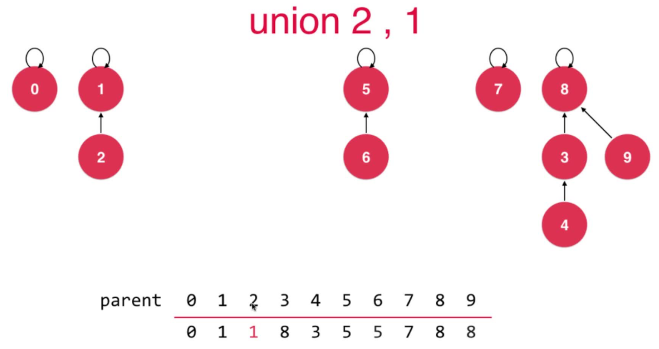
+ `union(5, 0)`:5和0都没父节点(也可以理解为只有一个节点的树，各自都是根节点，父节点都是自己)，直接把5指向0，即设置`parent[5]=0`
  > 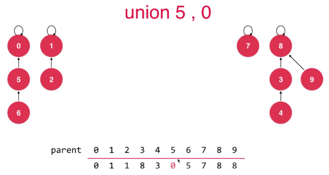
+ `union(7, 2)`:7没父节点(也可以理解为只有一个节点的树，7是根节点，父节点是自己)；2有父节点，通过parent不断向上找，得到`2所在联通分量的根节点qRoot`为1。所以把7指向1，即设置`parent[7]=1`
  > 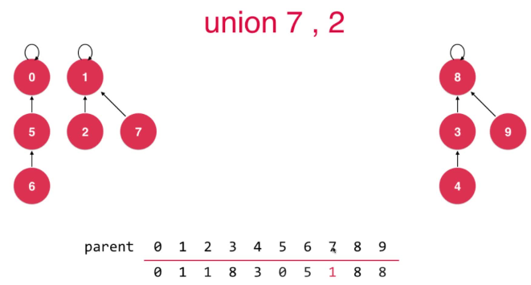
+ `union(6, 2)`:6有父节点，通过parent不断向上找，得到`6所在联通分量的根节点pRoot`为0；2有父节点，通过parent不断向上找，得到`2所在联通分量的根节点qRoot`为1。所以把`pRoot=0`指向`qRoot=1`，即`parent[pRoot]=qRoot`，即设置`parent[0]=1`
  > 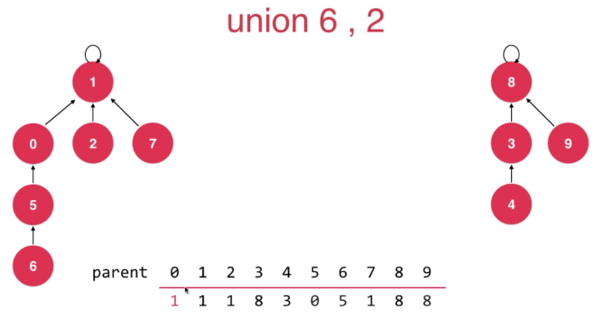
+ 到此为止我们的构造的并查集如下
  > 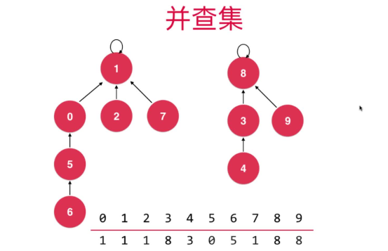

通过上面的步骤我们就可以不断地完善我们的并查集，在判断p和q是否联通(`即isConnected(p, q)`)时，只需要在使用find(p)和find(q)分别找到p和q所在联通分量的根节点pRoot和qRoot，判断pRoot是否等于qRoot即可，相等说明p和q是联通的。

### QuickUnion的时间复杂度
| 方法                | 时间复杂度 |
| ------------------- | ---------- |
| find(i)             | O(logn)，最坏情况下会蜕化成O(n)       |
| union(p, q) | O(logn)，最坏情况下会蜕化成O(n)       |

之所以上面的find和union操作会在最坏情况下蜕化成O(n)，是因为我们union操作时可能会把两个联通分量连接成一条链表，树退化成了链表，时间复杂度就会从O(logn)蜕化成O(n)

### 代码实现
> [仓库地址](src/main/java/Chapter11UnionFind/Section3QuickUnion/UnionFind.java)

```java
/***********************************************************
 * @Description : 并查集第2版：把联通分量用树表示，
 * union(p, q)时把p所在联通分量的根节点pRoot指向q所在联通分量的根节点qRoot
 * (即pRoot作为子节点，qRoot作为父节点，子节点指向父节点，没有父节点直接用自己)，代码表示为：`parent[pRoot]=qRoot`
 * @author      : 梁山广(Liang Shan Guang)
 * @date        : 2020/1/2 20:06
 * @email       : liangshanguang2@gmail.com
 ***********************************************************/
package Chapter11UnionFind.Section3QuickUnion;

import Chapter11UnionFind.UF;

public class UnionFind implements UF {

    /**
     * 记录每个节点在联通分量中的父节点
     */
    private int[] parent;

    public UnionFind(int size) {
        this.parent = new int[size];
        for (int i = 0; i < parent.length; i++) {
            // 初始化时每个顶点的父节点都认为是自己
            parent[i] = i;
        }
    }

    @Override
    public boolean isConnected(int p, int q) {
        return find(p) == find(q);
    }

    @Override
    public void unionElements(int p, int q) {
        int pRoot = find(p);
        int qRoot = find(q);
        if (pRoot == qRoot) {
            // p和q在一个联通分量内，不需要union了，直接退出
            return;
        }
        // p所在联通分量的根节点指向q所在联通分量的根节点，这样两个联通分量就连接到一起了，p和q自然也就联通了
        parent[pRoot] = qRoot;
    }

    @Override
    public int getSize() {
        return parent.length;
    }

    /**
     * 获取元素i所属的联通分量的根节点，因为是树，所以查找的时间复杂度是O(logn)
     *
     * @param i 元素，即parent数组的下标，用来唯一标识一个元素，即parent数组的下标既是索引又是元素
     * @return i所属的联通分量的根节点
     */
    private int find(int i) {
        if (i < 0 || i >= parent.length) {
            throw new IllegalArgumentException("传入的索引超出了数组范围！");
        }
        // 当i的父节点是自己时说明达到了根节点
        while (parent[i] != i) {
            i = parent[i];
        }
        return i;
    }
}
```

## 11.4 测试前面实现的UnionFind
### 测试并查集
> 主要是测试前面两节实现的两种UnionFind，当并查集的节点数size比union此时越大时，第3节基于树的并查集实现性能越高
+ [通用测试函数](src/main/java/Chapter11UnionFind/Section4TestUF/TestUF.java)
+ [测试类](src/main/java/Chapter11UnionFind/Section4TestUF/Main.java)

本节基于size的优化可以不看，讲地有点问题(其实原理都是在引入基于层数rank的优化)，原因可以参考
[基于size优化和基于rank优化的对比](https://coding.imooc.com/learn/questiondetail/145698.html)

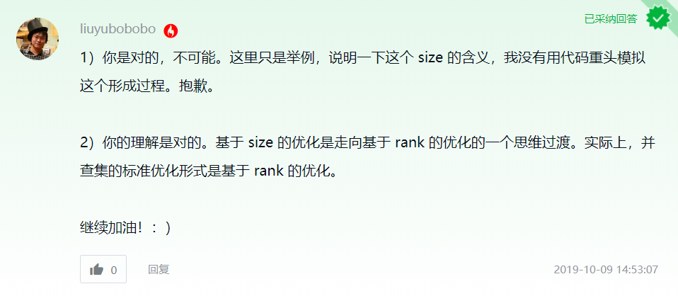
## 11.5 基于`rank[i]`进一步优化UnionFind
> `rank[i]`表示元素i所在的联通分量的层数)

### 为什么要关注各个联通分量树的层数？
> 上一节的测试代码和结果如下：

```java
public class Main {

    public static void main(String[] args) {
        // 并查集一共的节点数
        int size = 100000;
        // 要进行union操作次数
        int m = 100000;

        UF uf1 = new Chapter11UnionFind.Section2QuickFind.UnionFind(size);
        System.out.println("11.2节 基于id数组的UnionFind实现：" + TestUF.test(uf1, m) + "s");

        UF uf2 = new Chapter11UnionFind.Section3QuickUnion.UnionFind(size);
        System.out.println("11.3节 基于parent数组的UnionFind实现：" + TestUF.test(uf2, m) + "s");
    }
}
/**
 * size=100000，m=10000时，第3节基于parent数组实现的并查集性能优势很大：
 * 11.2节 基于ID数组的UnionFind实现：0.1826555s
 * 11.3节 基于parent数组的UnionFind实现：0.0016694s
 *
 * size=100000，m=100000时，第2节基于id数组实现的并查集性能反超了基于parent数组的：
 * 11.2节 基于id数组的UnionFind实现：3.9950995s
 * 11.3节 基于parent数组的UnionFind实现：9.4859654s
 */
```

并查集的节点数size非常大时，可以看到当union数也很大时，基于parent树的UnionFind性能急剧下降，原因如下：
+ 1.大量union操作生成的树很难保障平衡，树可能会非常深，最差情况下甚至可能退化成O(n)级别的链表
+ 2.isConnected(p, q)操作在parent树中的UnionFind时间复杂度为O(logn)，在基于id数组的实现中恒为O(1)，所以随着isConnected次数增多，基于parent的UnionFind性能也会下降
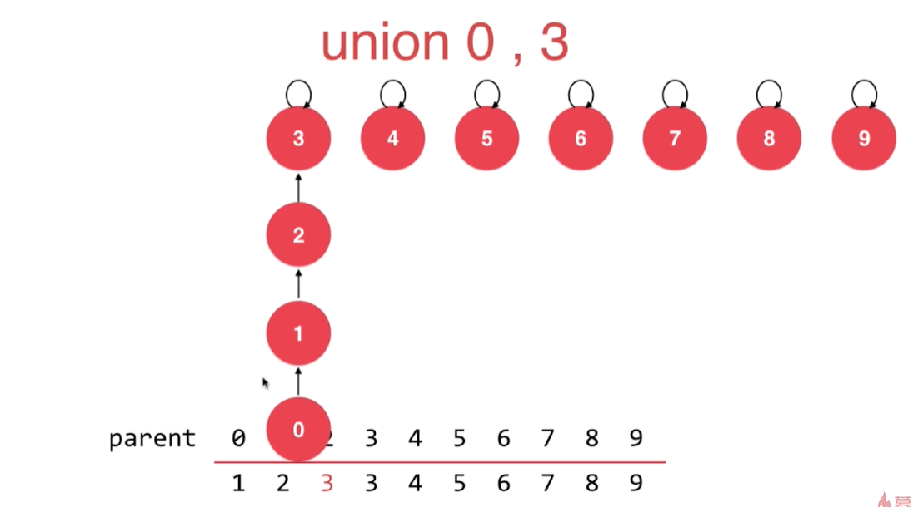
上面两条影响`基于parent树的UnionFind`性能的原因，实际都可以通过使我们的parent树更平衡即层级更少来进行改善，

在代码层面，改进的方式就是当执行union操作时，不是写死`从p所在联通分量的根节点pRoot指向q所在联通分量的根节点qRoot，即parent[pRoot]=qRoot`,而是判断p和q各自所在的联通分量树哪个的层次少，`让层次少的联通分量的根节点指向层次多的联通分量的根节点`
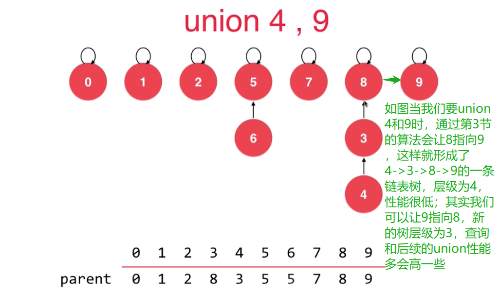
> 应该让层级少的联通分量根节点指向层级多的联通分量根节点
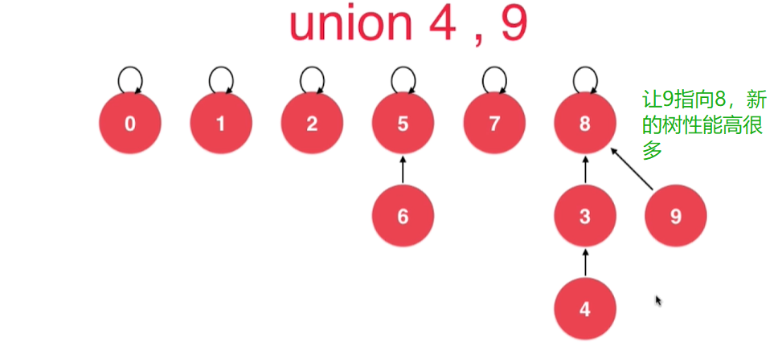

> 代码实现如下，我们用`rank[i]`来表示i所在的联通分量树的`层数`(也称高度或深度)
```java
public void unionElements(int p, int q) {
    int pRoot = find(p);
    int qRoot = find(q);
    if (pRoot == qRoot) {
        // p和q在一个联通分量内，不需要union了，直接退出
        return;
    }
    // 不在一个并查集内的话，只需要把两个根节点连接起来即可
    // 下面按照两个并并查集的层数(rank[i])的大小决定谁连接谁(层数少地连接层数多地)
    if (rank[pRoot] < rank[qRoot]) { // p所在的并查集层数小于q所在的并查集层数，p指向q
        // p所在的并查集连接q所在的并查集，rank[root]取两者中层数较大地，并不需要维护rank
        parent[pRoot] = qRoot;
    } else if (rank[pRoot] > rank[qRoot]) { // p所在的并查集层数大于q所在的并查集层数,q指向p
        // p所在的并查集连接q所在的并查集，rank[root]取两者中层数较大地，并不需要维护rank
        // q所在的并查集连接p所在的并查集
        parent[qRoot] = pRoot;
    } else { // p所在的并查集层数等于q所在的并查集层数,谁指向谁都行，这里选p指向q
        //当 rank[pRoot] = rank[qRoot];
        parent[pRoot] = qRoot;
        // 两个层级相等的并查集树根节点相连，层数一定增长1，所以把新的并查集层数+1
        rank[qRoot] += 1;
    }
}
```

### 本节的代码实现
> 在本章所有的UnionFind实现中最优！！而且性能远远超过前面的，强烈建议只记住和只用这一个，忘记前面的吧！！！

+ [完整代码实现](src/main/java/Chapter11UnionFind/Section5OptimizeByRank/UnionFind.java)
+ [测试代码](src/main/java/Chapter11UnionFind/Section5OptimizeByRank/Main.java)

