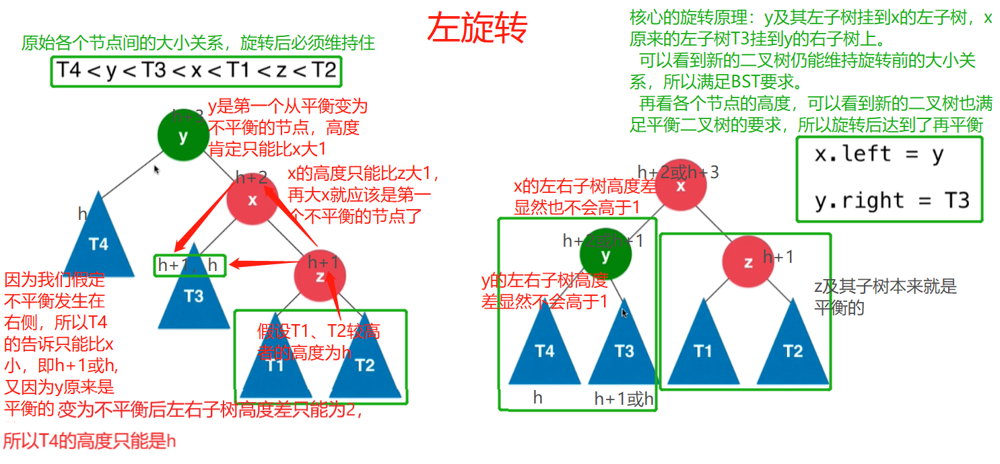
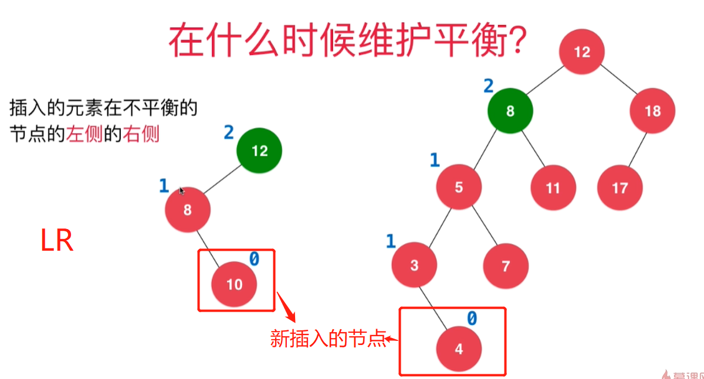
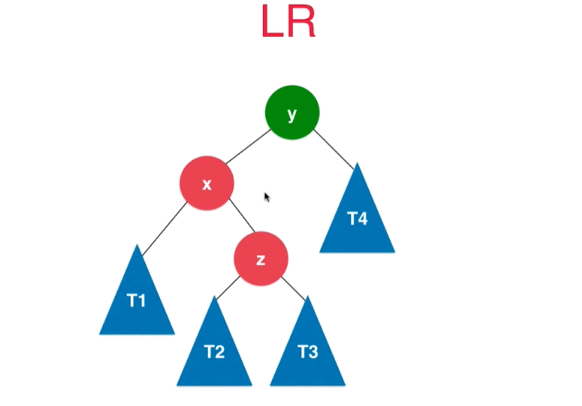
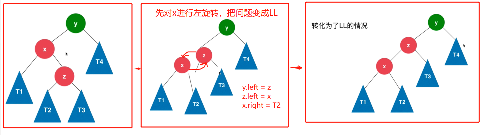
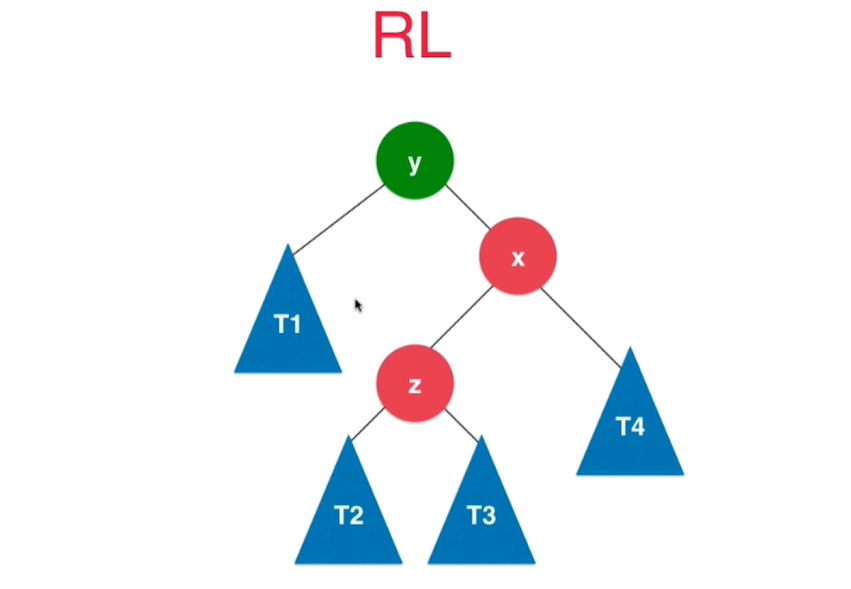
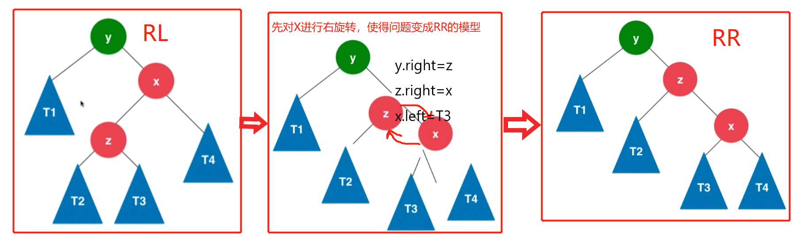

# 第12章 AVL平衡树
## 12.1 什么是AVL平衡树
> AVL是两个人的任命 `Adelson-Velsky`和`Landis`，两个人都是俄罗斯人，是两人在1962年的论文中首次提出，是最早的自平衡二分搜索树
## 什么是平衡二叉树？
+ 对任意一个节点，其左子树和右子树的高度差不能超过1
+ 平衡二叉树的高度和节点数量之间的关系也是`O(logn)`的
+ 平衡二叉树某个节点的高度值=`max(左子树高度值，右子树高度值)` + 1。+1时因为父亲节点比子节点高一层。叶子节点的高度值认为是1，左右子树为空高度认为是0
  > 。在下图中用黑色表示
+ 平衡二叉树某个节点的平衡因子=`左子树高度-右子树高度值`，子树为空平衡因子认为是0
  > 在下图中用蓝色表示


### 平衡二叉树中"平衡"的含义
+ 如果说一棵树是“平衡”的，就隐含着“这棵树的高度和节点数量成 log(n) 的关系”这样的信息，这也就是“平衡”的意义所在。
+ 之所以要区分一棵树是否平衡，就是因为需要知道这棵树的操作复杂度是什么量级的。比如说“堆是一种平衡树”，实际上就是从操作复杂度说“堆的各种操作（insert、extract）的复杂度都是 O(logn)”。

## 12.2 结算节点的高度和平衡因子
> 只在add函数中更新节点高度height和节点平衡因子balance
```java
/**
     * 向以节点Node为根节点的二分搜索树树中添加新的键值对节点，递归实现
     *
     * @param node 二分搜索树的根节点
     * @param key  要加入地节点的键
     * @param val  要加入地节点的值
     */
private Node add(Node node, K key, V val) {
    // 递归终止条件
    if (node == null) {
        // 只要碰到了为空的node，就一定要把我们的e作为节点添加到这里的，具体是作为左子树、右子树还是根节点到下面再进行设置
        size++;
        // 新加地节点刚开始都是叶子节点，所以Node的默认构造函数把height设置为1没问题，
        return new Node(key, val);
    }

    // 递归组成逻辑
    if (key.compareTo(node.key) < 0) {
        // key小于根节点的key，往node的左子树继续遍历
        node.left = add(node.left, key, val);
    } else if (key.compareTo(node.key) > 0) {
        // key大于根节点的key，往node的右子树继续遍历
        node.right = add(node.right, key, val);
    } else {
        // 如果和遍历到的节点相等即key.compareTo(node.key)==0，则进行节点值更新
        node.val = val;
    }
    // 更新当前节点和其往上节点的高度。平衡二叉树某个节点的高度值=max(左子树高度值，右子树高度值) + 1
    // +1时因为父亲节点比子节点高一层。叶子节点的高度值认为是1，左右子树为空高度认为是0
    node.height = Math.max(getHeight(node.left), getHeight(node.right)) + 1;
    // 获取节点的平衡因子，即node节点的左右子树的高度差的。子树为空平衡因子认为是0，即balance=左子树高度-右子树高度值
    node.balance = getHeight(node.left) - getHeight(node.right);
    if (Math.abs(node.balance) > 1) {
        // 如果左右子树的高度差超过了1(平衡二叉树任何一个节点的左右子树高度差不大于1)，说明不是平衡二叉树了
        System.out.println("节点左右子树高度差超过1啦：" + node.balance);
    }
    // 当这个node是把key给new出来地就设置到子节点为空的上面去；如果不是new出来地相当于把已有的二分搜索树中的节点关系又设置一次
    return node;
}
```

## 12.3 检查是否是二分搜索树BST和平衡二叉树AVL的要求
> 设计函数检查当前的二叉树是否满足如下特点：

### 判断是否是二分搜索树BST
> 二分搜索树BST的特点：
+ 任意一个节点的左子树中的所有节点都小于这个节点
+ 任意一个节点的右子树中的所有节点都大于这个节点

本节我们用地实际是"BST的中序遍历结果是升序的"这一个地6章得到的结论。

把遍历结果引用传值加入到keys列表中很巧妙

```java
 /**
 * 判断当前的二叉树是否仍然是一棵二分搜索树BST
 */
public boolean isBST() {
    List<K> keys = new ArrayList<>();
    inOrder(root, keys);
    // BST的中序遍历结果的一个特殊性质就是遍历结果是升序的
    for (int i = 1; i < keys.size(); i++) {
        if (keys.get(i - 1).compareTo(keys.get(i)) > 0) {
            // 升序表明前面的节点应该小于后面的节点，当前面的节点大于后面的节点时，就说明二叉树不时BST的
            return false;
        }
    }
    return true;
}
/**
 * 中序遍历以node作为根节点的二分搜索树,把遍历到的节点顺序加入到list中
 */
private void inOrder(Node node, List<K> keys) {
    // 递归终止条件
    if (node == null) {
        // 遍历到null节点就返回上一层递归
        return;
    }

    // 递归组成逻辑
    // 2.遍历左子树
    inOrder(node.left, keys);
    // 1.访问当前节点。需要存储时可以放到list中
    // 访问节点可以是打印也可以是存储到list中
    // System.out.print(node.key + ":" + node.val + " ");
    keys.add(node.key);
    // 3.遍历右子树
    inOrder(node.right, keys);
}
```
### 判断是否是平衡二叉树AVL
>  平衡二叉树AVL的特点：

+ 满足BST的特点
+ 对任意一个节点，其左子树和右子树的高度差不能超过1
```java

/**
 * 判断当前的二叉树是否是平衡二叉树，每个节点的平衡因子balance值的绝对值不能大于1
 */
public boolean isBalanced() {
    return isBalanced(root);
}

/**
 * 遍历当前二叉树的所有节点，看其balance值的绝对值是否大于1
 *
 * @param node 当前遍历到的子树的根节点
 * @return 是否是平衡二叉树
 */
private boolean isBalanced(Node node) {
    // 1.递归终止条件
    if (node == null) {
        // 递归到底了，空子树可以看做是平衡二叉树
        return true;
    }
    if (Math.abs(node.balance) > 1) {
        return false;
    }

    // 2.递归具体逻辑
    // 左右子树递归进行遍历，两个都为平衡二叉树，整体的二叉树才是平衡二叉树
    return isBalanced(node.left) && isBalanced(node.right);
}
```

### 本节相关代码
+ [实现代码](src/main/java/Chapter12AVLTree/Section3isBSTandisBalanced/BSTKV_AVL.java)
+ [测试代码](src/main/java/Chapter12AVLTree/Section3isBSTandisBalanced/Main.java)

## 12.4 旋转操作的基本原理
> 新的节点加入会使得二叉树不再平衡(不满足上一届BST和AVL的性质)，所以需要调整点使得二叉树重新平衡，这些操作下面会看到和旋转一样，一次我们称之为旋转操作

### 在什么是维护平衡(即旋转)？
> 加入新节点后，沿着新节点的插入的置向上维护平衡性


进行旋转的时机是在add中当更新节点高度和平衡因子后
```java
// 更新当前节点和其往上节点的高度。平衡二叉树某个节点的高度值=max(左子树高度值，右子树高度值) + 1
// +1时因为父亲节点比子节点高一层。叶子节点的高度值认为是1，左右子树为空高度认为是0
node.height = Math.max(getHeight(node.left), getHeight(node.right)) + 1;
// 获取节点的平衡因子，即node节点的左右子树的高度差的。子树为空平衡因子认为是0，即balance=左子树高度-右子树高度值
node.balance = getHeight(node.left) - getHeight(node.right);
// Todo：加入新节点后通过旋转使得二叉树重新平衡
```

### 加入新节点导致原二叉树失衡的例子
+ 例子1
  >
+ 例子2
  >

## 12.5~12.6 旋转的四种情形
### 一、右旋转
> 不平衡是因为在`从下往上首个不平衡点(绿色标出)`的左孩子的左侧新加入节点导致二叉树失衡，两个左，所以叫LL

```java
/**
 * 旋转情形1：不平衡发生在节点y左侧的左侧，需要进行右旋转
 * 向右旋转的核心代码：x.right = y; y.left = T3
 * // 对节点y进行向右旋转操作，返回旋转后新的根节点x
 * //        y                              x
 * //       / \                           /   \
 * //      x   T4     向右旋转 (y)        z     y
 * //     / \       - - - - - - - ->    / \   / \
 * //    z   T3                       T1  T2 T3 T4
 * //   / \
 * // T1   T2
 *
 * @param y 二叉树中首个发现平衡因子大于1的节点
 * @return 旋转后新的根节点x
 */
private Node rotateRight(Node y) {
    Node x = y.left;
    Node T3 = x.right;
    // 右旋转的核心
    x.right = y;
    y.left = T3;
    // 更新节点的Height，从上面注释的图可以看到z及其子树不用更新，T3和T4也不需要，只需要更新y和x即可
    y.height = calHeight(y);
    x.height = calHeight(x);
    return x;
}

private Node add(Node node, K key, V val) {
   ......
   // 旋转情形1：node左侧的左侧添加的节点导致node点不再平衡
   if (balance > 1 && calBalance(node.left) >= 0) {
       // 旋转后返回给上一层新的根节点，上面失衡的节点会继续按照旋转的流程使自己再次平衡，直到递归结束，整个二叉树也就再次平衡了
       return rotateRight(node);
   }
   ......
}
```

### 二、左旋转
> 不平衡是因为在`从下往上首个不平衡点(绿色标出)`的右孩子的右侧新加入节点导致二叉树失衡，两个右，所以叫RR

```java
/**
 * 旋转情形2：不平衡发生在节点y右侧的右侧，需要进行左旋转
 * 向右旋转的核心代码：x.left = y; y.right = T3
 * // 对节点y进行向左旋转操作，返回旋转后新的根节点x
 * //    y                             x
 * //  /  \                          /   \
 * // T4   x      向左旋转 (y)       y     z
 * //     / \   - - - - - - - ->   / \   / \
 * //   T3  z                     T4 T3 T1 T2
 * //      / \
 * //     T1 T2
 *
 * @param y 二叉树中首个发现平衡因子小于-1的节点
 * @return 旋转后新的根节点x
 */
private Node rotateLeft(Node y) {
    Node x = y.right;
    Node T3 = x.left;
    // 坐旋转过程
    x.left = y;
    y.right = T3;
    // 更新height
    y.height = calHeight(y);
    x.height = calHeight(x);
    return x;
}
private Node add(Node node, K key, V val) {
    ......
    // 旋转情形2：node右侧的右侧添加的节点导致node点不再平衡
    if (balance < -1 && calBalance(node.right) <= 0) {
        // 旋转后返回给上一层新的根节点，上面失衡的节点会继续按照旋转的流程使自己再次平衡，直到递归结束，整个二叉树也就再次平衡了
        return rotateLeft(node);
    }
    ......
}
```

### 三.先左旋转再右旋转
> 不平衡是因为在`从下往上首个不平衡点(绿色标出)`的左孩子的右侧新加入节点导致二叉树失衡，先左后右，所以叫LR


>抽象模型如下图左边，不平衡是因为y的左孩子x的右侧`z及其子树`中多了新的节点


>这种情况的解决策略是： 先对x进行左旋转，把题目模型变成LL，然后再用LL的方法使得二叉树重新平衡即可



然后用LL的右旋转使得二叉树重新平衡。

综上：LR问题的解决方案是先左旋转然后右旋转。LR转LL是左旋转，LL转平衡是右旋转
```java
// 旋转情形3：node左子树的右侧添加的节点导致node点不再平衡。先左后右所以叫LR
if (balance > 1 && calBalance(node.left) < 0) {
    // 旋转后返回给上一层新的根节点，上面失衡的节点会继续按照旋转的流程使自己再次平衡，直到递归结束，整个二叉树也就再次平衡了
    // 先对y的左孩子x执行一次左旋转，把问题转换成LL。node.left变成旋转后新的节点
    node.left = rotateLeft(node.left);
    // LL问题需要再对新的树执行一次右旋转
    return rotateRight(node);
}
```
### 四.先右旋转再左旋转
> 不平衡是因为在`从下往上首个不平衡点(绿色标出)`的右孩子的左侧新加入节点导致二叉树失衡，先右后左，所以叫RL

>抽象模型如下图左边，不平衡是因为y的右孩子x的左侧`z及其子树`中多了新的节点


>这种情况的解决策略是： 先对x进行右旋转，把题目模型变成RR，然后再用RR的方法使得二叉树重新平衡即可


然后用RR的右旋转使得二叉树重新平衡。

综上：RL问题的解决方案先右旋转然后左旋转。RL转RR是右旋转，RR转平衡是左旋转
```java
// 旋转情形4：node右子树的左侧添加的节点导致node点不再平衡。先右后左所以叫RL
if (balance < -1 && calBalance(node.right) > 0) {
    // 旋转后返回给上一层新的根节点，上面失衡的节点会继续按照旋转的流程使自己再次平衡，直到递归结束，整个二叉树也就再次平衡了
    // 先对y的右孩子x执行一次右旋转，把问题转换成RR。node.right变成旋转后新的节点
    node.right = rotateRight(node.right);
    // RR问题需要再对新的树执行一次左旋转
    return rotateLeft(node);
}
```

> 总结：对未经旋转的BST和经过旋转的BST(即AVL)进行了性能测试~最坏情况下(即输入有序)两者的性能能差上千倍
```java
public class PerformanceTest {
    public static void main(String[] args) {
        System.out.println("Pride and Prejudice");
        long startTime, endTime;
        ArrayList<String> words = new ArrayList<>();
        String filename = "src/main/java/Chapter07SetAndMap/Section1SetBasicAndBSTSet/pride-and-prejudice.txt";
        if (FileOperation.readFile(filename, words)) {
            // 排序后看看性能，这样最能测AVL的实现好不好。未经旋转的BST加入节点后整个BST会蜕化成一条链表，新加入的节点都要遍历整个BST才能找到自己的位置
            // 旋转后的BST在加过节点后都会调整使得BST重新保持为平衡二叉树AVL，性能要比没旋转地高
            Collections.sort(words);
            // System.out.println("Total words: " + words.size());
            // 1.未经旋转前的二分搜索树
            startTime = System.nanoTime();
            Chapter12AVLTree.Section3isBSTandisBalanced.BSTKV_AVL<String, Integer> avlBeforeRotate = new Chapter12AVLTree.Section3isBSTandisBalanced.BSTKV_AVL<>();
            for (String word : words) {
                if (avlBeforeRotate.contains(word)) {
                    // 之前存在地话就词频+1
                    avlBeforeRotate.set(word, avlBeforeRotate.get(word) + 1);
                } else {
                    // 不存在就插入进去，词频初始化为1
                    avlBeforeRotate.add(word, 1);
                }
            }
            // 查询操作时最消耗性能的，最能看出不平衡的BST和平衡的BST(即AVL)的性能差异
            for (String word : words) {
                avlBeforeRotate.contains(word);
            }
            endTime = System.nanoTime();
            System.out.println("未经旋转前的BST耗时：" + (endTime - startTime) / 1000000000.0 + "s");

            // 2.旋转后的二分搜索树
            startTime = System.nanoTime();
            Chapter12AVLTree.Section4to6RotateToReBalance.BSTKV_AVL<String, Integer> avlAfterRotate = new Chapter12AVLTree.Section4to6RotateToReBalance.BSTKV_AVL<>();
            for (String word : words) {
                if (avlAfterRotate.contains(word)) {
                    // 之前存在地话就词频+1
                    avlAfterRotate.set(word, avlAfterRotate.get(word) + 1);
                } else {
                    // 不存在就插入进去，词频初始化为1
                    avlAfterRotate.add(word, 1);
                }
            }
            // 查询操作时最消耗性能的，最能看出不平衡的BST和平衡的BST(即AVL)的性能差异
            for (String word : words) {
                avlAfterRotate.contains(word);
            }
            endTime = System.nanoTime();
            System.out.println("经过旋转后的BST(即AVL)耗时：" + (endTime - startTime) / 1000000000.0 + "s");

//            System.out.println("Total different words: " + avlAfterRotate.getSize());
//            // 出现pride和prejudice单词的次数
//            System.out.println("Frequency of PRIDE : " + avlBeforeRotate.get("pride"));
//            System.out.println("Frequency of PREJUDICE : " + avlBeforeRotate.get("prejudice"));
//            System.out.println("二叉树是否是二分搜索树BST：" + avlBeforeRotate.isBST());
//            // 还没进行平衡处理，肯定是不平衡的
//            System.out.println("二叉树是否是平衡二叉树：" + avlBeforeRotate.isBalanced());
        }
    }
}
/**
 * Pride and Prejudice
 * 未经旋转前的BST耗时：19.2616994s
 * 经过旋转后的BST(即AVL)耗时：0.0535379s
 */
```

## 12.7 AVL节点的删除
> 在第6章BST中删除节点的基础上考虑到LL、RR、LR、RL四种旋转再平衡的情况即可，和添加节点时完全相同

```java
/**
 * 删除指定值的结点
 *
 * @param key 节点的键
 */
public V remove(K key) {
    Node node = getNode(root, key);
    if(node != null){
        root = remove(root, key);
        return node.val;
    }
    return null;
}

/**
 * 删除
 *
 * @param node 二分搜索树的根节点
 * @param key  待删除节点的键
 * @return 要挂载到当前节点父节点的子树
 */
private Node remove(Node node, K key) {
    // 递归终止条件
    if (node == null) {
        return null;
    }

    // 递归组成逻辑
    // 还没找到就接着往下找
    Node retNode;
    if (key.compareTo(node.key) < 0) {
        // 要找的值比当前节点小，向左递归
        node.left = remove(node.left, key);
        retNode = node;
    } else if (key.compareTo(node.key) > 0) {
        // 要找的值比当前节点大，向右递归
        node.right = remove(node.right, key);
        retNode = node;
    } else {
        // node.key == key 找到相等的节点了，下面删除指定值的节点
        if (node.left == null) {
            Node rightNode = node.right;
            // 释放引用
            node.right = null;
            size--;
            // 左节点为空，把node的右子树挂接到node的父亲节点即可
            retNode = rightNode;
        } else if (node.right == null) {
            Node leftNode = node.left;
            // 释放引用
            node.left = null;
            size--;
            // 右节点为空，把node的左子树挂接到node的父亲节点即可
            retNode = leftNode;
        } else {
            // node的左右子树都不为空，就找node的右子树的最小值来代替node
            Node minimumRight = minimum(node.right);
            // 警告：下面两行代码一定不要颠倒，一定要先设置right再设置left，否则会出现迭代引用！
            // 选出node右子树最小元素来代替node，那么右子树最小元素就要从原来位置删掉
            minimumRight.right = removeMin(node.right);
            // 替换当前节点node的左右子树
            minimumRight.left = node.left;
            // 释放node的引用
            node.left = node.right = null;
            // 返回给上一级来设置父节点
            retNode = minimumRight;
        }
    }
    // 删除前再进行一次平衡操作
    return rotateToReBalance(retNode);
}
```

> 总结：经过上面的四种旋转和删除操作(remove、removeMin、removeMax)，我们把节点旋转再平衡的操作封装成了如下的函数(核心是`rotateToReBalance()`)~方便节点增删时直接调用

```java
/**
 * 获取指定节点的高度值
 *
 * @param node 要查询高度的节点
 * @return node节点的高度
 */
private int getHeight(Node node) {
    if (node == null) {
        // 空间点的高度值我们认为是0
        return 0;
    }
    return node.height;
}

/**
 * 计算节点的高度
 * 节点的高度值= max(左子树高度值，右子树高度值) + 1
 *
 * @param node 当前高度
 * @return 根据左右子树计算得到的高度
 */
private int calHeight(Node node) {
    if (node == null) {
        return 0;
    }
    // 不需要考虑node为null的情况，因为getHeight()已经考虑到了，node子节点为空直接返回0，不影响下面的计算
    return Math.max(getHeight(node.left), getHeight(node.right)) + 1;
}

/**
 * 计算节点node的平衡因子，即当前节点左子树高度减去右子树高度的差值
 *
 * @param node 当前节点
 * @return 平衡因子
 */
private int calBalance(Node node) {
    if (node == null) {
        return 0;
    }
    return getHeight(node.left) - getHeight(node.right);
}

/**
 * 旋转情形1：不平衡发生在节点y左侧的左侧，需要进行右旋转
 * 向右旋转的核心代码：x.right = y; y.left = T3
 * // 对节点y进行向右旋转操作，返回旋转后新的根节点x
 * //        y                              x
 * //       / \                           /   \
 * //      x   T4     向右旋转 (y)        z     y
 * //     / \       - - - - - - - ->    / \   / \
 * //    z   T3                       T1  T2 T3 T4
 * //   / \
 * // T1   T2
 *
 * @param y 二叉树中首个发现平衡因子大于1的节点
 * @return 旋转后新的根节点x
 */
private Node rotateRight(Node y) {
    Node x = y.left;
    Node T3 = x.right;
    // 右旋转的核心
    x.right = y;
    y.left = T3;
    // 更新节点的Height，从上面注释的图可以看到z及其子树不用更新，T3和T4也不需要，只需要更新y和x即可
    y.height = calHeight(y);
    x.height = calHeight(x);
    return x;
}

/**
 * 旋转情形2：不平衡发生在节点y右侧的右侧，需要进行左旋转
 * 向右旋转的核心代码：x.left = y; y.right = T3
 * // 对节点y进行向左旋转操作，返回旋转后新的根节点x
 * //    y                             x
 * //  /  \                          /   \
 * // T4   x      向左旋转 (y)       y     z
 * //     / \   - - - - - - - ->   / \   / \
 * //   T3  z                     T4 T3 T1 T2
 * //      / \
 * //     T1 T2
 *
 * @param y 二叉树中首个发现平衡因子小于-1的节点
 * @return 旋转后新的根节点x
 */
private Node rotateLeft(Node y) {
    Node x = y.right;
    Node T3 = x.left;
    // 坐旋转过程
    x.left = y;
    y.right = T3;
    // 更新height
    y.height = calHeight(y);
    x.height = calHeight(x);
    return x;
}

/**
 * 根绝当前节点的平衡因子判断是否需要进行旋转
 *
 * @param node 当前节点
 * @return 旋转后新的根节点
 */
private Node rotateToReBalance(Node node) {
    if (node == null) {
        return null;
    }
    // 更新节点的height，这个无比要做，要不会下面的平衡操作都是白搭~~！！！
    // 更新当前节点和其往上节点的高度。平衡二叉树某个节点的高度值=max(左子树高度值，右子树高度值) + 1
    // +1时因为父亲节点比子节点高一层。叶子节点的高度值认为是1，左右子树为空高度认为是0
    node.height = calHeight(node);
    // 获取节点的平衡因子，即node节点的左右子树的高度差的。子树为空平衡因子认为是0，即balance=左子树高度-右子树高度值
    int balance = calBalance(node);
    // 下面这3行可以打开用于观察旋转过程中平衡因子的变化
    // if (Math.abs(balance) > 1) {
    //     System.out.println(balance);
    // }
    // 旋转情形1：node左子树的左侧添加的节点导致node点不再平衡。两个左所以叫LL
    if (balance > 1 && calBalance(node.left) >= 0) {
        // 旋转后返回给上一层新的根节点，上面失衡的节点会继续按照旋转的流程使自己再次平衡，直到递归结束，整个二叉树也就再次平衡了
        return rotateRight(node);
    }
    // 旋转情形2：node右子树的右侧添加的节点导致node点不再平衡。两个右所以叫RR
    if (balance < -1 && calBalance(node.right) <= 0) {
        // 旋转后返回给上一层新的根节点，上面失衡的节点会继续按照旋转的流程使自己再次平衡，直到递归结束，整个二叉树也就再次平衡了
        return rotateLeft(node);
    }
    // 旋转情形3：node左子树的右侧添加的节点导致node点不再平衡。先左后右所以叫LR
    if (balance > 1 && calBalance(node.left) < 0) {
        // 旋转后返回给上一层新的根节点，上面失衡的节点会继续按照旋转的流程使自己再次平衡，直到递归结束，整个二叉树也就再次平衡了
        // 先对y的左孩子x执行一次左旋转，把问题转换成LL。node.left变成旋转后新的节点
        node.left = rotateLeft(node.left);
        // LL问题需要再对新的树执行一次右旋转
        return rotateRight(node);
    }
    // 旋转情形4：node右子树的左侧添加的节点导致node点不再平衡。先右后左所以叫RL
    if (balance < -1 && calBalance(node.right) > 0) {
        // 旋转后返回给上一层新的根节点，上面失衡的节点会继续按照旋转的流程使自己再次平衡，直到递归结束，整个二叉树也就再次平衡了
        // 先对y的右孩子x执行一次右旋转，把问题转换成RR。node.right变成旋转后新的节点
        node.right = rotateRight(node.right);
        // RR问题需要再对新的树执行一次左旋转
        return rotateLeft(node);
    }
    // 不需要维护平衡，直接返回原节点
    return node;
}
```

## 12.8 基于AVL树的集合Set和映射Map

### 集合Set
+ [实现代码](src/main/java/Chapter12AVLTree/Section8SetAndMapBasedOnAVL/AVLSet.java)
+ [测试代码](src/main/java/Chapter12AVLTree/Section8SetAndMapBasedOnAVL/MainSet.java)

### 映射Map
+ [实现代码](src/main/java/Chapter12AVLTree/Section8SetAndMapBasedOnAVL/AVLMap.java)
+ [测试代码](src/main/java/Chapter12AVLTree/Section8SetAndMapBasedOnAVL/MainMap.java)

### AVL树的局限性
> 旋转次数过多，很影响性能。为了解决这个问题~诞生了第13章的红黑树