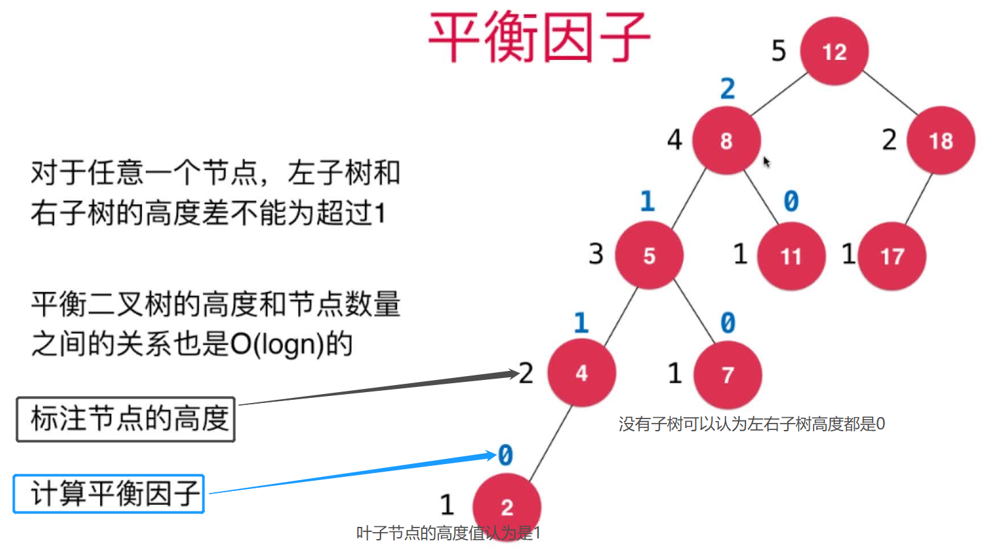
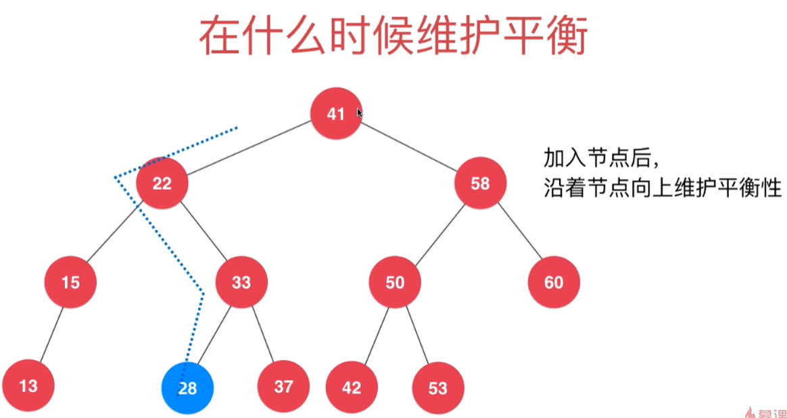
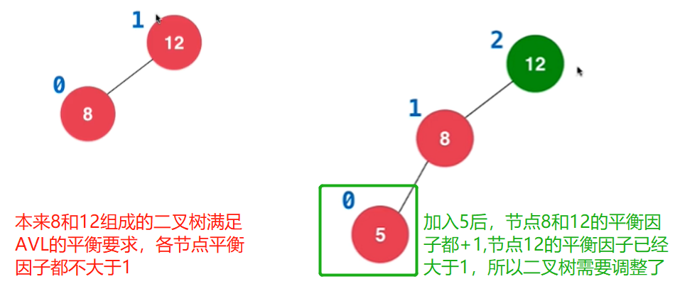
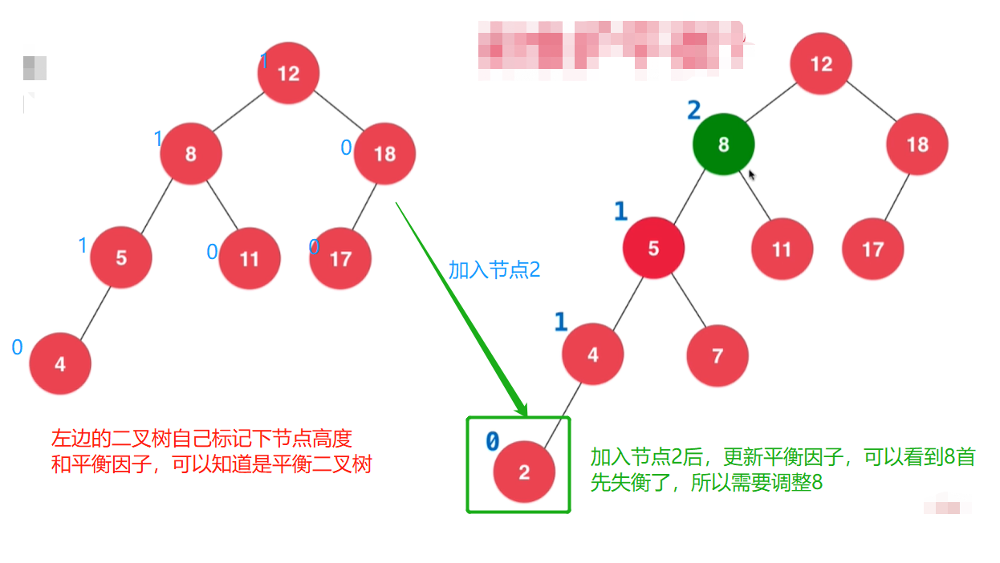
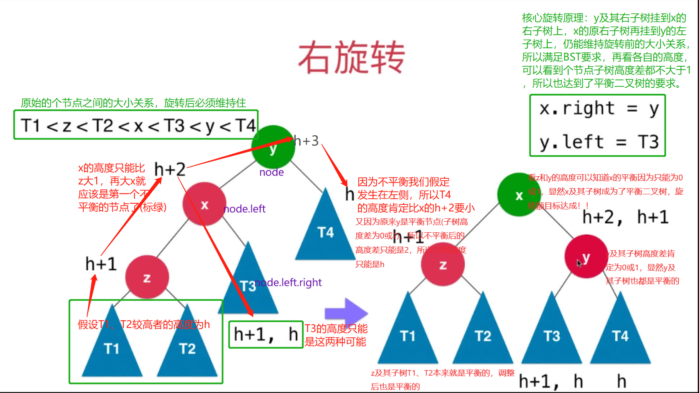

# 第12章 AVL平衡树
## 12.1 什么是AVL平衡树
> AVL是两个人的任命 `Adelson-Velsky`和`Landis`，两个人都是俄罗斯人，是两人在1962年的论文中首次提出，是最早的自平衡二分搜索树
## 什么是平衡二叉树？
+ 对任意一个节点，其左子树和右子树的高度差不能超过1
+ 平衡二叉树的高度和节点数量之间的关系也是`O(logn)`的
+ 平衡二叉树某个节点的高度值=`max(左子树高度值，右子树高度值)` + 1。+1时因为父亲节点比子节点高一层。叶子节点的高度值认为是1，左右子树为空高度认为是0
  > 。在下图中用黑色表示
+ 平衡二叉树某个节点的平衡因子=`左子树高度-右子树高度值`，子树为空平衡因子认为是0
  > 在下图中用蓝色表示


### 平衡二叉树中"平衡"的含义
+ 如果说一棵树是“平衡”的，就隐含着“这棵树的高度和节点数量成 log(n) 的关系”这样的信息，这也就是“平衡”的意义所在。
+ 之所以要区分一棵树是否平衡，就是因为需要知道这棵树的操作复杂度是什么量级的。比如说“堆是一种平衡树”，实际上就是从操作复杂度说“堆的各种操作（insert、extract）的复杂度都是 O(logn)”。

## 12.2 结算节点的高度和平衡因子
> 只在add函数中更新节点高度height和节点平衡因子balance
```java
/**
     * 向以节点Node为根节点的二分搜索树树中添加新的键值对节点，递归实现
     *
     * @param node 二分搜索树的根节点
     * @param key  要加入地节点的键
     * @param val  要加入地节点的值
     */
private Node add(Node node, K key, V val) {
    // 递归终止条件
    if (node == null) {
        // 只要碰到了为空的node，就一定要把我们的e作为节点添加到这里的，具体是作为左子树、右子树还是根节点到下面再进行设置
        size++;
        // 新加地节点刚开始都是叶子节点，所以Node的默认构造函数把height设置为1没问题，
        return new Node(key, val);
    }

    // 递归组成逻辑
    if (key.compareTo(node.key) < 0) {
        // key小于根节点的key，往node的左子树继续遍历
        node.left = add(node.left, key, val);
    } else if (key.compareTo(node.key) > 0) {
        // key大于根节点的key，往node的右子树继续遍历
        node.right = add(node.right, key, val);
    } else {
        // 如果和遍历到的节点相等即key.compareTo(node.key)==0，则进行节点值更新
        node.val = val;
    }
    // 更新当前节点和其往上节点的高度。平衡二叉树某个节点的高度值=max(左子树高度值，右子树高度值) + 1
    // +1时因为父亲节点比子节点高一层。叶子节点的高度值认为是1，左右子树为空高度认为是0
    node.height = Math.max(getHeight(node.left), getHeight(node.right)) + 1;
    // 获取节点的平衡因子，即node节点的左右子树的高度差的。子树为空平衡因子认为是0，即balance=左子树高度-右子树高度值
    node.balance = getHeight(node.left) - getHeight(node.right);
    if (Math.abs(node.balance) > 1) {
        // 如果左右子树的高度差超过了1(平衡二叉树任何一个节点的左右子树高度差不大于1)，说明不是平衡二叉树了
        System.out.println("节点左右子树高度差超过1啦：" + node.balance);
    }
    // 当这个node是把key给new出来地就设置到子节点为空的上面去；如果不是new出来地相当于把已有的二分搜索树中的节点关系又设置一次
    return node;
}
```

## 12.3 检查是否是二分搜索树BST和平衡二叉树AVL的要求
> 设计函数检查当前的二叉树是否满足如下特点：

### 判断是否是二分搜索树BST
> 二分搜索树BST的特点：
+ 任意一个节点的左子树中的所有节点都小于这个节点
+ 任意一个节点的右子树中的所有节点都大于这个节点

本节我们用地实际是"BST的中序遍历结果是升序的"这一个地6章得到的结论。

把遍历结果引用传值加入到keys列表中很巧妙

```java
 /**
 * 判断当前的二叉树是否仍然是一棵二分搜索树BST
 */
public boolean isBST() {
    List<K> keys = new ArrayList<>();
    inOrder(root, keys);
    // BST的中序遍历结果的一个特殊性质就是遍历结果是升序的
    for (int i = 1; i < keys.size(); i++) {
        if (keys.get(i - 1).compareTo(keys.get(i)) > 0) {
            // 升序表明前面的节点应该小于后面的节点，当前面的节点大于后面的节点时，就说明二叉树不时BST的
            return false;
        }
    }
    return true;
}
/**
 * 中序遍历以node作为根节点的二分搜索树,把遍历到的节点顺序加入到list中
 */
private void inOrder(Node node, List<K> keys) {
    // 递归终止条件
    if (node == null) {
        // 遍历到null节点就返回上一层递归
        return;
    }

    // 递归组成逻辑
    // 2.遍历左子树
    inOrder(node.left, keys);
    // 1.访问当前节点。需要存储时可以放到list中
    // 访问节点可以是打印也可以是存储到list中
    // System.out.print(node.key + ":" + node.val + " ");
    keys.add(node.key);
    // 3.遍历右子树
    inOrder(node.right, keys);
}
```
### 判断是否是平衡二叉树AVL
>  平衡二叉树AVL的特点：

+ 满足BST的特点
+ 对任意一个节点，其左子树和右子树的高度差不能超过1
```java

/**
 * 判断当前的二叉树是否是平衡二叉树，每个节点的平衡因子balance值的绝对值不能大于1
 */
public boolean isBalanced() {
    return isBalanced(root);
}

/**
 * 遍历当前二叉树的所有节点，看其balance值的绝对值是否大于1
 *
 * @param node 当前遍历到的子树的根节点
 * @return 是否是平衡二叉树
 */
private boolean isBalanced(Node node) {
    // 1.递归终止条件
    if (node == null) {
        // 递归到底了，空子树可以看做是平衡二叉树
        return true;
    }
    if (Math.abs(node.balance) > 1) {
        return false;
    }

    // 2.递归具体逻辑
    // 左右子树递归进行遍历，两个都为平衡二叉树，整体的二叉树才是平衡二叉树
    return isBalanced(node.left) && isBalanced(node.right);
}
```

### 本节相关代码
+ [实现代码](src/main/java/Chapter12AVLTree/Section3isBSTandisBalanced/BSTKV_AVL.java)
+ [测试代码](src/main/java/Chapter12AVLTree/Section3isBSTandisBalanced/Main.java)

## 12.4 旋转操作的基本原理
> 新的节点加入会使得二叉树不再平衡(不满足上一届BST和AVL的性质)，所以需要调整点使得二叉树重新平衡，这些操作下面会看到和旋转一样，一次我们称之为旋转操作

### 在什么是维护平衡(即旋转)？
> 加入新节点后，沿着新节点的插入的置向上维护平衡性


进行旋转的时机是在add中当更新节点高度和平衡因子后
```java
// 更新当前节点和其往上节点的高度。平衡二叉树某个节点的高度值=max(左子树高度值，右子树高度值) + 1
// +1时因为父亲节点比子节点高一层。叶子节点的高度值认为是1，左右子树为空高度认为是0
node.height = Math.max(getHeight(node.left), getHeight(node.right)) + 1;
// 获取节点的平衡因子，即node节点的左右子树的高度差的。子树为空平衡因子认为是0，即balance=左子树高度-右子树高度值
node.balance = getHeight(node.left) - getHeight(node.right);
// Todo：加入新节点后通过旋转使得二叉树重新平衡
```

### 加入新节点导致原二叉树失衡的例子
+ 例子1
  >
+ 例子2
  >


### 左右旋转的原理图示和代码
#### 右旋转
> 
```java
/**
 * 旋转情形1：不平衡发生在节点y左侧的左侧，需要进行右旋转
 * 向右旋转的核心代码：x.right = y; y.left = T3
 * // 对节点y进行向右旋转操作，返回旋转后新的根节点x
 * //        y                              x
 * //       / \                           /   \
 * //      x   T4     向右旋转 (y)        z     y
 * //     / \       - - - - - - - ->    / \   / \
 * //    z   T3                       T1  T2 T3 T4
 * //   / \
 * // T1   T2
 *
 * @param y 二叉树中首个发现平衡因子大于1的节点
 * @return 旋转后新的根节点x
 */
private Node rightRotate(Node y) {
    Node x = y.left;
    Node T3 = x.right;
    // 右旋转的核心
    x.right = y;
    y.left = T3;
    // 更新节点的Height，从上面注释的图可以看到z及其子树不用更新，T3和T4也不需要，只需要更新y和x即可
    y.height = calHeight(y);
    x.height = calHeight(x);
    return x;
}

public void add(Node node){
   ......
   // 旋转情形1：node左侧的左侧添加的节点导致node点不再平衡
   if (balance > 1 && calBalance(node.left) >= 0) {
       // 旋转后返回给上一层新的根节点，上面失衡的节点会继续按照旋转的流程使自己再次平衡，直到递归结束，整个二叉树也就再次平衡了
       return rightRotate(node);
   }
   ......
}
```

### 左旋转


