# 第13章 红黑树
## 13.1 红黑树与2-3树
### 红黑树举例
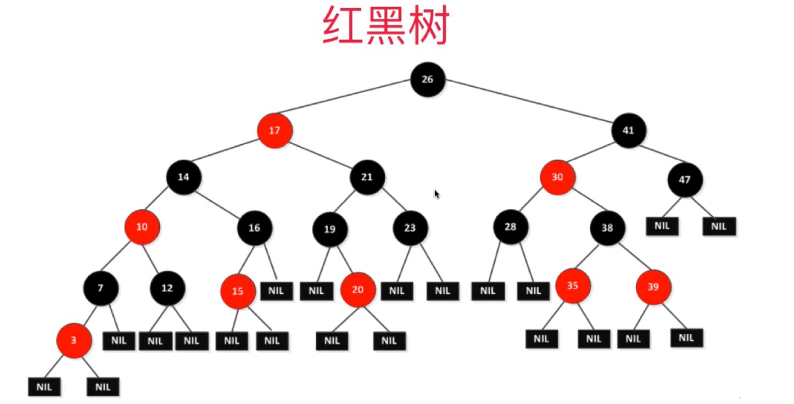
### 《算法导论》中堆红黑树的定义
> 首先红黑树一定是一棵二分搜索树BST
+ 1.每个节点或者是红色的，或者是黑色的
+ 2.根节点是黑色的
+ 3.每一个叶子节点(最后的空节点)是黑色的
+ 4.如果一个节点是红色的，那么它的孩子节点都是黑色的
+ 5.从任意一个节点到叶子节点，经过的黑色节点时一样的
### 红黑树的作者
> Robert Sedgewick，也是《算法(第4版)》的作者

> 红黑树作者的师傅正是TAPCP(《计算机编程艺术》)的作者`高德纳`

### 红黑树与2-3树之间的等价关系
> 理解了红黑树与2-3树之间的等价关系的等价关系，红黑树并不难。2-3树堆理解B类树也有很大的帮助。

### 2-3树的基本性质
+ 满足`二分搜索树BST(见第6章)`的基本性质
+ 节点可以存在一个元素或者两个元素
+ 每个节点可以有2个孩子或者3个孩子
+ 2-3树是一种绝对平衡的树。
  > 绝对平衡的含义：从根节点到任意一个叶子节点所经历的节点数都是相同的

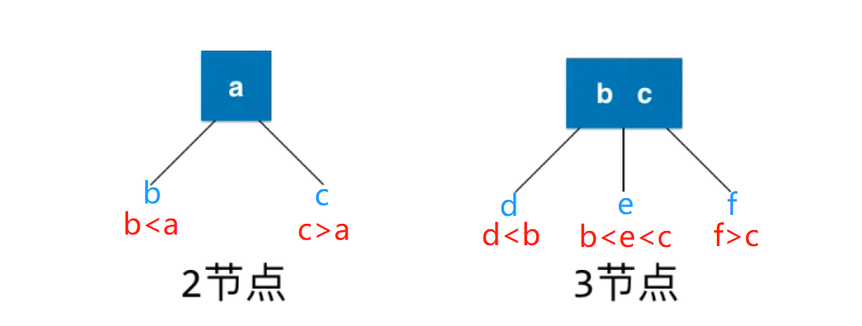

举例如下：  
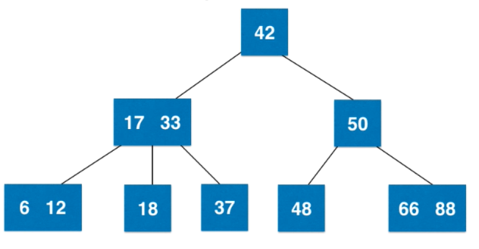

## 13.2 2-3树的绝对平衡性：`从根节点到任意一个叶子节点所经历的节点数都是相同的`

### 2-3树插入新节点的原则
+ 2-3树添加节点永远不会添加到一个空(NULL)的位置
+ 一个框内有3个数字我们称之为4节点(3个数字可以劈处4个叉，所以叫4节点)
  > 如下图，6插入已有的树中，因为不能插入到空节点子树上，所以只能和12、18组成4节点
  > 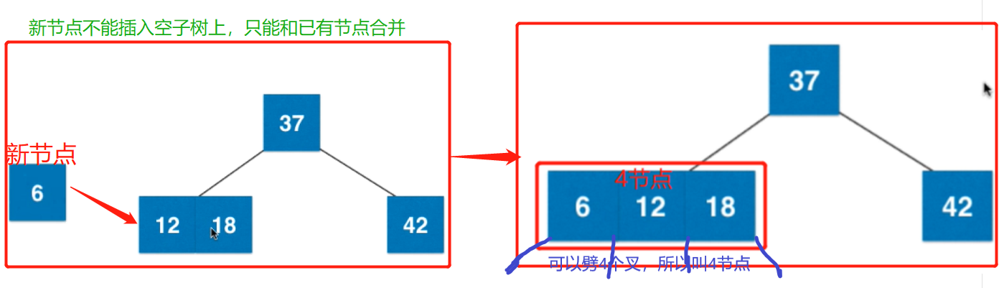
+ 2-3树其实就是不断地形成3节点、4节点，然后`拆分4节点成三个2节点`并`保持绝对平衡`的过程
  + 比如上面4节点的图，不能按照如下的方式，因为这样拆就不能保持绝对平衡了
    > 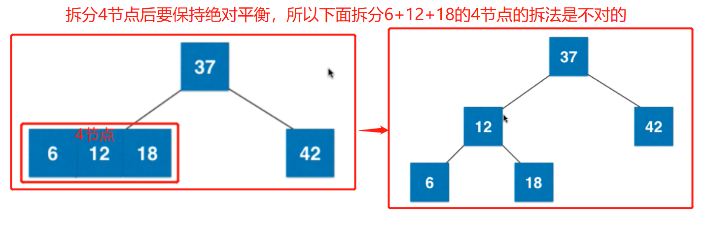
  + 正确的拆法应该是把4节点的中间节点12往上提，和父亲节点进行合并
    + 如果往上提的12和父亲节点37形成了3节点，就等待再有新节点来和12、37组成4节点
      > 
    + 一旦12、37加上新来的节点组成了4节点，就可以4节点变成3个2节点，而且还能保持二叉树的绝对平衡
      > 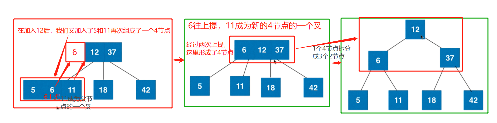

### 2-3树插入新节点的情况分类
+ 被插入地是2节点，直接和已有节点合并成3节点即可
  > 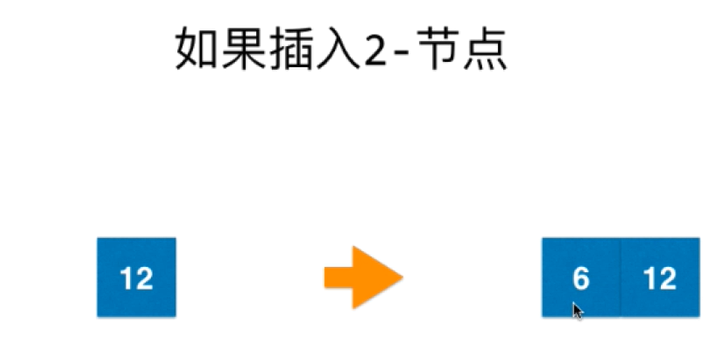
+ 被插入地是3节点而且是根节点，可以先和3节点合并成4节点，然后把一个4节点拆分成3个2节点，仍能保持2-3树的绝对平衡
  > 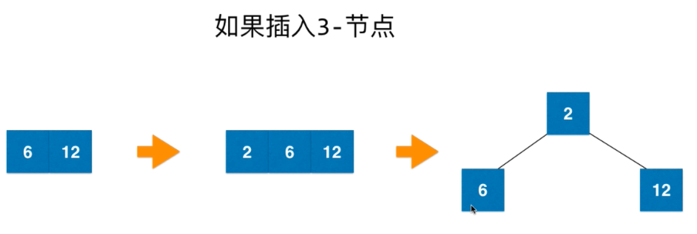
+ 被插入地是3节点但是是叶子节点，其父亲节点是2节点。可以先和被插入地3节点合并成4节点，把4节点的中间那个数上移到父亲节点和其组成3节点
  > 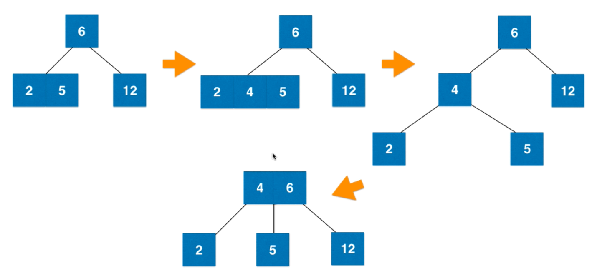
+ 被插入地是3节点但是是叶子节点，其父亲节点是3节点。可以先和被插入地3节点合并成4节点，把4节点的中间那个数上移到父亲节点和其组成4节点,这个4节点可以拆分成3个2节点
  > 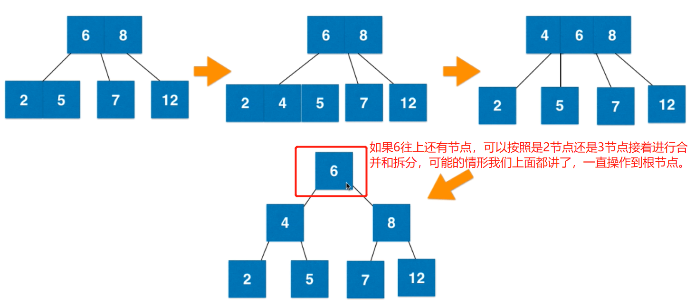

通过上面的4操作，所有的新节点插入后都可以保持2-3树的绝对平衡。

## 13.3 2-3树和红黑树的等效关系
### 2节点和3节点的等效关系
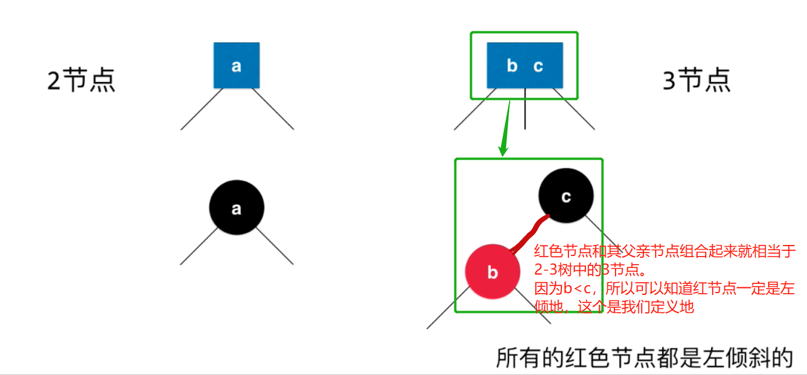

上面的对应关系的举例如下，自己画一下
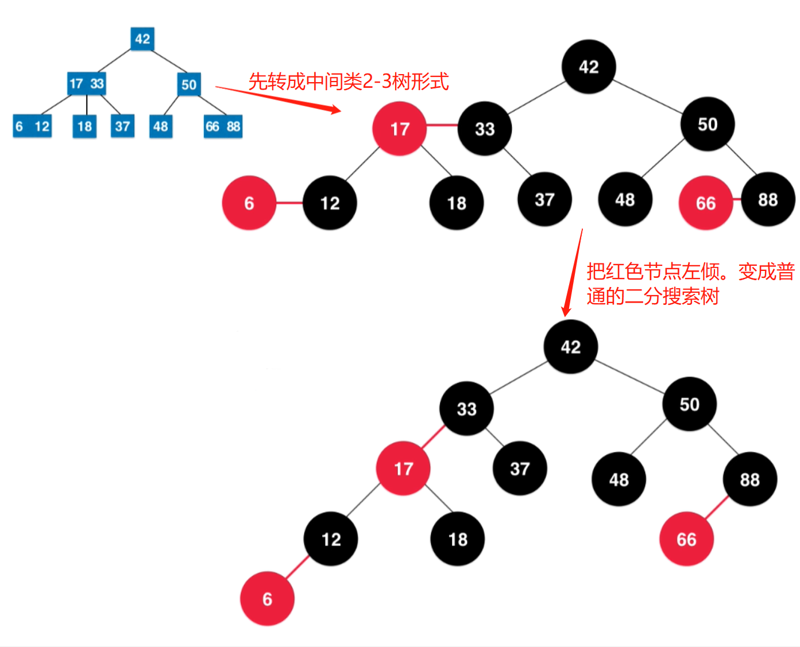

### 红黑树的基础结构代码
> 架构还是用地支持键值对的BST，给每个节点加入了color属性
+ [实现代码](src/main/java/Chapter13ReadBlackTree/Section3RBTreeBasic/BSTKV_RBTree.java)

## 13.4 红黑树的基本性质和复杂度分析
