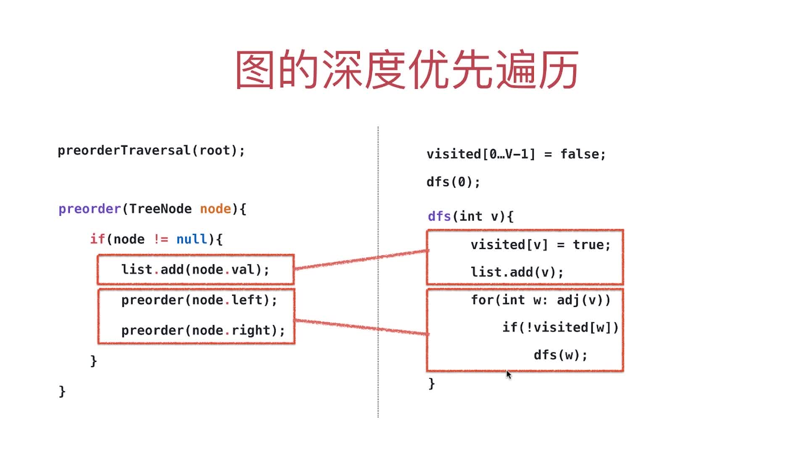
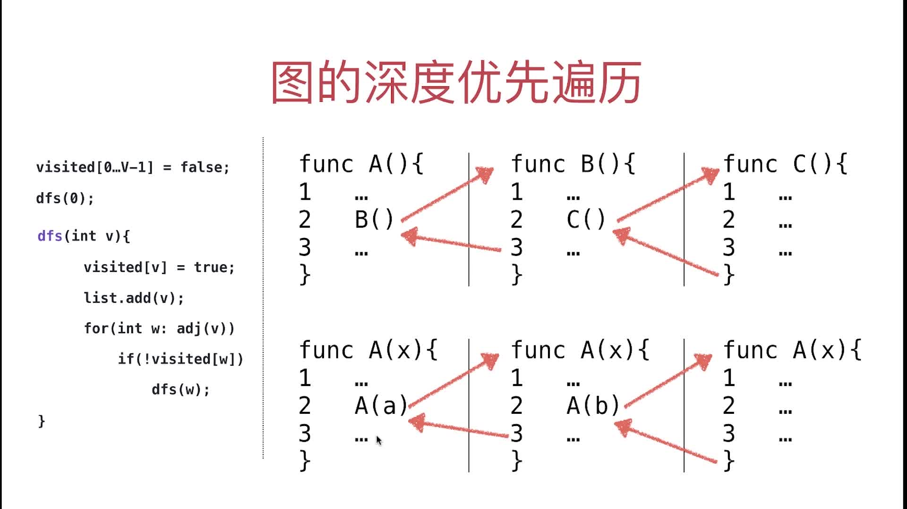
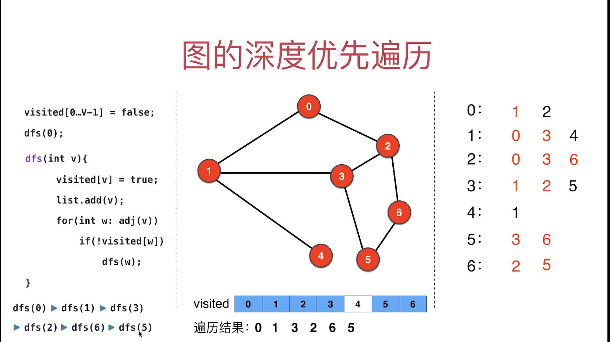
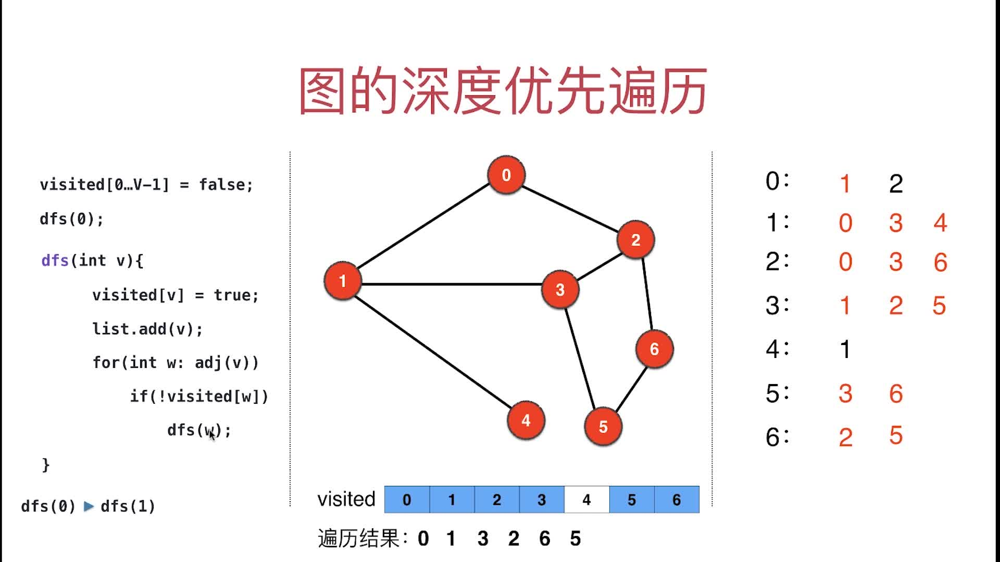
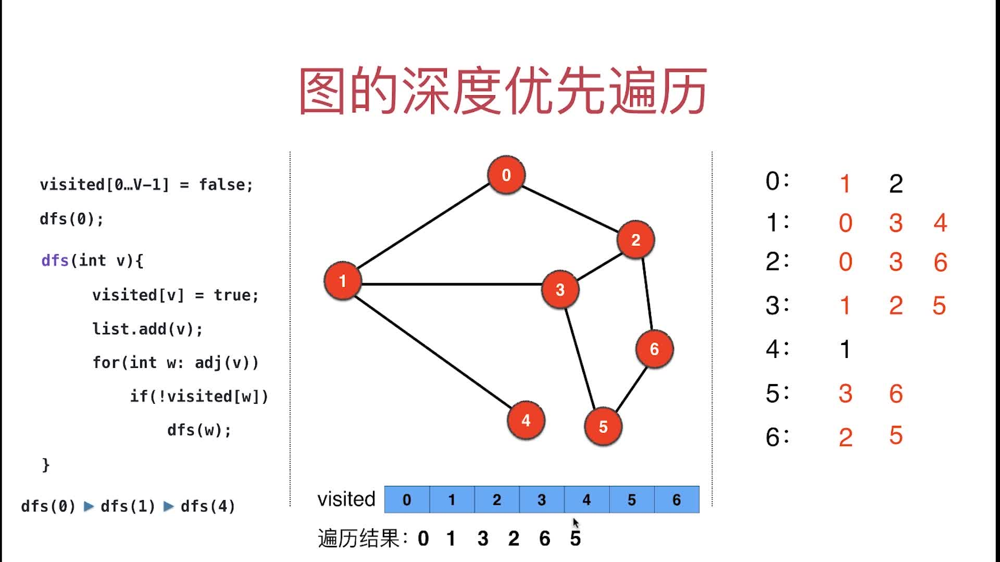
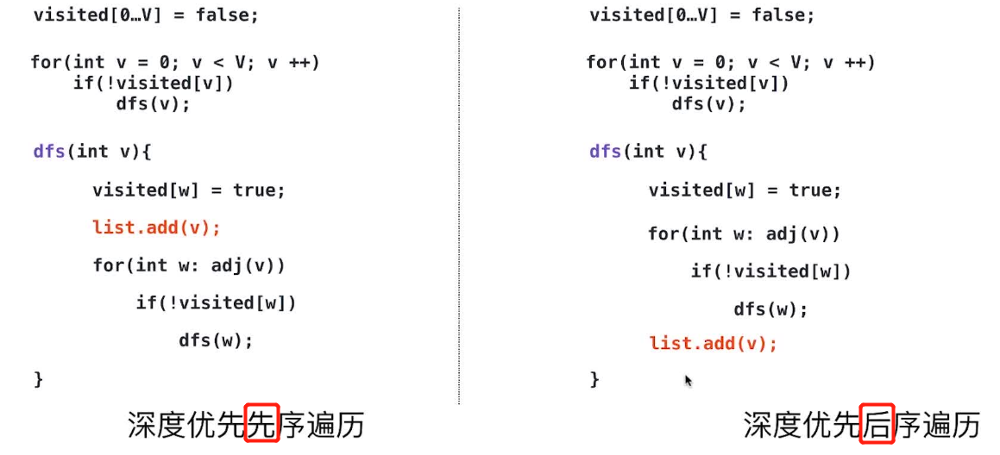

# 第3章 图的深度优先遍历

## 3.1 数据结构遍历的意义

### 每种数据结构，都必须有遍历的方式
> 很多算法的本质都是遍历，对于图论问题，真正理解遍历，已经可以应付80%的问题了

### 树的遍历 复习

> 复习下[玩转数据结构](https://coding.imooc.com/learn/list/207.html)第6章 和 [玩转算法与数据结构](https://coding.imooc.com/learn/list/71.html)第5章

树的深度优先遍历就是指前、中、后序遍历 ps:广度优先遍历实际就是层序遍历，可以参考如下内容：
+ [视频教程](https://coding.imooc.com/lesson/71.html#mid=1509)
+ [代码](../Part1Basic/JAVA/src/main/java/Chapter5BinarySearchTree/Section5TraverseSection6LevelOrder/BST.java)

### 需要回顾LeetCode上的几个问题

+ 二叉树的遍历
  + [144.BinaryTree Preorder Traversal 前序遍历](https://leetcode-cn.com/problems/binary-tree-preorder-traversal/)
  + [94.Binary Tree Inorder Traversal 中序遍历](https://leetcode-cn.com/problems/binary-tree-inorder-traversal/)
  + [145.Binary Tree Postorder Traversal 后序遍历](https://leetcode-cn.com/problems/binary-tree-postorder-traversal/)
  + [102.Binary Tree Level Order Traversal 层序遍历](https://leetcode-cn.com/problems/binary-tree-level-order-traversal/)

+ n叉树的遍历
  + [589.N-ary Tree Preorder Traversal  n叉树前序遍历](https://leetcode-cn.com/problems/n-ary-tree-preorder-traversal/)
  + [590.N-ary Tree Postorder Traversal n叉树后序遍历](https://leetcode-cn.com/problems/n-ary-tree-postorder-traversal/)

### 为什么n叉树的遍历没有中序? 

对于二叉树来说，有左右两个孩子，所以如果遍历发生在访问左孩子和右孩子之间，就叫“中序”。  

但是，n 叉树有可能有 3 个孩子，10 个孩子，26 个孩子，甚至 100 个孩子。遍历发生在哪里是中间？是遍历完第一个孩子？还是遍历完第 7 个孩子？还是遍历完第 66 个孩子？  

很显然，对于 n 叉树来说，我们不能定义一个统一的“中间”的标准了。  

所以，n 叉树的遍历，是没有中序遍历的概念的：）

练习题如下：

+ [429.N-ary Tree Level Order Traversal n叉树层序遍历](https://leetcode-cn.com/problems/n-ary-tree-level-order-traversal/)

## 3.2 从树的深度优先遍历，到图的深度优先遍历

> 树的深度优先遍历就是指前、中、后续遍历(n叉树没中序遍历，二叉树都有)，这里以前序遍历为例
左边是二叉树深度优先遍历中的前序遍历，右边是图的深度优先遍历，二者对比如下

+ **遍历过程**：左边是访问顶点的左右两个字节点;右边是for循环遍历节点的所有相邻子节点，每个节点访问后都会计入到长度为V(顶点数)的布尔数组中
+ **递归终止条件**：左边的终止条件是`if(node!=null)`，当递归到一个没有字节点的节点时就会退出递归;右边是for循环`遍历完联通图所有节点(if(!visited[w])不满足)`后退出



## 3.3 DFS代码逻辑的详细解读

### `递归调用`和`普通嵌套调用`的联系和区别
+ 联系：都是函数的嵌套调用
+ 区别：嵌套调用是不同函数之间的调用；递归调用是自己和自己的链式调用

图示如下：
+ 上面：`A<---B<---C`是普通的嵌套调用
+ 下面：`A<---A<---A`是递归调用，注意虽然函数相同，但是每层的递归传入的参数都是不同的


### 举例详解递归调用的过程

> 注意TreeSet是有序地，所以访问邻接点都是从小到大访问;   
>`visited[i]=true`代表该节点已经被访问了;  
>存储遍历结果的数组叫`order`  
>下面每张图片上方的文字是阐述其递归过程的

+ **递归到最深层的过程**
  + 访问0，0放入order数组并设置`visited[0]=true`，挂起dfs(0)，访问0的邻接点，邻接点有(1, 2)   ，先访问到1
  + 访问1，1放入order数组并设置`visited[1]=true`，挂起dfs(1)，访问1的邻接点，邻接点有(0, 3, 4)，先访问到0，因为`visited[0]=true`，所以再访问3
  + 访问3，3放入order数组并设置`visited[3]=true`，挂起dfs(3)，访问3的邻接点，邻接点有(1, 2, 5)，先访问到1，因为`visited[1]=true`，所以再访问2
  + 访问2，2放入order数组并设置`visited[2]=true`，挂起dfs(2)，访问2的邻接点，邻接点有(0, 3, 6)，先访问到0，因为`visited[0]=true`，所以再访问3，因为`visited[3]=true`，所以再访问6，
  + 访问6，6放入order数组并设置`visited[6]=true`，挂起dfs(6)，访问6的邻接点，邻接点有(2, 5)   ，先访问到2，因为`visited[2]=true`，所在再访问5
  + 访问5，5放入order数组并设置`visited[5]=true`，挂起dfs(5)，访问5的邻接点，邻接点有(3, 6)   ，先访问到3，因为`visited[3]=true`，所在再访问6，因为`visited[6]=true`，5的邻接点都访问完了
  > 
+ 接上面，演示**从最深往回递归的过程**,回退的过程中在回退前访问过的节点都不会再访问了
  + 5的邻接点都访问过了，递归退回到dfs(6)，6的邻接点(2, 5)   已经在递归回退前访问完
  + 6的邻接点都访问过了，所以回退到dfs(2)，2的邻接点(0, 3, 6)已经在递归回退前访问完
  + 2的邻接点都访问过了，所以回退到dfs(3)，3的邻接点(1, 2, 5)已经在递归回退前访问了(1, 2)，所以再访问5，因为`visited[5]=true`,所以3的邻接点已经访问完了
  + 3的邻接点都访问过了，所以回退到dfs(1)，1的邻接点(0, 3, 4)已经在递归回退前访问了(0, 3)，所以再访问4
  > 
  + 访问4，4放入order数组并设置`visited[4]=true`，挂起dfs(4)，访问4的邻接点，邻接点有(1)，先访问到1，因为`visited[1]=true`，此外4再无邻接点，所以4的邻接点都访问完了
  > 
  + 4的邻接点都访问过了，所以回退到dfs(1)，1的邻接点(0, 3, 6)已经在递归回退前访问完
  + 1的邻接点都访问过了，所以回退到dfs(0)，0的邻接点(1, 2)，1已经在递归回退前访问过，再访问邻接点2，因为`visited[2]=true`，所以0的邻接点都访问完了
  + 0的邻接点都访问过了，回到递归起点了，递归栈调用完毕，即递归遍历邻接点完毕。order数组中即存放地深度遍历的结果   
  > 

## 3.4 图的深度优先遍历(DFS)实现代码
> 仅支持遍历有一个联通分量的图，多个联通分量想支持需要修改`dfs(0)`

[仅支持全联通的代码，含多个联通分量的不行](src/main/java/Chapter03DepthFirstTraversal/GraphDFSNoCC.java)

## 3.5 图的深度优先遍历(DFS)实现代码，改进版本

### 一、能支持遍历含有多个联通分量的图

> 代码见[能支持遍历含有多个联通分量的图的DFS实现](src/main/java/Chapter03DepthFirstTraversal/GraphDFS.java)

写死从0开始执行dfs会导致只能遍历0所在的联通分量，当图有多个联通分量时就不适用了，如下图中的5显然无法遍历到


想改进这个问题，需要把构造函数中的
```java
// dfs(0)只能遍历一个联通分量
dfs(0);
```
修改为:
```java
// 从dfs(0)改成下面的代码，可以支持非连通的图,不用考虑连通分量的时候直接用dfs(v)即可
for (int v = 0; v < graph.V(); v++) {
    if (!visited[v]) {
        dfs(v);
    }
}
```

### 二、图的DFS也分先序遍历和后续遍历，没有中序遍历，这个点在后面有向图中会用到
> 代码见[图的DFS也分先序遍历和后续遍历](src/main/java/Chapter03DepthFirstTraversal/GraphDFSPostOrder.java)

想实现后序遍历，只需要把
```java
private void dfs(int v) {
    visited[v] = true;
    orderList.add(v);
    for (Integer w : graph.adj(v)) {
        if (!visited[w]) {
            // w点没被访问的话就递归接着访问
            dfs(w);
        }
    }
}
```
改成
```java
private void dfs(int v) {
    visited[v] = true;
    for (Integer w : graph.adj(v)) {
        if (!visited[w]) {
            // w点没被访问的话就递归接着访问
            dfs(w);
        }
    }
    orderList.add(v);
}
```



## 3.6 更多关于图的深度优先遍历

### DFS的复杂度
> O(V+E)

### 图的深度优先遍历的应用
   
+ 求图的连通分量
+ 求两点间是否可达
+ 求两点间的一条路径
+ 检测图是否有环
+ 二分图检测
+ 寻找图中的桥和割点
+ 哈密尔顿路径
+ 拓扑排序

### 扩展

+ [DFS的非递归实现](https://coding.imooc.com/lesson/370.html#mid=27346)
+ [基于邻接矩阵的DFS](https://coding.imooc.com/lesson/370.html#mid=27344)
