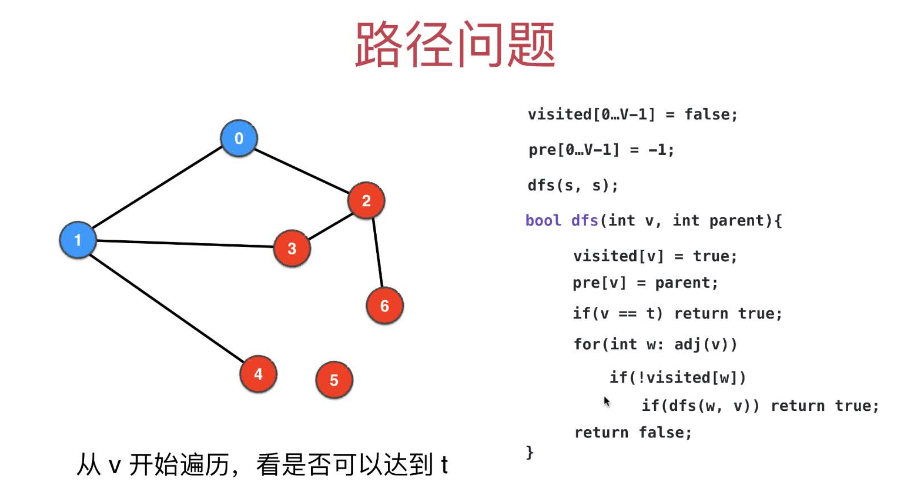
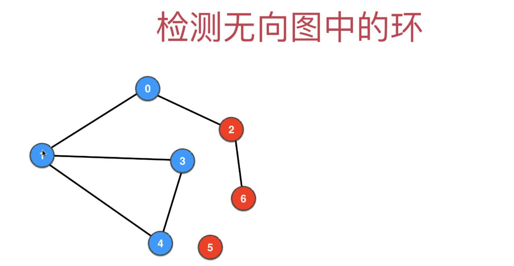
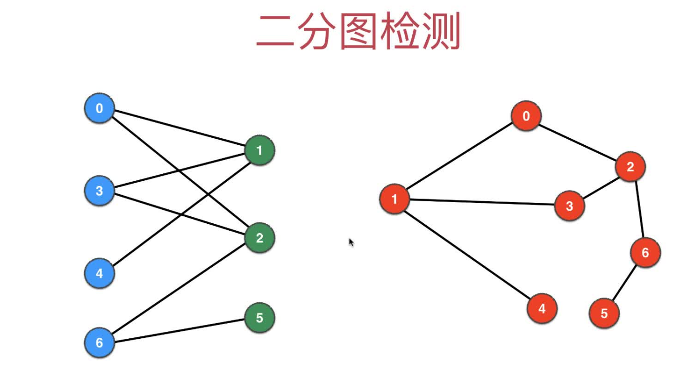
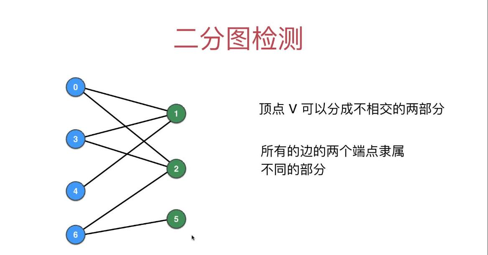
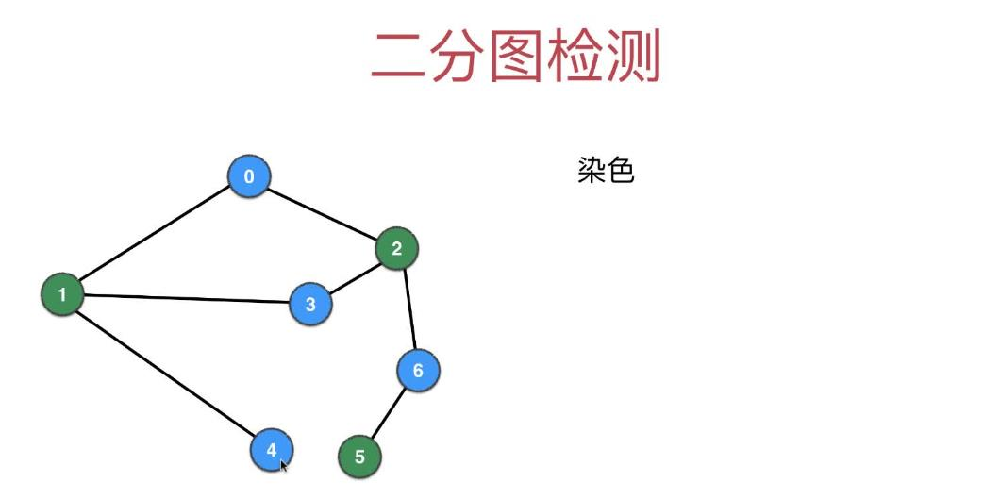
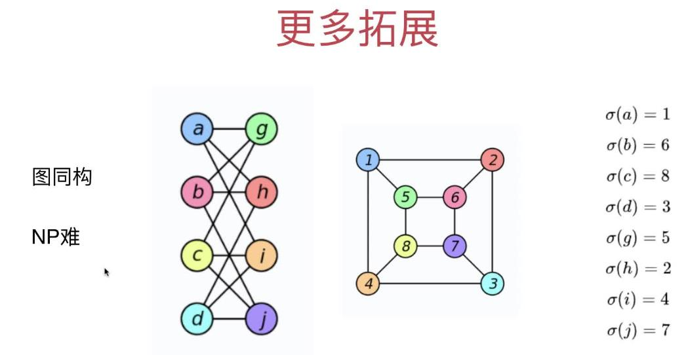

# 第04章 图的深度优先遍历的应用

> 常见的应用如下

+ 求图的连通分量(4.1~4.2)
+ 求两点间是否可达(4.3)
+ 求两点间的一条路径(4.4)
+ 检测图是否有环(4.9)
+ 二分图检测(4.10~4.11)
+ 寻找图中的桥和割点
+ 哈密尔顿路径
+ 拓扑排序

## 4.1 求无向图的连通分量的个数

> DFS递归每退出一次，说明图有了一个连通分量，所以在dfs()下方，连通分量个数connectedComponentCount(`下图中的ccount`)加1即可


+ [实现代码](src/main/java/Chapter04DFSInAction/Section1ConnectedComponents/GraphDFS4ConnectedComponents.java#L43)
+ [测试代码](src/main/java/Chapter04DFSInAction/Section1ConnectedComponents/Main.java)

## 4.2 求每个连通分量里各自具体有哪些节点

> 实际就是改造visited[]数组，把boolean类型改成整型，`不同的连通分量`标记为"已访问"时用`不同的整数`去记录(未被访问默认是-1,访问后用地是当前的联通分量的个数即connectedComponentCount的值)，同一个联通分量内的顶点在visited[]中的值相等

### 在递归中把当前的联通分量个数传给dfs()作为联通分量的编号，即`visited[当前点]`的值
```java
public GraphDFS4ConnectedComponentsStatistic(Graph graph) {
    this.graph = graph;
    // 初始化访问数组，用图的顶点个数来访问
    visited = new int[graph.V()];
    // 数组初始化为-1
    Arrays.fill(visited, -1);
    // 从dfs(0)改成下面的代码，可以支持非连通的图
    for (int v = 0; v < graph.V(); v++) { // 等于-1表示还没被访问过
        if (visited[v] == -1) {
            // 第二个参数表示当前连通分量的标志(多个连通分量内的元素在visited内用connectedComponentCount这个值进行标记)
            dfs(v, connectedComponentCount);
            // 当退出递归时，相当于结束了一个连通图的遍历，所以连通分量数加1
            connectedComponentCount++;
        }
    }
}
```

### 然后在dfs函数中把当前点v用上面传入的connectedComponentCount设置为已访问
```java
/**
* 深度优先遍历
*
* @param v    当前遍历到的顶点下标
* @param ccid 当前连通分量的标记(同一个连通分量内的元素都在visited数组内用这个数值进行赋值标记)
*/
private void dfs(int v, int ccid) {
    visited[v] = ccid;
    orderList.add(v);
    for (Integer w : graph.adj(v)) {
        if (visited[w] == -1) {
            // w点没被访问的话就递归接着访问
            dfs(w, ccid);
        }
    }
}
```

### 2020-4-22更新：使用List数组来记录每个联通分量更方便
```java
public List<Integer>[] getCcDetail(){
    List<Integer>[] ccDetailArr = new ArrayList[ccCount];
    // 一定注意要给数组内每个对象新建好List
    for (int i = 0; i < ccDetailArr.length; i++) {
        ccDetailArr[i] = new ArrayList<>();
    }
    // ccCount即上面的connectedComponentCount
    for (int ccid = 0; ccid < ccCount; ccid++) {
        for (int v = 0; v < visited.length; v++) {
            if (visited[v] == ccid){
                ccDetailArr[ccid].add(v);
            }
        }
    }
    return ccDetailArr;
}
```
使用方法如下：
```shell
ccDetail = dfsccCount.getCcDetail();
for (int ccid = 0; ccid < ccDetail.length; ccid++) {
    System.out.println("联通分量" + ccid + "的顶点详情是：" + ccDetail[ccid]);
}
```

结果举例如下：

```txt
联通分量0的顶点详情是：[0, 1, 2, 3, 4, 6]
联通分量1的顶点详情是：[5]
```


+ [实现代码](src/main/java/Chapter04DFSInAction/Section2ConnectedComponentsStatistic/GraphDFS4ConnectedComponentsStatistic.java#L98)
+ [测试代码](src/main/java/Chapter04DFSInAction/Section2ConnectedComponentsStatistic/Main.java)

## 4.3 判断两个点v和w在给定的图中是否是可连接`connected`地

> 只需要判断visited[v]是否和visited[w]相等即可，因为上一节已经实现了一个连通分量内的点其visited[i]的值是相等地了

```java
/**
* 判断v和w在图中是否是可以连接地
*/
public boolean isConnected(int v, int w) {
    graph.validateVertex(v);
    graph.validateVertex(w);
    return visited[v] == visited[w];
}
```

+ [实现代码](src/main/java/Chapter04DFSInAction/Section3IsConnected/GraphDFS4IsConnected.java#L60)
+ [测试代码](src/main/java/Chapter04DFSInAction/Section3IsConnected/Main.java#L43)

ps: :cn:**好像和Union Find的功能类似了！！**:cn: 见[并查集](../Part1Basic/第6章_并查集.md)

## 4.4~4.5 单源路径问题

> 单源的含义：起始点是固定地，终止点可以随意指定。单源`最短`路径用后一章的BFS

这一节的代码没有继承上一节的代码，因为单源路径问题是和连通分量无关的，所以dfs()要用最早没有考虑连通分量的那版

+ 首先：用isConnected(v, w)判断两个点是否连通
+ 然后：连通地话再求路径(深度优先遍历的起点选v或w,用previous数组记录每个节点的上一个节点),然后;不连通直接退出
+ 注意：目前不涉及最短路径或者最优路径，只要找到一条路径即可

### 下面是代码实现

+ [实现代码](src/main/java/Chapter04DFSInAction/Section4To5SingleSourcePath/GraphDFSSingleSourcePath.java#L100)
+ [测试代码](src/main/java/Chapter04DFSInAction/Section4To5SingleSourcePath/Main.java)

多源路径问题很简单，把这一节的代码封装下，每个不同的source各种一个单源路径GraphDFSSingleSourcePath即可

## 4.6~4.7 无关紧要，可不看

## 4.8 单源路径问题的优化：DFS遍历到target就提前退出

> dfs加个返回值，一旦遍历到target就防疫true.这样可以极大地节省递归的成本,因为target往后的元素都不用遍历了


```java
private boolean dfs(int v, int parent) {
    ......
    if (v == target) {
        // 这里的返回是为了防止遍历target后面的节点
        return true;
    }
    ......
        // w点没被访问的话就递归接着访问
        if (dfs(w, v)) {
            // 如果找到要遍历的点了就退出(这里是为了防止遍历到target后去遍历target.previous的其他邻接点)
            return true;
        }
    .....
}
```

+ [实现代码](src/main/java/Chapter04DFSInAction/Section8SingleSourcePathOptimize/GraphDFSSingleSourcePathOptimize.java#L109)
+ [测试代码](src/main/java/Chapter04DFSInAction/Section8SingleSourcePathOptimize/Main.java)

## 4.9 无向图环检测

> 当检测到一个节点(当前节点current)的相邻节点已经被visited但是这个相邻节点不是current的上一个visited节点，就说明图中有环了

下面是两个例子，都是从0点开始访问

### 无向图环检测例子1

> 下面的图当遍历到点2时，可以发现点0已经被访问，但是点0并不是2的上一个访问节点(3才是)，所以该图时存在环地


### 无向图环检测例子2
> 下面的图当遍历到点4时，可以发现点1已经被访问，但是点1并不是2的上一个访问节点(3才是)，所以该图时存在环地



```java

 public GraphDFSCycleDetect(Graph graph) {
    this.graph = graph;
    // 初始化访问数组，用图的顶点个数来访问
    visited = new boolean[graph.V()];
    // 从dfs(0)改成下面的代码，可以支持非连通的图,不用考虑连通分量的时候直接用dfs(v)即可。
    // for循环检测所有的联通分量，一个联通分量有环，当前图就是有环图
    for (int v = 0; v < graph.V(); v++) {
        if (!visited[v]) {
            // 第2个参数传入v，意思是起始点的parent节点可以认为是自己
            if (dfs(v, v)){
                hasCycle = true;
                break;
            }
        }
    }
}


......


 /**
    * 从顶点v出发，进行DFS，顺便检测当前图是否有环
    *
    * @param v      当前遍历到的点
    * @param parent v的上一个访问节点
    * return        当前的图是否有环
    */
private boolean dfs(int v, int parent) {
    visited[v] = true;
    orderList.add(v);
    for (Integer w : graph.adj(v)) {
        if (!visited[w]) {
            // w点没被访问的话就递归接着访问
            if (dfs(w, v)) {
                // dfs递归往下访问，遇到有环就可以直接返回true了
                return true;
            }
        } else if (w != parent) { // 新增代码：这个else分支就是无向图环检测的核心
            // 原理：当检测到一个节点(当前节点current)的相邻节点已经被visited但是这个相邻节点不是current的上一个visited节点，就说明图中有环了
            return true;
        }
    }
    return false;
}
```

+ [实现代码](src/main/java/Chapter04DFSInAction/Section9CycleDetect/GraphDFSCycleDetect.java#L71)
+ [测试代码](src/main/java/Chapter04DFSInAction/Section9CycleDetect/Main.java)

### 额外思考：判断一张图是否是一棵树？

提示：只判断一张图中没有环，不能说明这张图是一棵树。

### 想想看？还有什么条件需要满足？

答案：`必须保证图是联通的(即连通分量的个数为1，可用4.1的代码实现)`,同时没有环，才能说明这张图是一棵树

## 4.10~4.11 二分图检测

### 什么是二分图

+ 顶点可以分成不相交的两部分
+ 图的每条边的两个端点隶属于划分出地两部分中的一部分

下面图里左边的二分图实际等效于右边的图，只是我们把连线调整了下



下面是二分图的定义



### 二分图检测的核心原理：染色
> 注意DFS过程中遍历邻接点是从小到大遍历地，因为我们用地有序地TreeSet作为邻接表来存储地图

在DFS过程中用两种颜色对图进行染色，遵循一个顶点的所有邻接点都和这个顶点的颜色不同，如果最后DFS遍历完，达到了`每个顶点的所有邻接点和这个顶点的颜色都不同`，说明当前图是个二分图

下图从0开始染色，用蓝绿两种颜色对图进行染色，最终DFS遍历完符合二分图的约束，所以是个二分图



### 代码实现

> 基于 Chapter03DepthFirstTraversal/GraphDFS.java 实现

+ [实现代码](src/main/java/Chapter04DFSInAction/Section10BiPartitionDetect/GraphDFSBiPartitionDetect.java)
+ [测试代码](src/main/java/Chapter04DFSInAction/Section10BiPartitionDetect/Main.java)

### 额外思考：如何获得二分图的顶点划分？ 

非常简单，通过 colors 数组中存储的信息就可以。
+ `colors[v] == 0` 的顶点是一组 
+ `colors[v] == 1` 的顶点是另一组

当然了，大家可以设计一个接口，不是简单地返回 colors 这个数组，而是真正通过 colors 的信息，把两部分顶点分别放在两个 ArrayList 中返回给用户，对用户而言或许更友好。 具体，可以参考之前，我们实现的 CC 类中，返回给用户具体联通分量内容的形式


## 4.12 图论问题的思考

### 本章讲解地DFS的应用距离总结

|                    | 记录更多信息        | 递归函数dfs()返回值      |
|--------------------|---------------------|--------------------------|
| 联通分量           | ccid                | 无                       |
| 路径问题(单源路径) | pre                 | 有，是否遍历到了target点 |
| 环检测             | hasCycle            | 有，是否找到环           |
| 二分图检测         | biPartition、colors | 有，是否是二分图         |

### 当图的顶点不是连续的0~n的数字标识时，可以设计一个`现有顶点标识`与`0~n`的连续数字的map映射

> 比如下图左，顶点是字符串，则可以用Map建立字符串顶点到数字顶点的映射关系,然后就可以使用前面的图论算法解题了,解决完了再用映射还原回去即可


