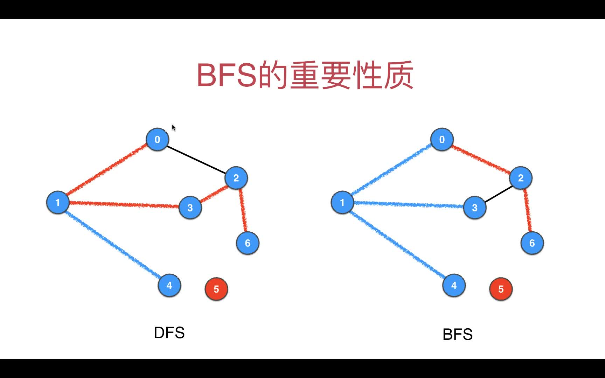
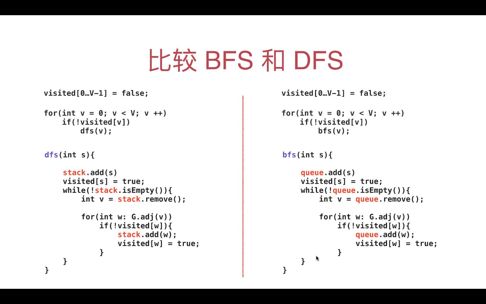
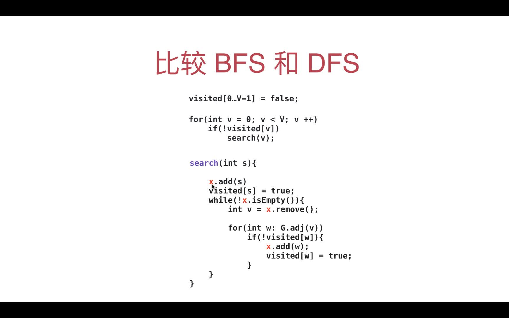

# 第05章 图的广度优先遍历

## 5.1 从树的广度优先遍历，到图的广度优先遍历

### 树的`广度优先遍历(层序遍历)`的原理
> 用一个队列来记录树的元素，每次都是弹出父节点，然后加入这个这个节点的所有子节点。没有元素供插入或弹出就跳过

### 广度优先遍历实际就是层序遍历
> 可以参考[玩转算法与数据结构](https://coding.imooc.com/learn/list/71.html)的视频教程和代码

+ [5-6 层序遍历(广度优先遍历)](https://coding.imooc.com/lesson/71.html#mid=1510)
+ [层序遍历参考代码](../Part1Basic/JAVA/src/main/java/Chapter5BinarySearchTree/Section5TraverseSection6LevelOrder/BST.java#L149)

`广度优先遍历实际就是用了一个队列，不断弹出父节点加入子节点的过程`

### ps:深度优先遍历就是指前、中、后序遍历

> 可以参考[玩转算法与数据结构](https://coding.imooc.com/learn/list/71.html)的视频教程和代码

+ [5-5 二分搜索树的遍历(深度优先遍历)](https://coding.imooc.com/lesson/71.html#mid=1509)
+ [代码](../Part1Basic/JAVA/src/main/java/Chapter5BinarySearchTree/Section5TraverseSection6LevelOrder/BST.java#L149)

### 广度优先遍历原理举例，一步步讲解
> 被访问过地节点标记为蓝色(加入过queue队列就认为被访问过)，遍历过一个元素即从队列quque弹出元素的动作，遍历结果存到order数组中
> 
+ 1.初始化图，从顶点0开始遍历，当然也可以选其他顶点，这里只为了演示。初始时queue=[]，order=[]，visited={0=false, 1=false, 2=false, 3=false, 4=false, 5=false, 6=false}
+ 2.节点0作为起始点，没有父节点，队列此时为空，把节点0加入队列，此时queue=[0]，order=[]，visited={0=true, 1=false, 2=false, 3=false, 4=false, 5=false, 6=false}
+ 3.弹出父节点0，欲加入节点0的邻接点1和2，visited[1]和visited[2]均为false所以都加入queue，此时quque=[1, 2]，   order=[0]，   visited={0=true, 1=true, 2=true, 3=false, 4=false, 5=false, 6=false}
+ 4.弹出父节点1，欲加入节点1的邻接点3和4，visited[3]和visited[4]均为false所以都加入queue，此时queue=[2, 3, 4]，order=[0, 1]，visited={0=true, 1=true, 2=true, 3=true,  4=true,  5=false, 6=false}
+ 5.弹出父节点2，欲加入节点2的邻接点3和6，因为visited[3]=true，所以只加入6，此时queue=[3, 4, 6]，order=[0, 1, 2]，visited={0=true, 1=true, 2=true, 3=true, 4=true, 5=false, 6=true}
+ 6.弹出父节点3，欲加入节点3的邻接点1和2，因为visited[1]和visited[2]均为true，所以都不加入，此时queue=[4, 6]，order=[0, 1, 2, 3]，visited={0=true, 1=true, 2=true, 3=true, 4=true, 5=false, 6=true}
+ 7.弹出父节点4，欲加入节点4的邻接点1，因为visited[1]为true，所以不加入，此时queue=[6]，order=[0, 1, 2, 3, 4]，visited={0=true, 1=true, 2=true, 3=true, 4=true, 5=false, 6=true}
+ 8.弹出父节点6，欲加入节点6的邻接点2和5，因为visited[2]为true，所以加入5，此时queue=[5]，order=[0, 1, 2, 3, 4, 6]，visited={0=true, 1=true, 2=true, 3=true, 4=true, 5=true, 6=true}
+ 9.弹出父节点5，欲加入节点5的邻接点6，因为visited[6]为true，所以不加入，此时queue=[]，order=[0, 1, 2, 3, 4, 6, 5]，visited={0=true, 1=true, 2=true, 3=true, 4=true, 5=true, 6=true}
+ 10.队列已经为空，广度优先遍历结束，最终的遍历结果为order=[0, 1, 2, 3, 4, 6, 5]

`如果是有多个联通分量时，处理手段和DFS时一样，针对所有顶点都作为起始点执行一遍广度优先遍历即可`

## 5.2 广度优先遍历的实现
> 和树的广度优先遍历完全一样：`用一个队列，不断弹出父节点加入子节点`,此外还需要记录每个节点是否已经被遍历而引入了visited数组

+ [实现代码](src/main/java/Chapter05BreadthFirstTraversal/Section2GraphBFS/GraphBFS.java#L41)
+ [测试代码](src/main/java/Chapter05BreadthFirstTraversal/Section2GraphBFS/Main.java)

`广度优先遍历的复杂度：O(V + E)`

上一章使用DFS解决地几类问题，使用BFS几乎都可以解决，思路也是一样的，下面几节将进行讲解

|                    | 记录更多信息        | 阐述    |
|--------------------|--------------------|--------------------------|
| 路径问题(单源路径) | pre                 | pre记录每个被visited节点的上一个visited节点，从target点开始遍历pre到source，结果逆序即得到路径 |
| 环检测             | hasCycle           | 当检测到一个节点(当前节点current)的相邻节点已经被visited但是这个相邻节点不是current的上一个visited节点，就说明图中有环了 |
| 二分图检测         | biPartition、colors | 用两种颜色0和1(在colors数组中)对图进行染色，遵循一个顶点的所有邻接点都和这个顶点的颜色不同，如果最后遍历完，达到了每个顶点的所有邻接点和这个顶点的颜色都不同，说明当前图是个二分图         |

## 5.3 使用BFS求解单源路径

> 参考[深度优先遍历的代码](src/main/java/Chapter04DFSInAction/Section4To5SingleSourcePath)

>pre记录每个被visited节点的上一个visited节点，从target点开始遍历pre到source，结果逆序即得到路径

+ [实现代码](src/main/java/Chapter05BreadthFirstTraversal/Section3GraphBFSSingleSourcePath/GraphBFSSingleSourcePath.java)
+ [测试代码](src/main/java/Chapter05BreadthFirstTraversal/Section3GraphBFSSingleSourcePath/Main.java)

## 5.4 广度优先遍历求单源路径的优化

> BFS遍历到target就提前退出，这样可以极大地节省递归的成本,当前图的构造就只是为了求解当前两个点的路径

+ [实现代码](src/main/java/Chapter05BreadthFirstTraversal/Section4GraphBFSSingleSourcePathOptimize/GraphBFSSingleSourcePathOptimize.java)
+ [测试代码](src/main/java/Chapter05BreadthFirstTraversal/Section4GraphBFSSingleSourcePathOptimize/Main.java)

## 5.5 广度优先遍历求连通分量

> 和DFS基本相同

+ [实现代码](src/main/java/Chapter05BreadthFirstTraversal/Section5GraphBFSConnectedComponents/GraphBFSConnectedComponents.java)
+ [测试代码](src/main/java/Chapter05BreadthFirstTraversal/Section5GraphBFSConnectedComponents/Main.java)

## 5.6 广度优先遍历实现环检测

> 和DFS的基本相同

+ [实现代码](src/main/java/Chapter05BreadthFirstTraversal/Section6GraphBFSCycleDetect/GraphBFSCycleDetect.java)
+ [测试代码](src/main/java/Chapter05BreadthFirstTraversal/Section6GraphBFSCycleDetect/Main.java)

## 5.7 广度优先遍历实现二分图检测

> 和DFS的基本相同

+ [实现代码](src/main/java/Chapter05BreadthFirstTraversal/Section7BiPartitionDetect/GraphBFSBiPartitionDetect.java)
+ [测试代码](src/main/java/Chapter05BreadthFirstTraversal/Section7BiPartitionDetect/Main.java)

## 5.8 BFS的单源路径实际就是source到target得最短路径

> 实际就是求出了无权图中指定两点的最短路径，还有个小缺点就是只列出了最短路径经过点，而没有列出具体的最短路径的值

+ [代码参考](src/main/java/Chapter05BreadthFirstTraversal/Section8And9ShortestPath/SingleSourcePathTest.java)

代码的图示如下，左侧是DFS的单源路径问题，右侧是BFS的单源路径问题

## 5.9 无向图的最短路径，终极版

> 返回最短路径经过的点和最短路径的值，实际就是加了一个distance数组，记录了BFS过程中经过的点到起点source的距离(无权图默认边长是1，经过一条边加1即可)。测试的Graph就是上面的图

+ [实现代码](src/main/java/Chapter05BreadthFirstTraversal/Section8And9ShortestPath/GraphBFSUnweightedGraphShortestPath.java)
+ [测试代码](src/main/java/Chapter05BreadthFirstTraversal/Section8And9ShortestPath/Main.java)

## 5.10 DFS和BFS的神奇联系

### 都转换成非递归的方式地话，DFS用地是Stack, BFS用的是Queue

> 为了方便看，stack和queue添加元素的方法都写成了add，删除元素的方法都写成了remove

### 进一步抽象，可以得到图的遍历都可以提取成如下的编程模型

> 下面图的x就是指存储遍历点的容器类型，当是Stack时就是深度优先遍历，当是Queue时就是广度优先遍历，其实也可以是其他的容器类型，比如是个随机弹出的容器类型，那么遍历就相当于是随机遍历了，这个思想在刘老师的《看地见的算法 7个经典应用诠释算法精髓》里有应用到

