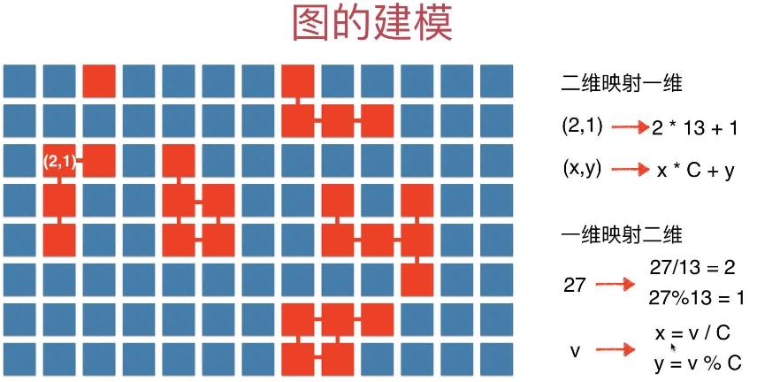
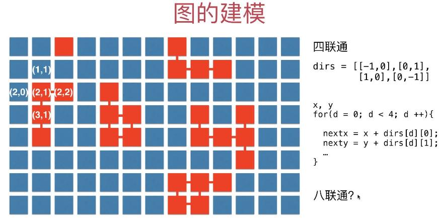
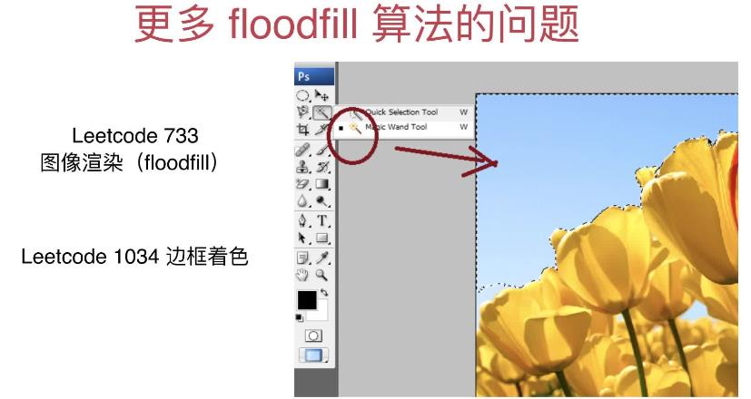
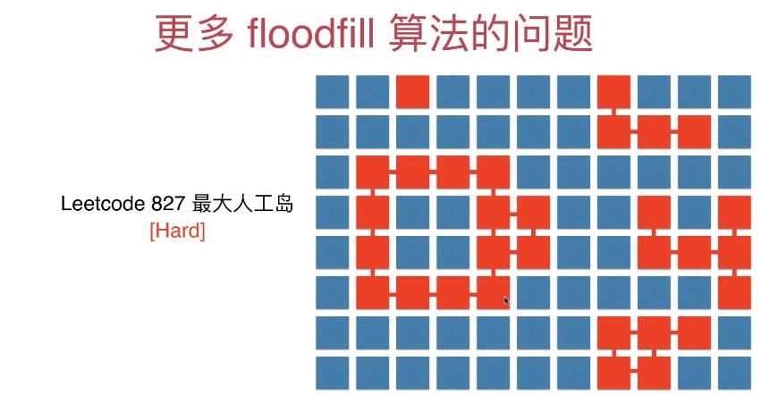

# 第6章 图论问题建模和floodfill

> floodfill(洪泛)实际就是图的遍历

## 6.1 图论问题例子：判断二分图


题目来源：[LeetCode 785 is-graph-bipartite](https://leetcode-cn.com/problems/is-graph-bipartite):，判断二分图，

因为题目中已经给出了邻接表，相当于已经给出了Graph，所以直接用二分图的核心算法即可，参考[DFS实现二分图检测](src/main/java/Chapter04DFSInAction/Section10BiPartitionDetect/GraphDFSBiPartitionDetect.java)

+ [实现代码](src/main/java/Chapter06GraphModellingAndFloodfill/Section1LeetCodeBiPartite/Solution.java)


## 6.2 图的建模和二维网格中的小技巧

> 核心是为了解决[LeetCode 695.岛屿的最大面积](https://leetcode-cn.com/problems/max-area-of-island),本节和下一节先用图建模和DFS来解决，6.4开始会提取成更为常用floodfill算法(洪泛，类似洪水向四周蔓延)

695.岛屿的最大面积 建模成图论问题，转化成**求所有连通分量里元素最多的一个**，返回其元素个数即可, 需要把平面中二维的点映射成一维的点，然后就可以用检测连通分量那套来做这个问题了

### 图论建模

> 二维点和一维的转换，然后就可以利用图论的标准实现来解决当前问题了



### 四联通分量(上右下左四个点的矢量差，顺时针旋转)
图中使用的坐标系是屏幕坐标系，不是笛卡尔坐标系的(x, y)而是(行, 列)。四连通分量就是在当前的(行, 列)坐标上加上四联通分量得到的点就是四联通分量要找的点，如图中(2, 1)代表第3行第2列(下标从0开始)的点，(1, 1)、(2, 2)、(3, 1)、(2, 0)分别对应(2, 1)加上四联通分量后对应的点，其实就是(2, 1)的上、右、下、左(顺时针转一下即可)对应的点。下面的伪代码说明了怎么获取上右下左四个点的坐标。此外八联通有时也会用到，就是指当前点为中心的九宫格以外的其他8个点，可以用类似的方法进行表示(顺时针旋转，试试列出八联通的dirs)  


### 八联通情况下的 dirs 数组定义 

在八连通的情况下，dirs 数组应该是 8*2 的二维数组，具体如下： 

```java
int[][] dirs = {{-1, 0}, {-1, 1}, {0, 1}, {1, 1}, {1, 0}, {1, -1}, {0, -1}, {-1, -1}};
```

> 请在纸笔上模拟，看看能不能理解，数组中的每一个元素(包含两个坐标的位移偏差)，代表一个坐标位置对应的哪个相邻位置的坐标？

## 6.3 DFS实现解决floodfill的问题

> 通过构造图和使用DFS来解决洪泛问题

+ [问题链接 LeetCode 695.岛屿的最大面积](https://leetcode-cn.com/problems/max-area-of-island)
+ [代码实现](src/main/java/Chapter06GraphModellingAndFloodfill/Section2And3GraphModel/Solution.java)

## 6.4 Floodfill算法

> 实际就是把原来基于整数的图遍历扩展到了基于二维坐标系的图遍历，二维坐标系中的每个像素点都是图中的一个顶点。

上一节做了大量的构建基于整数顶点的图并进行了大量二维坐标到整数的转换，从而可以使用前面写好地DFS代码，

实际是可以直接用(x, y)来表达图的顶点了，而且也不需要显示地构建图了，只需要利用骄傲DFS或BFS的思想即可


+ [经典实现代码，基于递归的DFS实现](src/main/java/Chapter06GraphModellingAndFloodfill/Section4Floodfill/Solution.java)
+ [BFS实现](src/main/java/Chapter06GraphModellingAndFloodfill/Section4Floodfill/SolutionBFS.java)
+ [递归的DFS实现](src/main/java/Chapter06GraphModellingAndFloodfill/Section4Floodfill/SolutionDFS递归实现.java)
+ [非递归的DFS实现](src/main/java/Chapter06GraphModellingAndFloodfill/Section4Floodfill/SolutionDFS非递归实现.java)

## 6.5 更多floodfill的问题

+ [130.被包围的水域](../Part7LeetCode/src/main/java/C09_深度优先搜索/T130_被围绕的水域/Solution.java)
+ [200.岛屿数量](../Part7LeetCode/src/main/java/C09_深度优先搜索/T200_岛屿数量/Solution.java)
+ [529.扫雷游戏](https://leetcode-cn.com/problems/minesweeper/)
  > 待做
+ [733.图像渲染](https://leetcode-cn.com/problems/flood-fill/)
  > 待做
+ [827.最大人工岛](https://leetcode-cn.com/problems/making-a-large-island/)
  > 待做
+ [1020.飞地的数量](https://leetcode-cn.com/problems/number-of-enclaves/)
  > 待做
+ [1034.边框着色](https://leetcode-cn.com/problems/coloring-a-border/)
  > 待做






