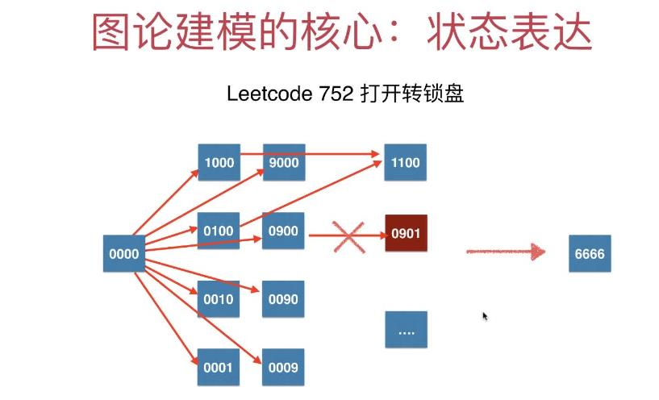
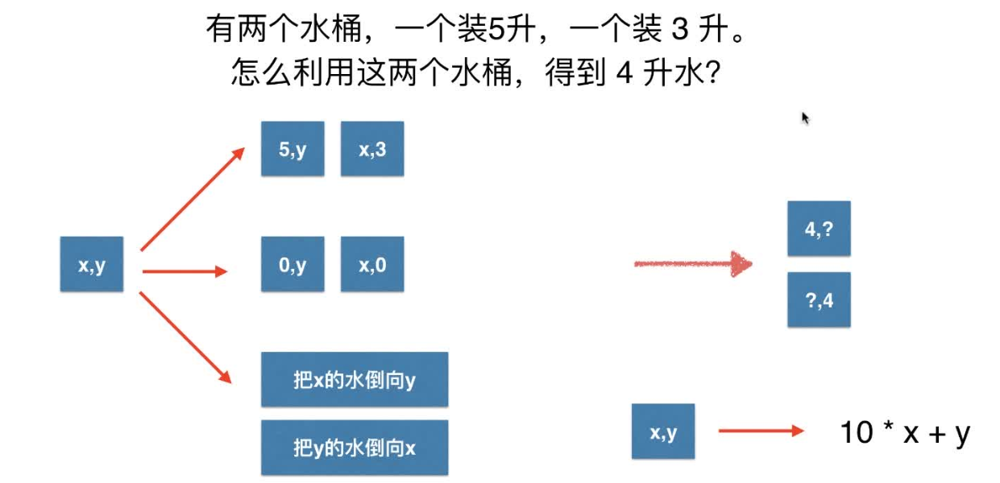
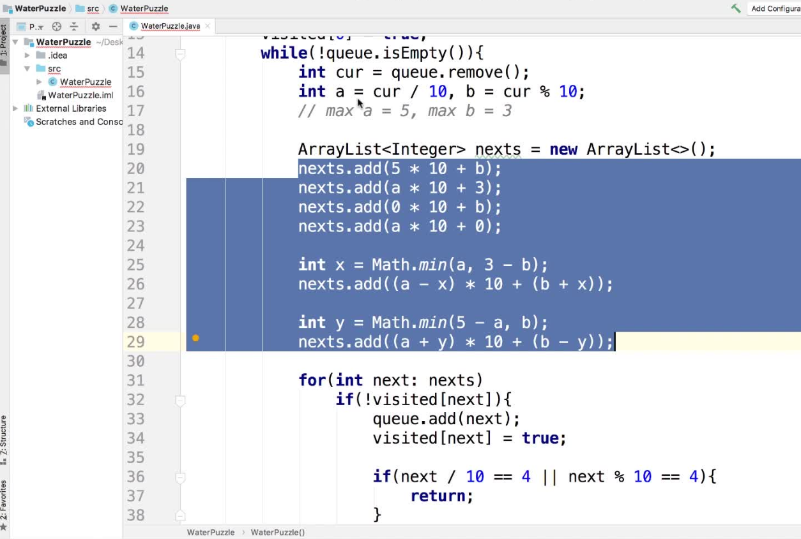

# 第7章 图论搜索和人工智能

> 主要是BFS(广度优先遍历)的应用

## 7.1 算法笔试面试中的BFS问题

### 八连通矩阵例题：[1091.二进制矩阵中的最短路径](https://leetcode-cn.com/problems/shortest-path-in-binary-matrix)，因为BFS的结果就是最短路径，所以此问题直接用BFS的思想即可

+ 无权图的最短路径：BFS
+ 八连通分量
+ 不单独建图，直接在二维矩阵中计算

代码实现如下：

+ [基础实现](src/main/java/Chapter07AISearchAndBFS/Section1EightConnectedAndBFS/Solution.java)
+ [可打印完整路径的实现](src/main/java/Chapter07AISearchAndBFS/Section1EightConnectedAndBFS/SolutionOptimize.java)
+ [测试代码](src/main/java/Chapter07AISearchAndBFS/Section1EightConnectedAndBFS/Main.java)
+ [自己的最佳实现,直接用BFS思想，不独立建图，性能最高，建议只看这个吧 at 2019-12-17](src/main/java/Chapter07AISearchAndBFS/Section1EightConnectedAndBFS/SolutionBFS.java)
  > 这个的性能最好，见[leetcode的提交记录](https://leetcode-cn.com/problems/shortest-path-in-binary-matrix/submissions/)

## 7.2~7.3 图论建模的核心：状态表达

> 可以把一个状态当成一个顶点，那么最少状态问题就可以转换成最短路径问题，使用无权图的bfs实现即可

以[752. 打开转盘锁](https://leetcode-cn.com/problems/open-the-lock)为例

转盘锁一共有`10*10*10*10=10000`中可能性，每个可能性都是一个状态，都可以看做图的一个顶点。以`0000`为例，每个0都可能向前拨1位或者向后拨1位，所以每个状态共有4*2=8个邻接状态，不同的点可能拨到同一个状态，显然这些状态之间的关系组成了一个庞大的图，下面我们要做地就是用bfs找指定点之间的路径，并且不能遍历deadends里面的点

+ [超时的实现，因为存deadends用了ArrayList](src/main/java/Chapter07AISearchAndBFS/Section2And3RotaryLock/Solution.java)
+ [超时实现的测试代码](src/main/java/Chapter07AISearchAndBFS/Section2And3RotaryLock/Main.java)
+ [优化实现，把deadends的实现由ArrayList换成了HashSet，瞬间效率就提上来了](src/main/java/Chapter07AISearchAndBFS/Section2And3RotaryLock/SolutionOptimize.java)
+ [优化实现的测试代码](src/main/java/Chapter07AISearchAndBFS/Section2And3RotaryLock/MainOptimize.java)
+ [自己从头进行的实现,后面就以这个为准吧~~这个自己理解地最好](src/main/java/Chapter07AISearchAndBFS/Section2And3RotaryLock/SolutionBFS.java)

## 7.4~7.5 智力题
> 

### 核心解决思路如下：  

### 代码实现如下：
+ [基于**多维数组**的BFS实现](src/main/java/Chapter07AISearchAndBFS/Section4And5IQ/WaterPuzzle.java)
+ [基于**状态压缩**的BFS实现](src/main/java/Chapter07AISearchAndBFS/Section4And5IQ/WaterPuzzleZip.java)
  > 状态压缩实际就是把多个数字转换为一个数字，通常做法是：多个数字可以通过`num = a*10^k+ b*10^k-1 +......+ x*10^0`来转换为一个数字，从而实现了数字的压缩，用到的时候再通过整除或求余来还原为原来的数字即可，中间状态的`num`可以高效地进行运算和逻辑处理

### 更多智力题

`农夫`需要把`狼`、`羊`、`菜`和自己运到对岸去，需要满足如下限制条件
+ 只有农夫能够划船，而且船比较小，除农夫外每次只能运一样东西
+ 如果没有农夫看着，羊会偷吃菜，狼会吃羊

请考虑一种方法，让农夫能安全地安排这些东西和他自己过河

[农夫过河问题实现](src/main/java/Chapter07AISearchAndBFS/Section4And5IQ/FarmerCrossRiver.java)

## 7.6~7.7 滑动谜题略

> [LeetCode 773号 滑动谜题](https://leetcode-cn.com/problems/sliding-puzzle/)

## 7.8 图论搜索和人工智能

