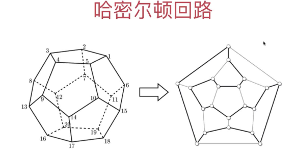
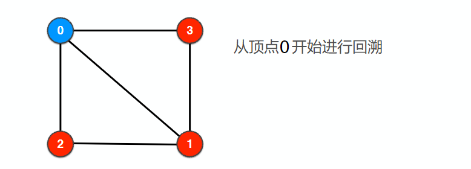
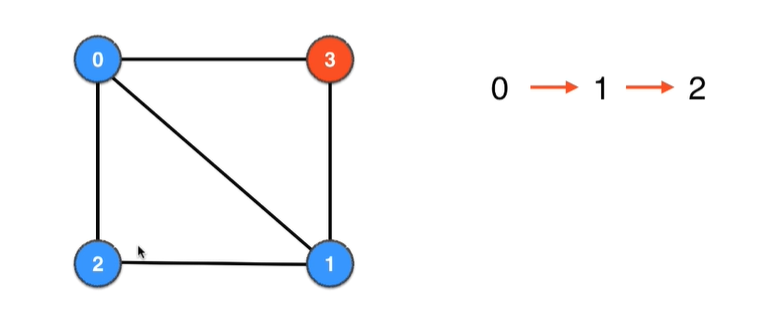
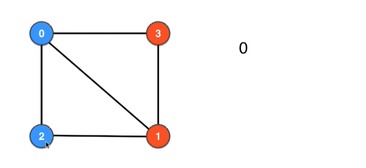
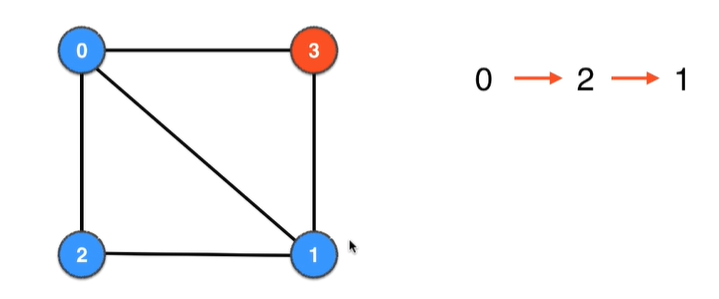
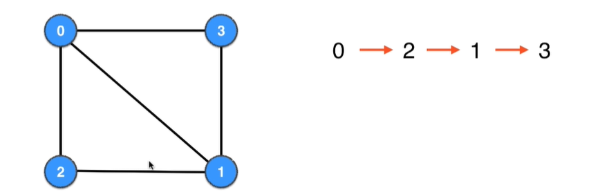
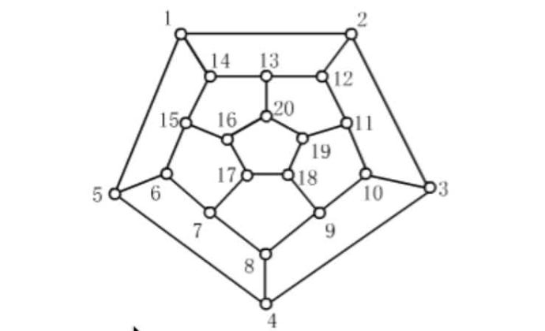

# 第09章 哈密尔顿问题和路径压缩

## 9.1 哈密尔顿回路和TSP

### 路径与回路
> 哈密尔顿问题偏计算机，欧拉问题偏数学，所以**本章我们主要讲哈密尔顿回路和哈密尔顿路径**
+ 哈密尔顿回路
+ 哈密尔顿路径
+ 欧拉回路
+ 欧拉路径

### 哈密尔顿回路定义
> 从一个点出发，沿着边走，经过每个顶点恰好一次，之后再回到出发点，过程中经过的路径就叫哈密尔顿路径

关键是如下两个特点
+ 回到出发点
+ 经过每个顶点，并且每个顶点只能经过一次

### 哈密尔顿回路问题的起源
1859年年，爱尔兰数学家哈密尔顿（Hamilton）提出下列列周游世界的游戏：  
在正十二⾯面体的二十个顶点上依次标记伦敦、巴黎、莫斯科等世界著名⼤大城市，正十二⾯面体的棱表示连接这些城市的路路线。试问能否在图中做一次旅⾏行行，从顶点到顶点，沿着边⾏行行⾛走，经过每个城市恰好一次之后再回到出发点。这就是著名的哈密尔顿问题
  
1859年年，爱尔兰数学家哈密尔顿（Hamilton）提出下列列周游世界的游戏。  
一个半世纪过去了了，这个问题即⼀一个图是否为哈密尔顿图的判定问题⾄至今悬⽽而未决。数学上：找不不到充分必要条件

### 哈密尔顿回路问题的变种：旅行推销员问题(Travelling Salesman Problem, **TSP**)
> 给定⼀一系列列城市和每对城市之间的距离，求解访问每一座城市⼀次并回到起始城市的**最短**回路。

+ 带权图，完全图
+ NP难问题(即还`没有多项式级别的算法，只有指数级别的算法`来解决这类问题)

## 9.2 求解哈密尔顿回路的算法

### 暴力求解
> 使用排列组合列出所有的顶点组合，遍历所有组合，看能不能找到符合条件的哈密尔顿路径

### 回溯法：正规解法，比暴力求解性能高一些

> 回溯算法也叫试探法，它是一种系统地搜索问题的解的方法。回溯算法的基本思想是：从一条路往前走，能进则进，不能进则退回来，换一条路再试。用回溯算法解决问题的一般步骤为：
+ 1、定义一个解空间，它包含问题的解
+ 2、利用适于搜索的方法组织解空间
+ 3、利用深度优先法搜索解空间。
+ 4、利用限界函数避免移动到不可能产生解的子空间。
问题的解空间通常是在搜索问题的解的过程中动态产生的，这是回溯算法的一个重要特性

### 下面以下图下图为例说明下回溯法：
> 

注意如下事项：
+ 1.邻接点是TreeSet，所以遍历邻接点是按序号从小到大访问
+ 2.发现某个回路执行完后还有节点没访问，则当前回路不是哈密尔顿回路
+ 3.在2后要进行回退，回退过程中需要把原来访问的节点设置为未访问
+ 4.哈密尔顿回路**不允许经过一次顶点两次**，所以一旦发现某个顶点的邻接点已经全部被访问，但是图中仍有顶点没被访问，则说明需要回退

详细遍历过程如下：
+ 1.访问0并设置`visited[0]=true`，0的邻接点有1、2、3，1的序号最小，所以下一个访问1
+ 2.访问1并设置`visited[1]=true`，1的邻接点有0、2、3，0已经被访问，2和3中2较小，所以下一个访问2
+ 3.访问2并设置`visited[2]=true`，2的邻接点有1、2，都已经被访问，无法再继续遍历，但是图中顶点3仍然未被遍历，所以需要回退到1

+ 4.回退到1并设置`visited[2]=false`，接着访问1剩下的邻接点3
+ 5.访问3并设置`visited[3]=true`，3的邻接点有0和1，都已经被访问，无法再继续遍历，但是图中顶点2仍然未被访问，所以需要回退到1
+ 6.回退到1并设置`visited[3]=false`，1的邻接点都已经证明走不通，接着回退到0
+ 7.回退到0并设置`visited[1]=false`，0的邻接点1证明走不通，这次走邻接点2

+ 8.访问2并设置`visited[2]=true`，2的邻接点有0、1，0是父节点已经被访问，所以下面访问1
+ 9.访问1并设置`visited[1]=true`，1的邻接点有0、2、3，0和2都是祖先节点已经被访问，所以下面访问节点3

+ 10.访问3并设置`visited[3]=true`，此发现3已经和0是邻接点而且图中的点都已经被访问，所以0-2-1-3-0就是哈密尔顿回环

注意：回溯时选取一个定点开始就行，不用试遍所有的顶点，因为存在哈密尔顿回路的话，任何一个顶点开始回溯都是可以的;不存在哈密尔顿回路地话，任何一个顶点开始都是找不到回路地

## 9.3 求哈密尔顿回路算法(回溯)的实现

+ [实现代码](src/main/java/Chapter09HamiltonLoop/Section1to4HamiltonLoop/GraphDFSHamiltonLoop.java)
+ [测试代码](src/main/java/Chapter09HamiltonLoop/Section1to4HamiltonLoop/Main.java)

graph2.txt的示意图如下，注意此图中回路是从下标1开始，我们自己计算地结果是从0开始

## 9.4 求哈密尔顿回路算法(回溯)的改进
> allVisited()方法在所有能到起始点的路径上都会执行一遍，比较损耗性能，我们改成剩余没被访问的顶点数left，未被访问顶点数等于0说明树遍历完毕

+ [改进之处](https://gitee.com/lsgwr/algorithms/commit/2224b2bdaeafff85f1924740ec7010ee3053edf6?view=parallel)

## 9.5 哈密尔顿路径
> 首先明确所谓的哈密尔顿路径和哈密尔顿回路两个概念。

| 比较       | 定义                                                                                     | 代码注意地地方                                                                                                                                                                    |
| ------------ | ------------------------------------------------------------------------------------------ | ---------------------------------------------------------------------------------------------------------------------------------------------------------------------------------------- |
| **哈密尔顿路径** | 由一个起点到达一个终点，经过且只经过图的**每个节点**`一次`的路径，起点和终点是不是同一个点都行 | 同样一张图，从有的点出发，就存在哈密尔顿路径，从另一个点出发，就不存在哈密尔顿路径。所以，我们在算法设计中，**构造函数需要用户显式地传入起始点** |
| **哈密尔顿回路** | 是一个闭合的哈密尔顿路径，即：起点和终点是同一个点       | 求哈密尔顿回路，选取不同的起始点对结果无影响，如果存在回路，那么图所有的点都是回路上的点，选任何一个顶点进行DFS回路检测效果都是一样的，所以在**构造函数里随便传入一个起始点即可**，一般选0 |

