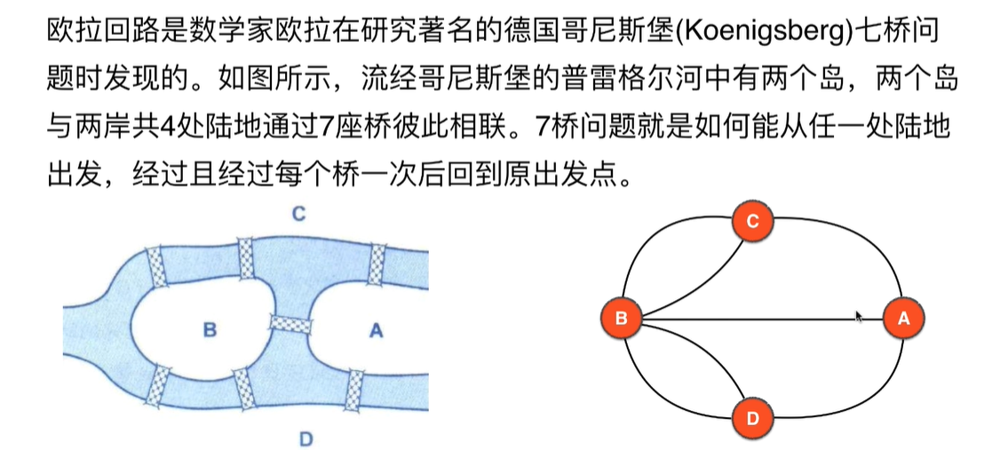
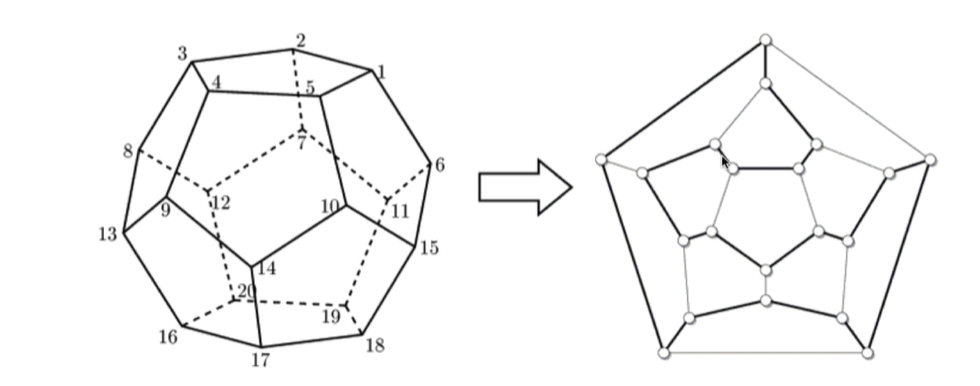
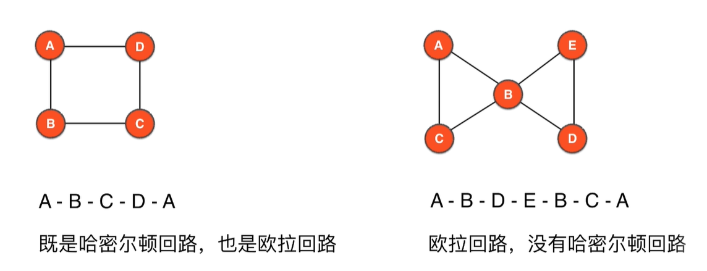
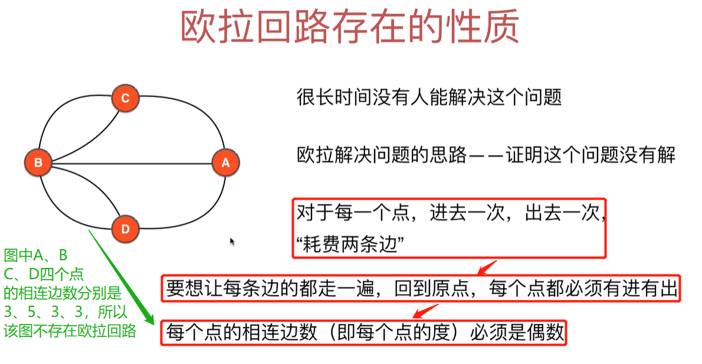
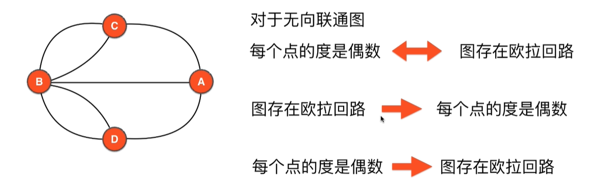
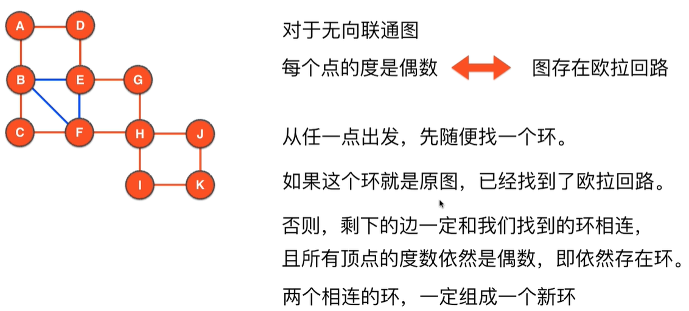

# 第10章 欧拉回路和欧拉路径

## 10.1 欧拉回路

### 欧拉回路的起源


### 欧拉回路与哈密尔顿回路的区别
> 经过所有顶点的回路不一定经过所有边。即哈密尔顿回路不一定是欧拉回路
+ 哈密尔顿回路：从一个点出发，沿着边行走，经过`每个顶点`恰好一次，之后再回到出发点
+ 欧拉回路：    从一个点出发，沿着边行走，经过`每条边`  恰好一次，之后再回到出发点

### 有哈密尔顿回路不一定有欧拉回路
> 如下图右侧的图中，所有的实现组成了哈密尔顿回路，但是并没有经过所有边，即不是欧拉回路


### 有欧拉回路不一定有哈密尔顿回路
> 欧拉回路要求每条边只能遍历一次，但是每个点可以遍历多次


## 10.2 欧拉回路的存在性及证明

### 欧拉回路存在的性质


### 欧拉回路存在的充要条件
> 注意以下几个条件
+ 无向
+ 联通
+ 每个点的度都是偶数


### 证明：图中每个点的度(临边数)是偶数--->图存在欧拉回路


### 最终定论
对于无向联通图，如果每个点的度是偶数，则图中存在欧拉回路，反过来同样成立

## 10.3 实现`欧拉回路存在性判断`的代码
> 见 [实现代码](src/main/java/Chapter10EulerLoopAndEulerPath/EulerLoop.java#L25)
```java
/**
 * 判断图中是否有欧拉回路
 */
public boolean hasEulerLoop() {
    // 1.检测联通性
    GraphDFS4ConnectedComponents cc = new GraphDFS4ConnectedComponents(graph);
    if (cc.getConnectedComponentCount()>1){
        // 多于一个联通分量肯定就不包含欧拉回路了
        return false;
    }
    // 2.所有的点的度必须都是偶数
    for (int v = 0; v < graph.V(); v++) {
        if (graph.degree(v)%2==1){
            // 如果有一个顶点的度是奇数，直接返回false
            return false;
        }
    }
    return true;
}
```

## 10.4 求解欧拉回路的3个算法

+ 回溯法：指数级时间复杂度，不可用
+ Fleury算法：基于贪心算法。时间复杂度是多项式级`O((V+E)^2)`近似为`O(E^2)`
  + 有多条边的时候，不走桥
  + 对每一个邻边，判断一下是否是`桥`(桥的查找可以参考第8章)
  + 不能预处理哪些是桥，只能每到一个点再进行判断邻边是否石桥，因为Fleury算法会动态删除边
+ Hierholzer算法：时间复杂度是`O(V+E)`近似等于`O(E)`

## 10.5 Hierholzer算法模拟
> 随便从图中找一个环，并把环中的边删除，如果剩下的边可以组成环并且和删掉的环有交点，则把这两个环加起来就是欧拉路径。遇到没有临边的点就把这个点加入到最终的欧拉回路中
