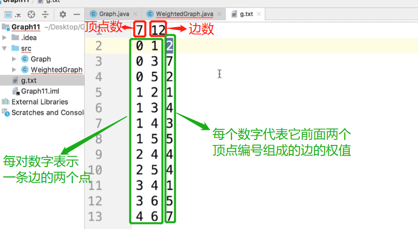
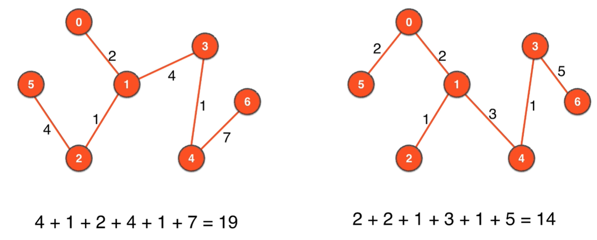
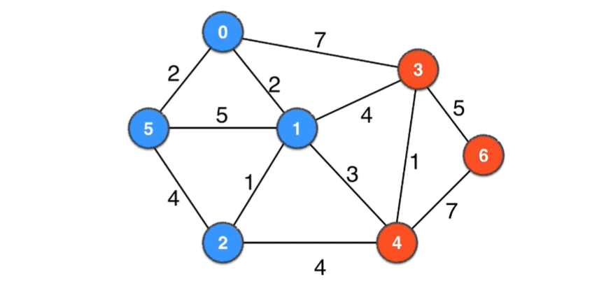
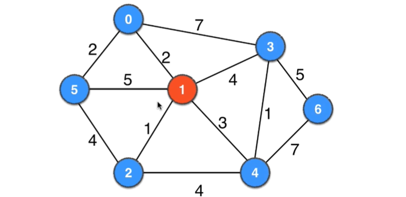
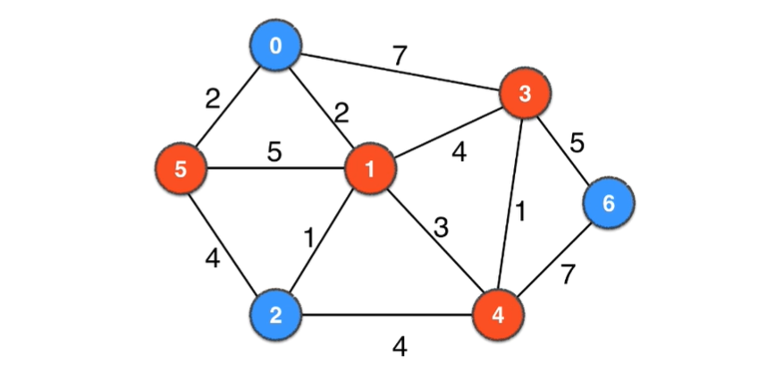

# 第11章 无向有权图之最小生成树问题
> 前10章我们讲解地都是无向无权图，本章我们将讲解无向有权图，以及无向有权图的经典问题：最小生成树问题(MST:Minimum Spanning Tree)

## 11.1~11.2 无向有权图的实现
> 主要是用TreeMap代替了无向无权图的TreeSet
### 本节用到的图

上面的graph.txt对应的图如下：

### 最终的代码
+ [无向带权图的基本表示](src/main/java/Chapter11WeightedGraphAndMinimumSpanningTree/Section1To2WeightedGraph/WeightedGraph.java)
+ [读取无向带权图](src/main/java/Chapter11WeightedGraphAndMinimumSpanningTree/Section1To2WeightedGraph/ReadWeightedGraph.java)
+ [测试类](src/main/java/Chapter11WeightedGraphAndMinimumSpanningTree/Section1To2WeightedGraph/Main.java)

## 11.3 最小生成树和Kruskal算法

### 什么是生成树
> 用n-1条边把含有n个顶点的图连接起来就形成了图的生成树,一个图一般都有很多个不同的生成树

  
的两个生成树如下：

### 什么是最小生成树
> 在有权图中，不同的n-1条边形成的不同生成树其权总和一般也就不同，权值总和最小的就叫最小生成树

### 最小生成树的用途
+ 布线设计
+ 网络设计
+ 电路设计
+ 保证图联通且费用最低

### 求最小生成树的思想
> 把所有的边进行排序，基于贪心思想使用权值小的边，一旦选到的边使得图中有环就舍弃这条边，如此下去一直到选够n-1条边，这n-1条边组成的生成树就是最小生成树

上面的过程就是求最小生成树的Kruskal算法

## 11.4 Kruskal算法正确性的理论保证：切分定理

### 什么是切分
把图中的顶点分为两部分，就称为一个切分
如下面几个图都不同的颜色均组成一个切分

   

  

