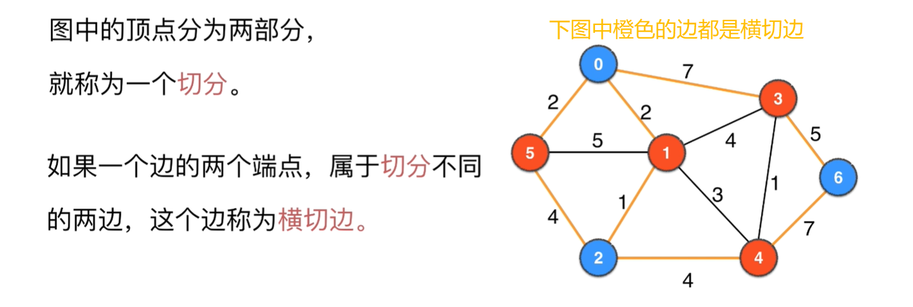
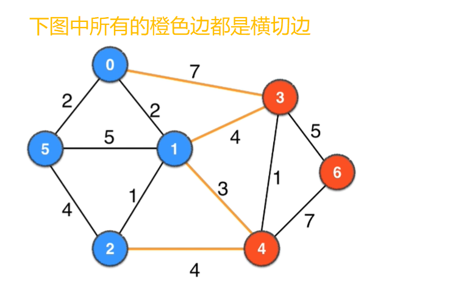
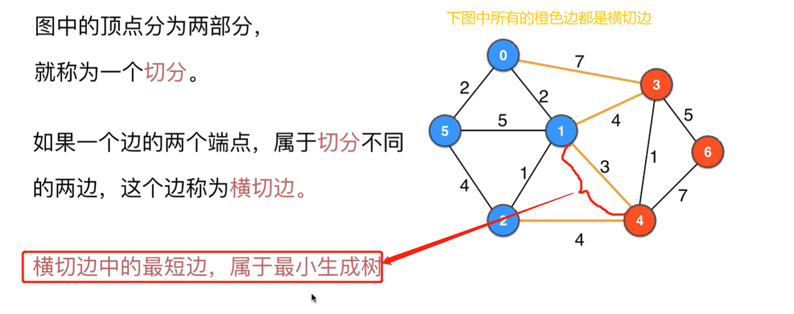
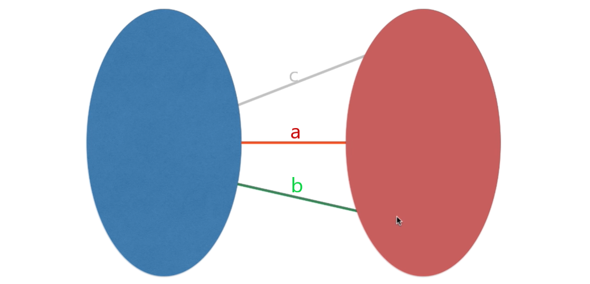
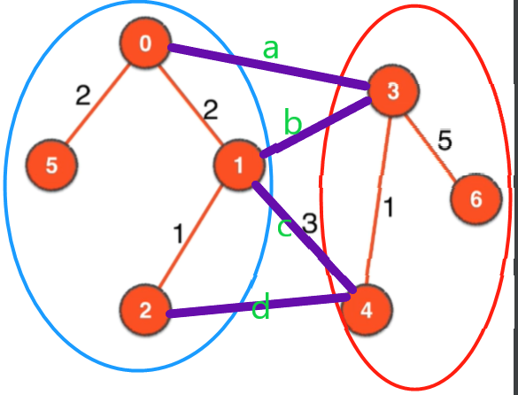
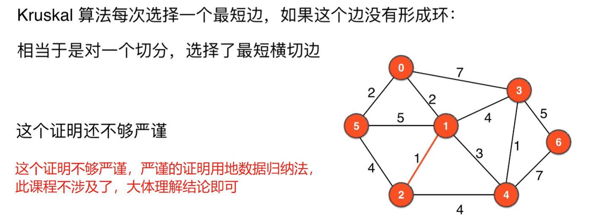
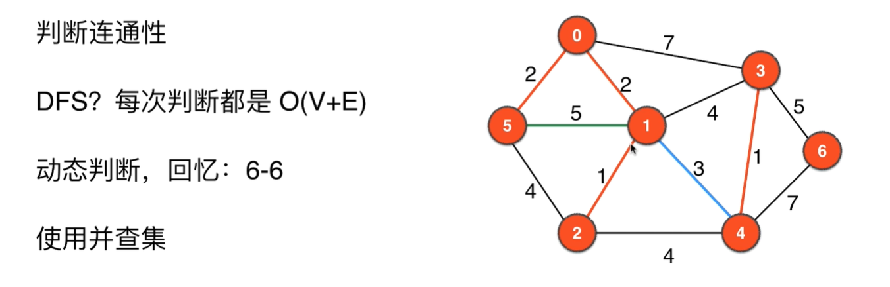
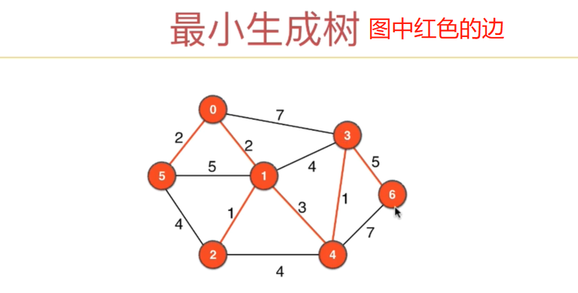

# 第11章 无向有权图之最小生成树问题
> 前10章我们讲解地都是无向无权图，本章我们将讲解无向有权图，以及无向有权图的经典问题：最小生成树问题(MST:Minimum Spanning Tree)

## 11.1~11.2 无向有权图的实现
> 主要是用TreeMap代替了无向无权图的TreeSet
### 本节用到的图

上面的graph.txt对应的图如下：

### 最终的代码
+ [无向带权图的基本表示](src/main/java/Chapter11WeightedGraphAndMinimumSpanningTree/Section1To2WeightedGraph/WeightedGraph.java)
+ [读取无向带权图](src/main/java/Chapter11WeightedGraphAndMinimumSpanningTree/Section1To2WeightedGraph/ReadWeightedGraph.java)
+ [测试类](src/main/java/Chapter11WeightedGraphAndMinimumSpanningTree/Section1To2WeightedGraph/Main.java)

## 11.3 最小生成树和Kruskal算法

### 什么是生成树
> 用n-1条边把含有n个顶点的图连接起来就形成了图的生成树,一个图一般都有很多个不同的生成树

  
的两个生成树如下：

### 什么是最小生成树
> 在有权图中，不同的n-1条边形成的不同生成树其权总和一般也就不同，权值总和最小的就叫最小生成树

### 最小生成树的用途
+ 布线设计
+ 网络设计
+ 电路设计
+ 保证图联通且费用最低

### 求最小生成树的思想
> 把所有的边进行排序，基于贪心思想使用权值小的边，一旦选到的边使得图中有环就舍弃这条边，如此下去一直到选够n-1条边，这n-1条边组成的生成树就是最小生成树

上面的过程就是求最小生成树的Kruskal算法

## 11.4 Kruskal算法正确性的理论保证：切分定理

### 切分
> 把图中的顶点分为两部分，就称为一个`切分`

如下面几个图都不同的颜色均组成一个切分

   

  

### 横切边
> 如果一个边的两个端点，属于`切分`不同的两边，则这个边被称为`横切边`

下面是图的一种切分的横切边

下面是图的另一个切分的横切边：

### 切分定理
> 横切边中的最短边，一定属于最小生成树

反证法证明：如下图，a、b、c是蓝红切分的所有横切边，红蓝里面的顶点和边加上a组成了最小生成树，a是a、b、c中权值最小的，假设a不是最小生成树的一条边，那么b、c中的一条可以代替a称为最小生成树的一部分(必须从横切边中选取一条才能使得蓝红两部分是联通地)，但是b、c中任何一条加入，新的生成树的权值综合肯定大于替换a之前的，所以得证a一定是最小生成树的一条边

具体的例子可以见下图：

### Kruskal算法与切分定理的关系

Kruskal算法每次选择一个最短边，如果这个边没有形成环：相当于是对一个切分，选择了最短横切边

## 11.5~11.6 Kruskal算法实现

### 如何快算判断已有的边中是否有环

+ DFS 每次判断的事件复杂度都是O(V+E)，而且对动态变化的图性能不高
+ 使用并查集：事件复杂度是O(E)，而且支持动态变化的图很好。

所以我们使用并查集来实现已有边中是否有环的快速判断，思想如下：
之前已经加入地边都放到到一个并查集中，一个联通分量内的两个点在并查集中是true，如果我们要加入地边的两个端点在并查集中为true，那么这条边加入一定会生成环。
简而言之，kruskal算法新加入的边的两个顶点在并查集中必须为false，否则不能加入

并查集相关的只是可以参考
+ [数据结构精讲Java版 第11章 并查集](https://coding.imooc.com/learn/list/207.html)
+ [并查集代码实现参考](../Part2Basic/src/main/java/Chapter11UnionFind/UnionFind.java)

### Kruskal算法实现
+ [算法实现](src/main/java/Chapter11WeightedGraphAndMinimumSpanningTree/Section3to5Kruskal/MinimumSpanningTreeKruskal.java)
+ [测试代码](src/main/java/Chapter11WeightedGraphAndMinimumSpanningTree/Section3to5Kruskal/Main.java)
> 测试图如下：

### Kruskal求最小生成的时间复杂度是`O(ElogE)`级别的
> 时间开销主要是在`Collections.sort(edges);`上

