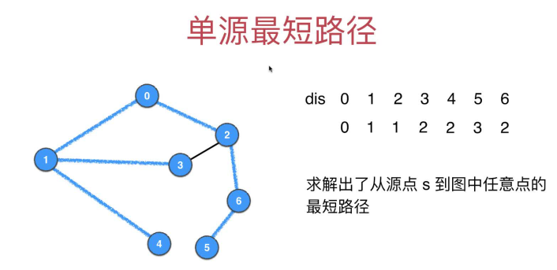
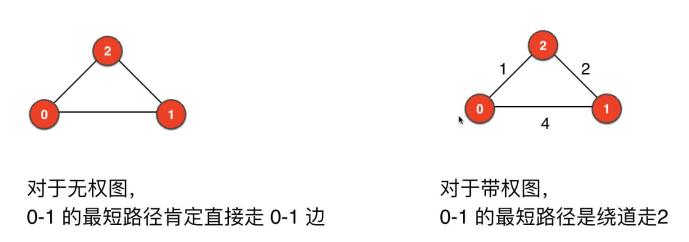
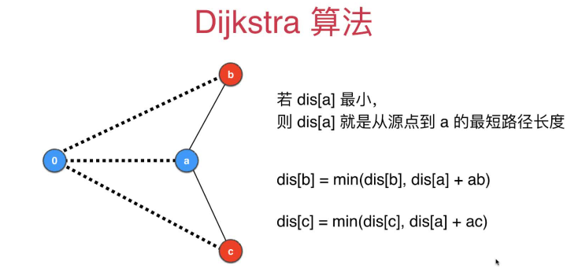
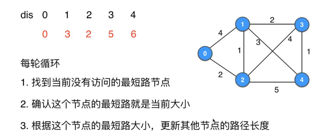
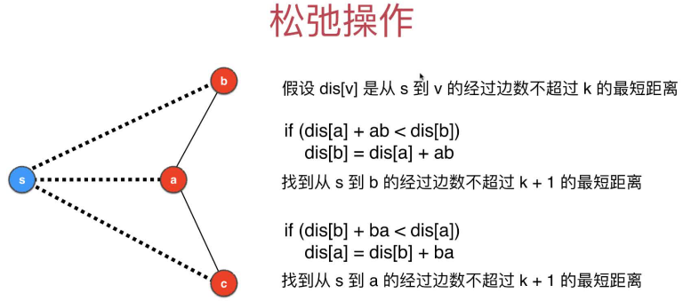
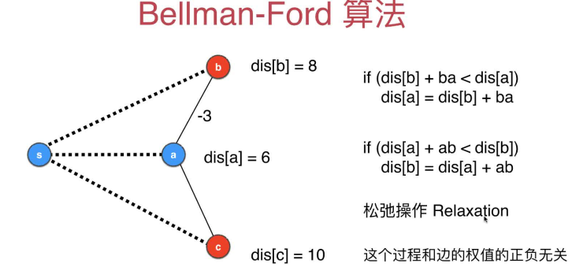
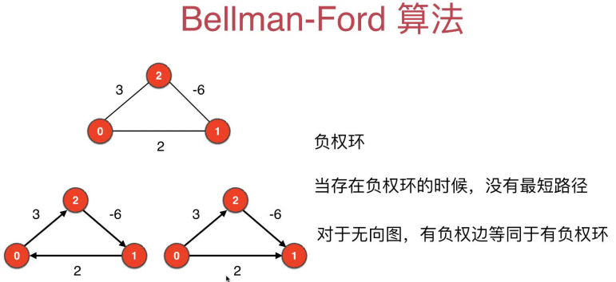
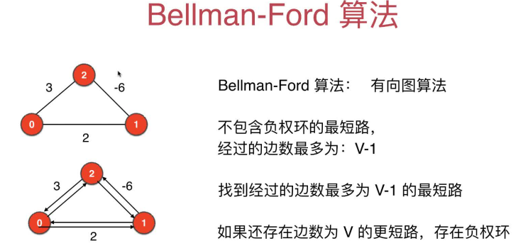

# 第12章 无向有权图之最短路径问题

## 12.1 有权图的最短路径问题

### 什么是有权图的最短路径问题？
> 从图中的一个点到另一个点的路径中，权值总和最小的路径就是最短路径

### 最短路径的应用场景
+ 高德导航两个地点之间的路线，一般都是规划地最短路径
+ 互联网中对数据进行路由，一般都是选最优的路径进行数据传送

### 单源最短路径问题

### 无权图和带权图的最短路径的区别

### 求带权图的最短路径的算法
+ Dijkstra算法：不能处理负权边，处理负权边会使得复杂度上升
  > 实际大部分应用是不涉及负权边地，所以Dijkstra算法是够用地
+ Bellman-Ford算法：可以处理负权边
+ Floyd算法

## 12.2 Dijkstra算法的原理和模拟

+ 1.根据上一个确定了到起始点最小值的节点，获取其到其所有还未被访问的邻接点路径，临时更新到表中(比原来地更小就更新，大于等于地话就不变)
+ 2.找到还没确定到起始点最小值的节点中距离值最小地,确定这个节点的当前大小就是最小距离，更新到表中
  > 这条是Dijkstra算法的核心

下面以下图为例，`选择0作为起始点`，模拟Dijkstra算法的详细过程，获取0到其他各个点的最短路径，
+ 确定了最小路径的就加粗
+ 不确定地就用斜体表示

### 1.初始化0到各个顶点的距离均为`+∞`，Java中为`Integer.MAX_VALUE`
| 顶点标号 | 0  | 1  | 2  | 3  | 4  |
| -------- | -- | -- | -- | -- | -- |
| 最小距离 | +∞ | +∞ | +∞ | +∞ | +∞ |
### 2.遍历从0开始
+ 0到起始点的距离为0，**0到0的最小值确认为0**，直接设置到表中  
  | 顶点标号 | 0  | 1  | 2  | 3  | 4  |
  | -------- | -- | -- | -- | -- | -- |
  | 最小距离 | **0** | +∞ | +∞ | +∞ | +∞ |

### 3.访问0的`未确定到起始点最小距离值`的邻接点
+ 0的`未确定到起始点最小距离值`的邻接点1、2到0的距离分别为2和4，还不确定是到0的最小距离值，先把这两个临时最小距离值更新到表中
  | 顶点标号 | 0  | 1  | 2  | 3  | 4  |
  | -------- | -- | -- | -- | -- | -- |
  | 最小距离 | **0** | *4* | *2* | +∞ | +∞ |

+ `不确定到起始点最小距离值的顶点`1、2、3、4中，顶点2到起始点的0值最小，**所以0到2的最小值为2**，更新到表中 **这行是Dijkstra算法的核心**
  > 因为0到2以外的点的距离本来就都比2要大，又因为Dijkstra只考虑无负权边的图，所以经由其他顶点再到2的距离肯定会更大，故0到2的最短举例肯定是2

  | 顶点标号 | 0  | 1  | 2  | 3  | 4  |
  | -------- | -- | -- | -- | -- | -- |
  | 最小距离 | **0** | *4* | **2** | +∞ | +∞ |

### 4.访问2的`未确定到起始点最短距离值`的邻接点
+ 2的`未确定到起始点最小距离值`的邻接点1、3、4到2的距离分别为1、4、3，下面根据这些距离值更新对应的点到起始点的最小距离值(临时的，是不是最终的最小距离值等待后面确定)
  + `0到2的最小距离为2`+`2到1的距离为1`=3 < `上面表中0到1的距离为4`，所以更新0到1的临时最小距离为3
  + `0到2的最小距离为2`+`2到3的距离为4`=6 < `上面表中0到3的距离为∞`，所以更新0到3的临时最小距离为6
  + `0到2的最小距离为2`+`2到4的距离为5`=7 < `上面表中0到4的距离为∞`，所以更新0到4的临时最小距离为7
    | 顶点标号 | 0  | 1  | 2  | 3  | 4  |
    | -------- | -- | -- | -- | -- | -- |
    | 最小距离 | **0** | *3* | **2** | *6* | *7* |

+ `不确定到起始点最小距离值的顶点`1、3、4中，顶点1到起始点0的值3最小，**所以0到1的最小值确定为3**，更新到表中 **这行是Dijkstra算法的核心**
  > 因为0到1以外的点的距离本来就都比2要大(不考虑已经确认最小距离的顶点0和2，因为0到1就是从0->2->1过来地)，又因为Dijkstra只考虑无负权边的图，所以经由其他顶点再到1的距离肯定会更大，故0到1的最短举例肯定是3

  | 顶点标号 | 0  | 1  | 2  | 3  | 4  |
  | -------- | -- | -- | -- | -- | -- |
  | 最小距离 | **0** | **3** | **2** | *6* | *7* |

### 5.访问1的`未确定到起始点最小距离值`的邻接点
+ 1的`未确定到起始点最小距离值`的邻接点3、4到1的距离分别为2、3，下面根据这些距离值更新对应的点到起始点的最小距离值(临时的，是不是最终的最小距离值等待后面确定)
  + `0到1的最小距离为3`+`1到3的距离为2`=5 < `上面表中0到3的距离为6`，所以更新0到3的临时最小距离为5
  + `0到1的最小距离为3`+`1到4的距离为3`=6 < `上面表中0到4的距离为7`，所以更新0到4的临时最小距离为6
    | 顶点标号 | 0  | 1  | 2  | 3  | 4  |
    | -------- | -- | -- | -- | -- | -- |
    | 最小距离 | **0** | **3** | **2** | *5* | *6* |

+ `不确定到起始点最小距离值的顶点`3、4中，顶点3到起始点的0值最小，**所以0到3的最小值确定为5**，更新到表中 **这行是Dijkstra算法的核心**
  > 因为0到3以外的点的距离本来就都比5要大(不考虑已经确认最小距离的顶点0、2、1，因为0到3就是从0->2->1->3过来地)，又因为Dijkstra只考虑无负权边的图，所以经由其他顶点再到3的距离肯定会更大，故0到3的最短举例肯定是5

  | 顶点标号 | 0  | 1  | 2  | 3  | 4  |
  | -------- | -- | -- | -- | -- | -- |
  | 最小距离 | **0** | **3** | **2** | **5** | *6* |

### 6.访问3的`未确定到起始点最小距离值`的邻接点
+ 3的`未确定到起始点最小距离值的邻接点4到1的距离分别为1，下面根据这些距离值更新对应的点到起始点的最小距离值(临时的，是不是最终的最小距离值等待后面确定)
  + `0到3的最小距离为5`+`3到4的距离为1`=6 = `上面表中0到4的距离为6`，所以不用更新0到3的临时最小距离
    | 顶点标号 | 0  | 1  | 2  | 3  | 4  |
    | -------- | -- | -- | -- | -- | -- |
    | 最小距离 | **0** | **3** | **2** | **5** | *6* |

+ `不确定到起始点最小路径值的顶点`只剩4了，**所以0到4的最小值确定为6**，更新到表中 **这行是Dijkstra算法的核心**
  > 因为0到6以外的点的已经没了(不考虑已经确认最小距离的顶点0、2、1、3，因为0到6就是从0->2->1->3->6过来地)，故0到6的最小距离值为6
  
  | 顶点标号 | 0  | 1  | 2  | 3  | 4  |
  | -------- | -- | -- | -- | -- | -- |
  | 最小距离 | **0** | **3** | **2** | **5** | **6** |

## 12.3 Dijkstra算法的基本实现
> 时间复杂度：O(V^2)，不推荐使用，仅用于理解上一节的算法模拟过程
+ [代码实现](src/main/java/Chapter12WeightedGraphAndShortestPath/Section1to3Dijkstra/ShortestPathDijkstra.java)
+ [测试代码](src/main/java/Chapter12WeightedGraphAndShortestPath/Section4DijkstraOptimize/Main.java)

## 12.4 Dijkstra算法的优化：基于优先队列改进查找最小距离值
> 时间复杂度：O(ElogE)，推荐正式的生产环境中使用这个算法
+ [代码实现](src/main/java/Chapter12WeightedGraphAndShortestPath/Section4DijkstraOptimize/ShortestPathDijkstra.java#L98)
+ [测试代码](src/main/java/Chapter12WeightedGraphAndShortestPath/Section4DijkstraOptimize/Main.java)

## 12.5 更多关于Dijkstra的讨论

### 实现记录路径的功能
> 类似DFS那里，使用pre数组记录每个顶点的上一个访问节点，获取路径的使用逐个往前取值放入到list中即可
+ [实现代码](src/main/java/Chapter12WeightedGraphAndShortestPath/Section4DijkstraOptimize/ShortestPathDijkstra.java#L124)
+ [参考提交记录](https://gitee.com/lsgwr/algorithms/commit/eace18d4213d1cb7e44cb1ab376d4d6eed7d3214?view=parallel)

### 优化到ElogV级别
> 可以基于索引堆来实现，参考[算法与数据结构c++版--第4章：堆和堆排序](https://coding.imooc.com/learn/list/71.html)

### 更多堆相关的问题
+ **只关注从start到定点v的最短路径**：一旦findShortest[v]=true，就可以提前退出了
+ **求所有点对的最短路径？**：依次循环选取不同的顶点作为Dijkstra算法的起始点即可，时间复杂度`O(V*ElogE)`
+ **溢出问题**：路径的权值不能超过`Integer.MAX_VALUE`，可以改成长整型，或者改成是否找到最小距离值的标记位
+ **Dijkstra算法不能处理负权边**：为了能处理负权边，引入了接下来的Bellman-Ford算法.

## 12.6 可以处理含负权边的图的求最短路径的算法：Bellman-Ford算法

### 松弛操作
> 加上个负权边(多经过一条边,k-->k+1)比原来还小，就叫松弛操作

+ 松弛操作定义
  > 
+ 松弛操作举例
  > 

### Bellman-Floyd算法的执行过程概述
+ 初始化distances[start]=0，其余distance值为`+∞`
+ 对所有的边进行第1次松弛操作,则求出了到所有点`经过的边数最多为1`的最短路
+ 对所有的边进行第2次松弛操作,则求出了到所有点`经过的边数最多为2`的最短路
+ 对所有的边进行第3次松弛操作,则求出了到所有点`经过的边数最多为3`的最短路
......
+ 对所有的边进行第v-1次松弛操作,则求出了到所有点`经过的边数最多为v-1`的最短路
+ 如果对所有边再进行一次松弛操作，还能更新最小路径的值数组distances，则说明图中包含负权环

经过上面的操作，就得到了所有点到起始点的最短路径。

## 12.7 Bellman-Ford算法的问题：负权环
> 负权环即环上的所有边的权值之和为负数，绕着负权环不停转圈路径便会向着负无穷的趋势一直减少，是不合理地，所以说

+ 当图中存在负权环时，没有最短路径
+ 对于无向图来说，**有负权边等同于有负权环**，因为可以在一条边上来来回回，所以Bellman-Ford算法指针地是经过的边数"最多为v-1"的最短路

总结：
> 一共要进行v轮松弛操作，其中第v轮用于检测负权环
+ 少于v-1轮的松弛操作也可能得到最小路径值
+ 做v-1轮操作一定可以得到最小路径值
+ 如果多进行一轮松弛操作(即第v轮)，仍可以得到更小的距离值，则图中存在负权环

## 12.8 Bellman-Ford算法实现
+ [实现代码](src/main/java/Chapter12WeightedGraphAndShortestPath/Section6to8BellmanFord/ShortestPathBellmanFord.java)
+ [测试代码](src/main/java/Chapter12WeightedGraphAndShortestPath/Section6to8BellmanFord/Main.java)

