# 第14章 网络流和最大流问题

## 14.1 网络流和最大流问题阐述
### 网络流基本概念
> 网络流图中，从源点出发，在满足每条边容量限制的条件下，汇点t最多能接收多少流量
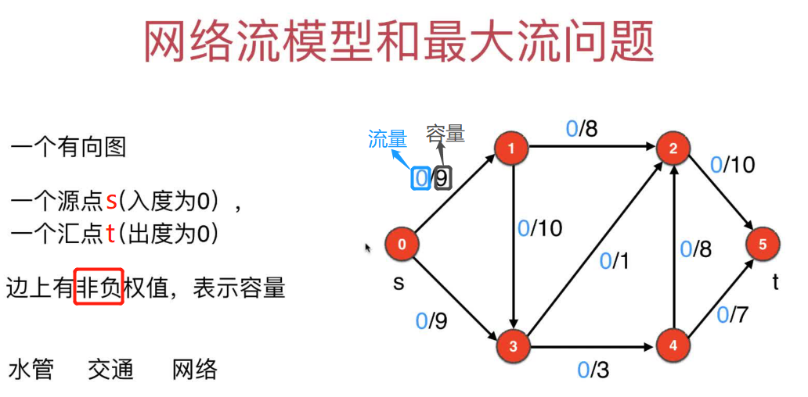
+ s:source
+ t:target
### 网络流需要满足的限制
+ 容量限制
+ 平衡限制：除了源点s和汇点t，对于每一个点，流入量等于流出量
+ 从源点s流出的流量，一定等于最终汇入汇点t的流量
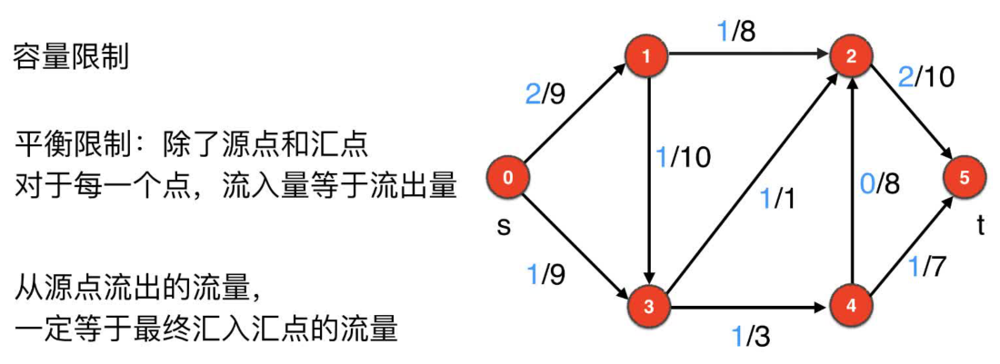

### 引出最大流问题
> 网络流图中，从源点s出发，在满足每条边容量限制、平衡限制的条件下，汇点t最多能接收多少流量？

## 14.2 Ford-Fulkerson思想
> Ford-Fulkerson思想的核心是当路径上的容量限制小于流量时，把流量改成负值加到图上，这个加上的流量叫残量，在残量图中不断找增广路径，直到没有增广路径为止~

### 手动求最大流的风险
+ 1.初始化网络流图：建立一个有向图，标注上流量(蓝色字体)和容量(黑色字体)
  > 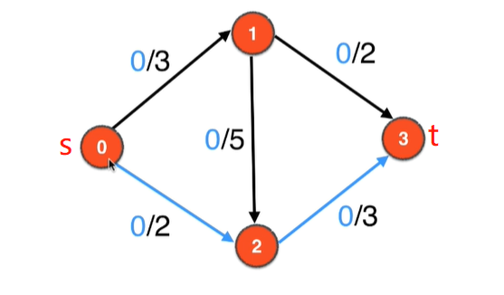
+ 2.手动模拟不难得出该图的最大流应该是5，路线如下图所示：
  > 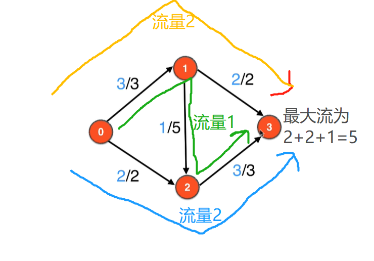
+ 3.手动找最大流方法的思想：随便找一条s到t的路径，只要路径还没满就接着找~直到无法再继续往t汇入流量。
  > 这个思路是有问题的，前面选择的路径不对很可能得不到正确的最大流.如下图，如果上来就走0->1->2->3的路线，路线上直接传流量3，那么后续其他路径也没法走了，最终t只能得到3，显然不是最大流
  > 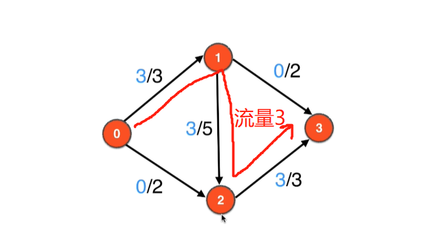
  > 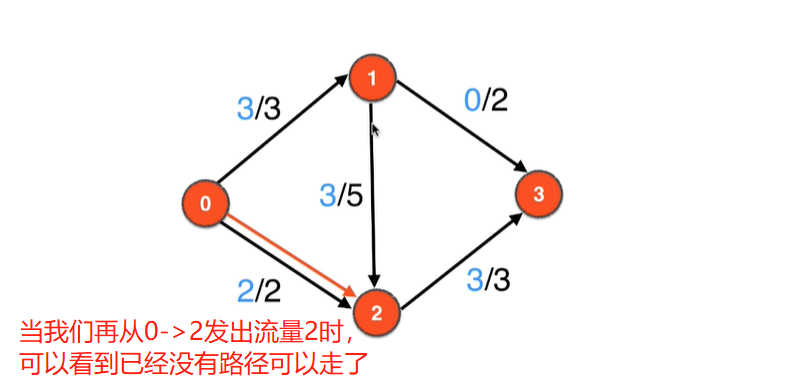
### 引入Ford-Fulkerson思想
+ 1.针对上面手动法的问题，我们可以引入`负流量和反向边`，即虚拟一条`2->1`的流量值2，和原来的3抵消，`1->2`的流量还剩1，再从1->2把流入1的2个流量流入到3，即完成了最大流5的求解。这便是Ford-Fulkerson思想
  > 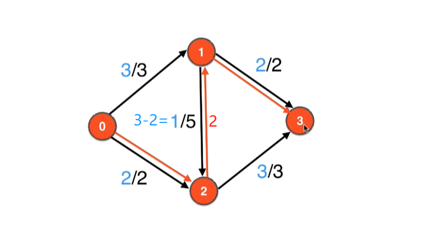
+ 2.残量图和增广路径的概念和图示
  + 增广路径：所有边的权值都大于0的图中的路径
  + 残量图：记录流量流过后，正向边权值剩余和反向边权值大小的图
  > 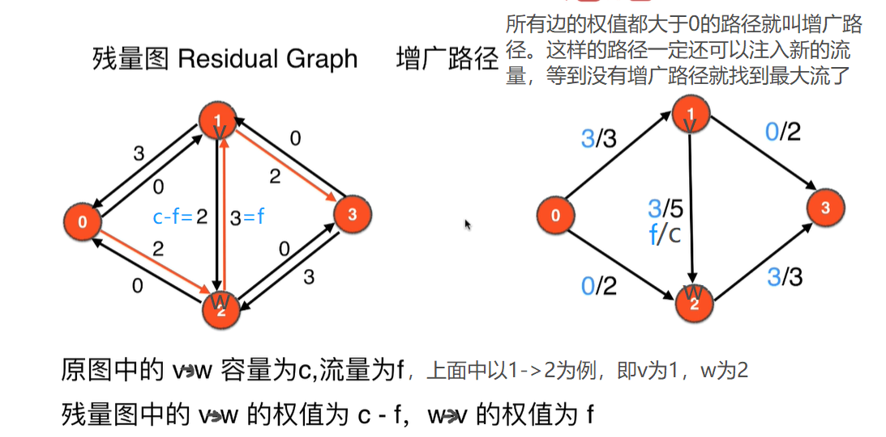
+ 3.上面描述经过理论抽象后为：在残量图中不断寻找增广路径，直到没有增广路径，汇入点的流量即为图的最大流。
  > 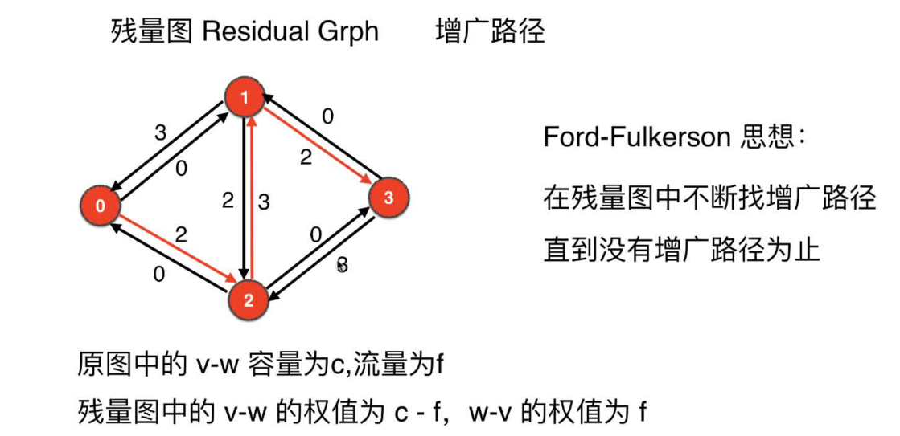

## 14.3~14.4 Edmonds-Karp算法
> 不断进行BFS寻找增广路经和更新残量图，直到找不到增广路径。最后所有增广路径的流量加起来就是最大流。注意两个事项：
+ 1.残量图中，权值为0的边不能走(不管是正向边还是反向边，反向边代表可以回流的流量，前提是正向边已经流入了流量)
+ 2.每次BFS遍历到一条增广路径后，都要重新更新残量图，然后进行下一轮的BFS，按照上一步的原则，直到找不到增广路径为止

> 下面是一个详细的用上面思路找最大流的过程，以下图为例：
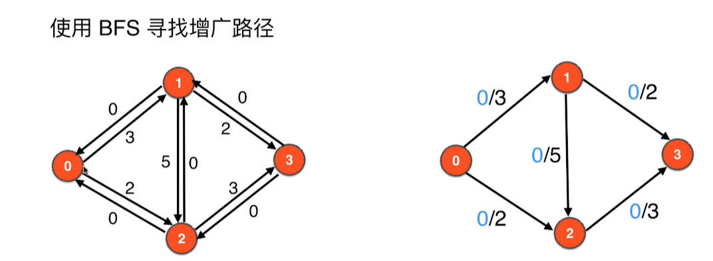
+ 1.第1遍BFS遍历，得到一条增广路径`0->1->3`，取边`0->1`和`1->3`的较小权值2，所以从0出流量2，更新残量网络后如下：
  > 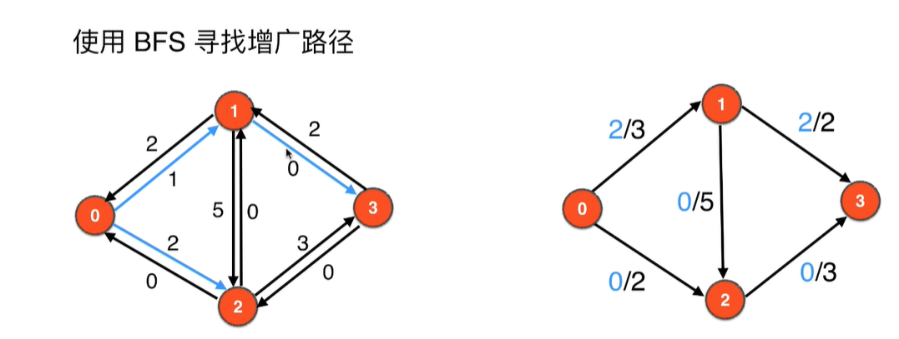
+ 2.第2遍BFS遍历，得到一条增广路径`0->2->3`，注意不能走权值为0的边`2->1`和`1->3`，取边`0->2`和`2->3`的较小权值2，所以从0出流量2到2，更新残量网络后如下：
  > 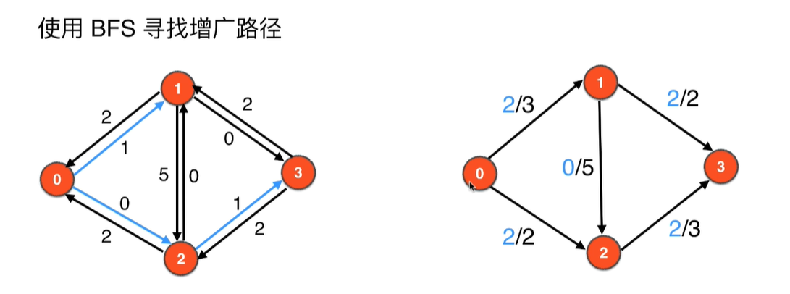
+ 3.第3遍BFS遍历，得到一条增广路径`0-1->>2->3`，注意不能走权值为0的边`0->2`和`1->3`，取边`0->1`、`1->2`和`2->3`的较小权值1，所以从0出流量1到1，更新残量网络后如下：
  > 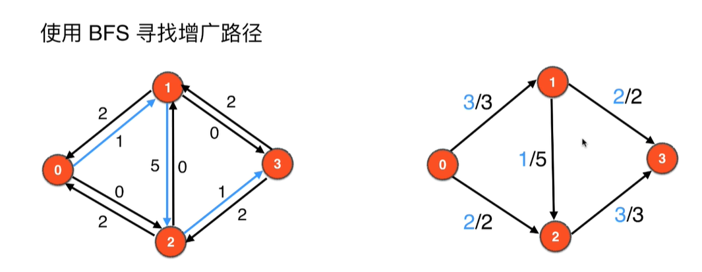
+ 4.第4边BFS遍历，0的邻接边向外的权值都已经为0，无法在进行BFS遍历，所以算法执行完毕，最大流就是汇点所有临边的入流量值`2+3=5`

### Edmonds-Karp算法实现和测试
+ [实现代码](src/main/java/Chapter14NetworkFlowsAndMaxFlows/MaxFlow.java)
+ [测试代码](src/main/java/Chapter14NetworkFlowsAndMaxFlows/Main.java)

## 14.7 网络流问题建模
### 最大流问题引入
> 参考博客：http://www.matrix67.com/blog/archives/5190 

在一场职业棒球赛中,每队要打162场比赛  
最终,所胜场次最多的队伍,为冠军  
如果有平局,则进行加赛  
在比赛过程中,如果发现一个队伍无论如何都不可能获冠,则直接淘汰  
比如A队已经获得100胜, B队获得70胜,还剩29场比赛未打， 则B队淘汰  
| Team     | 胜   | 负   | 余   | 纽约 | 巴尔的摩 | 波士顿 | 多伦多 | 底特律 |
| -------- | ---- | ---- | ---- | ---- | -------- | ------ | ------ | ------ |
| **纽约**New York     | 75   | 59   | 28   | 0    | 3        | 8      | 7      | 3      |
| **巴尔的摩**Baltimore | 71   | 63   | 28   | 3    | 0        | 2      | 7      | 4      |
| **波士顿**Boston   | 69   | 66   | 27   | 8    | 2        | 0      | 0      | 0      |
| **多伦多**Toronto   | 63   | 72   | 27   | 7    | 7        | 0      | 0      | 0      |
| **底特律**Detroit   | 49   | 86   | 27   | 3    | 4        | 0      | 0      | 0      |

问题：目前排名第五的**底特律**Detroit是否还有希望夺冠？

### 问题建模和分析
> 关键：除了底特律以外的其他队互相打完比赛之后，能否都最多76场胜利(因为底特律剩下的比赛全赢了也就49+27=76胜)？
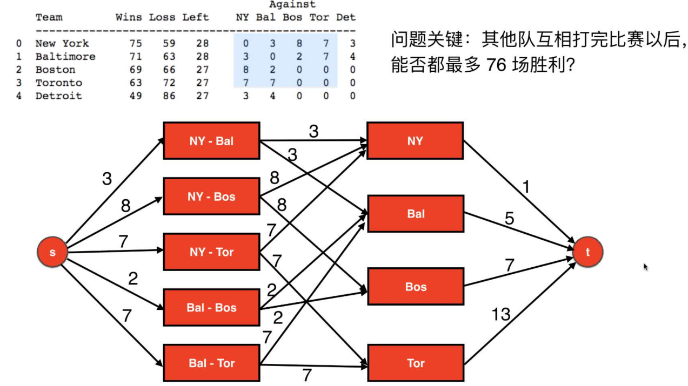
+ 源点s发出的边和权值表示指向的两个队之间的比赛，最多给输出的胜利场次;
+ 汇点汇入的权值表示是否能让底特律以外的几个队拿到76场胜利。76-75=1、76-71=5、76-69=7、76-63=13、76-49=17
+ 通过上面图的最大流如果大于27=76-49，表示底特律还有机会；如果小于27，表示底特律没机会了

提炼出图的信息为:
```txt
11 19
0 1 3
0 2 8
0 3 7
0 4 2
0 5 7
1 6 3
1 7 3
2 6 8
2 8 8
3 6 7
3 9 7
4 7 2
4 8 2
5 7 7
7 9 7
6 10 1
7 10 5
8 10 7
9 10 13
```

### 代码实现和结论
+ [实现代码](src/main/java/Chapter14NetworkFlowsAndMaxFlows/BaseBall.java)

```java
/***********************************************************
 * @Description : 最大流比赛问题之棒球比赛
 * @author      : 梁山广(Liang Shan Guang)
 * @date        : 2019/12/27 21:06
 * @email       : liangshanguang2@gmail.com
 ***********************************************************/
package Chapter14NetworkFlowsAndMaxFlows;

import Chapter11WeightedGraphAndMinimumSpanningTree.Section1To2WeightedGraph.ReadWeightedGraph;
import Chapter11WeightedGraphAndMinimumSpanningTree.Section1To2WeightedGraph.WeightedGraph;

public class BaseBall {
    public static void main(String[] args) {
        String filepath = "src/main/java/Chapter14NetworkFlowsAndMaxFlows/baseball.txt";
        WeightedGraph networkGraph = new WeightedGraph(true);
        ReadWeightedGraph.init(networkGraph, filepath);
        MaxFlow maxFlow = new MaxFlow(networkGraph, 0, 10);
        // 结果为26，表明剩下的27场比赛没法让底特律以外的队伍都<=76，所以底特律没机会夺冠了，可以被淘汰了
        System.out.println("当前网络0->10的最大流为：" + maxFlow.getMaxFlow());
    }
}
/**
 * 顶点数V = 11, 边数E = 19
 * 当前网络0->10的最大流为：26
 */
```

## 14.8 最大流算法总结

### Edmonds-Karp算法总结
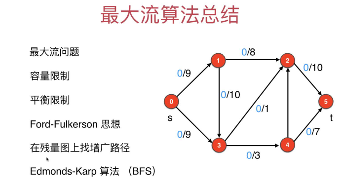

### 常见的求最大流的算法
| 算法           | 时间复杂度 |
| ---------------- | ---------- |
| Edmonds-Karp算法 | O(VE^2)    |
| Dinic算法      | O(VE^2)    |
| MPM算法        | O(V^3)     |

### 更多相关问题
+ 最小割：和最大流问题很相似
+ 网络流量
+ 分配
+ 匹配问题(下一章第15章会讲)