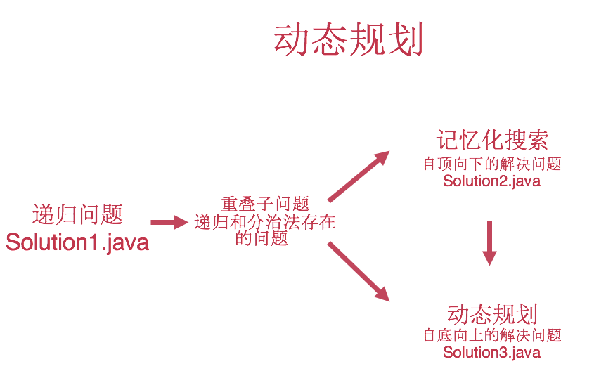
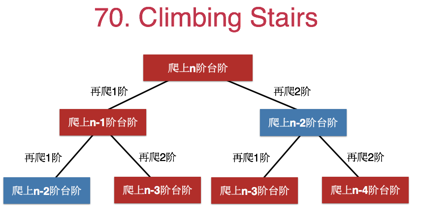
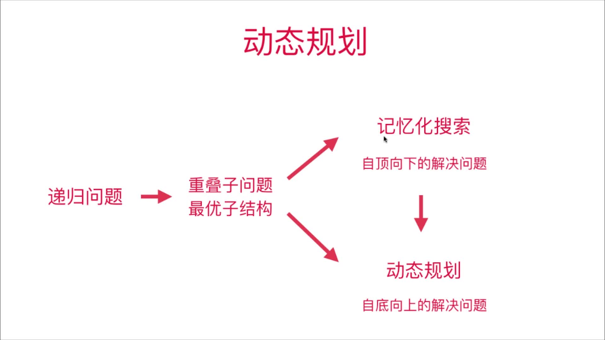

# 第9章 动态规划

## 9.1 什么是动态规划

> 以菲波那切数列求和为例，通过普通的递归-->引入记忆数组memo-->自下而上地解决问题三个步骤引出了动态递归

代码见[动态递归逐步深入](Section1Fibonacci)

### 动态规划的定义


> dynamic programming (also known as dynamic optimization) is a method for solving a complex problem by breaking it down into a collection of simpler subproblems, solving each of those subproblems just once, and storing their solutions – ideally, using a memory-based data structure.

> 将原问题拆解成若干子问题，同时保存子问题的答案，使得每个子问题只求解一次，最终获得原问题的答案。


体会其中自下而上地解决问题的思路，有点类似数学归纳法

### 递归与动态规划的联系和区别



## 9.2 第一个动态规划问题 70.Climbing Stairs


> 有一个楼梯，总共有n阶台阶。每一次，可以上一个台阶，也可以上两个台阶。问，爬上这样的一个楼梯，一共有多少不同的方法？
> 如 n = 3，可以爬上这个楼梯的方法有：[1,1,1] , [1,2] , [2,1]  , 所以答案为3

### 递归法(可以看到有重复子问题存在)


代码见[ClimbingStairs的递归求解](Section2ClimbingStairs/Solution1.java)

但是实际这个方法是存在重复子问题地，如下图蓝框所示：




类似的问题还有120号和64号问题

## 9.3 发现重叠子问题 343. 整数拆分

```text
给定一个正整数 n，将其拆分为至少两个正整数的和，并使这些整数的乘积最大化。 返回你可以获得的最大乘积。

示例 1:

输入: 2
输出: 1
解释: 2 = 1 + 1, 1 × 1 = 1。
示例 2:

输入: 10
输出: 36
解释: 10 = 3 + 3 + 4, 3 × 3 × 4 = 36。
```

### 拆分4为例，发现存在重复子问题


### 扩展搭配拆分n,重复子问题就更多了


### 经过前两节可知，可以用`记忆数组`或者`动态规划`的方法来大大提高代码效率

> 最优子结构的含义：通过求解子问题的最优解，可以获得原问题的最优解



### 代码

+ [纯递归](Section3IntegerBreak/Solution1.java)
+ [递归+记忆数组](Section3IntegerBreak/Solution2.java)
+ [动态规划实现](Section3IntegerBreak/Solution3.java)

## 9.4 状态的定义和转移 198.House Robber

```text
你是一个专业的小偷，计划偷窃沿街的房屋。每间房内都藏有一定的现金，影响你偷窃的唯一制约因素就是相邻的房屋装有相互连通的防盗系统，如果两间相邻的房屋在同一晚上被小偷闯入，系统会自动报警。

给定一个代表每个房屋存放金额的非负整数数组，计算你在不触动警报装置的情况下，能够偷窃到的最高金额。

示例 1:

输入: [1,2,3,1]
输出: 4
解释: 偷窃 1 号房屋 (金额 = 1) ，然后偷窃 3 号房屋 (金额 = 3)。
     偷窃到的最高金额 = 1 + 3 = 4 。
示例 2:

输入: [2,7,9,3,1]
输出: 12
解释: 偷窃 1 号房屋 (金额 = 2), 偷窃 3 号房屋 (金额 = 9)，接着偷窃 5 号房屋 (金额 = 1)。
     偷窃到的最高金额 = 2 + 9 + 1 = 12 。
```

### 递归过程分析如下

> 可以看到存在重复子问题


## 状态转移方程


+ f(2)表示从2~`n-1`的房子
+ f(3)表示从3~`n-1`的房子
......
+ f(n-1)表示从`n-1`~`n-1`之间的房子，实际只有一个
+ v(n-2)等效于v(n-2)+f(n)，f(n)表示n~`n-1`之间的房子，实际是没有地
+ v(n-1)等效于v(n-1)+f(n+1)，f(n)表示`n+1~`n-1`之间的房子，实际是没有地

类似的问题
+ [213. 打家劫舍 II](https://leetcode-cn.com/problems/house-robber-ii/)
+ [337. 打家劫舍 III](https://leetcode-cn.com/problems/house-robber-iii/)
+ [309. 最佳买卖股票时机含冷冻期](https://leetcode-cn.com/problems/best-time-to-buy-and-sell-stock-with-cooldown/)

## 9.5 0-1背包问题

