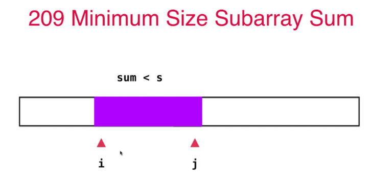

# 第3章 数组中的问题其实最常见

+ 通过基础问题，掌握写出正确算法的“秘诀”
+ 巧妙使用双索引技术，解决复杂问题
+ 对撞指针- 滑动窗口

## 3.1 从二分查找法看如何写出正确的程序

> 本节学习重点：处理边界问题！

+ 1.确定边界范围方法，先用区间表示，即明确范围的数学定义，后用代码表示；
+ 2.在循环里维护循环不变量，能保证算法的正确性，即这里的“在[l..r]的范围里寻找target”；
+ 3.重新理解一些基础算法当中的循环不变量。截图代码中：while(l<=r)、l=mid+1、r=mid-1都是在维护循环不变量“在[l..r]的范围里寻找target”。

## 3.2 写程序与调试程序

### 写程序：

+ 1、明确变量的含义，包含的范围区间
+ 2、循环`不变量`(比如Java的list的length的获取)，保证变量和区间在循环时保持正确

### 调程序：

+ 1、小数据量测试：边界条件，特殊情况，错误例子。
+ 2、大数据量测试：性能和大数据量测试。

## 3.3~3.4 283号问题`Move Zeros`

```java
给定一个数组 nums，编写一个函数将所有 0 移动到数组的末尾，同时保持非零元素的相对顺序。

示例:
  输入: [0,1,0,3,12]
  输出: [1,3,12,0,0]

说明:
  必须在原数组上操作，不能拷贝额外的数组。
  尽量减少操作次数。
```

### 解法1：最简单解法，常规思维

```java
package Chapter03Array.MoveZeros;

import java.util.ArrayList;
import java.util.Arrays;
import java.util.List;

/***********************************************************
 * @note      : 给定一个数组 nums，编写一个函数将所有 0 移动到数组的末尾，同时保持非零元素的相对顺序。
 *              解决思路：遍历整个数组，把非零地先存起来，然后在赋值回nums，把剩下的位置补零即可            
 * @author    : l00379880 梁山广
 * @version   : V1.0 at 2019/8/19 18:53
 ***********************************************************/
class Solution {
    public void moveZeroes(int[] nums) {
        // list初始化最好指定大小
        List<Integer> numList = new ArrayList<>(nums.length);
        for (int num : nums) {
            if (num != 0) {
                numList.add(num);
            }
        }
        for (int i = numList.size(); i < nums.length; i++) {
            numList.add(0);
        }
        for (int i = 0; i < nums.length; i++) {
            nums[i] = numList.get(i);
        }
    }

    public static void main(String[] args) {
        int[] nums = {0,1,0,3,12};
        new Solution().moveZeroes(nums);
        System.out.println(Arrays.toString(nums));
    }
}
```

### 解法2：双指针法，不用额外空间

```java
package Chapter03Array.MoveZeros;

import java.util.Arrays;

/***********************************************************
 * @note      : 给定一个数组 nums，编写一个函数将所有 0 移动到数组的末尾，同时保持非零元素的相对顺序。
 *              简化解法：双指针法，把非零元素不断前移，把剩下的补零。没有使用任何辅助空间
 * @author    : l00379880 梁山广
 * @version   : V1.0 at 2019/8/19 18:53
 ***********************************************************/
class Solution {
    /**
     * 简化解法：双指针法，把非零元素不断前移，把剩下的补零。没有使用任何辅助空间
     */
    public void moveZeroes(int[] nums) {
        // k代表nums中，[0...k)的元素均为非0元素
        int k = 0;
        // 遍历到第i个元素后，保证[0...i)中所有非0元素都按照顺序排列在[0...k)中
        for (int i = 0; i < nums.length; i++) {
            if (nums[i] != 0) {
                nums[k++] = nums[i];
            }
        }
        // 将nums中的剩余位置补零
        for (int i = k; i < nums.length; i++) {
            nums[i] = 0;
        }
    }

    public static void main(String[] args) {
        int[] nums = {0, 1, 0, 3, 12};
        new Solution2().moveZeroes(nums);
        System.out.println(Arrays.toString(nums));
    }
}
```

### 解法3：对换法，非零元素和零元素对换位置，不需要额外的空间和时间，最优

```java
package Chapter03Array.MoveZeros;

import java.util.Arrays;

/***********************************************************
 * @note      : 给定一个数组 nums，编写一个函数将所有 0 移动到数组的末尾，同时保持非零元素的相对顺序。
 * @author    : l00379880 梁山广
 * @version   : V1.0 at 2019/8/19 18:53
 ***********************************************************/
class Solution3 {
    /**
     * 简化解法：对外交换法，零和非零元素对位交换，不需要额外空间和时间，最为简单
     */
    public void moveZeroes(int[] nums) {
        // k代表nums中，[0...k)的元素均为非0元素
        int k = 0;
        // 遍历到第i个元素后，保证[0...i)中所有非0元素都按照顺序排列在[0...k)中
        for (int i = 0; i < nums.length; i++) {
            if (nums[i] != 0) {
                // 零和非零元素对位交换
                int tmp = nums[k];
                nums[k] = nums[i];
                nums[i] = tmp;
                k++;
            }
        }
    }

    public static void main(String[] args) {
        int[] nums = {0, 1, 0, 3, 12};
        new Solution3().moveZeroes(nums);
        System.out.println(Arrays.toString(nums));
    }
}
```

### LeetCode上更多同类型问题

+ 27 Remove Element
  ```java
  给定一个数组nums和一个数值val，将数组中所有等于val的元素删除，并返回剩余的元素个数。
  如nums = [3, 2, 2, 3], val = 3；
  返回2，且nums中前两个元素为2
  ```
  注意事项：
  + 如何定义删除？从数组中去除？还是放在数组末尾？
  + 剩余元素的排列是否要保证原有的相对顺序？
  + 是否有空间复杂度的要求？ O(1)

  ```java
    class Solution {
        public int removeElement(int[] nums, int val) {
            int k = 0;
            for(int i = 0; i < nums.length; i++){
                if(nums[i] != val){
                    nums[k++] = nums[i];
                }
            }
            return k;
        }
    }
  ```

+ 26 Remove Duplicated from Sorted Array
  ```java
  给定一个有序数组，对数组中的元素去重，使得原数组的每个元素只有一个。返回去重后数组的长度值
  如 nums = [1, 1, 2]，
  结果应返回2，且nums的前两个元素为1和2
  ```
  注意事项：
  + 如何定义删除？从数组中去除？还是放在数组末尾？
  + 剩余元素的排列是否要保证原有的相对顺序？
  + 是否有空间复杂度的要求？ O(1)
    ```java
    class Solution {
        public int removeDuplicates(int[] nums) {
            int k = 0;
            for(int i = 1; i< nums.length; i++){
                if(nums[i] != nums[k]){ // 有序数组，所以直接和前面的比较就知道有没有排序了
                    nums[++k] = nums[i];
                }
            }
            return k + 1; // k从0开始，所以数组长度最后要+1
        }
    }
    ```
+ 80 Remove Duplicated from Sorted Array II
  ```java
  给定一个有序数组，对数组中的元素去重，使得原数组的每个元素最多保留两个。返回去重后数组的长度值
  如 nums = [1, 1, 1, 2, 2, 3]，
  结果应返回5，且nums的前五个元素为1, 1, 2, 2, 3
  ```
    ```java
    class Solution {
        public int removeDuplicates(int[] nums) {
            int k = 1;
            // 前2位无论如何都是要加入地，所以直接跳过接口
            for(int i = 2; i < nums.length; i++){
                if(nums[i] != nums[k]){
                    nums[++k] = nums[i];
                }else {
                    // 相邻的相等，还要再往前判断一位
                    if(nums[i] != nums[k - 1]){
                        nums[++k] = nums[i];
                    }
                }
            }
            return k + 1;
        }
    }
    ```

## 3.5 三路快排partition思路的应用 Sort Color

> [LeetCode75号问题 颜色分类](https://leetcode-cn.com/problems/sort-colors/)

```java
给定一个包含红色、白色和蓝色，一共 n 个元素的数组，原地对它们进行排序，使得相同颜色的元素相邻，并按照红色、白色、蓝色顺序排列。

此题中，我们使用整数 0、 1 和 2 分别表示红色、白色和蓝色。

注意:
不能使用代码库中的排序函数来解决这道题。

示例:

输入: [2,0,2,1,1,0]
输出: [0,0,1,1,2,2]
进阶：

一个直观的解决方案是使用计数排序的两趟扫描算法。
首先，迭代计算出0、1 和 2 元素的个数，然后按照0、1、2的排序，重写当前数组。
你能想出一个仅使用常数空间的一趟扫描算法吗？
```

### 解法1：系统自带的Arrays.sort()方法直接排好了

### 解法2：使用计数排序的两趟扫描算法

```java
package Chapter03Array.SortColors;

import java.util.Arrays;

/***********************************************************
 * 题目：给定一个包含红色、白色和蓝色，一共 n 个元素的数组，原地对它们进行排序，使得相同颜色的元素相邻，并按照红色、白色、蓝色顺序排列。
 * 思路：使用计数排序的两趟扫描算法
 *
 * @author    : l00379880 梁山广
 * @version   : V1.0 at 2019/8/19 20:05
 ***********************************************************/
class Solution {
    public void sortColors(int[] nums) {
        int[] count = {0, 0, 0};
        for (int i = 0; i < nums.length; i++) {
            count[nums[i]]++;
        }
        Arrays.fill(nums, 0, count[0], 0);
        Arrays.fill(nums, count[0], count[0] + count[1], 1);
        Arrays.fill(nums, count[0] + count[1], nums.length, 2);
    }

    public static void main(String[] args) {
        int[] nums = {2, 0, 2, 1, 1, 0};
        new Solution().sortColors(nums);
        System.out.println(Arrays.toString(nums));
    }
}
```

### 解法3：三路快排法

```java
package Chapter03Array.SortColors;

import java.util.Arrays;

/***********************************************************
 * 题目：给定一个包含红色、白色和蓝色，一共 n 个元素的数组，原地对它们进行排序，使得相同颜色的元素相邻，并按照红色、白色、蓝色顺序排列。
 * 思路：三路快速排序，按照0、1、2把数据分成三份，通过数据交换即可一次循环完成排序
 *
 * @author    : l00379880 梁山广
 * @version   : V1.0 at 2019/8/19 20:05
 ***********************************************************/
class Solution2 {
    void swap(int[] nums, int i, int j) {
        int tmp = nums[j];
        nums[j] = nums[i];
        nums[i] = tmp;
    }

    public void sortColors(int[] nums) {
        // nums[0...zero] == 0
        int zero = -1;
        // nums[two...n-1] == 2
        int two = nums.length;
        for (int i = 0; i < two; ) {
            if (nums[i] == 1) {
                i++;
            } else if (nums[i] == 2) {
                // 等于2时i不需要继续前移
                swap(nums, i, --two);
            } else {
                // nums[i] ==0
                swap(nums, ++zero, i++);
            }
        }
    }

    public static void main(String[] args) {
        int[] nums = {2, 0, 2, 1, 1, 0};
        new Solution2().sortColors(nums);
        System.out.println(Arrays.toString(nums));
    }
}
```

### 更多题目

+ 88 Merge Sorted Array：给定两个有序整型数组nums1, nums2，将nums2的元素归并到nums1中
    ```java
    class Solution {
        public void merge(int[] nums1, int m, int[] nums2, int n) {
            // 1.递归终止条件
            if(n == 0){
                // nums2为空时，nums1还有元素，调整完毕，nums1既是想要的
                return;
            }
            if(m == 0){
                // nums1为空时，nums2还有元素，直接把nums2剩下的元素全都覆盖到nums1中即可
                for(int i = 0; i < n; i++){
                    nums1[i] = nums2[i];
                }
                return;
            }

            // 2.递归的具体逻辑
            // nums2和nums1都不为空时，需要比较最后一个元素，决定nums1最后插入哪个元素
            if(nums2[n - 1] > nums1[m - 1]){
                // nums2的最后一个元素大于nums1的最后一个元素，则nums1最后的元素取nums2的
                nums1[m + n -1] = nums2[n - 1];
                // nums2少了一个元素，继续往下递归
                merge(nums1, m, nums2, n-1);
            }else {
                // nums2的最后一个元素小于nums1的最后一个元素，则nums1最后的元素取nums1的
                nums1[m + n -1] = nums1[m - 1];
                // nums1少了一个元素，继续往下递归
                merge(nums1, m-1, nums2, n);
            }
        }
    }
    ```

+ 215 Kth Largest Element in an Array

  ```java
  在一个整数序列中寻找第k大的元素
  如给定数组 [3, 2, 1, 5, 6, 4], k = 2， 结果为5
  利用快排partition中，将pivot放置在了其正确的位置上的性质
  ```
  > 解题思路：维护一个大小为k的最小堆，遍历一遍数组，最后的最小堆堆顶元素就是第k大的元素  

    ```java
    class Solution {
       public int findKthLargest(int[] nums, int k) {
            PriorityQueue<Integer> pq = new PriorityQueue<>(k);
            for (int num : nums) {
                if (pq.size() < k) {
                    pq.offer(num);
                } else {
                    pq.offer(num);
                    pq.poll();
                }
            }
            return pq.poll();
        }
    }
    ```

## 3.6 Two Sum问题
> [LeetCode第1号问题 两数之和](https://leetcode-cn.com/problems/two-sum/)
```java
给定一个有序整型数组和一个整数target，在其中寻找两个元素，使其和为target。返回这两个数的索引。
如numbers = [2, 7, 11, 15], target = 9
返回数字2，7的索引1, 2 (索引从1开始计算)

注意：
  如果没有解怎样？保证有解
  如果有多个解怎样？返回任意解

解题思路：
0.暴力解法，两层for循环，列出所有的可能，总能找出来符合条件地，不过这种方法性能太低，容易超时
1.因为是有序地，所以一个确定一个元素后，另一个元素在数组中用二分法查找
2.也可以用使用两个指针，从两边向中间靠近，直到获取nums[i] + nums[j] = target，这个方法又称对撞指针法，下面有实现
```

```java
/***********************************************************
 * @Description : 给定一个已按照升序排列 的有序数组，找到两个数使得它们相加之和等于目标数。
 * 可以用使用两个指针，从两边向中间靠近，直到获取nums[i] + nums[j] = target，这个方法又称对撞指针法，下面有实现
 * @author      : 梁山广(Liang Shan Guang)
 * @date        : 2019/8/19 23:48
 * @email       : liangshanguang2@gmail.com
 ***********************************************************/
package Chapter03.TwoSum;

import java.util.Arrays;

class Solution {
    public int[] twoSum(int[] numbers, int target) {
        int l = 0, r = numbers.length - 1;
        while (l < r) {
            if (numbers[l] + numbers[r] == target) {
                // 注意返回地是下标，而且是从1开始
                return new int[]{l + 1, r + 1};
            } else if (numbers[l] + numbers[r] < target) {
                l++;
            } else {
                r--;
            }
        }
        return null;
    }

    public static void main(String[] args) {
        int[] numbers = {2, 7, 11, 15};
        int target = 9;
        int[] result = new Solution().twoSum(numbers, target);
        System.out.println(Arrays.toString(result));
    }
}
```

### 扩展问题

+ 125 Valid Palindrome

  ```java
  // 125 Valid Palindrome
  给定一个字符串，只看其中的数字和字母，忽略大小写，判断这个字符串是否为回文串？
  “A man, a plan, a canal; Panama” - 是回文串
  “race a car” - 不是回文串
  
  注意事项：
    空字符串如何看？
    字符的定义？
    大小写问题
  ```
    ```java
    class Solution {
        public boolean isPalindrome(String s) {
            s = s.toLowerCase();
            int l = 0;
            int r = s.length() - 1;
            while(l < r){
                // 只要还没相遇就接着往下走
                if(!Character.isLetterOrDigit(s.charAt(l))){
                    // 左边的字符不是字母或数字
                    l++;
                    continue;
                }
                if(!Character.isLetterOrDigit(s.charAt(r))){
                    // 右边的字符不是字母或数字
                    r--;
                    continue;
                }
                // 左右两边都是字母或数字，只要不相等就说明不是回文
                if(s.charAt(l) != s.charAt(r)){
                    return false;
                }
                // 相等地话，继续向中间靠拢
                l++;
                r--;
            }
            return true;
        }
    }
    ```

+ 344 Reverse String

  ```java
  给定一个字符串，返回这个字符串的倒序字符串。
  - 如“hello”，返回”olleh”
  - 类似：翻转一个数组
  ```
    ```java
    class Solution {
        public void reverseString(char[] s) {
            int l = 0;
            int r = s.length - 1;
            while(l < r){
                char tmp = s[l];
                s[l] = s[r];
                s[r] = tmp;
                l++;
                r--;
            }
        }
    }
    ```

+ 345 Reverse Vowels of a String

  ```java
  给定一个字符串，将该字符串中的元音字母翻转
  如：给出 ”hello”，返回”holle”
  如：给出“leetcode”，返回“leotcede”
  元音不包含y
  ```
    ```java
    class Solution {
        public String reverseVowels(String s) {
            String vowels = "aeiouAEIOU"; // 注意大小写
            char[] chs = s.toCharArray();
            int l = 0;
            int r = s.length() - 1;
            while(l < r){
                // 左边不是元音字符
                if(!vowels.contains(String.valueOf(chs[l]))){
                    l++;
                    continue;
                }
                // 右边不是元音字符
                if(!vowels.contains(String.valueOf(chs[r]))){
                    r--;
                    continue;
                }
                // 左右都为元音字符
                char tmp = chs[l];
                chs[l] = chs[r];
                chs[r] = tmp;
                l++;
                r--;
            }
            return String.valueOf(chs);
        }
    }
    ```
+ 11 Container With Most Water

  ```java
  给出一个非负整数数组 a1,a2,a3,…,an；每一个整数表示一个竖立在坐标轴x位置的一堵高度为ai的“墙”，选择两堵墙，和x轴构成的容器可以容纳最多的水。
  ```
    ```java
    /**
    * 基本的表达式: area = min(height[i], height[j]) * (j - i) 使用两个指针，值小的指针向内移动，这样就减小了搜索空间 
    * 因为面积取决于指针的距离与值小的值乘积，如果值大的值向内移动，距离一定减小，而求面积的另外一个乘数一定小于等于值小的值，因此面积一定减小；
    * 而我们要求最大的面积，因此值大的指针不动，而值小的指针向内移动遍历
    */
    class Solution {
        public int maxArea(int[] height) {
            int maxArea = 0;
            int l = 0;
            int r = height.length - 1;
            while (l < r) {
                int area = Math.min(height[l], height[r]) * (r - l);
                maxArea = Math.max(area, maxArea); // 更新最大值
                // height小地向内移动，贪心算法。如果求最小值就是height大地向内移动
                if (height[l] < height[r]) {
                    l++;
                } else {
                    r--;
                }
            }
            return maxArea;
        }
    }
    ```
## 3.7 滑动窗口问题
> [LeetCode第209号问题 长度最小的子数组](https://leetcode-cn.com/problems/minimum-size-subarray-sum/)

核心思想：用于求解符合条件的连续子数组问题，方法是维护一个范围`[l, r)`，l和r均在数组范围内，不断调整l和r使得区间内的元素满足题目要求

```java
给定一个整型数组和一个数字s，找到数组中最短的一个连续子数组，使得连续子数组的数字和sum >= s，返回这个最短的连续子数组的长度值
如，给定数组[2, 3, 1, 2, 4, 3], s = 7
答案为[4, 3]，返回2

注意：
  什么叫子数组
  如果没有解怎么办？返回0
```

### 方法1：暴力解

> 遍历所有的连续子数组[i...j]，计算其和sum，验证sum >= s，时间复杂度O(n^3)

### 方法2：滑动窗口

> 不算调整窗口长度来看窗口数组是否满足条件，过程中记录窗口数组的长度，不断取最小值


```java
/***********************************************************
 * @Description : 滑动窗口问题
 * @author      : 梁山广(Liang Shan Guang)
 * @date        : 2019/8/20 07:49
 * @email       : liangshanguang2@gmail.com
 ***********************************************************/
package Chapter03.MinSubArrayLen;

/**
 * 时间复杂度O(n),空间复杂度O(1)
 */
class Solution {
    public int minSubArrayLen(int s, int[] nums) {
        // nums[l, r)为我们的滑动窗口，左闭右开区间，初始化应该不包含任何元素
        int l = 0, r = -1;
        int sum = 0;
        // 后面是求最小值，所以开始要设置成最大值
        int minLen = nums.length + 1;
        while (l < nums.length) {
            // 因为要r++，所以务必判断r的范围
            if ((r + 1) < nums.length && sum < s) {
                // 小于要求的目标和s了，右边元素下标右移，然后计算新的数组和sum
                r++;
                sum = sum + nums[r];
            } else {
                // 大于要求地目标和s了，先减去l位置的元素，然后左边元素下标右移
                sum = sum - nums[l];
                l++;
            }

            if (sum >= s) {
                // 满足要求了就取出窗口长度,
                minLen = Math.min(minLen, r - l + 1);
            }
        }
        if (minLen == nums.length + 1) {
            // minLen从未更新过，说明数组中不存在子数组满足其和大于等于s
            return 0;
        }
        return minLen;
    }

    public static void main(String[] args) {
        int s = 11;
        int[] nums = {1, 2, 3, 4, 5};
        int minLen = new Solution().minSubArrayLen(s, nums);
        System.out.println(minLen);
    }
}
```

## 3.8 在滑动窗口中做记录 Longest Substring Without Repeating Characters
> [LeetCode第3号问题 无重复字符的最长子串](https://leetcode-cn.com/problems/minimum-size-subarray-sum/)，此题中引入了频率数组用于统计各个字符的出现次数
```java
在一个字符串中寻找没有重复字母的最长子串，返回其长度。
如”abcabcbb”，则结果为”abc”，长度为3
如”bbbbb”，则结果为”b”，长度为1
如”pwwkew”，则结果为”wke”，长度为3

注意：
  字符集？只有字母？数字+字母？ASCII？
  大小写是否敏感？
```

```java
package Chapter03Array.LongestSubString;

import java.util.Arrays;

/***********************************************************
 * @note      : 在一个字符串中寻找没有重复字母的最长子串
 * @author    : l00379880 梁山广
 * @version   : V1.0 at 2019/8/20 9:32
 ***********************************************************/
public class Solution {
    public int lengthOfLongestSubstring(String s) {
        // freq表示所有的ASCII码字符对应的频率
        int[] freq = new int[256];
        Arrays.fill(freq, 0);
        // 滑动窗口为s[l...r)左闭右开区间
        int l = 0, r = -1;
        // 要求最大值，就得初始化为最小值
        int maxLen = 0;
        while (l < s.length()) {
            if (r + 1 < s.length() && freq[s.charAt(r + 1)] == 0) {
                // 最右侧的字符还没统计过频率，那么就把最右侧的字符放入统计数组freq
                r++;
                freq[s.charAt(r)]++;
            } else {
                // 已经到最右侧或者最右侧的字符已经统计过频率了非0了，那么就把最左侧的字符右移，右边界不进行扩展
                freq[s.charAt(l)]--;
                l++;
            }
            maxLen = Math.max(maxLen, r - l + 1);
        }
        return maxLen;
    }

    public static void main(String[] args) {
        String s = "abcabcbb";
        System.out.println(new Solution().lengthOfLongestSubstring(s));
    }
}
```

### 滑动窗口的其他相关问题
+ [438.找到字符串中所有字母异位词](https://leetcode-cn.com/problems/find-all-anagrams-in-a-string/)
```java
import java.util.ArrayList;
import java.util.Arrays;
import java.util.List;

class Solution {
    int[] freq = new int[256];

    /**
     * 判断[l, r)的区间是否满足要求：即使anagrams
     *
     * @param l 左边界
     * @param r 右边界
     * @param s 原字符串
     * @return [l, r)是否满足要求
     */
    boolean isAnagrams(int l, int r, String s, String p) {
        int[] freqTmp = new int[256];
        Arrays.fill(freqTmp, 0);
        for (int i = l; i < r; i++) {
            freqTmp[s.charAt(i)] += 1;
        }
        for (int i = 0; i < p.length(); i++) {
            if (freqTmp[p.charAt(i)] != freq[p.charAt(i)]) {
                return false;
            }
        }
        return true;
    }

    public List<Integer> findAnagrams(String s, String p) {
        // 初始化为-1，-1表示时不需要查找的字符
        Arrays.fill(freq, 0);
        // 更新在p中的字符
        for (int i = 0; i < p.length(); i++) {
            freq[p.charAt(i)] += 1;
        }
        // 存储符合条件的起始索引的列表
        List<Integer> indexList = new ArrayList<>();
        int l = 0;
        int r = p.length();
        // 右边界还没滑动到末尾时就一直往后滑动
        while (r <= s.length()) {
            if (isAnagrams(l, r, s, p)) {
                indexList.add(l);
            }
            l++;
            r++;
        }
        return indexList;
    }

    public static void main(String[] args) {
        String s = "baa";
        String p = "aa";
        List<Integer> anagrams = new Solution().findAnagrams(s, p);
        System.out.println(anagrams);
    }
}
```

优化1：
```java
class Solution {
   public List<Integer> findAnagrams(String s, String p) {
        // 存储符合条件的起始索引的列表
        List<Integer> indexList = new ArrayList<>();
        if ("".equals(s) || "".equals(p) || s.length() < p.length()) {
            return indexList;
        }
        int[] freq = new int[256];
        int[] freqTmp = new int[256];
        Arrays.fill(freq, 0);
        Arrays.fill(freqTmp, 0);
        // 更新在p中的字符
        for (int i = 0; i < p.length(); i++) {
            freq[p.charAt(i)] += 1;
            // 初始化窗口内的字符频率
            freqTmp[s.charAt(i)] += 1;
        }
        int l = 0;
        int r = p.length();
        // 右边界还没滑动到末尾时就一直往后滑动
        while (r <= s.length()) {
            boolean find = true;
            for (int i = l; i < r; i++) {
                if (freqTmp[s.charAt(i)] != freq[s.charAt(i)]) {
                    find = false;
                    break;
                }
            }
            if (find) {
                indexList.add(l);
            }
            if (r + 1 > s.length()) {
                break;
            }
            // 窗口向后移动,注意区间是左闭右开[l...r)
            freqTmp[s.charAt(l)] -= 1;
            freqTmp[s.charAt(r)] += 1;
            l++;
            r++;
        }
        return indexList;
    }
}
```
+ [76.最小覆盖子串](https://leetcode-cn.com/problems/minimum-window-substring/)
```java
/***********************************************************
 * @Description : LeetCode 76号问题：最小覆盖字符串
 * @author      : 梁山广(Liang Shan Guang)
 * @date        : 2020/1/15 23:34
 * @email       : liangshanguang2@gmail.com
 ***********************************************************/
package Chapter03.LeetCode76;

class Solution {
    public String minWindow(String s, String p) {
        int sLen = s.length();
        int pLen = p.length();
        if ("".equals(s) || "".equals(p) || sLen < pLen) {
            return "";
        }
        // s="ab" p="A
        if (pLen == 1) {
            if (s.contains(p)) {
                return p;
            } else {
                return "";
            }
        }
        int[] freq = new int[256];
        int[] freqTmp = new int[256];

        // 更新在p中的字符
        for (int i = 0; i < pLen; i++) {
            freq[p.charAt(i)] += 1;
            // 初始化窗口内的字符频率
            freqTmp[s.charAt(i)] += 1;
        }
        int l = 0;
        int r = pLen;
        int lMin = 0;
        int rMin = pLen;
        // 找最小时，初始应为最大值
        int min = Integer.MAX_VALUE;
        // 右边界还没滑动到末尾时就一直往后滑动
        while (r <= sLen) {
            boolean find = true;
            for (int i = 0; i < pLen; i++) {
                if (freqTmp[p.charAt(i)] == 0) {
                    // 有一个p中的字母在s中找不到，直接跳出
                    find = false;
                    break;
                } else {
                    // 能找到但是频率小，出现频率大于等于可以
                    if (freqTmp[p.charAt(i)] < freq[p.charAt(i)]) {
                        find = false;
                        break;
                    }
                }
            }
            if (find) {
                // 找到了符合条件的字符串
                if ((r - l) < min) {
                    // 新的区间小于初始化地最小区间才需要更新
                    min = r - l;
                    lMin = l;
                    rMin = r;
                }
            }

            if (freq[s.charAt(l)] == 0) {
                // 最左边的字母不在p中，此时窗口宽度必须必p的长度大，这样左边的l才可以右移
                if (r - l > pLen) {
                    // 在维持窗口宽度的前提下，左边界l可以向右移动地
                    freqTmp[s.charAt(l)] -= 1;
                    l++;
                } else {
                    // 长度不够，r必须先往右侧移动
                    // 必须放在这里~~否则会提前退出地
                    if (r + 1 > sLen) {
                        break;
                    }
                    freqTmp[s.charAt(r)] += 1;
                    r++;
                }

            } else {
                // 最左边的元素在p中，同时它的频率大于在p中的频率了，左边界l一定是可以向右移动地，需要更新freqTmp
                if (freqTmp[s.charAt(l)] > freq[s.charAt(l)]) {
                    freqTmp[s.charAt(l)] -= 1;
                    l++;
                } else {
                    // 必须放在这里~~否则会提前退出地
                    if (r + 1 > sLen) {
                        break;
                    }
                    // 其他情况下只能右侧元素往右移动，并更新频率
                    freqTmp[s.charAt(r)] += 1;
                    r++;
                }
            }
        }
        if (min == Integer.MAX_VALUE) {
            return "";
        } else {
            return s.substring(lMin, rMin);
        }
    }

    /**
     * 想到的异常用例：
     * S = "aa", T = "a"  ==> "a"
     * S = "abc", T = "acd"  ==> ""
     * S = "abc", T = "cba"  ==> abc
     * S = "bbaa", T = "aba"  ==>baa
     * S = "aaaaaaaaaaaabbbbbcdd", T = "abcdd"  ==> abbbbbcdd
     * S = "aabAA", T = "BB"
     */
    public static void main(String[] args) {
        String S = "aabAA";
        // cba、acd都测测
        String T = "BB";
        System.out.println(new Solution().minWindow(S, T));
    }
}
```