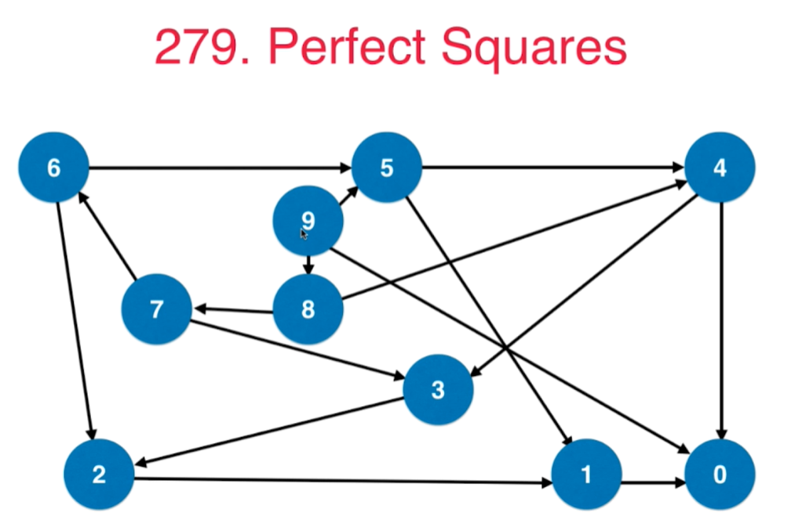

# 第06章 栈和队列

## 6.1 栈的基础应用:[20.括号匹配](https://leetcode-cn.com/problems/valid-parentheses/submissions/)
```java
class Solution {
     public boolean isValid(String s) {
        Stack<Character> stack = new Stack<>();
        for (int i = 0; i < s.length(); i++) {
            char c = s.charAt(i);
            if (c == '(' || c == '[' || c == '{') {
                stack.push(c);
            } else {
                // 还有字符串但是栈已经为空了，肯定是非法表达式
                if (stack.size()==0){
                    return false;
                }
                char cPop = stack.pop();
                if(cPop == '('){
                    if (c !=')'){
                        return false;
                    }
                }else if (cPop == '['){
                    if (c != ']'){
                        return false;
                    }
                }else if (cPop== '{'){
                    if (c != '}'){
                        return false;
                    }
                }
            }
        }
        if (stack.size() != 0) {
            return false;
        }
        return true;
    }
}
```

本节类似问题：150、71

### [150.逆波兰表达式求值](https://leetcode-cn.com/problems/evaluate-reverse-polish-notation/)

### [71.简化路径](https://leetcode-cn.com/problems/simplify-path/)

## 6.2 栈和递归的关系，以二叉树的前、中、后序遍历为例(图的深度优先遍历DFS原理是一样的)
> 参考[Part2Basic/第06章_二分搜索树BST.md](../Part2Basic/第06章_二分搜索树BST.md#66-二分搜索树的前序遍历)的6.6和6.7
### [144.二叉树前序遍历](https://leetcode-cn.com/problems/binary-tree-preorder-traversal/submissions/)
```java
class Solution {
    public List<Integer> preorderTraversal(TreeNode root) {
        List<Integer> list = new ArrayList<>();
        preorder(root, list);
        return list;
    }

    /// 遍历以node作为根节点的子树
    private void preorder(TreeNode node, List<Integer> list){
        // 1.递归终止条件
        if(node == null){
            return;
        }
        // 2.递归具体逻辑
        list.add(node.val);
        preorder(node.left, list);
        preorder(node.right, list);
    }
}
```
### [94.二叉树中序遍历](https://leetcode-cn.com/problems/binary-tree-inorder-traversal/)
```java
class Solution {
    public List<Integer> inorderTraversal(TreeNode root) {
        List<Integer> list = new ArrayList<>();
        inorder(root, list);
        return list;
    }

    /// 遍历以node作为根节点的子树
    private void inorder(TreeNode node, List<Integer> list){
        // 1.递归终止条件
        if(node == null){
            return;
        }
        // 2.递归具体逻辑
        inorder(node.left, list);
        list.add(node.val);
        inorder(node.right, list);
    }
}
```
### [145.二叉树后序遍历](https://leetcode-cn.com/problems/binary-tree-postorder-traversal/)
```java
class Solution {
    public List<Integer> postorderTraversal(TreeNode root) {
        List<Integer> list = new ArrayList<>();
        postorder(root, list);
        return list;
    }

    /// 遍历以node作为根节点的子树
    private void postorder(TreeNode node, List<Integer> list){
        // 1.递归终止条件
        if(node == null){
            return;
        }
        // 2.递归具体逻辑
        postorder(node.left, list);
        postorder(node.right, list);
        list.add(node.val);
    }
}
```

### [589.n叉树前序遍历](https://leetcode-cn.com/problems/n-ary-tree-preorder-traversal/submissions/)
```java
class Solution {
    public List<Integer> preorder(Node root) {
        List<Integer> list = new ArrayList<>();
        preorder(root, list);
        return list;
    }

    private void preorder(Node node, List<Integer> list){
        // 1.递归终止条件
        if(node == null){
            return;
        }

        // 2.递归具体逻辑
        list.add(node.val);
        for(Node child : node.children){
            preorder(child, list);
        }
    }
}
```
### [590.n叉树后序遍历](https://leetcode-cn.com/problems/n-ary-tree-postorder-traversal/comments/)
```java
class Solution {
    public List<Integer> postorder(Node root) {
        List<Integer> list = new ArrayList<>();
        postorder(root, list);
        return list;
    }

    private void postorder(Node node, List<Integer> list){
        // 1.递归终止条件
        if(node == null){
            return;
        }

        // 2.递归具体逻辑
        for(Node child : node.children){
            postorder(child, list);
        }
        list.add(node.val);
    }
}
```

## 6.3 使用栈模拟递归
> 递归实际是一种系统栈调用

### [341.扁平化嵌套列表迭代器](https://leetcode-cn.com/problems/flatten-nested-list-iterator/)

```java
/**
 * // This is the interface that allows for creating nested lists.
 * // You should not implement it, or speculate about its implementation
 * public interface NestedInteger {
 *
 *     // @return true if this NestedInteger holds a single integer, rather than a nested list.
 *     public boolean isInteger();
 *
 *     // @return the single integer that this NestedInteger holds, if it holds a single integer
 *     // Return null if this NestedInteger holds a nested list
 *     public Integer getInteger();
 *
 *     // @return the nested list that this NestedInteger holds, if it holds a nested list
 *     // Return null if this NestedInteger holds a single integer
 *     public List<NestedInteger> getList();
 * }
 */
public class NestedIterator implements Iterator<Integer> {
    // 定义一个队列
    private Queue<Integer> queue = new ArrayDeque<>();
    // 根据文件头各个函数的注释进行合理的递归调用
    private void init(List<NestedInteger> nestedList){
        for(NestedInteger nestedInteger : nestedList){
            if(nestedInteger.isInteger()){
                queue.add(nestedInteger.getInteger());
            }else {
                init(nestedInteger.getList());
            }
        }
    }
    public NestedIterator(List<NestedInteger> nestedList) {
        init(nestedList);
    }

    @Override
    public Integer next() {
        return queue.remove();
    }

    @Override
    public boolean hasNext() {
        return !queue.isEmpty();
    }
}

/**
 * Your NestedIterator object will be instantiated and called as such:
 * NestedIterator i = new NestedIterator(nestedList);
 * while (i.hasNext()) v[f()] = i.next();
 */
```

## 6.4 队列的典型应用：二叉树的层序遍历以及图的BFS
### [102.二叉树的层序遍历](https://leetcode-cn.com/problems/binary-tree-level-order-traversal/)
> 可以记住第几层的BFS

```txt
给定一个二叉树，返回其按层次遍历的节点值。 （即逐层地，从左到右访问所有节点）。

例如:
给定二叉树: [3,9,20,null,null,15,7],

    3
   / \
  9  20
    /  \
   15   7
返回其层次遍历结果：

[
  [3],
  [9,20],
  [15,7]
]
```
```java
/**
 * Definition for a binary tree node.
 * public class TreeNode {
 *     int val;
 *     TreeNode left;
 *     TreeNode right;
 *     TreeNode(int x) { val = x; }
 * }
 */
class Solution {
    public List<List<Integer>> levelOrder(TreeNode root) {
        List<List<Integer>> list = new ArrayList<>();
        if(root == null){
            return list;
        }
        Queue<TreeNode> queue = new ArrayDeque<>();
        queue.add(root);
        while(!queue.isEmpty()){
            int size = queue.size();
            // 一次性把当前层的节点全部弹出
            List<Integer> levelList = new ArrayList<>();
            while(size-- > 0){
                TreeNode node = queue.remove();
                levelList.add(node.val);
                if(node.left != null){
                    queue.add(node.left);
                }
                if(node.right != null){
                    queue.add(node.right);
                }
            }
            list.add(levelList);
        }
        return list;
    }
}
```

不用记住第几层的BFS
```java
class Solution {
    public List<Integer> levelOrder(TreeNode root) {
        List<Integer> list = new ArrayList<>();
        Queue<TreeNode> queue = new ArrayDeque<>();
        queue.add(root);
        while (!queue.isEmpty()) {
            // 一次性把当前层的节点全部弹出
            TreeNode node = queue.remove();
            list.add(node.val);
            if (node.left != null) {
                queue.add(node.left);
            }
            if (node.right != null) {
                queue.add(node.right);
            }
        }
        return list;
    }
}
```

> 此外还有107、103、199

### [107.二叉树的层次遍历 II](https://leetcode-cn.com/problems/binary-tree-level-order-traversal-ii/submissions/)
> 相比102实际就加了`Collections.reverse(list);`这一行
```java

class Solution {
    public List<List<Integer>> levelOrderBottom(TreeNode root) {
        List<List<Integer>> list = new ArrayList<>();
        if(root == null){
            return list;
        }
        Queue<TreeNode> queue = new ArrayDeque<>();
        queue.add(root);
        while(!queue.isEmpty()){
            int size = queue.size();
            // 一次性把当前层的节点全部弹出
            List<Integer> levelList = new ArrayList<>();
            while(size-- > 0){
                TreeNode node = queue.remove();
                levelList.add(node.val);
                if(node.left != null){
                    queue.add(node.left);
                }
                if(node.right != null){
                    queue.add(node.right);
                }
            }
            list.add(levelList);
        }
        // 相比102就加了下面一行
        Collections.reverse(list);
        return list;
    }
}
```

### [103.二叉树的锯齿形层次遍历](https://leetcode-cn.com/problems/binary-tree-zigzag-level-order-traversal/)
> 相比102实际只加了下面几行，用于偶数行逆序
```java
for (int i = 0; i < list.size(); i++) {
    List<Integer> listCur = list.get(i);
    if (i % 2 == 1) {
        Collections.reverse(listCur);
    }
}
```

```java
class Solution {
    public List<List<Integer>> zigzagLevelOrder(TreeNode root) {
        List<List<Integer>> list = new ArrayList<>();
        if (root == null) {
            return list;
        }
        Queue<TreeNode> queue = new ArrayDeque<>();
        queue.add(root);
        while (!queue.isEmpty()) {
            int size = queue.size();
            // 一次性把当前层的节点全部弹出
            List<Integer> levelList = new ArrayList<>();
            while (size-- > 0) {
                TreeNode node = queue.remove();
                levelList.add(node.val);
                if (node.left != null) {
                    queue.add(node.left);
                }
                if (node.right != null) {
                    queue.add(node.right);
                }
            }
            list.add(levelList);
        }
        for (int i = 0; i < list.size(); i++) {
            List<Integer> listCur = list.get(i);
            if (i % 2 == 1) {
                Collections.reverse(listCur);
            }
        }
        return list;
    }
}
```

### [199.二叉树的右视图](https://leetcode-cn.com/problems/binary-tree-right-side-view/submissions/)
> 当到达本层最后一个元素时才加到list中

核心代码：
```java
 // 核心，到达本行最后一个元素才加到list里
if (i == size - 1) {
    list.add(node.val);
}
```

完整实现如下：

```java
class Solution {
    public List<Integer> rightSideView(TreeNode root) {
        List<Integer> list = new ArrayList<>();
        if (root == null) {
            return list;
        }
        Queue<TreeNode> queue = new ArrayDeque<>();
        queue.add(root);
        while (!queue.isEmpty()) {
            int size = queue.size();
            int i = 0;
            while (i < size) {
                TreeNode node = queue.remove();
                // 核心，到达本行最后一个元素才加到list里
                if (i == size - 1) {
                    list.add(node.val);
                }
                if (node.left != null) {
                    queue.add(node.left);
                }
                if (node.right != null) {
                    queue.add(node.right);
                }
                i++;
            }
        }
        return list;
    }
}
```

## 6.5 BFS和图的最短路径:[279.完全平方数](https://leetcode-cn.com/problems/perfect-squares/)
```txt
给定正整数 n，找到若干个完全平方数（比如 1, 4, 9, 16, ...）使得它们的和等于 n。你需要让组成和的完全平方数的个数最少。

示例 1:

输入: n = 12
输出: 3 
解释: 12 = 4 + 4 + 4.
示例 2:

输入: n = 13
输出: 2
解释: 13 = 4 + 9.
```

### 思路：

+ 对问题建模，整个问题转化为一个图论问题。
+ 从n到0，每个数组表示一个节点
+ 如果两个数字x到y相差一个完全平方数，则连接一条边，我们得到了一个有向无权图。
+ 原问题转换为：`求这个无权图从n到0的最短路径`，求最短路径一般都用BFS


```java
public class Solution {
    private class Node {
        /**
         * 节点编号
         */
        int num;
        /**
         * 节点到起点的距离
         */
        int distance;

        public Node(int num, int distance) {
            this.num = num;
            this.distance = distance;
        }
    }

    public int numSquares(int n) {
        // 这里用map表达图中的一个节点，键代表节点，值代表距离起点的距离(无权图可以认为是经过的节点个数)
        Queue<Node> queue = new ArrayDeque<>();
        queue.add(new Node(n, 0));
        boolean[] visited = new boolean[n];
        while (!queue.isEmpty()) {
            Node node = queue.remove();
            if (node.num == 0) {
                // 这里我们只用到了距离，不需要具体的路径，需要完整路径地话还需要pre数组
                return node.distance;
            }
            // 遍历邻接点，把他们加入到队列中
            for (int i = 1; node.num - i * i >= 0; i++) {
                if (!visited[node.num - i * i]) {
                    queue.add(new Node(node.num - i * i, node.distance + 1));
                    visited[node.num - i * i] = true;
                }
            }
        }
        return 0;
    }
}
```
### 类似问题：127、126
> 使用BFS关键是要找到邻接点
### [127.单词接龙](https://leetcode-cn.com/problems/word-ladder/submissions/)
```java
class Solution {
    private class Node {
        /**
         * 节点对应的单词
         */
        String word;
        /**
         * 当前单词到起点单词的距离
         */
        int distance;

        public Node(String word, int distance) {
            this.word = word;
            this.distance = distance;
        }
    }

    /**
     * 判断两个单词是否只有一个单词不同
     * 两个单词的长度是相等地
     */
    private boolean oneCharDiff(String wordA, String wordB) {
        // 不同字符的个数
        int diffCnt = 0;
        for (int i = 0; i < wordA.length(); i++) {
            if (wordA.charAt(i) != wordB.charAt(i)) {
                diffCnt++;
            }
        }
        return diffCnt == 1;
    }

    public int ladderLength(String beginWord, String endWord, List<String> wordList) {
        // 访问数组
        Map<String, Boolean> visited = new HashMap<>();
        Queue<Node> queue = new ArrayDeque<>();
        queue.add(new Node(beginWord, 1));
        visited.put(beginWord, true);
        while (!queue.isEmpty()) {
            Node node = queue.remove();
            for (String word : wordList) {
                if (oneCharDiff(word, node.word) && visited.get(word) == null) {
                    // 一旦找到目标单词endWord，直接返回
                    if (word.equals(endWord)) {
                        return node.distance + 1;
                    }
                    // 和父节点相比只有一个节点不同而且还没被访问
                    queue.add(new Node(word, node.distance + 1));
                    visited.put(word, true);
                }
            }
        }
        return 0;
    }
}
```


## 6.6~6.7 优先队列
> Java默认的`java.util.PriorityQueue`是基于最小堆实现地

### [347.前K个高频元素](https://leetcode-cn.com/problems/top-k-frequent-elements/submissions/)

```java
class Solution {
    public List<Integer> topKFrequent(int[] nums, int k) {
        // 元素和出现频次的映射Map
        Map<Integer, Integer> mapNumFreq = new HashMap<>();
        for (int num : nums) {
            // 更新map里面的值
            if (mapNumFreq.get(num) == null) {
                mapNumFreq.put(num, 1);
            } else {
                mapNumFreq.put(num, mapNumFreq.get(num) + 1);
            }
        }
        PriorityQueue<Integer> pq = new PriorityQueue<>(k, new Comparator<Integer>() {
            @Override
            public int compare(Integer key1, Integer key2) {
                // 自定义比较器，找出现频次较高地需要每次弹出最小值
                return mapNumFreq.get(key1) - mapNumFreq.get(key2);
            }
        });
        for (Integer key : mapNumFreq.keySet()) {
            if (pq.size() == k) {
                // 满了需要和栈顶元素比较，比栈顶元素大就加入到队列中
                if (mapNumFreq.get(key) > mapNumFreq.get(pq.peek())) {
                    pq.poll();
                    pq.add(key);
                }
            } else {
                // 优先队列没满就直接加入
                pq.add(key);
            }

        }
        List<Integer> result = new ArrayList<>();
        while (!pq.isEmpty()) {
            result.add(pq.poll());
        }
        // 从高频到低频
        Collections.reverse(result);
        return result;
    }
}
```

### [23.合并K个排序链表](https://leetcode-cn.com/problems/merge-k-sorted-lists/comments/)

