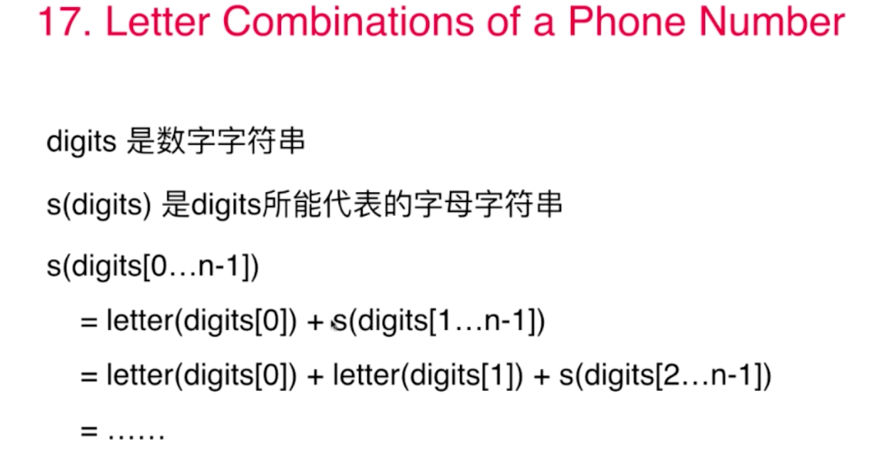
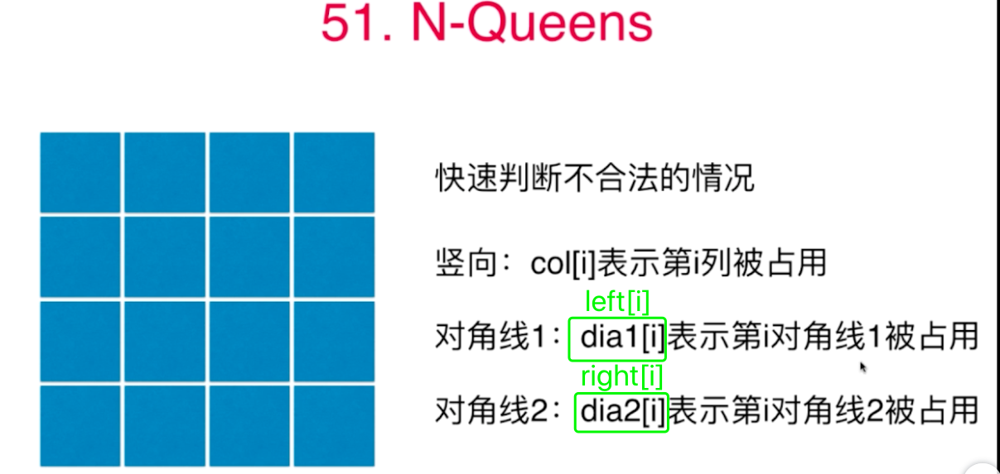
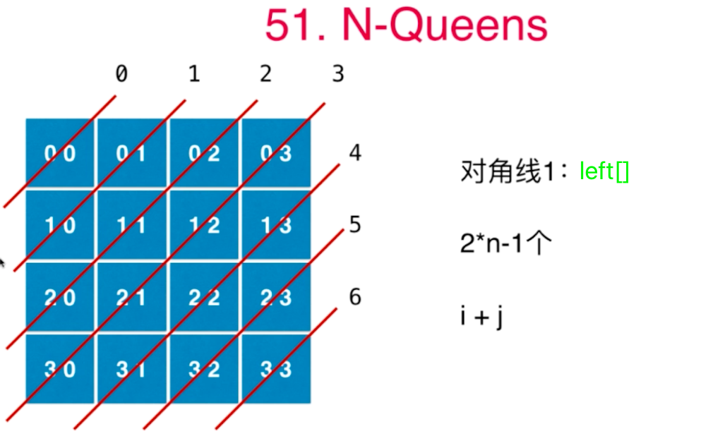
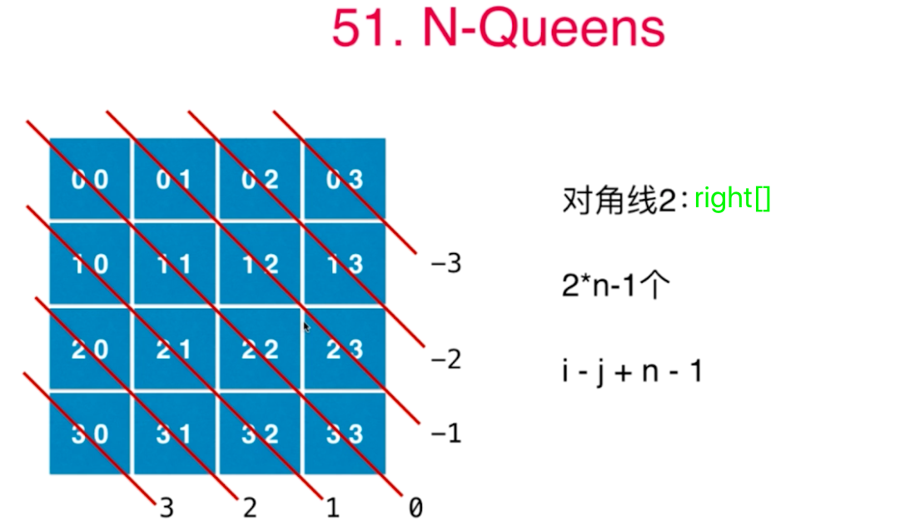

# 第08章 递归和回溯
## 8.0 递归与回溯的异同

### 参考文章
+ [递归与回溯](https://blog.csdn.net/lym940928/article/details/89679157)
+ [递归与回溯的理解](https://www.cnblogs.com/fanguangdexiaoyuer/p/11224426.html)
+ [回溯和递归区别](https://blog.csdn.net/u014772862/article/details/51789015)

### 比较

|          | 递归                                                         | 回溯                                                         |
| -------- | ------------------------------------------------------------ | ------------------------------------------------------------ |
| 定义     | 为了描述问题的某一状态，必须用到该状态的上一状态，而描述上一状态，又必须用到上一状态的上一状态……这种用自已来定义自己的方法，称为递归定义。形式如 f(n) = n*f(n-1), if n=0,f(n)=1. | 从问题的某一种可能出发, 搜索从这种情况出发所能达到的所有可能, 当这一条路走到” 尽头 “的时候, 再倒回出发点, 从另一个可能出发, 继续搜索. 这种不断” 回溯 “寻找解的方法, 称作” 回溯法 “。 |
| 不同     | 递归是一种算法结构，递归会出现在子程序中自己调用自己或间接地自己调用自己。最直接的递归应用就是计算连续数的阶乘，计算规律：n!=(n-1)!*n。 | 回溯是一种算法思想，可以用递归实现。通俗点讲回溯就是一种试探，类似于穷举，`但回溯有“剪枝”功能`，比如求和问题。给定7个数字，1 2 3 4 5 6 7，求和等于7的组合，从小到大搜索，选择1+2+3+4 =10>7，已经超过了7，之后的5 6 7就没必要在继续了，这就是一种搜索过程的优化。如果还有不清楚的可以看一下8皇后问题。 |
| 问题举例 | [玩转算法面试第7章_二叉树与递归](第07章_二叉树和递归.md)     | [玩转算法面试第8章_递归与回溯](第08章_递归和回溯.md)         |

### 举例
> 用一个比较通俗的说法来解释递归和回溯：
我们在路上走着，前面是一个多岔路口，因为我们并不知道应该走哪条路，所以我们需要尝试。尝试的过程就是一个函数。
+ 我们选择了一个方向，后来发现又有一个多岔路口，这时候又需要进行一次选择。所以我们需要在上一次尝试结果的基础上，再做一次尝试，即在函数内部再调用一次函数，这就是递归的过程。
+ 这样重复了若干次之后，发现这次选择的这条路走不通，这时候我们知道我们上一个路口选错了，所以我们要回到上一个路口重新选择其他路，这就是回溯的思想。

## 8.1~8.2 树形问题与回溯 

### [17.电话号码的字母组合](https://leetcode-cn.com/problems/letter-combinations-of-a-phone-number/) 

```txt
给定一个仅包含数字 2-9 的字符串，返回所有它能表示的字母组合。

给出数字到字母的映射如下（与电话按键相同）。注意 1 不对应任何字母。
示例:

输入："23"
输出：["ad", "ae", "af", "bd", "be", "bf", "cd", "ce", "cf"].
```


```java
class Solution {
    // 每个按键(数组的下标)对应的可能的字符串，0和1不对应任何字符，所以这里为空
    String[] letterMap = {
            "", // 0
            "", // 1
            "abc", // 2
            "def", // 3
            "ghi", // 4
            "jkl", // 5
            "mno", // 6
            "pqrs", // 7
            "tuv",  // 8
            "wxyz"  // 9
    };

    public List<String> letterCombinations(String digits) {
        // 存储最终结果的列表
        List<String> result = new ArrayList<>();
        if ("".equals(digits)){
            return result;
        }
        findCombinations(digits, 0, "", result);
        return result;
    }

    /**
     * 寻找digits[index]匹配的字母，获得digits[0...index]对应的解
     *
     * @param digits 原始数字字符串
     * @param index 要看digits的哪一个数字
     * @param s      s保存了此时从digits[0...index-1]翻译得到的一个字母字符串
     * @param result 保存最终可能的字符串
     */
    private void findCombinations(String digits, int index, String s, List<String> result) {
        // 所有数字都遍历完了，递归退出
        if (index == digits.length()) {
            result.add(s);
            return;
        }
        // 拿到index对应的数字字符
        char c = digits.charAt(index);
        // 获取当前数字字符可能对应的键盘上的字符串
        String lettersStr = letterMap[c - '0'];
        // 第当前数字对应的字符串进行遍历拼接
        for (int i = 0; i < lettersStr.length(); i++) {
            findCombinations(digits, index + 1, s + lettersStr.charAt(i), result);
        }
    }
}
```

### [93.复原IP地址](https://leetcode-cn.com/problems/restore-ip-addresses/)
```java
class Solution {
    private boolean validId(String ip) {
        if (ip.length() > 1 && ip.charAt(0) == '0') {
            return false;
        }
        if (ip.length() > 3 || Integer.parseInt(ip) > 255) {
            return false;
        }
        return true;
    }

    private String concatList(List<String> numList) {
        StringBuilder sb = new StringBuilder();
        for (String numStr : numList) {
            sb.append(numStr).append(".");
        }
        // 最后的一个.要去掉
        return sb.substring(0, sb.length() - 1);
    }

    // 把s分成四分，判断这四份组成的ip的合理性
    // 递归过程：不断取字符串的前几个字符，每出现一个合法的字符串就接着往下取
    private void findIp(String s, List<String> numList, List<String> result) {
        if (numList.size() == 4) {
            result.add(concatList(numList));
            // 当s字符串已经被分割成空时，分割完毕，退出本层递归即可
            return;
        }
        for (int i = 1; i <= s.length(); i++) {
            if (numList.size() == 3) {
                // 前面已经分成3份了，这里直接把剩下的作为IP即可
                i = s.length();
            }
            String tmp = s.substring(0, i);
            if (!validId(tmp)) {
                continue;
            }
            numList.add(tmp);
            // i往后的字符串
            findIp(s.substring(i), numList, result);
            // 退出上一层递归，就要从numList中删除最后一个num
            numList.remove(numList.size() - 1);
        }
    }

    public List<String> restoreIpAddresses(String s) {
        List<String> result = new ArrayList<>();
        if ("".equals(s) || s.length() < 4 || s.length() > 12) {
            return result;
        }
        List<String> numList = new ArrayList<>();
        findIp(s, numList, result);
        return result;
    }
}
```

### [131.分割回文串](https://leetcode-cn.com/problems/palindrome-partitioning/)
> 验证字符串是否用[125.验证回文串](https://leetcode-cn.com/problems/valid-palindrome/submissions/)的代码
```java
class Solution {
    /**
     * 参考LeetCode125.验证回文串
     */
    public boolean isPalindrome(String s) {
        s = s.toLowerCase();
        int l = 0;
        int r = s.length() - 1;
        while (l < r) {
            // 只要还没相遇就接着往下走
            if (!Character.isLetterOrDigit(s.charAt(l))) {
                // 左边的字符不是字母或数字
                l++;
                continue;
            }
            if (!Character.isLetterOrDigit(s.charAt(r))) {
                // 右边的字符不是字母或数字
                r--;
                continue;
            }
            // 左右两边都是字母或数字，只要不相等就说明不是回文
            if (s.charAt(l) != s.charAt(r)) {
                return false;
            }
            // 相等地话，继续向中间靠拢
            l++;
            r--;
        }
        return true;
    }

    /**
     * 获取本次循环中的回文串
     *
     * @param s           原始字符串
     * @param palindromes 本次循环中的回文串
     * @param result      存储所有回文串列表的列表
     */
    void getAllPalindromes(String s, List<String> palindromes, List<List<String>> result) {
        if ("".equals(s)) {
            // 当到头时，把回文串列表加入到result中并返回，列表是引用传值，所以必须new一个list
            result.add(new ArrayList<>(palindromes));
            return;
        }
        for (int i = 1; i <= s.length(); i++) {
            String tmp = s.substring(0, i);
            if (!isPalindrome(tmp)) {
                // 不是回文串就直接退出本层递归
                continue;
            }
            palindromes.add(tmp);
            getAllPalindromes(s.substring(i), palindromes, result);
            // 退出本层递归，需要移除一个回文串
            palindromes.remove(palindromes.size() - 1);
        }
    }

    public List<List<String>> partition(String s) {
        List<List<String>> result = new ArrayList<>();
        List<String> palindromes = new ArrayList<>();
        getAllPalindromes(s, palindromes, result);
        return result;
    }
}
```

## 8.3 组合
> 用基于递归的回溯法解决组合问题
### [46.全排列](https://leetcode-cn.com/problems/permutations/)
```java
class Solution {
    private void calPermutations(List<Integer> numList, List<Integer> curList, List<List<Integer>> result) {
        if (numList.size() == 0) {
            result.add(new ArrayList<>(curList));
            return;
        }
        for (int i = 0; i < numList.size(); i++) {
            curList.add(numList.get(i));
            List<Integer> numListNext = new ArrayList<>(numList);
            numListNext.remove(i);
            calPermutations(numListNext, curList, result);
            // 递归退出就删除一个元素
            curList.remove(curList.size() - 1);
        }
    }

    public List<List<Integer>> permute(int[] nums) {
        List<List<Integer>> result = new ArrayList<>();
        List<Integer> curList = new ArrayList<>();
        List<Integer> numList = new ArrayList<>();
        for (int num : nums) {
            numList.add(num);
        }
        calPermutations(numList, curList, result);
        return result;
    }
}
```
### [47.全排列II](https://leetcode-cn.com/problems/permutations-ii/)
> 只需要在上面46题的递归退出逻辑上加一句`!result.contains(curList)`即可
```java
class Solution {
    private void calPermutations(List<Integer> numList, List<Integer> curList, List<List<Integer>> result) {
        if (numList.size() == 0 && !result.contains(curList)) {
            result.add(new ArrayList<>(curList));
            return;
        }
        for (int i = 0; i < numList.size(); i++) {
            curList.add(numList.get(i));
            List<Integer> numListNext = new ArrayList<>(numList);
            numListNext.remove(i);
            calPermutations(numListNext, curList, result);
            // 递归退出就删除一个元素
            curList.remove(curList.size() - 1);
        }
    }

    public List<List<Integer>> permuteUnique(int[] nums) {
        List<List<Integer>> result = new ArrayList<>();
        List<Integer> curList = new ArrayList<>();
        List<Integer> numList = new ArrayList<>();
        for (int num : nums) {
            numList.add(num);
        }
        calPermutations(numList, curList, result);
        return result;
    }
}
```

## 8.4~8.5 组合问题
> 利用递归回溯法解决组合问题.
### [77.组合](https://leetcode-cn.com/problems/combinations/)
> 和46、47差不多，简单适配下即可,通过变化索引的方式去遍历子数组要比新建一个子数组效率高很多
```java
class Solution {
    private void calCombinations(int[] nums, int start, List<Integer> curList, List<List<Integer>> result, int k) {
        if (curList.size() == k) {
            result.add(new ArrayList<>(curList));
            return;
        }
        for (int i = start; i < nums.length; i++) {
            curList.add(nums[i]);
            calCombinations(nums,i+1, curList, result, k);
            // 递归退出就删除一个元素
            curList.remove(curList.size() - 1);
        }
    }

    public List<List<Integer>> combine(int n, int k) {
        List<List<Integer>> result = new ArrayList<>();
        List<Integer> curList = new ArrayList<>();
        int[] nums = new int[n];
        for (int i = 0; i < n; i++) {
            nums[i] = i+1;
        }
        calCombinations(nums, 0, curList, result, k);
        return result;
    }
}
```
### [39.组合总和](https://leetcode-cn.com/problems/combination-sum/)
```java
class Solution {
    private void calCombinations(int[] nums, List<Integer> curList, int start, int target, List<List<Integer>> result) {
        if (target < 0) {
            return;
        }
        if (target == 0) {
            result.add(new ArrayList<>(curList));
            return;
        }
        // 从start开始是为了能重复使用start位置的元素
        for (int i = start; i < nums.length; i++) {
            curList.add(nums[i]);
            // 下一层递归还是用这些元素，通过索引来遍历子数组而不要额外建立空间
            calCombinations(nums, curList, i, target - nums[i], result);
            // 递归退出就删除一个元素
            curList.remove(curList.size() - 1);
        }
    }

    public List<List<Integer>> combinationSum(int[] candidates, int target) {
        // 排序后输出结果比较统一
        Arrays.sort(candidates);
        List<List<Integer>> result = new ArrayList<>();
        List<Integer> curList = new ArrayList<>();
        calCombinations(candidates, curList, 0, target, result);
        return result;
    }
}
```
### [40.组合总和 II](https://leetcode-cn.com/problems/combination-sum-ii/)
> 和39类似，就是把i换成i+1，然后再添加到result前判重一下即可
```java
class Solution {
    private void calCombinations(int[] nums, List<Integer> curList, int start, int target, List<List<Integer>> result) {
        if (target < 0) {
            return;
        }
        if (target == 0) {
            if(!result.contains(curList)){
                result.add(new ArrayList<>(curList));
            }
            return;
        }
        // 从start开始是为了能重复使用start位置的元素
        for (int i = start; i < nums.length; i++) {
            curList.add(nums[i]);
            // 下一层递归还是用这些元素，通过索引来遍历子数组而不要额外建立空间
            calCombinations(nums, curList, i + 1, target - nums[i], result);
            // 递归退出就删除一个元素
            curList.remove(curList.size() - 1);
        }
    }

    public List<List<Integer>> combinationSum2(int[] candidates, int target) {
        // 排序后输出结果比较统一
        Arrays.sort(candidates);
        List<List<Integer>> result = new ArrayList<>();
        List<Integer> curList = new ArrayList<>();
        calCombinations(candidates, curList, 0, target, result);
        return result;
    }
}
```
### [216.组合总和 III](https://leetcode-cn.com/problems/combination-sum-iii/)
> 和40题类似。执行用时 : 1 ms , 在所有 Java 提交中击败了 99.29% 的用户
```java
class Solution {
    private void calCombinations(int[] nums, List<Integer> curList, int start, int target, List<List<Integer>> result, int k) {
        if (target < 0) {
            return;
        }
        if (target == 0) {
            if(curList.size() == k){
                result.add(new ArrayList<>(curList));
            }
            return;
        }
        // 从start开始是为了能重复使用start位置的元素
        for (int i = start; i < nums.length; i++) {
            curList.add(nums[i]);
            // 下一层递归还是用这些元素，通过索引来遍历子数组而不要额外建立空间
            calCombinations(nums, curList, i + 1, target - nums[i], result, k);
            // 递归退出就删除一个元素
            curList.remove(curList.size() - 1);
        }
    }

    public List<List<Integer>> combinationSum3(int k, int n) {
        List<List<Integer>> result = new ArrayList<>();
        List<Integer> curList = new ArrayList<>();
        int[] nums = {1,2,3,4,5,6,7,8,9};
        calCombinations(nums, curList, 0, n, result, k);
        return result;
    }
}
```
### [78.子集](https://leetcode-cn.com/problems/subsets/)
```java
class Solution {
    private void calSubsets(int[] nums, int start, List<Integer> curList, List<List<Integer>> result){
        if(start == nums.length){
            return;
        }
        for(int i = start; i < nums.length; i++){
            curList.add(nums[i]);
            if(!result.contains(curList)){
                result.add(new ArrayList<>(curList));
            }
            calSubsets(nums, i + 1, curList, result);
            curList.remove(curList.size() - 1);
        }
    }
    public List<List<Integer>> subsets(int[] nums) {
        List<List<Integer>> result = new ArrayList<>();
        List<Integer> curList = new ArrayList<>();
        result.add(new ArrayList<>());
        calSubsets(nums, 0, curList, result);
        return result;
    }
}
```
### [90.子集II](https://leetcode-cn.com/problems/subsets-ii/)
> 和上一个题相比就加了个`Arrays.sort(nums);`
```java
class Solution {
    private void calSubsets(int[] nums, int start, List<Integer> curList, List<List<Integer>> result){
        if(start == nums.length){
            return;
        }
        for(int i = start; i < nums.length; i++){
            curList.add(nums[i]);
            if(!result.contains(curList)){
                result.add(new ArrayList<>(curList));
            }
            calSubsets(nums, i + 1, curList, result);
            curList.remove(curList.size() - 1);
        }
    }
    public List<List<Integer>> subsetsWithDup(int[] nums) {
        Arrays.sort(nums);
        List<List<Integer>> result = new ArrayList<>();
        List<Integer> curList = new ArrayList<>();
        result.add(new ArrayList<>());
        calSubsets(nums, 0, curList, result);
        return result;
    }
}
```
### [401.二进制手表](https://leetcode-cn.com/problems/binary-watch/)
```java
class Solution {
    private void getResult(int[] nums, int start, int k, List<Integer> curList, List<List<Integer>> result){
        if(curList.size() == k){
            result.add(new ArrayList(curList));
            return;
        }
        for(int i = start; i < nums.length; i++){
            curList.add(nums[i]);
            getResult(nums, i + 1, k, curList, result);
            curList.remove(curList.size() - 1);
        }
    }
    private List<String> trans(List<List<Integer>> result){
        List<String> list = new ArrayList<>();
        for(List<Integer> lightList : result){
            int[] flags = new int[10];
            for(int i = 0; i < 10; i++){
                if(lightList.contains(i)){
                    flags[i] = 1;
                }else {
                    flags[i] = 0;
                }
            }
            int hour = 8 * flags[0] + 4 * flags[1] + 2 * flags[2] + flags[3];
            int minute = 32 * flags[4] + 16 * flags[5] + 8 * flags[6] + 4 * flags[7] + 2 * flags[8] + flags[9];
            if(hour > 11 || minute > 59){
                continue;
            }
            if(minute < 10){
                list.add(hour + ":0" + minute);
            }else{
                list.add(hour + ":" + minute);
            } 
        }
        Collections.sort(list);
        return list;
    }
    // 组合问题
    public List<String> readBinaryWatch(int num) {
        List<List<Integer>> result = new ArrayList<>();
        List<Integer> curList = new ArrayList<>();
        // 下标0~3的元素表示上面四个灯，下标4~9的元素表示下面6个灯
        int[] nums = {0,1,2,3,4,5,6,7,8,9};
        getResult(nums, 0, num, curList, result);
        return trans(result);
    }
}
```

## 8.6 二维平面的搜索
> 参考[Part2BasicGraph/第06章_图论问题建模和floodfill](../Part2BasicGraph/第06章_图论问题建模和floodfill.md),这里是floodfill的四连通分量问题，可以用DFS解决，在递归回退时记得要把相关状态重置下
### [79.单词搜索](https://leetcode-cn.com/problems/word-search/)
```java
class Solution {
    /**
     * 当前点求上右下左四个点时用到的矢量差,dirs 是directions的意思
     */
    private int[][] dirs = {
            {-1, 0},
            {0, 1},
            {1, 0},
            {0, -1}
    };

    /**
     * 传进来的grid有多少行(Row)多少列(Col)
     */
    private int R, C;

    /**
     * 岛屿网格的情况
     */
    private char[][] grid;
    private boolean[][] visited;

    /**
     * 判断第x行第y列的点(x, y)是否在grid所在的范围内
     */
    private boolean inArea(int x, int y) {
        return x >= 0 && x < R && y >= 0 && y < C;
    }

    /**
     * 图的初始化
     *
     * @param board 二维的图
     * @param word  要找的单词
     * @return
     */
    public boolean exist(char[][] board, String word) {
        this.grid = board;
        if (grid == null) {
            return false;
        }
        R = grid.length;
        if (R == 0) {
            // 如果行数为0说明图为空，直接返回
            return false;
        }
        C = grid[0].length;
        if (C == 0) {
            // 如果列数为0说明图为空，直接返回
            return false;
        }
        visited = new boolean[R][C];
        for (int i = 0; i < R; i++) {
            for (int j = 0; j < C; j++) {
                // 点没有被访问而且字符等于word的第一个字符，才以这个点作为起点进行DFS遍历
                if (grid[i][j] == word.charAt(0)) {
                    // 以(i,j)作为起点进行DFS，看看遍历结果能否组成提供的单词
                    List<Character> cList = new ArrayList<>();
                    cList.add(word.charAt(0));
                    dfs(i, j, 1, word, cList);
                    if (cList.size() == word.length()) {
                        return true;
                    }
                    // 每次递归DFS遍历完，数组要重新初始化
                    visited = new boolean[R][C];
                }
            }
        }
        return false;
    }

    private void dfs(int x, int y, int start, String word, List<Character> cList) {
        if (cList.size() == word.length()) {
            return;
        }
        visited[x][y] = true;
        // 遍历节点(x, y)所有的邻接点,判断是陆地的
        for (int d = 0; d < dirs.length; d++) {
            int nextX = x + dirs[d][0];
            int nextY = y + dirs[d][1];
            // 点(next_x, next_y)必须在grid区域内 + 没被访问过 + 是陆地(点(x, y)是陆地)
            if (inArea(nextX, nextY) && !visited[nextX][nextY] && grid[nextX][nextY] == word.charAt(start)) {
                cList.add(grid[nextX][nextY]);
                dfs(nextX, nextY, start + 1, word, cList);
                if (cList.size() == word.length()) {
                    break;
                }
                // 状态重置：列表和访问数组
                cList.remove(cList.size() - 1);
                visited[nextX][nextY] = false;
            }
        }
    }

    /**
     * char[][] board = {{'A', 'B', 'C', 'E'}, {'S', 'F', 'C', 'S'}, {'A', 'D', 'E', 'E'}};
     * String word = "ABCCED";
     * <p>
     * char[][] board = {{'C', 'A', 'A'}, {'A', 'A', 'A'}, {'B', 'C', 'D'}};
     * String word = "AAB";
     * <p>
     * char[][] board = {{'A','B','C','E'},{'S','F','E','S'},{'A','D','E','E'}};
     * String word  = "ABCEFSADEESE";
     */
    public static void main(String[] args) {
        char[][] board = {{'C', 'A', 'A'}, {'A', 'A', 'A'}, {'B', 'C', 'D'}};
        String word = "AAB";
        System.out.println(new Solution().exist(board, word));
    }
}
```
## 8.7 floodfill(实际就是DFS) 
> 二维图的搜索实际就是DFS
### [200.岛屿数量](https://leetcode-cn.com/problems/number-of-islands/) 
> 实际就是DFS求连通分量的个数
```java
public class Solution {
    /**
     * 当前点求上右下左四个点时用到的矢量差,dirs 是directions的意思
     */
    private int[][] dirs = {
            {-1, 0},
            {0, 1},
            {1, 0},
            {0, -1}
    };

    /**
     * 传进来的grid有多少行(Row)多少列(Col)
     */
    private int R, C;

    /**
     * 岛屿网格的情况
     */
    private char[][] grid;
    private boolean[][] visited;
    /**
     * 连通分量的个数
     */
    private int cCount = 0;

    /**
     * 判断第x行第y列的点(x, y)是否在grid所在的范围内
     */
    private boolean inArea(int x, int y) {
        return x >= 0 && x < R && y >= 0 && y < C;
    }

    public int numIslands(char[][] grid) {
        this.grid = grid;
        if (grid == null) {
            return 0;
        }
        R = grid.length;
        if (R == 0) {
            // 如果行数为0说明图为空，直接返回
            return 0;
        }
        C = grid[0].length;
        if (C == 0) {
            // 如果列数为0说明图为空，直接返回
            return 0;
        }
        visited = new boolean[R][C];
        for (int i = 0; i < R; i++) {
            for (int j = 0; j < C; j++) {
                // 点没有被访问而且字符等于word的第一个字符，才以这个点作为起点进行DFS遍历
                if (grid[i][j] == '1' && !visited[i][j]) {
                    dfs(i, j);
                    cCount++;
                }
            }
        }
        return cCount;
    }

    private void dfs(int x, int y) {
        visited[x][y] = true;
        // 遍历节点(x, y)所有的邻接点,判断是陆地的
        for (int d = 0; d < dirs.length; d++) {
            int nextX = x + dirs[d][0];
            int nextY = y + dirs[d][1];
            // 点(next_x, next_y)必须在grid区域内 + 没被访问过 + 是陆地(点(x, y)是陆地)
            if (inArea(nextX, nextY) && !visited[nextX][nextY] && grid[nextX][nextY] == '1') {
                dfs(nextX, nextY);
            }
        }
    }
}
```

### [139.被围绕的区域](https://leetcode-cn.com/problems/surrounded-regions/)
```java
class Solution {
    public boolean wordBreak(String s, List<String> wordDict) {
        boolean[] visited = new boolean[s.length() + 1];
        return dfs(s, 0, wordDict, visited);
    }

    private boolean dfs(String s, int start, List<String> wordDict, boolean[] visited) {
        visited[start] = true;
        for (int i = start; i < s.length(); i++) {
            // 防止递归回退的时候再次经过这个字符
            if (visited[i + 1]) {
                continue;
            }
            String substr = s.substring(start, i + 1);
            if (wordDict.contains(substr)) {
                if (i + 1 == s.length() || dfs(s, i + 1, wordDict, visited)) {
                    return true;
                }
            }
        }
        return false;
    }

    /**
     * 输入: s = "leetcode", wordDict = ["leet", "code"]  输出: true
     * <p>
     * 输入："aaaaaaa"  输出：["aaaa","aaa"]
     */
    public static void main(String[] args) {
        String s = "aaaaaaa";
        String[] words = {"aaaa", "aaa"};
        List<String> wordDict = new ArrayList<>(Arrays.asList(words));
        System.out.println(new Solution().wordBreak(s, wordDict));
    }
}
```
### [417.太平洋大西洋水流问题](https://leetcode-cn.com/problems/pacific-atlantic-water-flow/)
> 遍历每个点，DFS找到既能到达太平洋又能到达大西洋的点加入到结果中即可
```java
class Solution {
    /**
     * 当前点求上右下左四个点时用到的矢量差,dirs 是directions的意思
     */
    private int[][] dirs = {
            {-1, 0},
            {0, 1},
            {1, 0},
            {0, -1}
    };

    /**
     * 传进来的grid有多少行(Row)多少列(Col)
     */
    private int R, C;

    /**
     * 岛屿网格的情况
     */
    private int[][] grid;
    private boolean[][] visited;

    /**
     * 判断第x行第y列的点(x, y)是否在grid所在的范围内
     */
    private boolean inArea(int x, int y) {
        return x >= 0 && x < R && y >= 0 && y < C;
    }

    public List<List<Integer>> pacificAtlantic(int[][] matrix) {
        List<List<Integer>> result = new ArrayList<>();
        this.grid = matrix;
        if (grid == null) {
            return result;
        }
        R = grid.length;
        if (R == 0) {
            // 如果行数为0说明图为空，直接返回
            return result;
        }
        C = grid[0].length;
        if (C == 0) {
            // 如果列数为0说明图为空，直接返回
            return result;
        }
        visited = new boolean[R][C];
        for (int i = 0; i < R; i++) {
            for (int j = 0; j < C; j++) {
                // 点没有被访问而且字符等于word的第一个字符，才以这个点作为起点进行DFS遍历
                boolean pacific = dfs(i, j, true);
                visited = new boolean[R][C];
                boolean atlantic = dfs(i, j, false);
                visited = new boolean[R][C];
                if (pacific && atlantic) {
                    List<Integer> list = new ArrayList<>();
                    list.add(i);
                    list.add(j);
                    result.add(list);
                }
            }
        }
        return result;
    }

    /**
     * dfs遍历看起点是否能到到
     *
     * @param x       行
     * @param y       列
     * @param pacific true代表检查能否到达太平洋()，false代表检查能否到到大西洋
     * @return 是否能到达太平洋或大西洋
     */
    private boolean dfs(int x, int y, boolean pacific) {
        if (pacific) {
            // 检查能否到达太平洋
            if (x == 0 || y == 0) {
                return true;
            }
        } else {
            // 检查大西洋
            if (x == R - 1 || y == C - 1) {
                return true;
            }
        }
        visited[x][y] = true;
        for (int d = 0; d < dirs.length; d++) {
            int nextX = x + dirs[d][0];
            int nextY = y + dirs[d][1];
            // 点(next_x, next_y)必须在grid区域内 + 没被访问过 + 往地处流 + 能到达边界
            if (inArea(nextX, nextY) && !visited[nextX][nextY] && grid[nextX][nextY] <= grid[x][y] && dfs(nextX, nextY, pacific)) {
                return true;
            }
        }
        // 到最后都没能到达边界，则说明无法到到，退出即可
        return false;
    }

    public static void main(String[] args) {
        int[][] matrix = {
                {1, 2, 2, 3, 5},
                {3, 2, 3, 4, 4},
                {2, 4, 5, 3, 1},
                {6, 7, 1, 4, 5},
                {5, 1, 1, 2, 4}
        };
        System.out.println(new Solution().pacificAtlantic(matrix)); 
    }
}
```

## 8.8 递归回溯法是人工智能的基础
### [51.N皇后问题](https://leetcode-cn.com/problems/n-queens/)
> 图中的i是下面的r，
+ 
+ 
+ 
```java
class Solution {
    boolean[] col = null;
    boolean[] left = null;
    boolean[] right = null;
    List<List<String>> ret = new ArrayList<>();

    public List<List<String>> solveNQueens(int n) {
        // col[i]表示第i列被占用
        col = new boolean[n];
        // 左倾对角线
        left = new boolean[2 * n - 1];
        // 右倾对角线
        right = new boolean[2 * n - 1];
        // 二维平面
        char[][] board = new char[n][n];
        // 回溯法求解问题
        backTrack(board, 0, n);
        return ret;
    }
    // i代表行，j代表列
    void backTrack(char[][] board, int i, int n) {
        if (i >= n) {
            // 找到能一个能摆放皇后的位置，加入到结果列表中
            List<String> list = new ArrayList<>();
            for (int j = 0; j < n; j++) {
                list.add(new String(board[j]));
            }
            ret.add(list);
            return;
        }
        // 初始化棋盘啥都不放
        Arrays.fill(board[i], '.');
        for (int j = 0; j < n; j++) {
            if (!col[j] && !left[i + j] && !right[i - j + n - 1]) {
                // 一、尝试在当前位置摆放皇后
                // 摆放皇后
                board[i][j] = 'Q';
                // 列占用
                col[j] = true;
                // 左倾对角线的规律
                left[i + j] = true;
                // 右倾对角线的规律
                right[i - j + n - 1] = true;
                // 二、递归求解其合法性
                backTrack(board, i + 1, n);
                // 三、递归回退过程中需要恢复初始的状态
                // 拿走皇后
                board[i][j] = '.';
                // 列占用解除
                col[j] = false;
                // 左对角线占用解除
                left[i + j] = false;
                // 右对角线占用解除
                right[i - j + n - 1] = false;
            }
        }
    }
}
```