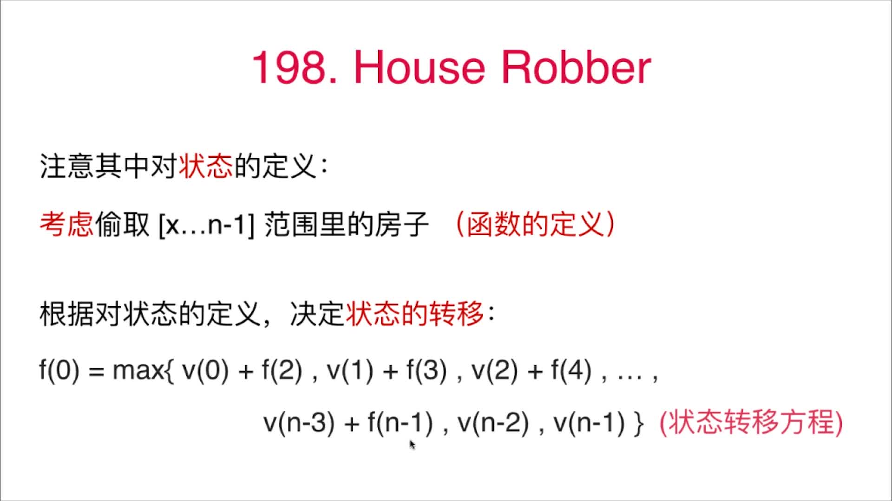

# 第9章 动态规划

## 9.1 什么是动态规划
> 以菲波那切数列求和为例，通过

+ 1.[普通的递归](src/main/java/Chapter09DynamicAllocate/Section1Fibonacci/Solution1.java)
+ 2.[引入记忆数组memo](src/main/java/Chapter09DynamicAllocate/Section1Fibonacci/Solution2.java)
+ 3.[自下而上地解决问题，即动态规划](src/main/java/Chapter09DynamicAllocate/Section1Fibonacci/Solution3.java)

三个步骤引出了动态规划

### 动态规划的定义

> dynamic programming (also known as dynamic optimization) is a method for solving a complex problem by breaking it down into a collection of simpler subproblems, solving each of those subproblems just once, and storing their solutions – ideally, using a memory-based data structure.

> 将原问题拆解成若干子问题，同时保存子问题的答案，使得每个子问题只求解一次，最终获得原问题的答案。

简单说：自下而上地，先解决最小子问题，然后最小子问题不断向上推，最终解决完整的问题


体会其中自下而上地解决问题的思路，有点类似数学归纳法

### 递归与动态规划的联系和区别


### LeetCode上的对应题目：[509. 斐波那契数](https://leetcode-cn.com/problems/fibonacci-number/submissions/)
```java
class Solution {
    /**
     * 自下而上地解决问题，也称动态规划，有点像数学归纳法
     */
    public int fib(int n) {
        if(n == 0 || n == 1){
            return n;
        }
        List<Integer> memo = new ArrayList<>(n + 1);
        for (int i = 0; i < n + 1; i++) {
            memo.add(-1);
        }
        memo.set(0, 0);
        memo.set(1, 1);
        for (int i = 2; i <= n; i++) {
            memo.set(i, memo.get(i - 1) + memo.get(i - 2));
        }
        return memo.get(n);
    }
}
```

## 9.2 第一个动态规划问题：[70.Climbing Stairs](https://leetcode-cn.com/problems/climbing-stairs/)
> 有一个楼梯，总共有n阶台阶。每一次，可以上一个台阶，也可以上两个台阶。问，爬上这样的一个楼梯，一共有多少不同的方法？
> 如 n = 3，可以爬上这个楼梯的方法有：[1,1,1] , [1,2] , [2,1]  , 所以答案为3

### 一、递归法(可以看到有重复子问题存在)


代码见[ClimbingStairs的递归求解](src/main/java/Chapter09DynamicAllocate/Section2ClimbingStairs/Solution1.java)
```java
public class Solution1 {

    public static int num;

    public int climbStairs(int n) {
        num++;
        if (n == 0) {
            return 1;
        }
        if (n == 1) {
            return 1;
        }

        return climbStairs(n - 1) + climbStairs(n - 2);
    }

    public static void main(String[] args) {
        int n = 20;
        int ways = new Solution1().climbStairs(n);
        System.out.println("一共有" + ways + "种爬楼梯的方法");
        System.out.println("一共进入递归函数" + num + "次");
    }
}

/**
 * 输出如下：
 * <p>
 * 一共有10946种爬楼梯的方法
 * 一共进入递归函数21891次
 */
```

但是实际这个方法是存在重复子问题地，如下图蓝框所示：


### 二、记忆数组法
```java
public class Solution2 {


    public static int num;
    /**
     * 记忆数组memory，用于存储子问题是否已经被访问
     */
    public static int[] memo;

    public int climbStairs(int n) {
        num++;
        if (n == 0) {
            return 1;
        }
        if (n == 1) {
            return 1;
        }

        if (memo[n] == -1) {
            memo[n] = climbStairs(n - 1) + climbStairs(n - 2);
        }
        return memo[n];
    }

    public static void main(String[] args) {
        int n = 20;
        memo = new int[n + 1];
        Arrays.fill(memo, -1);
        int ways = new Solution2().climbStairs(n);
        System.out.println("一共有" + ways + "种爬楼梯的方法");
        System.out.println("一共进入递归函数" + num + "次");
    }
}

/**
 * 输出如下(可以看到记忆数组节省了大量进入递归的操作)：
 * <p>
 * 一共有10946种爬楼梯的方法
 * 一共进入递归函数39次
 */
```

### 三、动态规划法
```java
public class Solution3 {
    public int climbStairs(int n) {
        if(n == 1 || n ==2){
            return n;
        }
        /**
         * 记忆数组memory，用于存储子问题是否已经被访问
         */
        int[] memo = new int[n + 1];
        memo[1] = 1;
        memo[2] = 2;
        for (int i = 3; i <= n; i++) {
            memo[i] = memo[i - 1] + memo[i - 2];
        }
        return memo[n];
    }

    public static void main(String[] args) {
        int n = 20;
        int ways = new Solution3().climbStairs(n);
        System.out.println("一共有" + ways + "种爬楼梯的方法");
        System.out.println("非递归法，不需要递归函数");
    }
}

/**
 * 输出如下：
 * <p>
 * 一共有-10946种爬楼梯的方法
 * 非递归法，不需要递归函数
 */
```

> 类似的问题还有120号和64号问题

### [120.三角形最小路径和](https://leetcode-cn.com/problems/triangle/)
+ 1.[普通的递归](src/main/java/Chapter09DynamicAllocate/Section2ClimbingStairs/LeetCode120Triangle/解法1_纯递归实现.java)
+ 2.[引入记忆数组memo，跳过重复子问题](src/main/java/Chapter09DynamicAllocate/Section2ClimbingStairs/LeetCode120Triangle/解法2_递归加记忆数组去除重复递归.java)
+ 3.[自下而上地解决问题，即动态规划](src/main/java/Chapter09DynamicAllocate/Section2ClimbingStairs/LeetCode120Triangle/解法3_动态规划实现.java)

### [64.最小路径和](https://leetcode-cn.com/problems/minimum-path-sum/)
+ 1.[普通的递归](src/main/java/Chapter09DynamicAllocate/Section2ClimbingStairs/LeetCode64最小路径和/解法1_纯递归实现.java)
+ 2.[引入记忆数组memo，跳过重复子问题](src/main/java/Chapter09DynamicAllocate/Section2ClimbingStairs/LeetCode64最小路径和/解法2_递归加记忆数组去除重复子问题.java)
+ 3.[自下而上地解决问题，即动态规划](src/main/java/Chapter09DynamicAllocate/Section2ClimbingStairs/LeetCode64最小路径和/解法3_动态规划实现.java)


## 9.3 发现重叠子问题:[343.整数拆分](https://leetcode-cn.com/problems/integer-break/)

```text
给定一个正整数 n，将其拆分为至少两个正整数的和，并使这些整数的乘积最大化。 返回你可以获得的最大乘积。

示例 1:

输入: 2
输出: 1
解释: 2 = 1 + 1, 1 × 1 = 1。
示例 2:

输入: 10
输出: 36
解释: 10 = 3 + 3 + 4, 3 × 3 × 4 = 36。
```

### 拆分4为例，发现存在重复子问题


### 扩展搭配拆分n,重复子问题就更多了


### 经过前两节可知，可以用`记忆数组`或者`动态规划`的方法来大大提高代码效率

> 最优子结构的含义：通过求解子问题的最优解，可以获得原问题的最优解


### 代码

+ [纯递归](src/main/java/Chapter09DynamicAllocate/Section3IntegerBreak/Solution1.java)
+ [递归+记忆数组](src/main/java/Chapter09DynamicAllocate/Section3IntegerBreak/Solution2.java)
+ [动态规划实现](src/main/java/Chapter09DynamicAllocate/Section3IntegerBreak/Solution3.java)

> 类似问题还有279、91、62、63号问题
### [279.完全平方数](https://leetcode-cn.com/problems/perfect-squares/)
> 在[第06章_栈和队列.md#65-bfs和图的最短路径279完全平方数](../Part3Practise/第06章_栈和队列.md#65-bfs和图的最短路径279完全平方数)中用BFS实现过
```java
class Solution {
    public int numSquares(int n) {
        // meme[i]代表找到若干个完全平方数（比如 1, 4, 9, 16, ...）使得它们的和等于 n
        int[] memo = new int[n + 1];
        Arrays.fill(memo, Integer.MAX_VALUE);
        memo[0] = 0;
        memo[1] = 1;
        for (int i = 2; i <= n; i++) {
            for (int j = 1; i - j * j >= 0; j++) {
                // 之所以还要和memo[i]比较是因为在内层循环中会不算更新meme[i]
                memo[i] = Math.min(memo[i], memo[i - j * j] + 1);
            }
        }
        return memo[n];
    }
}
```
### [91.解码方法](https://leetcode-cn.com/problems/decode-ways/)
```java
class Solution {
    public int numDecodings(String s) {
        int n = s.length();
        if (n == 0) {
            return 0;
        }
        int[] memo = new int[n + 1];
        memo[n] = 1;
        memo[n - 1] = s.charAt(n - 1) != '0' ? 1 : 0;
        for (int i = n - 2; i >= 0; i--) {
            if (s.charAt(i) != '0') {
                memo[i] = (Integer.parseInt(s.substring(i, i + 2)) <= 26) ? memo[i + 1] + memo[i + 2] : memo[i + 1];
            }
        }
        return memo[0];
    }
}
```
### [62.不同路径](https://leetcode-cn.com/problems/unique-paths/)
### [63.不同路径 II](https://leetcode-cn.com/problems/unique-paths-ii/)

## 9.4 状态的定义和转移 198.House Robber

```text
你是一个专业的小偷，计划偷窃沿街的房屋。每间房内都藏有一定的现金，影响你偷窃的唯一制约因素就是相邻的房屋装有相互连通的防盗系统，如果两间相邻的房屋在同一晚上被小偷闯入，系统会自动报警。

给定一个代表每个房屋存放金额的非负整数数组，计算你在不触动警报装置的情况下，能够偷窃到的最高金额。

示例 1:

输入: [1,2,3,1]
输出: 4
解释: 偷窃 1 号房屋 (金额 = 1) ，然后偷窃 3 号房屋 (金额 = 3)。
     偷窃到的最高金额 = 1 + 3 = 4 。
示例 2:

输入: [2,7,9,3,1]
输出: 12
解释: 偷窃 1 号房屋 (金额 = 2), 偷窃 3 号房屋 (金额 = 9)，接着偷窃 5 号房屋 (金额 = 1)。
     偷窃到的最高金额 = 2 + 9 + 1 = 12 。
```

### 递归过程分析如下

> 可以看到存在重复子问题


## 状态转移方程



+ f(2)表示从2~`n-1`的房子
+ f(3)表示从3~`n-1`的房子
......
+ f(n-1)表示从`n-1`~`n-1`之间的房子，实际只有一个
+ v(n-2)等效于v(n-2)+f(n)，f(n)表示n~`n-1`之间的房子，实际是没有地
+ v(n-1)等效于v(n-1)+f(n+1)，f(n)表示`n+1~`n-1`之间的房子，实际是没有地

类似的问题
+ [213.打家劫舍 II](https://leetcode-cn.com/problems/house-robber-ii/)
+ [337.打家劫舍 III](https://leetcode-cn.com/problems/house-robber-iii/)
+ [309.最佳买卖股票时机含冷冻期](https://leetcode-cn.com/problems/best-time-to-buy-and-sell-stock-with-cooldown/)

## 9.5 0-1背包问题

> 有一个背包，它的容量为C (Capacity)，。现在有n种不同的物品，编号为0...n-1，其中每一件物品的重量为w(i)，价值为v(i)。问可以向这个背包中盛放哪些物品，使得在不超过背包`容量`(`容量即可以容纳地最大重量`)的基础上，物品的总价值最大。

### 0-1背包问题的状态方程

```shell
# F( n , C ) 表示将n个物品放进容量为C的背包，使得价值最大.v表示value即价值，w表示weight即重量值
F ( i , c )  =   F( i-1 , c ) # 情况1：第i个物品不再放入容器，价值已经最大了,i和i-1对应的值相同

或者

F ( i , c )  =   v(i) + F( i-1 , c - w(i) ) # 情况2：第i个物品放入容器，那么当前的容量往下递归时需要减去i的重量w(i),并加上i的价值v(i)

所以最大价值的公式是：

F ( i , c )  =   max( F( i-1 , c ) , v(i) + F( i-1 , c - w(i) )
```

### 背包问题的动态规划过程举例


代码如下, 自己debug调试下：

```java
/***********************************************************
 * @Description : 递归求解背包问题，记忆数组实现，避免了重复子问题
 * @author      : 梁山广(Liang Shan Guang)
 * @date        : 2019/8/24 20:31
 * @email       : liangshanguang2@gmail.com
 ***********************************************************/
package Chapter09DynamicAllocate.Section5Knapsack;

public class Solution3Dynamic {

    /**
     * 背包问题：在容量C下求最大价值
     *
     * @param w 重量weight数组
     * @param v 价值value数组
     * @param C 容器总容量
     * @return 背包问题的总价值
     */
    public int knapsack(int[] w, int[] v, int C) {

        if (w == null || v == null || w.length != v.length) {
            throw new IllegalArgumentException("Invalid w or v");
        }

        if (C < 0) {
            throw new IllegalArgumentException("C must be greater or equal to zero.");
        }

        int n = w.length;
        if (n == 0 || C == 0) {
            return 0;
        }

        int[][] memo = new int[n][C + 1];
        for (int i = 0; i < n; i++) {
            for (int j = 0; j < C + 1; j++) {
                memo[i][j] = -1;
            }
        }


        for (int j = 0; j <= C; j++) {
            // 对第0个物体遍历所有的容量可能值.当容量值大于第0个物体的重量时就取底0个物体的容量值，否则取0
            memo[0][j] = j >= w[0] ? v[0] : 0;
        }

        // 计算0往后的物体
        for (int i = 1; i < n; i++) {
            for (int j = 0; j <= C; j++) {
                if (j >= w[i]) { // 如果当前容量大于等于第i个物体的重量，那么就尝试下放入新物体
                    // 上一个物体加入时的最大价值memo[i-1][j]
                    // 与
                    // 新物体加入后的价值v[i] + memo[i-1][j-w[i]]
                    // 两者中的较大值
                    memo[i][j] = Math.max(memo[i - 1][j], v[i] + memo[i - 1][j - w[i]]);
                } else { // 如果当前容量小于第i个物体的重量，就不用放入新物体了，直接用上一步求地最大价值即可
                    memo[i][j] = memo[i - 1][j];
                }
            }
        }
        return memo[n - 1][C];
    }

    public static void main(String[] args) {
        int[] weight = {1, 2, 3};
        int[] value = {6, 10, 12};
        int C = 5;
        int bestValue = new Solution3Dynamic().knapsack(weight, value, C);
        System.out.println("最大价值是：" + bestValue);
        System.out.println("动态规划不需要进入递归");
    }
}

/**
 * 输出结果为(动态规划不需要进入递归)：
 * <p>
 * 最大价值是：22
 * 动态规划不需要进入递归
 */
```

### 多种实现方法

+ [纯递归实现](src/main/java/Chapter09DynamicAllocate/Section5Knapsack/Solution1Recur.java)
+ [递归+记忆数组去除递归重复子问题](src/main/java/Chapter09DynamicAllocate/Section5Knapsack/Solution2Memo.java)
+ [动态递归实现，也是上面图示的实现](src/main/java/Chapter09DynamicAllocate/Section5Knapsack/Solution3Dynamic.java)

## 9.6 背包问题的优化和变种

### 背包问题的时间复杂度和空间复杂度

+ 时间复杂度：O(n * C)
+ 空间复杂度：O(n * C)

### 空间复杂度的优化

F( n , C ) 考虑将n个物品放进容量为C的背包，使得价值最大

```text
F ( i , c )  =   max( F( i-1 , c ) , v(i) + F( i-1 , c - w(i) )
```

第i行元素只依赖于第i-1行元素。理论上，只需要保持两行元素。
空间复杂度：`O( 2 * C ) = O(C)`

代码见[空间复杂度的优化](src/main/java/Chapter09DynamicAllocate/Section6KnapsackOptimize/Solution3DynamicSpaceOptimize.java)

### 时间复杂度优化


代码见[时间复杂度优化](src/main/java/Chapter09DynamicAllocate/Section6KnapsackOptimize/Solution3DynamicTimeOptimize.java)

### 0-1背包问题更多变种

+ 多重背包问题：每个物品不止1个，有num(i)个
+ 多维费用背包问题：要考虑物品的体积和重量两个维度？
+ 物品间加入更多约束
+ 物品间可以互相排斥；也可以互相依赖
+ 完全背包问题：每个物品可以无限使用

## 9.7 面试中的0-1背包问题 416.Partition Equal Subset Sum

> 416.分割等和子集

### 题干

给定一个只包含正整数的非空数组。是否可以将这个数组分割成两个子集，使得两个子集的元素和相等。

注意:

+ 每个数组中的元素不会超过 100 
+ 数组的大小不会超过 200

上面连个条件的含义是：
+ 所有数字和最大为`20000`
+ 背包最大为`100^2=10000`
+ 时间复杂度为：`n*sum/2 = 100*10000 = 100万`

示例 1:
    输入: `[1, 5, 11, 5]`
    输出: `true`
    解释: 数组可以分割成 `[1, 5, 5]` 和 `[11]`
 
示例 2:
    输入: `[1, 2, 3, 5]`
    输出: `false`
    解释: 数组不能分割成两个元素和相等的子集.


### 题目分析

典型的背包问题，在n个物品中选出一定物品，填满sum/2的背包

F( n , C ) 考虑将n个物品填满容量为C的背包

```shell
F ( i , c )  =   F( i-1 , c ) || F( i-1 , c - w(i) )
```

时间复杂度：`O( n * sum/2 ) = O( n * sum )`

### 代码实现

+ [纯递归实现](src/main/java/Chapter09DynamicAllocate/Section7PartitionEqualSubsetSum/Solution1Recur.java)
+ [递归+记忆数组去除递归重复子问题](src/main/java/Chapter09DynamicAllocate/Section7PartitionEqualSubsetSum/Solution2Memo.java)
+ [动态递归实现，也是上面图示的实现](src/main/java/Chapter09DynamicAllocate/Section7PartitionEqualSubsetSum/Solution3Dynamic.java)

### 类似问题

+ 322.Coin Change
+ 377.Combination Sum IV
+ 474.Ones And Zeroes
+ 139.Word Break
+ 494.Target Sum

## 9.8 LIS问题 Longest Increasing Subsequence

### 题干

```text
300. 最长上升子序列

给定一个无序的整数数组，找到其中最长上升子序列的长度。

示例:

输入: [10,9,2,5,3,7,101,18]
输出: 4 
解释: 最长的上升子序列是 [2,3,7,101]，它的长度是 4。
说明:

可能会有多种最长上升子序列的组合，你只需要输出对应的长度即可。
你算法的时间复杂度应该为 O(n2) 。
进阶: 你能将算法的时间复杂度降低到 O(n log n) 吗?

注意：
注意1：什么是子序列？
注意2：什么是上升？
注意3：一个序列可能有多个最长上升子序列；但这个最长的长度只有1个
```

### 暴力解法

选择所有的子序列进行判断：`O( (2^n) * n )`

### 动态规划解法

`LIS(i)` 表示以第 i 个数字为结尾的最长上升子序列的长度

`LIS(i)` 表示 `[0...i]` 的范围内，选择数字`nums[i]`可以获得的最长上升子序列的长度

nums[]表示存放数字的数组，这里认为是总的序列

```text
LIS(i) = max( 1 + LIS(j) if nums[i] > nums[j] )
         j<i
```

### 最长上升子序列举例

例子1：


例子2：


### 动态规划实现

[代码实现](src/main/java/Chapter09DynamicAllocate/Section8LongestIncreasingSubsequence/Solution.java)

### 类似题目 

+ [376. 摆动序列 wiggle subsequence](https://leetcode-cn.com/problems/wiggle-subsequence/)

## 9.9 LCS、最短路、求动态规划的具体解以及更多

### LCS 最共公共子字符串问题


