# 第9章 动态规划

## 9.1 什么是动态规划
> 以菲波那切数列求和为例，通过

+ 1.[普通的递归](src/main/java/Chapter09DynamicAllocate/Section1Fibonacci/Solution1.java)
+ 2.[引入记忆数组memo](src/main/java/Chapter09DynamicAllocate/Section1Fibonacci/Solution2.java)
+ 3.[自下而上地解决问题，即动态规划](src/main/java/Chapter09DynamicAllocate/Section1Fibonacci/Solution3.java)

三个步骤引出了动态规划

### 动态规划的定义

> dynamic programming (also known as dynamic optimization) is a method for solving a complex problem by breaking it down into a collection of simpler subproblems, solving each of those subproblems just once, and storing their solutions – ideally, using a memory-based data structure.

> 将原问题拆解成若干子问题，同时保存子问题的答案，使得每个子问题只求解一次，最终获得原问题的答案。

简单说：自下而上地，先解决最小子问题，然后最小子问题不断向上推，最终解决完整的问题


体会其中自下而上地解决问题的思路，有点类似数学归纳法

### 递归与动态规划的联系和区别


### LeetCode上的对应题目：[509. 斐波那契数](https://leetcode-cn.com/problems/fibonacci-number/submissions/)
```java
class Solution {
    /**
     * 自下而上地解决问题，也称动态规划，有点像数学归纳法
     */
    public int fib(int n) {
        if(n == 0 || n == 1){
            return n;
        }
        List<Integer> memo = new ArrayList<>(n + 1);
        for (int i = 0; i < n + 1; i++) {
            memo.add(-1);
        }
        memo.set(0, 0);
        memo.set(1, 1);
        for (int i = 2; i <= n; i++) {
            memo.set(i, memo.get(i - 1) + memo.get(i - 2));
        }
        return memo.get(n);
    }
}
```

## 9.2 第一个动态规划问题：[70.Climbing Stairs](https://leetcode-cn.com/problems/climbing-stairs/)
> 有一个楼梯，总共有n阶台阶。每一次，可以上一个台阶，也可以上两个台阶。问，爬上这样的一个楼梯，一共有多少不同的方法？
> 如 n = 3，可以爬上这个楼梯的方法有：[1,1,1] , [1,2] , [2,1]  , 所以答案为3

### 一、递归法(可以看到有重复子问题存在)

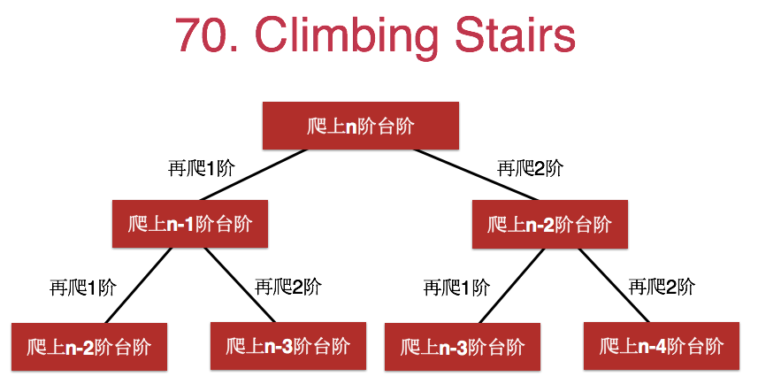

代码见[ClimbingStairs的递归求解](src/main/java/Chapter09DynamicAllocate/Section2ClimbingStairs/Solution1.java)
```java
public class Solution1 {

    public static int num;

    public int climbStairs(int n) {
        num++;
        if (n == 0) {
            return 1;
        }
        if (n == 1) {
            return 1;
        }

        return climbStairs(n - 1) + climbStairs(n - 2);
    }

    public static void main(String[] args) {
        int n = 20;
        int ways = new Solution1().climbStairs(n);
        System.out.println("一共有" + ways + "种爬楼梯的方法");
        System.out.println("一共进入递归函数" + num + "次");
    }
}

/**
 * 输出如下：
 * <p>
 * 一共有10946种爬楼梯的方法
 * 一共进入递归函数21891次
 */
```

但是实际这个方法是存在重复子问题地，如下图蓝框所示：


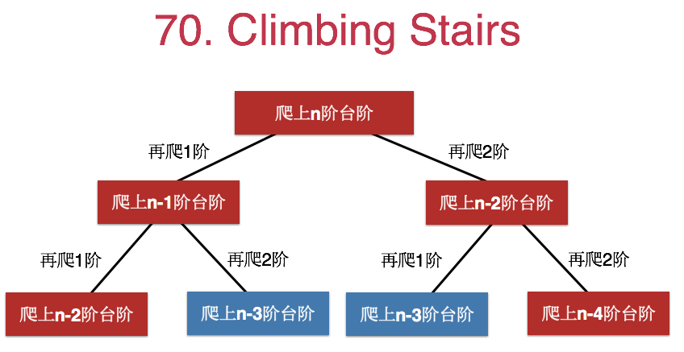

### 二、记忆数组法
```java
public class Solution2 {


    public static int num;
    /**
     * 记忆数组memory，用于存储子问题是否已经被访问
     */
    public static int[] memo;

    public int climbStairs(int n) {
        num++;
        if (n == 0) {
            return 1;
        }
        if (n == 1) {
            return 1;
        }

        if (memo[n] == -1) {
            memo[n] = climbStairs(n - 1) + climbStairs(n - 2);
        }
        return memo[n];
    }

    public static void main(String[] args) {
        int n = 20;
        memo = new int[n + 1];
        Arrays.fill(memo, -1);
        int ways = new Solution2().climbStairs(n);
        System.out.println("一共有" + ways + "种爬楼梯的方法");
        System.out.println("一共进入递归函数" + num + "次");
    }
}

/**
 * 输出如下(可以看到记忆数组节省了大量进入递归的操作)：
 * <p>
 * 一共有10946种爬楼梯的方法
 * 一共进入递归函数39次
 */
```

### 三、动态规划法
```java
public class Solution3 {
    public int climbStairs(int n) {
        if(n == 1 || n ==2){
            return n;
        }
        /**
         * 记忆数组memory，用于存储子问题是否已经被访问
         */
        int[] memo = new int[n + 1];
        memo[1] = 1;
        memo[2] = 2;
        for (int i = 3; i <= n; i++) {
            memo[i] = memo[i - 1] + memo[i - 2];
        }
        return memo[n];
    }

    public static void main(String[] args) {
        int n = 20;
        int ways = new Solution3().climbStairs(n);
        System.out.println("一共有" + ways + "种爬楼梯的方法");
        System.out.println("非递归法，不需要递归函数");
    }
}

/**
 * 输出如下：
 * <p>
 * 一共有-10946种爬楼梯的方法
 * 非递归法，不需要递归函数
 */
```

> 类似的问题还有120号和64号问题

### [120.三角形最小路径和](https://leetcode-cn.com/problems/triangle/)
+ 1.[普通的递归](src/main/java/Chapter09DynamicAllocate/Section2ClimbingStairs/LeetCode120Triangle/解法1_纯递归实现.java)
+ 2.[引入记忆数组memo，跳过重复子问题](src/main/java/Chapter09DynamicAllocate/Section2ClimbingStairs/LeetCode120Triangle/解法2_递归加记忆数组去除重复递归.java)
+ 3.[自下而上地解决问题，即动态规划](src/main/java/Chapter09DynamicAllocate/Section2ClimbingStairs/LeetCode120Triangle/解法3_动态规划实现.java)

### [64.最小路径和](https://leetcode-cn.com/problems/minimum-path-sum/)
+ 1.[普通的递归](src/main/java/Chapter09DynamicAllocate/Section2ClimbingStairs/LeetCode64最小路径和/解法1_纯递归实现.java)
+ 2.[引入记忆数组memo，跳过重复子问题](src/main/java/Chapter09DynamicAllocate/Section2ClimbingStairs/LeetCode64最小路径和/解法2_递归加记忆数组去除重复子问题.java)
+ 3.[自下而上地解决问题，即动态规划](src/main/java/Chapter09DynamicAllocate/Section2ClimbingStairs/LeetCode64最小路径和/解法3_动态规划实现.java)


## 9.3 发现重叠子问题:[343.整数拆分](https://leetcode-cn.com/problems/integer-break/)

```text
给定一个正整数 n，将其拆分为至少两个正整数的和，并使这些整数的乘积最大化。 返回你可以获得的最大乘积。

示例 1:

输入: 2
输出: 1
解释: 2 = 1 + 1, 1 × 1 = 1。
示例 2:

输入: 10
输出: 36
解释: 10 = 3 + 3 + 4, 3 × 3 × 4 = 36。
```

### 拆分4为例，发现存在重复子问题

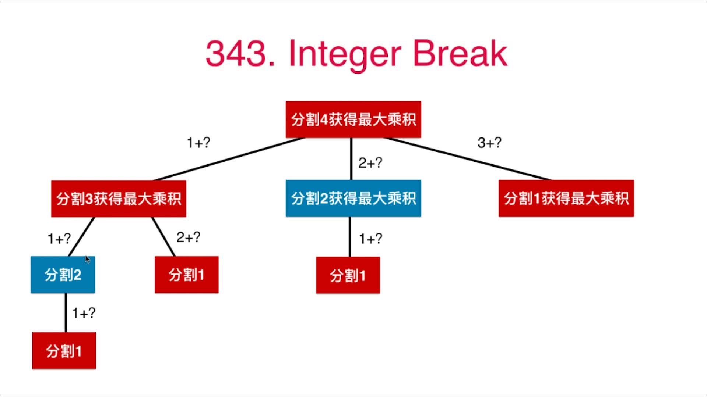

### 扩展搭配拆分n,重复子问题就更多了

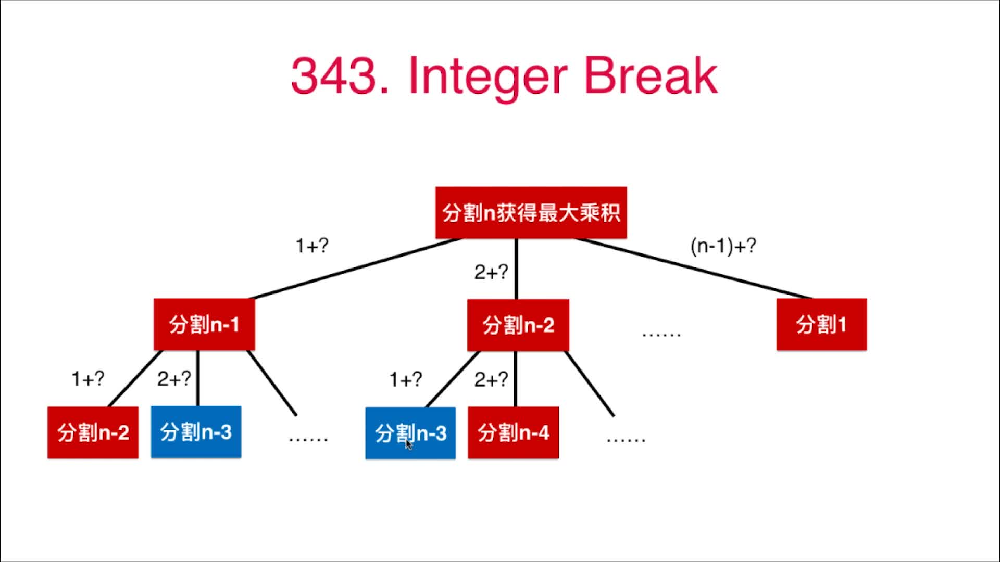

### 经过前两节可知，可以用`记忆数组`或者`动态规划`的方法来大大提高代码效率

> 最优子结构的含义：通过求解子问题的最优解，可以获得原问题的最优解


### 代码

+ [纯递归](src/main/java/Chapter09DynamicAllocate/Section3IntegerBreak/Solution1.java)
+ [递归+记忆数组](src/main/java/Chapter09DynamicAllocate/Section3IntegerBreak/Solution2.java)
+ [动态规划实现](src/main/java/Chapter09DynamicAllocate/Section3IntegerBreak/Solution3.java)

> 类似问题还有279、91、62、63号问题
### [279.完全平方数](https://leetcode-cn.com/problems/perfect-squares/)
> 在[第06章_栈和队列.md#65-bfs和图的最短路径279完全平方数](../Part3Practise/第06章_栈和队列.md#65-bfs和图的最短路径279完全平方数)中用BFS实现过
```java
class Solution {
    public int numSquares(int n) {
        // meme[i]代表找到若干个完全平方数（比如 1, 4, 9, 16, ...）使得它们的和等于 n
        int[] memo = new int[n + 1];
        Arrays.fill(memo, Integer.MAX_VALUE);
        memo[0] = 0;
        memo[1] = 1;
        for (int i = 2; i <= n; i++) {
            for (int j = 1; i - j * j >= 0; j++) {
                // 之所以还要和memo[i]比较是因为在内层循环中会不算更新meme[i]
                memo[i] = Math.min(memo[i], memo[i - j * j] + 1);
            }
        }
        return memo[n];
    }
}
```
### [91.解码方法](https://leetcode-cn.com/problems/decode-ways/)
```java
class Solution {
    public int numDecodings(String s) {
        int n = s.length();
        if (n == 0) {
            return 0;
        }
        int[] memo = new int[n + 1];
        memo[n] = 1;
        memo[n - 1] = s.charAt(n - 1) != '0' ? 1 : 0;
        for (int i = n - 2; i >= 0; i--) {
            if (s.charAt(i) != '0') {
                memo[i] = (Integer.parseInt(s.substring(i, i + 2)) <= 26) ? memo[i + 1] + memo[i + 2] : memo[i + 1];
            }
        }
        return memo[0];
    }
}
```
### [62.不同路径](https://leetcode-cn.com/problems/unique-paths/)
> 执行用时 : 0 ms , 在所有 Java 提交中击败了 100.00% 的用户 内存消耗 : 32.9 MB , 在所有 Java 提交中击败了 74.78% 的用户
```java
class Solution {
    public int uniquePaths(int m, int n) {
        int[][] memo = new int[m][n];
        for (int i = 0; i < m; i++) {
            for (int j = 0; j < n; j++) {
                if (i == 0 || j == 0) {
                    memo[i][j] = 1;
                    continue;
                }
                memo[i][j] = memo[i - 1][j] + memo[i][j - 1];
            }
        }
        return memo[m - 1][n - 1];
    }
}
```
### [63.不同路径 II](https://leetcode-cn.com/problems/unique-paths-ii/)
> 在62题的基础上要考虑足够多的特殊场景.
> 执行用时 : 2 ms , 在所有 Java 提交中击败了 90.06% 的用户 内存消耗 : 36.9 MB , 在所有 Java 提交中击败了 71.65% 的用户
```java
class Solution {
    public int uniquePathsWithObstacles(int[][] obstacleGrid) {
        int m = obstacleGrid.length;
        int n = obstacleGrid[0].length;
        int[][] memo = new int[m][n];
        if(obstacleGrid[0][0]==1 || obstacleGrid[m-1][n-1]==1){
            return 0;
        }
        for (int i = 0; i < m; i++) {
            for (int j = 0; j < n; j++) {
                memo[i][j] = -1;
            }
        }
        for (int i = 0; i < m; i++) {
            for (int j = 0; j < n; j++) {
                if (memo[i][j] != -1) {
                    // 已经处理过了就不要再处理了
                    continue;
                }
                if (i == 0) {
                    if (obstacleGrid[i][j] == 1) {
                        for (int k = j; k < n; k++) {
                            // 往后列的值都为0了
                            memo[i][k] = 0;
                        }
                    } else {
                        memo[i][j] = 1;
                    }
                    continue;
                }
                if (j == 0) {
                    if (obstacleGrid[i][j] == 1) {
                        for (int k = i; k < m; k++) {
                            // 往后列的值都为0了
                            memo[k][j] = 0;
                        }
                    } else {
                        memo[i][j] = 1;
                    }
                    continue;
                }
                if (obstacleGrid[i][j] == 1) {
                    memo[i][j] = 0;
                    continue;
                }
                memo[i][j] = memo[i - 1][j] + memo[i][j - 1];
            }
        }
        return memo[m - 1][n - 1];
    }
}
```

## 9.4 状态的定义和转移 [198.House Robber](https://leetcode-cn.com/problems/house-robber/)

```text
你是一个专业的小偷，计划偷窃沿街的房屋。每间房内都藏有一定的现金，影响你偷窃的唯一制约因素就是相邻的房屋装有相互连通的防盗系统，如果两间相邻的房屋在同一晚上被小偷闯入，系统会自动报警。

给定一个代表每个房屋存放金额的非负整数数组，计算你在不触动警报装置的情况下，能够偷窃到的最高金额。

示例 1:

输入: [1,2,3,1]
输出: 4
解释: 偷窃 1 号房屋 (金额 = 1) ，然后偷窃 3 号房屋 (金额 = 3)。
     偷窃到的最高金额 = 1 + 3 = 4 。
示例 2:

输入: [2,7,9,3,1]
输出: 12
解释: 偷窃 1 号房屋 (金额 = 2), 偷窃 3 号房屋 (金额 = 9)，接着偷窃 5 号房屋 (金额 = 1)。
     偷窃到的最高金额 = 2 + 9 + 1 = 12 。
```

### 递归过程分析如下

> 本节的分析是自上而下分析的，可以看到存在重复子问题。实际自下而上地分析更简单。下面的代码就是自下而上实现地

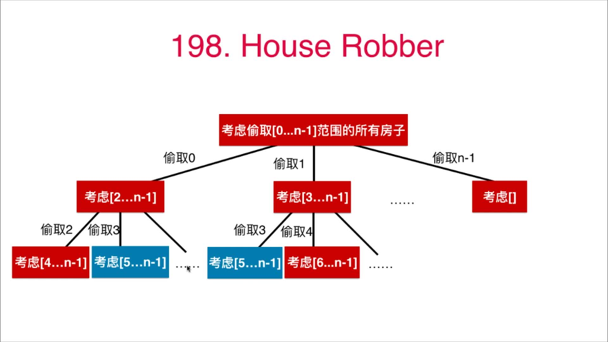

## 状态转移方程
> 本题中的状态转移方程为：`memo[i] = Math.max(nums[i] + memo[i - 2], memo[i - 1]);`

### 代码
> 下面的代码实际是从下往上进行的，解决基础的问题后不断向前推导，最终解决了完整的问题。老师的代码是从上往下地，不好理解

> 执行用时 : 0 ms , 在所有 Java 提交中击败了 100.00% 的用户 内存消耗 : 34 MB , 在所有 Java 提交中击败了 80.45% 的用户 
```java
class Solution {
    public int rob(int[] nums) {
        int n = nums.length;
        if(n == 0){
            return 0;
        }
        if(n == 1){
            return nums[0];
        }
        int[] memo = new int[n + 1];
        memo[0] = nums[0];
        memo[1] = Math.max(nums[0], nums[1]);
        for (int i = 2; i < n; i++) {
            memo[i] = Math.max(nums[i] + memo[i - 2], memo[i - 1]);
        }
        return memo[n - 1];
    }
}
```

类似的问题：213、337、309
### [213.打家劫舍 II](https://leetcode-cn.com/problems/house-robber-ii/)
> 第1个和最后一个不能同时抢，分别把第一个和最后一个从数组剔除，按照198的方法分别去求最多抢劫的钱，然后取一下两者中的较大者即可

> 执行用时 : 0 ms , 在所有 Java 提交中击败了 100.00% 的用户 内存消耗 : 34.2 MB , 在所有 Java 提交中击败了 42.36% 的用户
```java
public class Solution {
    // 198号问题实现地打家劫舍
    public int rob198(int[] nums) {
        int n = nums.length;
        if (n == 0) {
            return 0;
        }
        if (n == 1) {
            return nums[0];
        }
        int[] memo = new int[n + 1];
        memo[0] = nums[0];
        memo[1] = Math.max(nums[0], nums[1]);
        for (int i = 2; i < n; i++) {
            memo[i] = Math.max(nums[i] + memo[i - 2], memo[i - 1]);
        }
        return memo[n - 1];
    }

    // 核心是：第1个和最后一个不能同时抢，分别把第一个和最后一个从数组剔除，按照198的方法分别去求最多抢劫的钱，然后取一下两者中的较大者即可
    public int rob(int[] nums) {
        int n = nums.length;
        if (n == 0) {
            return 0;
        }
        if (n == 1) {
            return nums[0];
        }
        // 去除第一个元素
        int[] nums1 = new int[n - 1];
        for (int i = 1; i < n; i++) {
            nums1[i - 1] = nums[i];
        }
        // 去除最后一个元素
        int[] nums2 = new int[n - 1];
        for (int i = 0; i < n - 1; i++) {
            nums2[i] = nums[i];
        }
        return Math.max(rob198(nums1), rob198(nums2));
    }
}
```
### [337.打家劫舍 III](https://leetcode-cn.com/problems/house-robber-iii/)
> 递归遍历，当前节点作为根节点，按照当前节点被抢劫和未被抢劫统计最大值
```java
class Solution {
    public int rob(TreeNode root) {
        int[] res = doRob(root);
        // 返回抢根节点和不抢根节点两种情况下的最大值
        return Math.max(res[0], res[1]);
    }
    // 在遍历中找最大值
    private int[] doRob(TreeNode node){
        int[] res = new int[2];
        if(node == null){
            return res;
        }
        int[] left = doRob(node.left);
        int[] right = doRob(node.right);
        // 不抢当前的根节点node，直接比较左右子树即可
        res[0] = Math.max(left[0], left[1]) + Math.max(right[0], right[1]);
        // 抢当前根节点node，那么左右子树的根节点就不能抢了，所以left[1]和right[1]就不用考虑了
        res[1] = left[0] + right[0] + node.val;
        return res;
    }
 }
```
### [309.最佳买卖股票时机含冷冻期](https://leetcode-cn.com/problems/best-time-to-buy-and-sell-stock-with-cooldown/)
> 比较复杂的状态转移，涉及多个状态
```java
class Solution {
    public int maxProfit(int[] prices) {
        int n = prices.length;
        if(n == 0){
            return 0;
        }
        // sell[i]表示截至第i天，最后一个操作是卖时的最大收益；
        int[] sell = new int[n];
        // buy[i]表示截至第i天，最后一个操作是买时的最大收益；
        int[] buy  = new int[n];
        // cool[i]表示截至第i天，最后一个操作是冷冻期时的最大收益；
        int[] cool = new int[n];
        // 第一天是买入，纯赔钱.sell[0]和cool[0]用默认的0作为初始值即可
        buy[0] = -prices[0];
        for(int i = 1; i < n; i++){
            // 第一项表示第i天卖出，第二项表示第i天冷冻
            sell[i] = Math.max(buy[i - 1]  + prices[i], sell[i - 1]);
            // 第一项表示第i天买进，第二项表示第i天冷冻
            buy[i]  = Math.max(cool[i - 1] - prices[i], buy[i - 1]);
            // 根据题目的状态转换形式，cool[i]=sell[i-1]。其不存在从buy状态和cold状态再到cold状态的过程，只存在sell状态到cold状态。因此cool[i]=sell[i-1]的物理意义才是正确的.状态方程的第三个是没有任何意义的。
            cool[i] = sell[i - 1];
        }
        return sell[n - 1];
    }
}
```

## 9.5 0-1背包问题

> 有一个背包，它的容量为C (Capacity)，。现在有n种不同的物品，编号为0...n-1，其中每一件物品的重量为w(i)，价值为v(i)。问可以向这个背包中盛放哪些物品，使得在不超过背包`容量`(`容量即可以容纳地最大重量`)的基础上，物品的总价值最大。

### 0-1背包问题的状态方程

```shell script
# F( n , C ) 表示将n个物品放进容量为C的背包，使得价值最大.v表示value即价值，w表示weight即重量值
F ( i , c )  =   F( i-1 , c ) # 情况1：第i个物品不再放入容器，价值已经最大了,i和i-1对应的值相同
```
或者
```shell script
F ( i , c )  =   v(i) + F( i-1 , c - w(i) ) # 情况2：第i个物品放入容器，那么当前的容量往下递归时需要减去i的重量w(i),并加上i的价值v(i)
```
所以最大价值的状态转移方程是：
```shell script
F ( i , c )  =   max( F( i-1 , c ) , v(i) + F( i-1 , c - w(i) )
```

### 背包问题的动态规划过程举例

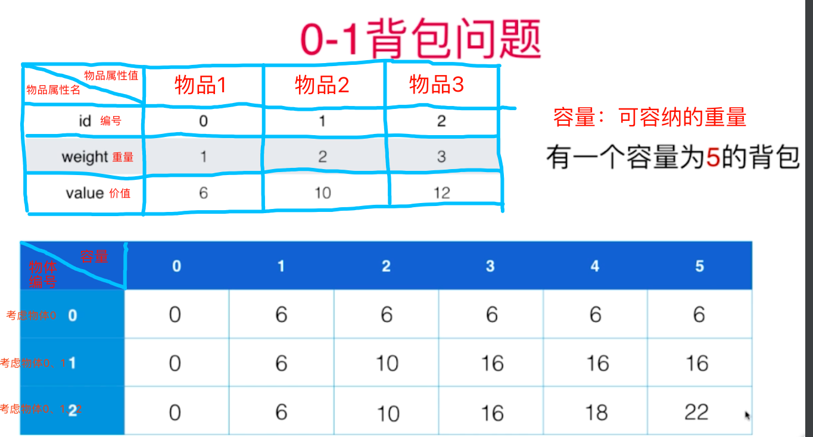

代码如下, 自己debug调试下：

```java
/***********************************************************
 * @Description : 递归求解背包问题，记忆数组实现，避免了重复子问题
 * @author      : 梁山广(Liang Shan Guang)
 * @date        : 2019/8/24 20:31
 * @email       : liangshanguang2@gmail.com
 ***********************************************************/
package Chapter09DynamicAllocate.Section5Knapsack;

public class Solution3Dynamic {

    /**
     * 背包问题：在容量C下求最大价值
     *
     * @param w 重量weight数组
     * @param v 价值value数组
     * @param C 容器总容量
     * @return 背包问题的总价值
     */
    public int knapsack(int[] w, int[] v, int C) {

        if (w == null || v == null || w.length != v.length) {
            throw new IllegalArgumentException("Invalid w or v");
        }

        if (C < 0) {
            throw new IllegalArgumentException("C must be greater or equal to zero.");
        }

        int n = w.length;
        if (n == 0 || C == 0) {
            return 0;
        }

        int[][] memo = new int[n][C + 1];
        for (int i = 0; i < n; i++) {
            for (int j = 0; j < C + 1; j++) {
                memo[i][j] = -1;
            }
        }


        for (int j = 0; j <= C; j++) {
            // 对第0个物体遍历所有的容量可能值.当容量值大于第0个物体的重量时就取底0个物体的容量值，否则取0
            memo[0][j] = j >= w[0] ? v[0] : 0;
        }

        // 计算0往后的物体
        for (int i = 1; i < n; i++) {
            for (int j = 0; j <= C; j++) {
                if (j >= w[i]) { // 如果当前容量大于等于第i个物体的重量，那么就尝试下放入新物体
                    // 上一个物体加入时的最大价值memo[i-1][j]
                    // 与
                    // 新物体加入后的价值v[i] + memo[i-1][j-w[i]]
                    // 两者中的较大值
                    memo[i][j] = Math.max(memo[i - 1][j], v[i] + memo[i - 1][j - w[i]]);
                } else { // 如果当前容量小于第i个物体的重量，就不用放入新物体了，直接用上一步求地最大价值即可
                    memo[i][j] = memo[i - 1][j];
                }
            }
        }
        return memo[n - 1][C];
    }

    public static void main(String[] args) {
        int[] weight = {1, 2, 3};
        int[] value = {6, 10, 12};
        int C = 5;
        int bestValue = new Solution3Dynamic().knapsack(weight, value, C);
        System.out.println("最大价值是：" + bestValue);
        System.out.println("动态规划不需要进入递归");
    }
}

/**
 * 输出结果为(动态规划不需要进入递归)：
 * <p>
 * 最大价值是：22
 * 动态规划不需要进入递归
 */
```

### 多种实现方法

+ [纯递归实现](src/main/java/Chapter09DynamicAllocate/Section5Knapsack/Solution1Recur.java)
+ [递归+记忆数组去除递归重复子问题](src/main/java/Chapter09DynamicAllocate/Section5Knapsack/Solution2Memo.java)
+ [动态递归实现，也是上面图示的实现](src/main/java/Chapter09DynamicAllocate/Section5Knapsack/Solution3Dynamic.java)

## 9.6 背包问题的优化和变种

### 背包问题的时间复杂度和空间复杂度

+ 时间复杂度：O(n * C)
+ 空间复杂度：O(n * C)

### 空间复杂度的优化

F( n , C ) 考虑将n个物品放进容量为C的背包，使得价值最大

```text
F ( i , c )  =   max( F( i-1 , c ) , v(i) + F( i-1 , c - w(i) )
```

第i行元素只依赖于第i-1行元素。理论上，只需要保持两行元素。
空间复杂度：`O( 2 * C ) = O(C)`

代码见[空间复杂度的优化](src/main/java/Chapter09DynamicAllocate/Section6KnapsackOptimize/Solution3DynamicSpaceOptimize.java)

### 时间复杂度优化


代码见[时间复杂度优化](src/main/java/Chapter09DynamicAllocate/Section6KnapsackOptimize/Solution3DynamicTimeOptimize.java)

### 0-1背包问题更多变种

+ 多重背包问题：每个物品不止1个，有num(i)个
+ 多维费用背包问题：要考虑物品的体积和重量两个维度？
+ 物品间加入更多约束
+ 物品间可以互相排斥；也可以互相依赖
+ 完全背包问题：每个物品可以无限使用

## 9.7 面试中的0-1背包问题[416.分割等和子集](https://leetcode-cn.com/problems/partition-equal-subset-sum/)

### 题干

给定一个只包含正整数的非空数组。是否可以将这个数组分割成两个子集，使得两个子集的元素和相等。

注意:

+ 每个数组中的元素不会超过 100 
+ 数组的大小不会超过 200

上面连个条件的含义是：
+ 所有数字和最大为`20000`
+ 背包最大为`100^2=10000`
+ 时间复杂度为：`n*sum/2 = 100*10000 = 100万`

示例 1:
    输入: `[1, 5, 11, 5]`
    输出: `true`
    解释: 数组可以分割成 `[1, 5, 5]` 和 `[11]`
 
示例 2:
    输入: `[1, 2, 3, 5]`
    输出: `false`
    解释: 数组不能分割成两个元素和相等的子集.


### 题目分析

典型的背包问题，在n个物品中选出一定物品，填满sum/2的背包

F( n , C ) 考虑将n个物品填满容量为C的背包

```shell script
F ( i , c )  =   F( i-1 , c ) || F( i-1 , c - w(i) )
```

时间复杂度：`O( n * sum/2 ) = O( n * sum )`

### 代码实现

+ [纯递归实现](src/main/java/Chapter09DynamicAllocate/Section7PartitionEqualSubsetSum/Solution1Recur.java)
+ [递归+记忆数组去除递归重复子问题](src/main/java/Chapter09DynamicAllocate/Section7PartitionEqualSubsetSum/Solution2Memo.java)
+ [动态递归实现，也是上面图示的实现](src/main/java/Chapter09DynamicAllocate/Section7PartitionEqualSubsetSum/Solution3Dynamic.java)

```java
// 从n个物体中选择几个，使得其和等于sum/2
class Solution {
    /**
     * nums[i]表示第i个物体的重量
     *
     * @param nums 存放物体重量的数组
     * @return 是否存在等和子集
     */
    public boolean canPartition(int[] nums) {

        int sum = 0;
        for (int i = 0; i < nums.length; i++) {
            assert nums[i] > 0;
            sum += nums[i];
        }
        // 能整除2才能分成两个相等的子集
        if (sum % 2 != 0) {
            return false;
        }
        // 数组长度
        int n = nums.length;
        // 背包的容量，除以2是因为要看是否可以划分为两个相等的子集
        int C = sum / 2;
        boolean[] memo = new boolean[C + 1];
        // 数组初始化为false
        Arrays.fill(memo, false);
        for (int i = 0; i < C + 1; i++) {
            memo[i] = (nums[0] == i);
        }

        // 背包问题的核心过程
        for (int i = 1; i < n; i++) { // i代表物体编号
            for (int j = C; j >= nums[i]; j--) { // j代表当前背包剩余的容量
                memo[j] = memo[j] || memo[j - nums[i]]; // 如果之前j处的容量或者减去nums[i]后剩余的容量已经能被填满，则说明可以分割
            }
        }
        return memo[C];
    }
}
```

### 类似问题

+ [322.零钱兑换](https://leetcode-cn.com/problems/coin-change/)
+ [377.组合总和 Ⅳ](https://leetcode-cn.com/problems/combination-sum-iv/)
+ [474.一和零们](https://leetcode-cn.com/problems/ones-and-zeroes/)
+ [139.单词分割](https://leetcode-cn.com/problems/word-break/)
+ [494.目标和](https://leetcode-cn.com/problems/target-sum/)

### [322.零钱兑换](https://leetcode-cn.com/problems/coin-change/)
```java
class Solution {
    public int coinChange(int[] coins, int amount) {
        if (coins.length == 0) {
            return -1;
        }

        //dp[j]代表当钱包的总价值为j时，所需要的最少硬币的个数
        int[] dp = new int[amount + 1];
        Arrays.fill(dp, Integer.MAX_VALUE);
        // 钱包总价值为0时，需要的最少硬币数肯定是0，这是动态规划的开始
        dp[0] = 0;
        //i代表可以使用的硬币索引，i=2代表只在第0个，第1个，第2个这三个硬币中选择硬币
        for (int i = 0; i < coins.length; i++) {
            /**
             * 	当外层循环执行一次以后，说明在只使用前i-1个硬币的情况下，各个钱包的最少硬币个数已经得到，
             *  如果有些钱包的值还是无穷大，说明在仅使用前i-1个硬币的情况下，不能凑出钱包的价值
             * 	现在开始再放入第i个硬币，要想放如coins[i]，钱包的价值必须满足j>=coins[i]，所以在开始放入第i个硬币时，j从coins[i]开始
             */
            for (int j = coins[i]; j <= amount; j++) {
                /**
                 * 	如果钱包当前的价值j仅能允许放入一个coins[i]，那么就要进行权衡，以获得更少的硬币数
                 * 	  如果放入0个：此时钱包里面硬币的个数保持不变： v0=dp[j]
                 * 	  如果放入1个：此时钱包里面硬币的个数为：		v1=dp[j-coins[i]]+1
                 *   【前提是dp[j-coins[i]]必须有值，如果dp[j-coins[i]]是无穷大，说明无法凑出j-coins[i]价值的钱包，那么把coins[i]放进去以后，自然也凑不出dp[j]的钱包】
                 * 	所以，此时当钱包价值为j时，里面的硬币数目为 dp[j]=min{v0,v1}
                 * 	如果钱包当前价值j能够放入2个coins[i]，就要再进行一次权衡
                 * 		如果不放人第2个coins[i]，此时钱包里面硬币数目为，v1=dp[j]=min{v0,v1}
                 * 		如果放入第2个coins[i],  此时钱包里面硬币数目为，v2=dp[j-coins[i]]+1
                 * 	所以，当钱包的价值为j时，里面的硬币数目为dp[j]=min{v1,v2}=min{v0,v1,v2}
                 * 	......如此循环下去....
                 * 	钱包价值j能允许放入3个，4个.........w[i]，不断更新dp[j]，最后得到在仅使用前i个硬币(各个硬币的数目是不确定地)的时候，每个钱包里的最少硬币数目
                 *
                 * 	好好体会下随着j增加，j逐渐容纳下多个coins[i]的过程
                 */
                if (dp[j - coins[i]] != Integer.MAX_VALUE) {
                    dp[j] = Math.min(dp[j], dp[j - coins[i]] + 1);
                }
            }
        }
        if (dp[amount] != Integer.MAX_VALUE) {
            return dp[amount];
        }
        return -1;
    }
}
```

### [139.单词分割](https://leetcode-cn.com/problems/word-break/)
```java
/**
 * Word Break
 * 动规， 时间复杂度O(n^2)， 空间复杂度O(n)
 */
class Solution {
    public boolean wordBreak(String s, List<String> dict) {
        // 长度为n的字符串有n+1个隔板
        boolean[] memo = new boolean[s.length() + 1];
        // 空字符串
        memo[0] = true;
        for (int i = 1; i <= s.length(); ++i) {
            for (int j = i - 1; j >= 0; --j) {
                if (memo[j] && dict.contains(s.substring(j, i))) {
                    memo[i] = true;
                    break;
                }
            }
        }
        return memo[s.length()];
    }
}
```

## 9.8 LIS(最长子序列)问题 [300.最长上升子序列Longest Increasing Subsequence](https://leetcode-cn.com/problems/longest-increasing-subsequence/)

### 题干

```text


给定一个无序的整数数组，找到其中最长上升子序列的长度。

示例:

输入: [10,9,2,5,3,7,101,18]
输出: 4 
解释: 最长的上升子序列是 [2,3,7,101]，它的长度是 4。
说明:

可能会有多种最长上升子序列的组合，你只需要输出对应的长度即可。
你算法的时间复杂度应该为 O(n2) 。
进阶: 你能将算法的时间复杂度降低到 O(n log n) 吗?

注意：
注意1：什么是子序列？
注意2：什么是上升？
注意3：一个序列可能有多个最长上升子序列；但这个最长的长度只有1个
```

### 暴力解法

选择所有的子序列进行判断：`O( (2^n) * n )`

### 动态规划解法

`LIS(i)` 表示以第 i 个数字为结尾的最长上升子序列的长度

上面的说法等效于：

`LIS(i)` 表示 `[0...i]` 的范围内，选择数字`nums[i]`可以获得的最长上升子序列的长度

nums[]表示存放数字的数组，这里认为是总的序列

```shell script
LIS(i) = max( 1 + LIS(j) if nums[i] > nums[j] )
         j<i
```

上面表达式的含义：从i处往前遍历，遍历到的位置下标为j(j<i)，如果nums[j]小于nums[i]，且LIS[j]的值不小于LIS[i],则把LIS[i]的值更新为`LIS[j]+1`，否则保持LIS[i]的值不变，伪代码如下：

```java
// 第1个元素不用考虑了，其最长子序列一定是1，已经初始化好了
for (int i = 1; i < nums.length; i++) {
    for (int j = 0; j < i; j++) {
        if (nums[j] < nums[i]) {
            // 如果i前面的值有大于i处的值的，更新子序列长度
            // memo[i]表示当前i处的子序列长度，1+memo[i]表示考虑j的情况下最长子序列长度加1
            // memo[i]在 `j in 0~i`的循环中可能已经被跟新多次了，不再是初始值1了
            memo[i] = Math.max(memo[i], 1 + memo[j]);
        }
    }
}
```

### 最长上升子序列举例

#### 例子1：
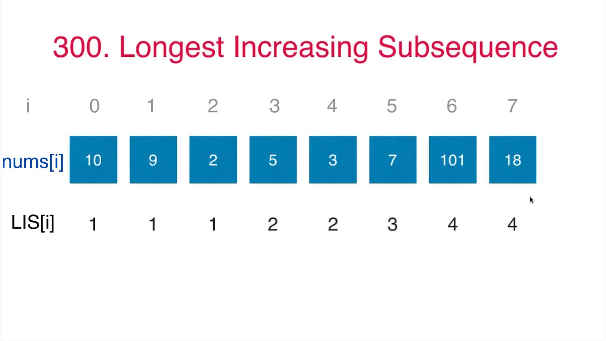
+ 初始化所有的LIS[i]=1，表示每个下标处的元素至少可以自己组成一个长度为1的上升序列
+ i=0, nums[0]=10，前面没有元素了，所以保留初始值LIS[0]=1
+ i=1, nums[1]=9，前面元素都比9大，所以保留初始值LIS[1]=1
+ i=2, nums[2]=2，前面元素都比2大，所以保留初始值LIS[2]=1
+ i=3, nums[3]=5, 遍历前面元素，只有nums[2]=2<nums[3]=5，所以LIS[3]=max{初始值1, LIS[2]+1}=LIS[2]+1=1+1=2
+ i=4, nums[4]=3, 遍历前面元素，只有nums[2]=2<nums[4]=3，所以LIS[4]=max{初始值1, LIS[2]+1}=LIS[2]+1=1+1=2
+ i=5, nums[5]=7, 遍历前面元素，nums[2]=2、nums[3]=5、nums[4]=3都要比nums[5]=7要小，所以LIS[5]=max{初始值1, LIS[2]+1, LIS[3]+1, LIS[4]+1}=LIS[4]+1=2+1=3
+ i=6, nums[6]=101, 遍历前面元素，nums[2]=2、nums[3]=5、nums[4]=3、nums[5]=7都要比`nums[6]=101`要小，所以LIS[6]=max{初始值1, LIS[2]+1, LIS[3]+1, LIS[4]+1, LIS[5]+1}=LIS[5]+1=3+1=4
+ i=7, nums[7]=18, 遍历前面元素，nums[2]=2、nums[3]=5、nums[4]=3、nums[5]=7都要比`nums[7]=18`要小，所以LIS[7]=max{初始值1, LIS[2]+1, LIS[3]+1, LIS[4]+1, LIS[5]+1}=LIS[5]+1=3+1=4
+ 总上可知最长子序列为4
#### 例子2：
+ 最长上升必须列的值不一定是递增地
+ 每个位置的最长上升子序列的值不一定是前面的加1

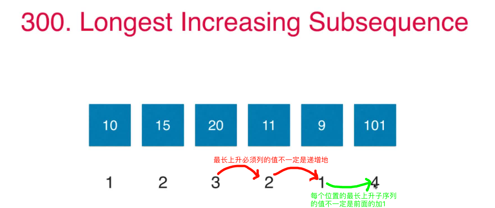
+ 初始化所有的LIS[i]=1，表示每个下标处的元素至少可以自己组成一个长度为1的上升序列
+ i=0, nums[0]=10，前面没有元素了，所以保留初始值LIS[0]=1
+ i=1, nums[1]=15, 遍历前面元素，只有nums[0]=10<nums[1]=15, 所以LIS[1]=max(初始值1, LIS[0]+1)=LIS[0]+1=2
+ i=2, nums[2]=10, 遍历前面元素，nums[0]=10、nums[1]=15都比nums[2]=20要小，所以LIS[2]=max{初始值1, LIS[0]+1, LIS[1]+1}=LIS[1]+1=2+1=3
+ i=3, nums[3]=11, 遍历前面元素，只有nums[0]=10<nums[3]=11, 所以LIS[3]=max(初始值1, LIS[0]+1)=LIS[0]+1=2
+ i=4, nums[4]=9，前面元素都比9大，所以保留初始值LIS[4]=1
+ i=5，nums[5]=101，遍历前面元素，nums[0]=10、nums[1]=15、nums[2]=10、nums[3]=11、nums[4]=9都比nums[5]=101要小，所以LIS[5]=max{初始值1, LIS[0]+1, LIS[1]+1, LIS[2]+1, LIS[3]+1, LIS[4]+1}=LIS[2]+1=3+1=4
+ 总上可知最长子序列为4

### 动态规划实现

[代码实现](src/main/java/Chapter09DynamicAllocate/Section8LongestIncreasingSubsequence/Solution.java)
```java
public class Solution {
    public int lengthOfLIS(int[] nums) {
        if (nums.length == 0) {
            return 0;
        }

        // memo[i]表示0~i区间内以nums[i]为结尾的的最长上升子序列的长度
        int[] memo = new int[nums.length];
        // 初始化
        Arrays.fill(memo, 1);
        // 第1个元素不用考虑了，其最长子序列一定是1，已经初始化好了
        for (int i = 1; i < nums.length; i++) {
            for (int j = 0; j < i; j++) {
                // 注意小于的才算上升，等于地不算
                if (nums[j] < nums[i]) {
                    // 如果i前面的值有大于i处的值的，更新子序列长度
                    // memo[i]表示当前i处的子序列长度，1+memo[i]表示考虑j的情况下最长子序列长度加1
                    // memo[i]在 `j in 0~i`的循环中可能已经被跟新多次了，不再是初始值1了
                    memo[i] = Math.max(memo[i], 1 + memo[j]);
                }
            }
        }
        int maxLIS = 1;
        // 从最长子序列数组中取最大地返回
        for (int i = 0; i < nums.length; i++) {
            maxLIS = Math.max(maxLIS, memo[i]);
        }
        return maxLIS;
    }

    public static void main(String[] args) {
        int[] nums = {10, 9, 2, 5, 3, 7, 101, 18};
        int maxLIS = new Solution().lengthOfLIS(nums);
        System.out.println(maxLIS);// 4
    }
}
```
### 类似题目:[376. 摆动序列 wiggle subsequence](https://leetcode-cn.com/problems/wiggle-subsequence/)
> 关键两点：一是去除重复元素；二是判断子序列是否为摆动序列。后面用贪心来解决其实会更简单
```java
class Solution {
    // leetcode第27题，删除连续的元素，只保留一个。
    // 主要是为了应付[0,0,0,0]这样的用例
    private int removeDuplicates(int[] nums) {
        int k = 0;
        for(int i = 1; i< nums.length; i++){
            if(nums[i] != nums[k]){ // 有序数组，所以直接和前面的比较就知道有没有排序了
                nums[++k] = nums[i];
            }
        }
        return k + 1; // k从0开始，所以数组长度最后要+1
    }
    // 高效判断符号是否相反
    private boolean oppositeSigns(int x, int y){
        // 位运算判断两个数是否符号相反
        return (x ^ y) < 0;
    }
    public int wiggleMaxLength(int[] nums) {
        int n = nums.length;
        if(n == 0){
            return n;
        }
        n = removeDuplicates(nums);
        // LS:longest wiggle sequence 最长子序列
        int[] LWS = new int[n];
        Arrays.fill(LWS, 2);
        // 只有一个元素时，摆动序列为1
        LWS[0] = 1;
        for(int i = 2; i < n; i++){
            for(int j = 1; j < i; j++){
                int diff1 = nums[i] - nums[j];
                int diff2 = nums[j] - nums[j - 1];
                // 两个差正负相反，才算一个摆动序列
                if(oppositeSigns(diff1, diff2)){
                    LWS[i] = Math.max(LWS[i], LWS[j] + 1);
                }
            }
        }
        int max = 0;
        for(int lws : LWS){
            if(lws > max){
                max = lws;
            }
        }
        return max;
    }
}
```

### [354. 俄罗斯套娃信封问题](https://leetcode-cn.com/problems/russian-doll-envelopes/submissions/)
```java
/***********************************************************
 * @Description : T354_信封嵌套问题
 * https://leetcode-cn.com/problems/russian-doll-envelopes/
 * 参考第300号问题(最长上升子序列)，先把一个维度排序后，堆第二个维度排序即可
 * @author      : 梁山广(Liang Shan Guang)
 * @date        : 2020/2/5 17:58
 * @email       : liangshanguang2@gmail.com
 ***********************************************************/
package C12_动态规划.T354_信封嵌套问题;

import java.util.Arrays;
import java.util.Comparator;

public class Solution {
    public int maxEnvelopes(int[][] envelopes) {
        int N = envelopes.length;
        if (N == 0) {
            return 0;
        }
        int[] LIS = new int[N];
        Arrays.fill(LIS, 1);
        // 按照长度进行排序，然后下面比较信封宽度即可！这步很关键！！
        Arrays.sort(envelopes, Comparator.comparingInt(o -> o[0]));
        for (int i = 0; i < N; i++) {
            for (int j = 0; j < i; j++) {
                // i前面的j信封长和宽都要比i信封的小，说明是上升序列的一部分，加入到i处的LIS
                if (envelopes[j][0] < envelopes[i][0] && envelopes[j][1] < envelopes[i][1]) {
                    // 不断用更大的LIS值来更新i处的LIS
                    LIS[i] = Math.max(LIS[i], LIS[j] + 1);
                }
            }
        }
        int max = 0;
        for (int lis : LIS) {
            if (lis > max) {
                max = lis;
            }
        }
        return max;
    }
}
```

## 9.9 LCS、最短路、求动态规划的具体解以及更多

### LCS 最共公共子字符串问题 [LeetCode 1143号问题]()


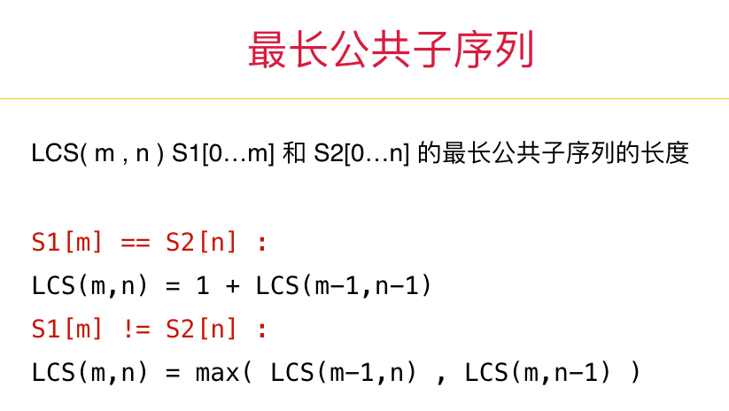

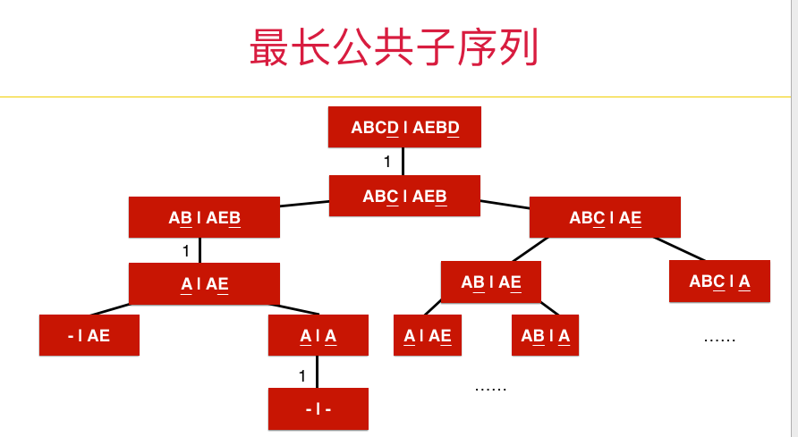

```java
class Solution {
    public int longestCommonSubsequence(String str1, String str2) {
        if (str1 == null || str2 == null) {
            return 0;
        }
        int m = str1.length();
        int n = str2.length();
        if (m == 0 || n == 0) {
            return 0;
        }
        // dp[i][j]代表chs1[0...i]和chs2[0...j]的最长公共子序列.注意此时的下标从1开始
        int[][] dp = new int[m + 1][n + 1];
        // 给非第1行和第1列的中间元素赋值
        for (int i = 1; i <= m; i++) {
            for (int j = 1; j <= n; j++) {
                if (str1.charAt(i - 1) == str2.charAt(j - 1)) {
                    // 字符相等地话直接等于前一个字符串的dp值加1
                    dp[i][j] = dp[i - 1][j - 1] + 1;
                } else {
                    // 比较相邻两种情况
                    dp[i][j] = Math.max(dp[i - 1][j], dp[i][j - 1]);
                }
            }
        }
        return dp[m][n];
    }
}
```

### dijkstra单源最短路径算法也是动态规划
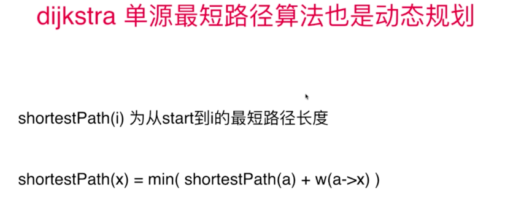

### 动态规划问题的具体解
> 用一个pre数组记录前后关系，然后逆序向前查找即可，图算法里面很常用
