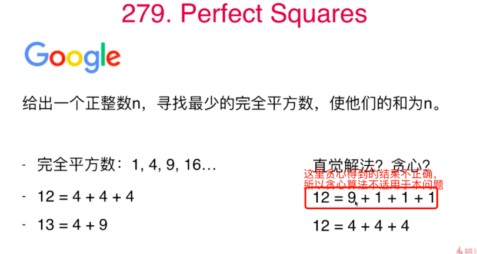
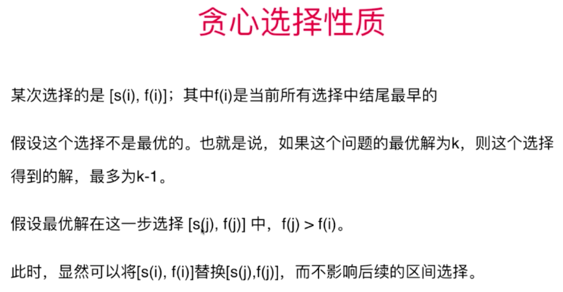

# 第10章 贪心算法

## 10.1 贪心选择例题 
### [455.饼干分配](https://leetcode-cn.com/problems/assign-cookies/)

假设你想给小朋友们饼干。每个小朋友最多能够给一块儿饼干。每个小朋友都有一个“贪心指数”，称为g(i)，g(i)表示的是这名小朋友需要的饼干大小的最小值。同时，每个饼干都有一个大小值s(i)。如果s(j) >= g(i)，我们将饼干j分给小朋友i后，小朋友就会很开心。给定数组s和g，问如何分配饼干，能更让最多的小朋友开心。
如 g = [1, 2, 3], s = [1, 1]，结果为1
如 g = [1, 2], s = [1, 2, 3]，结果为2

代码见[455. 分发饼干](src/main/java/Chapter10GreedyAlgorithms/Section01AssignCookies/LeetCode455分发饼干/Solution.java)

```java
class Solution {
    public int findContentChildren(int[] g, int[] s) {
        Arrays.sort(g);
        Arrays.sort(s);
        int gi = g.length - 1;
        int si = s.length - 1;
        int res = 0;
        while (gi >= 0 && si >= 0) {
            if (s[si] >= g[gi]) {
                si--;
                gi--;
                res++;
            } else {
                gi--;
            }
        }
        return res;
    }
}
```

### [392.判断子序列](https://leetcode-cn.com/problems/is-subsequence/)
```java
class Solution {
    public boolean isSubsequence(String s, String t) {
        int si = 0, ti = 0;
        while (si < s.length() && ti < t.length()) {
            if (s.charAt(si) == t.charAt(ti)) {
                si++;
                ti++;
            } else {
                ti++;
            }
        }
        return si == s.length();
    }
}
```
## 10.2  贪心算法与动态规划的关系
> 每次选择中，每个区间的结尾很重要，结尾越小，留给了后面越大的空间，后面越有可能容纳更多空间区间

依据上面的思想，设计出地贪心算法如下：
按照区间的结尾排序，每次选择结尾最早地、且和前一个区间不重叠的区间

### 动态规划实现
> [参考最长上升子序列问题的求解](第09章_动态规划.md#98-lis最长子序列问题-300最长上升子序列longest-increasing-subsequence)

```shell script
LIS(i) = max( 1 + LIS(j) if nums[i] > nums[j] )
         j<i
```

上面表达式的含义：从i处往前遍历，遍历到的位置下标为j(j<i)，如果nums[j]小于nums[i]，且LIS[j]的值不小于LIS[i],则把LIS[i]的值更新为LIS[j]+1，否则保持LIS[i]的值不变，核心伪代码如下：
```java
// 第1个元素不用考虑了，其最长子序列一定是1，已经初始化好了
for (int i = 1; i < nums.length; i++) {
    for (int j = 0; j < i; j++) {
        if (nums[j] < nums[i]) {
            // 如果i前面的值有大于i处的值的，更新子序列长度
            // memo[i]表示当前i处的子序列长度，1+memo[i]表示考虑j的情况下最长子序列长度加1
            // memo[i]在 `j in 0~i`的循环中可能已经被跟新多次了，不再是初始值1了
            memo[i] = Math.max(memo[i], 1 + memo[j]);
        }
    }
}
```

完整实现如下：

```java
class Solution {
    public int eraseOverlapIntervals(int[][] intervals) {
        // 先转换成List，注意每个interval都是个只有俩元素的数组
        List<int[]> intervalList = new ArrayList<>(Arrays.asList(intervals));
        // 自定义比较器，先比较开头，谁大谁靠后，开头相等地话就看结尾，谁大谁靠后
        intervalList.sort((interval1, interval2) -> {
            if (interval1[0] != interval2[0]) {
                return interval1[0] - interval2[0];
            }
            return interval1[1] - interval2[1];
        });
        // 借鉴最长公共子序列的思想.
        // memo[i]表示用使用intervals[0...i]的区间能构成的最长不重叠区间序列
        int[] memo = new int[intervalList.size()];
        Arrays.fill(memo, 1);
        for (int i = 1; i < intervals.length; i++) {
            for (int j = 0; j < i; j++) {
                // 从i向前遍历，如果i前面找到一个区间的尾部比i所在的区间头部还小，说明找到了一个不重叠区间
                if (intervalList.get(i)[0] >= intervalList.get(j)[1]) {
                    memo[i] = Math.max(memo[i], 1 + memo[j]);
                }
            }
        }
        // 取出最大的不重叠子区间个数
        int res = 0;
        for (int num : memo) {
            if (num > res) {
                res = num;
            }
        }
        // 题目要地是删除多少个区间可以得到最大的不重叠的子区间，所以要用区间总个数减去最多的不重叠子区间个数
        return intervalList.size() - res;
    }
}
```

### 贪心算法实现
> 每次选择结尾最早地、且和前一个区间不重叠的区间

```java
class 贪心算法实现 {
    public int eraseOverlapIntervals(int[][] intervals) {
        if(intervals.length == 0){
            return 0;
        }
        // 先转换成List，注意每个interval都是个只有俩元素的数组
        List<int[]> intervalList = new ArrayList<>(Arrays.asList(intervals));
        // 自定义比较器，先比较结尾，谁大谁靠后，结尾相等地话就看开头，谁大谁靠后
        intervalList.sort((interval1, interval2) -> {
            if (interval1[1] != interval2[1]) {
                return interval1[1] - interval2[1];
            }
            return interval1[0] - interval2[0];
        });
        // 贪心算法思路：不断选取结尾最早且区间和前面不重合的区间
        // 第一个区间先选上
        int res=1;
        // i前面的区间在intervalList中的下标
        int pre = 0;
        for (int i = 1; i < intervalList.size(); i++) {
            // 前面区间的结尾比后面区间的开头还小，说明找到了一个不重叠区间
            if (intervalList.get(pre)[1] <= intervalList.get(i)[0]){
                res++;
                pre = i;
            }
        }
        return intervalList.size() - res;
    }
}
```

## 10.3 贪心选择的适用性验证与性质
### 验证问题是否能用贪心算法：反证法
> 贪心算法的每个步骤不能影响后面的步骤，看问题是否适用于贪心算法可以尝试能否举出返利说明贪心算法中间步骤的错误性。下面就是举反例证明当前问题贪心算法是否适用的例子


### 如果不好举范例，如何验证问题能否用贪心算法？
> 使用归纳法：假设贪心算法不正确，不断向后推导，如果能推导出和已知矛盾的结论，就说明贪心算法是适用地

### 贪心算法的性质
给定一组区间，问最多保留多少个区间，可以让这些区间之间互相不重叠。

贪心算法：按照区间的结尾排序，每次选择结尾最早的，且和前一个区间不重叠的区间
某次选择的是 [s(i), f(i)]；其中f(i)是当前所有选择中结尾最早的

假设这个选择不是最优的。也就是说，如果这个问题的最优解为k，则这个选择得到的解，最多为k-1。 
假设最优解在这一步选择 [s(j), f(j)] 中，f(j) > f(i)。
此时，显然可以将[s(i), f(i)]替换[s(j),f(j)]，而不影响后续的区间选择。



### 贪心算法的性质证明

