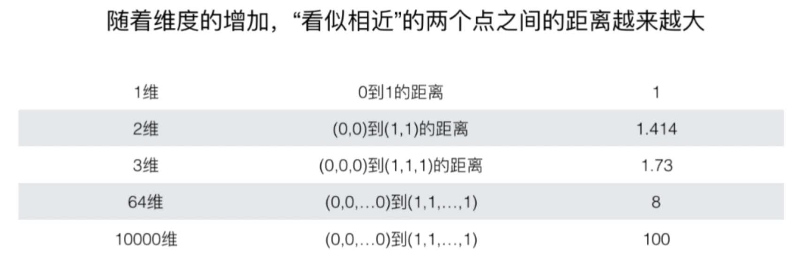
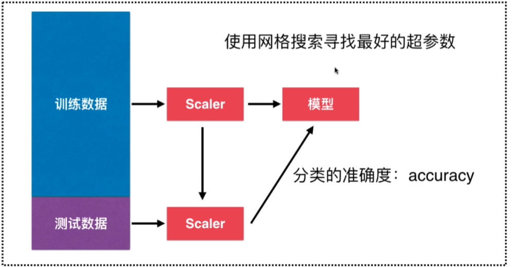

# 更多关于K紧邻算法的思考

## sklearn官方关于KNN算法文档 

> http://scikit-learn.org/stable/modules/generated/sklearn.neighbors.KNeighborsRegressor.html

## 应用场景和优点

+ 解决分类问题
+ 天然可以解决多分类问题
+ 思想简单，效果强大
+ 使用k紧邻算法还可以解决回归问题

## k紧邻算法的缺点

+ 1.最大的缺点：效率低下。
  > 比如如果训练集有m个样本，n个特征(即m行n列)，则预测一个新的数据，需要`O(m*n)`的事件复杂度，显然太高了，可以使用树结构比如KD-Tree和Ball-Tree来进行优化，但是帮助有限
+ 2.高度数据相关，对outlier(极端点或逸出点)比较敏感
+ 3.预测结果不具有可解释性
+ 4.维数灾难：随着维数的增加，看似相近的两个点之间的距离越来越大，导致k近邻算法处理高维度的数据时就会计算量大或不准确.为了解决维数灾难可以进行降维，本课程后面会讲到的PCA就是降维的主要方法
  > 
 
## 机器学习的流程总结

## 下一章展望

> 本章我们讲解地是**分类**问题处理地最简单那的方法--k近邻，下一章讲地将是解决**回归**问题的最简单的算法--线性回归法