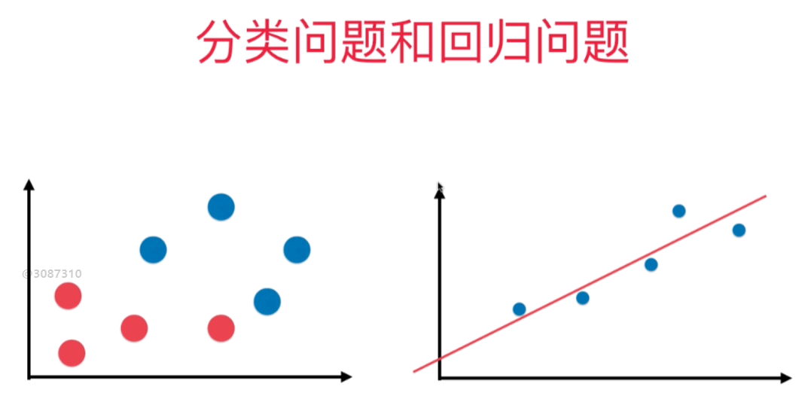
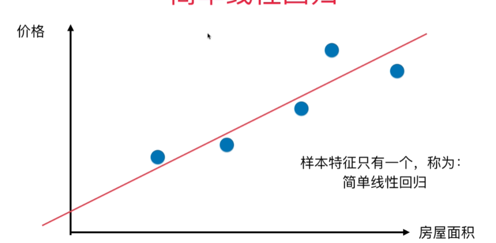
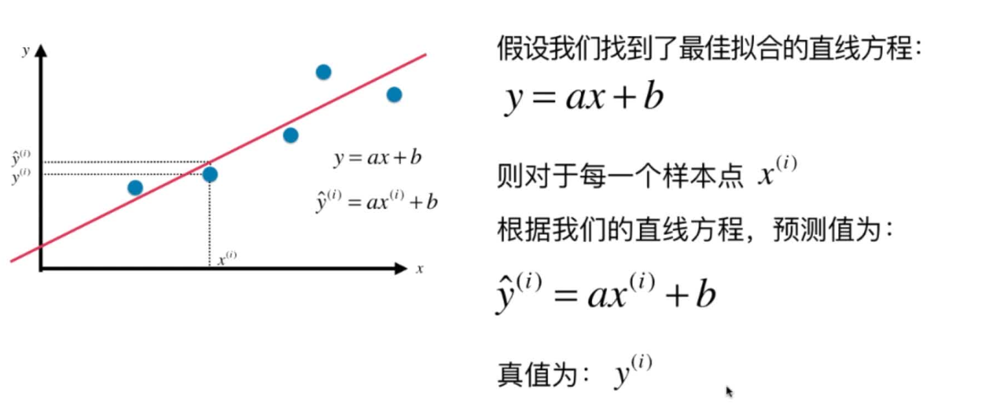
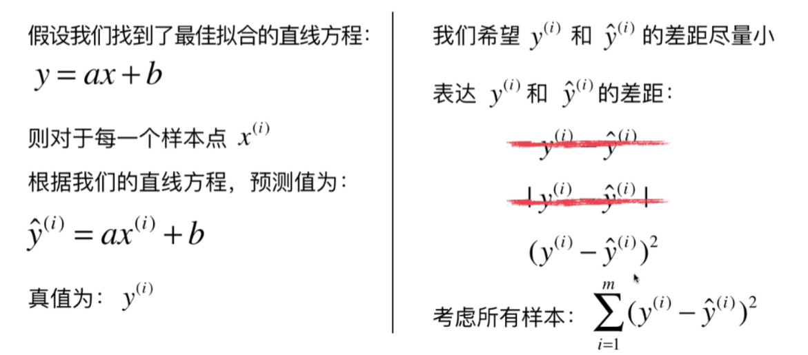
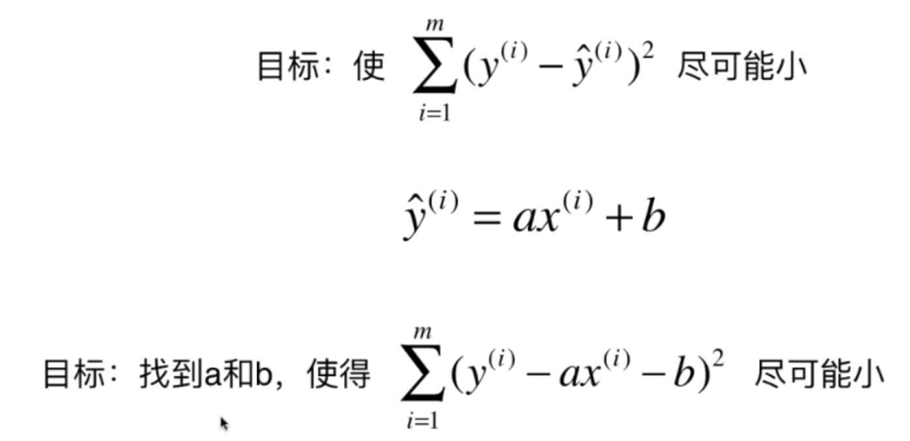
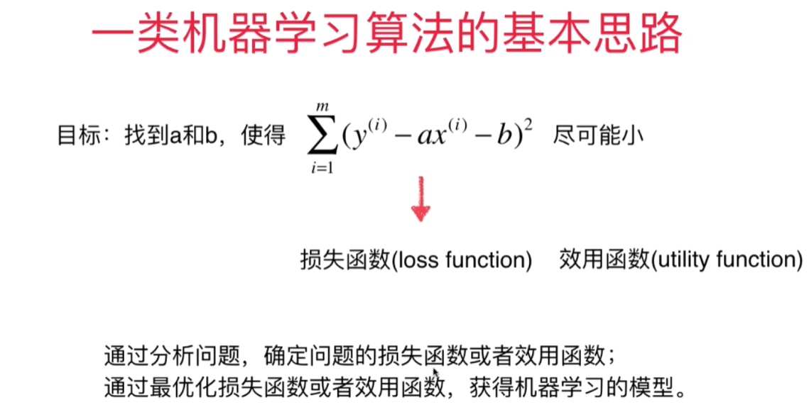
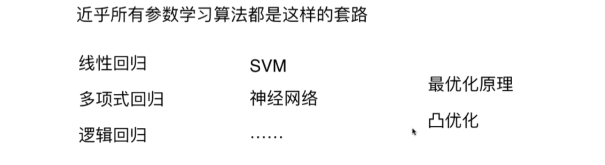
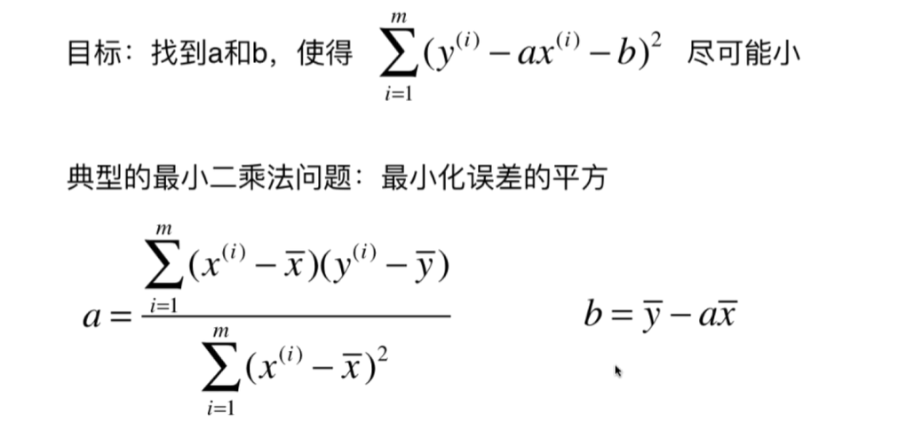

# 5-1 简单线性回归算法介绍

## 线性回归算法的特点

+ 解决回归问题
+ 思想简单，实现容易
+ 许多强大的非线性模型的基础
+ 结果具有很好的可解释性
+ 蕴含机器学习中的很多重要思想

## 分类问题和回归问题的比较

> k近邻算法适用于分类问题，结果是离散地；线性回归方法适用于回归类问题，结果是连续地

## 简单线性回归定义

> 样本特征只有一个(即只有一列)，称为简单线性回归

## 简单线性回归的表达式

## y不使用绝对值而使用平方的原因

> 不使用绝对值是因为加入绝对值后函数在某个点附近不可导

## 简单线性回归的目标

## 通过上面的论述得到机器学习算法的基本思路

## 简单线性回归最终的公式推导

