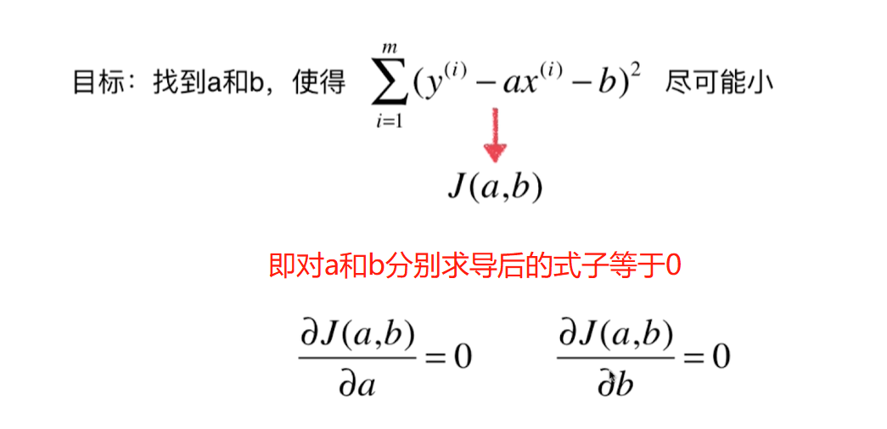
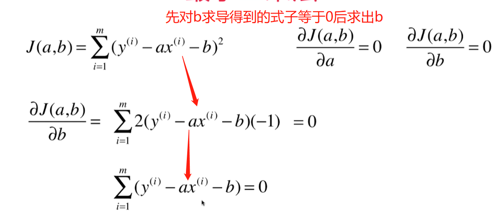
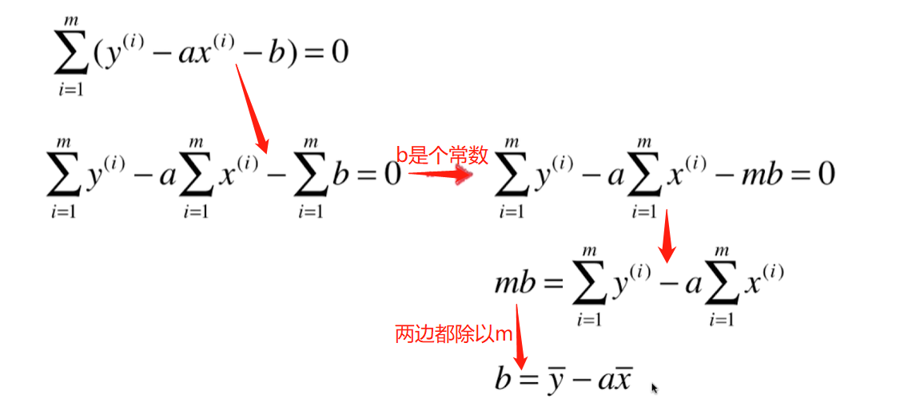
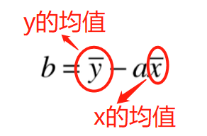
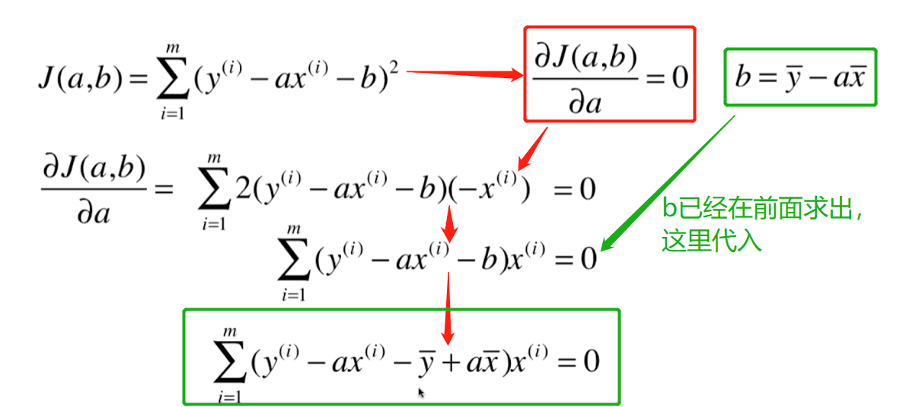
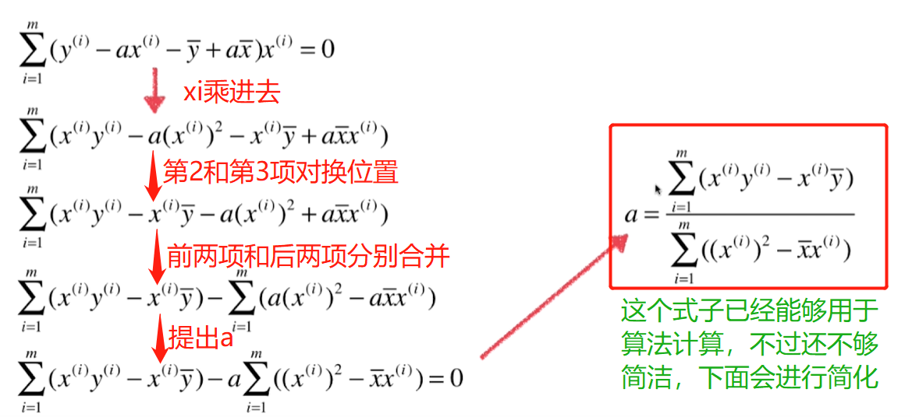
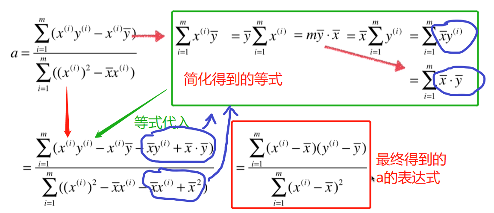
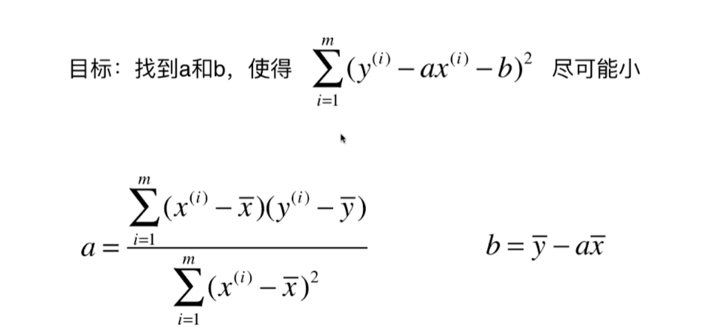

# 最小二乘法求一阶目标函数的最小值

## 最小二乘法的目标

> 实际就是求下面表达式的最小值

## 最小二乘法的推导过程

> 求最小值即求多项式极值，高等数学导数部分有定理：即对每个变量(这里是a和b)求导，使得求导后的式子等于0即可

具体推导过程如下：

### 先对b进行求导

最终求得b的值为：  

### 然后对a进行求导

这里已经得到a，但是还可以进行进一步的简化

## 最终得到的a和b的值如下

