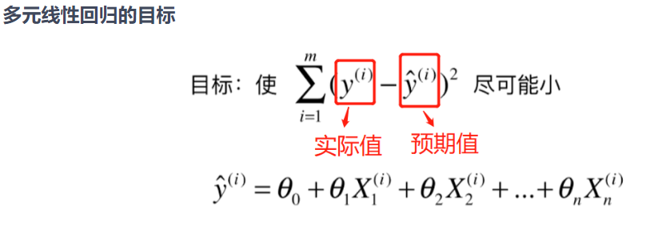
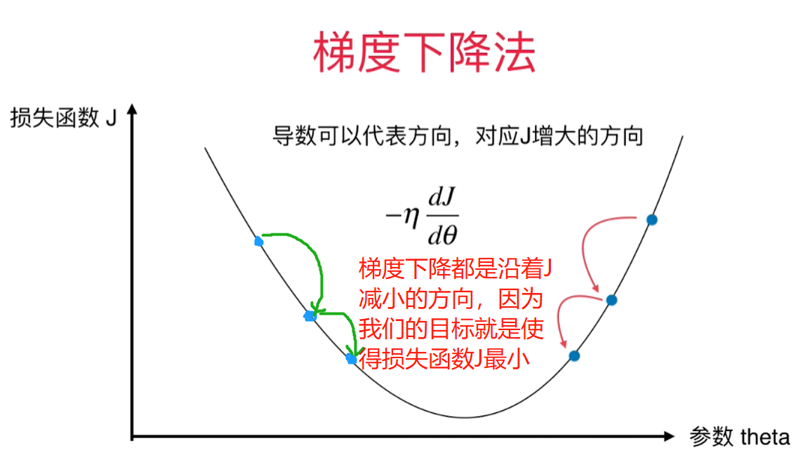
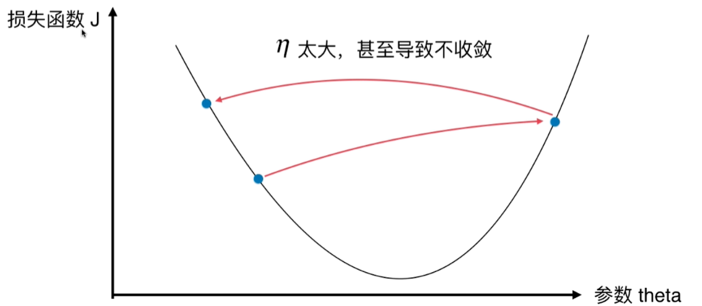
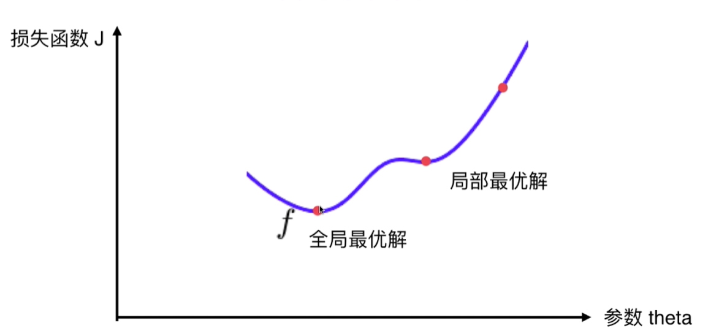

# 什么是梯度下降法

> 可以参考文章 https://www.jianshu.com/p/c7e642877b0e

## 简介

+ 不是一个机器学习算法
+ 是一种基于搜索的最优化方法
+ 作用：最小化一个损失函数
+ 梯度上升法：最大化一个效用函数

## 梯度下降法的理解

> 损失函数J和系数theta的解释见[第5章第7节多元线性回归和正规方程解](https://gitee.com/lsgwr/algorithms/blob/master/Part5Improve/05-Linear-Regression/07-Multi-Linear-Regression/多元线性回归和正规方程解.md#多元线性回归的目标)

+ 参数theta(即θ)代表方程的系数矩阵(一个特征一个θi，多个特征组成一维矩阵`[θ0, θ1, θ2......θn]`
+ 损失函数J代表实际值y与预测值y_hat的平方差,比如多元线性回归中的损失函数如下:
  > 
+ 在曲线方程中，导数代表切线斜率
+ 导数可以代表方向，正方向对应J增大的方向(η)；那么使得损失函数J变小从而取得最小值得方向应该是负方向(-η)
+ 参数theta代表单位变化时，J相应的变化
+ η读作伊塔,η方向表示J增大的方向，-η的大小表示在J-theta曲线上下降步伐的快慢(可以理解为走路的步子大小)
  + η称为学习率(learning rate)
  + η的取值影响获得最优解的速度
  + η取值不合适，甚至得不到最优解
  + η是梯度下降法的一个超参数

### 关于η的理解

### 为什么η值太大或太小会影响获取最优解的速速？

+ η太小，会使得收敛学习速度太慢
  > 
+ η太大，甚至导致不收敛
  > 
  
## 并不是所有函数都有唯一的极值点

> 面对非线性的复杂方程，函数曲线可能是有多个极值点地

这种情况的解决方案是：
+ 多次运行，随机化初始点
+ 梯度下降法的初始点也是一个超参数

注意：`线性回归法的损失函数具有唯一的最优解`，因为线性回归方程的曲线的导数都是递增或递减的，大小变化时单一的