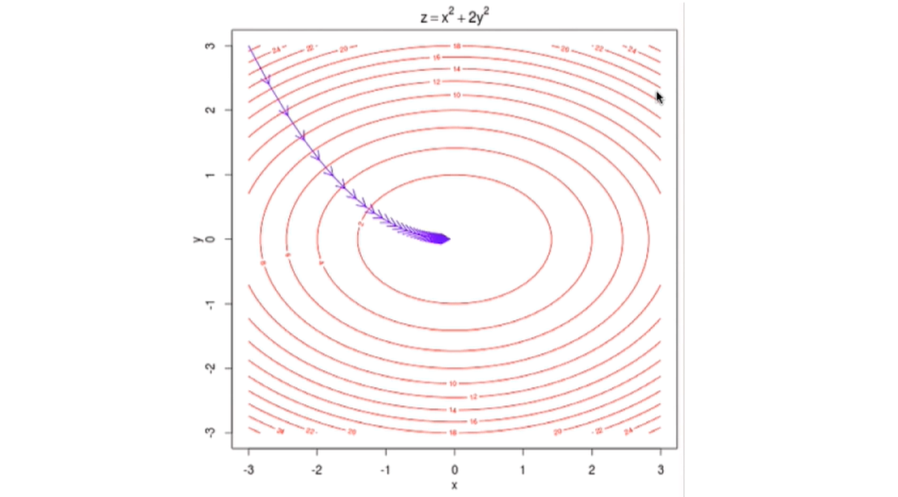
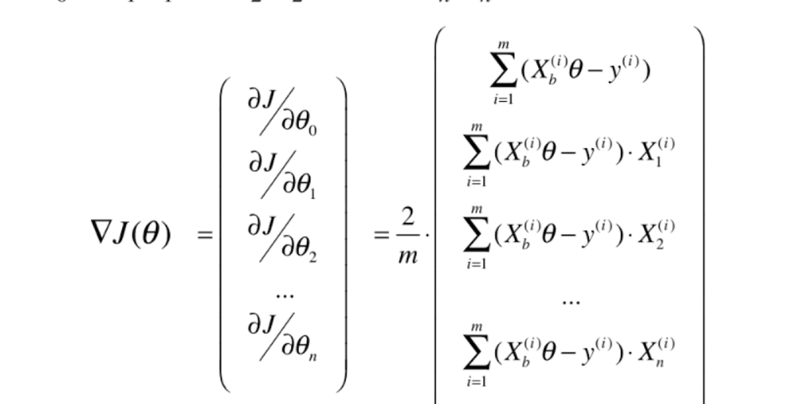
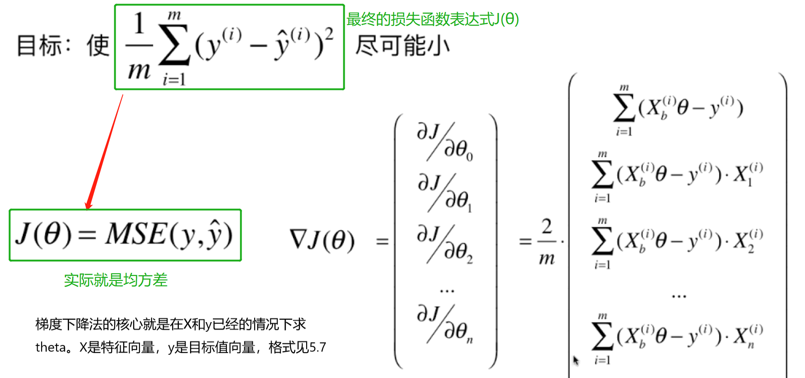

# 多元线性回归中的梯度下降法

## 线性回归中的J与θ

## 多元线性回归的J与η

> 这里的η变成了一个偏导数组成的向量，这样就把梯度下降法扩展到了多维空间

> 下面是两维空间的梯度下降法

## 多元线性回归中使用梯度下降法

### 多元线性回归中的损失函数J表达式

### 对损失函数J求偏导数

### 上面的`▽J(θ)`显然和样本数量m有关，这是不合理地，所以我们取`▽J(θ)=▽J(θ)/m`

### 所以最终相当于在原始的J上面乘以了`1/m`

### 最终的损失函数如下

