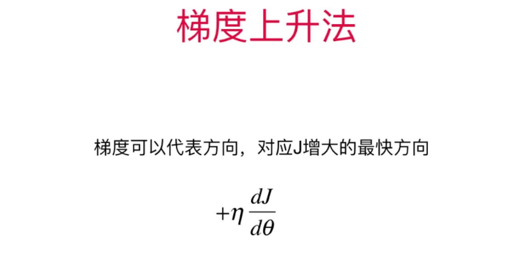

# 梯度下降法的总结和扩展

## 梯度下降法的总结

+ 批量梯度下降法 Batch Gradient Descent
  > 针对所有样本(即所有行)执行梯度下降法，一定能得到结果，就是耗时相对较长
+ 随机梯度下降法
  > 每次随机选取一个样本(一行)，多次迭代，基本也能得到结果，耗时短很多，但是会有概率得不到结果
+ 小批量梯度下降法
  > 每次随机选取固定数目(指定行数)，多次迭代，综合了批量和随机两种方法的优点，小批量的数目是一个新的超参数
  
## 随机梯度下降法的思考

+ 跳出局部最优解
+ 更快的运行速度
+ 机器学习领域很多算法都要用到随机的特点，比如：随机搜索、随机森林等

## 梯度下降法的思考

+ 不是一个机器学习算法
+ 是一种基于搜索的最优化方法
+ 作用：最小化一个损失函数
+ 梯度上升法：最大化一个效用函数。为下一章主成分分析(PCA)做铺垫

