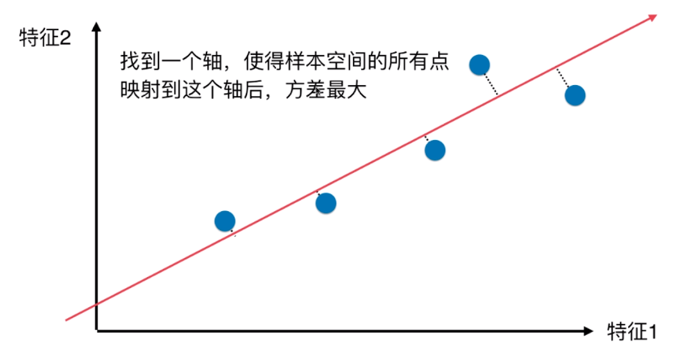
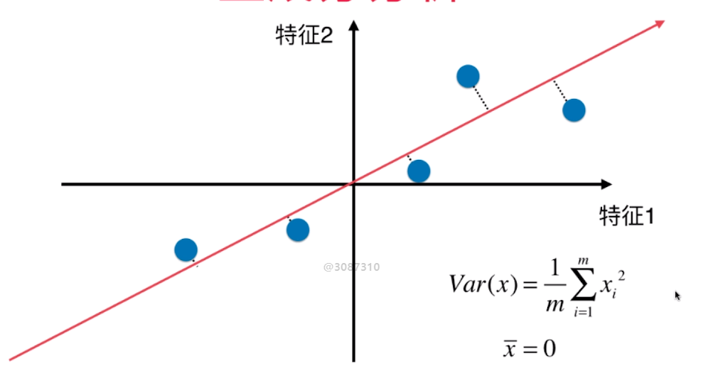
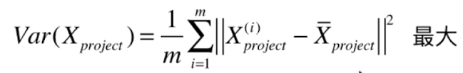
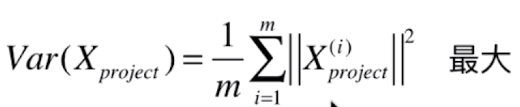
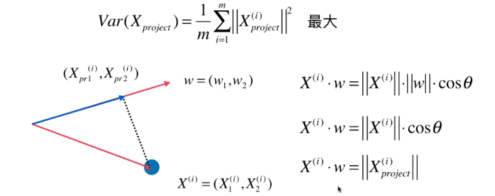
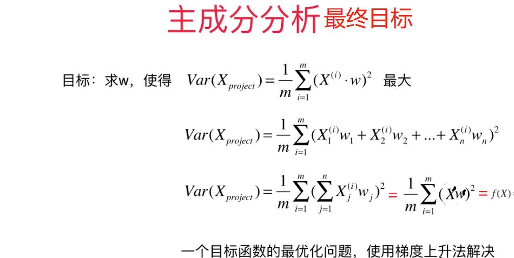
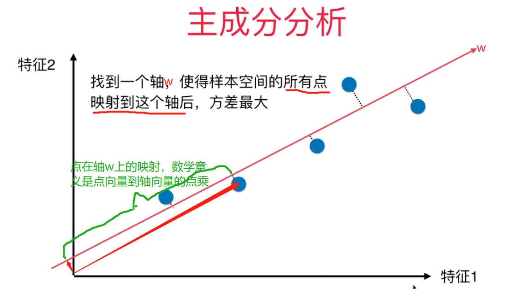
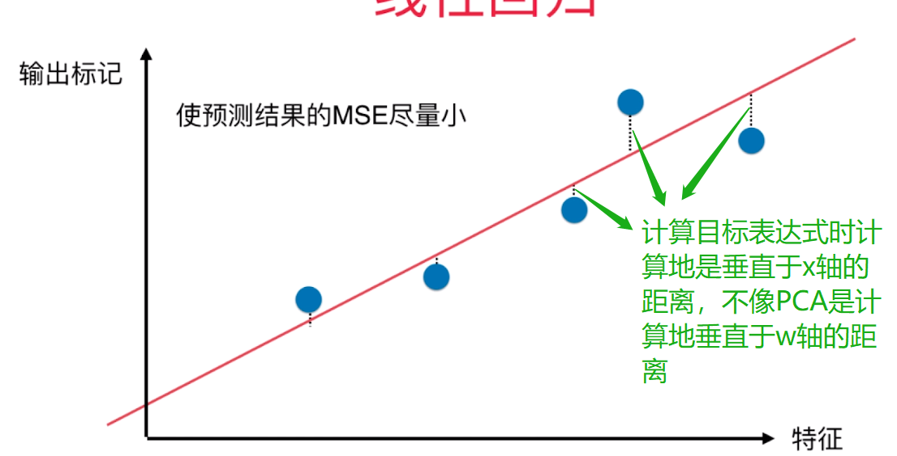

# 什么是PCA

> 主成分分析(Principal Component Analysis),主要用于数据降维

## PCA简介

+ 一个非监督的机器学习算法
+ 主要用于数据的降维
+ 通过降维，可以发现更便于人类理解的特征
+ 其他应用：可视化；去燥

## PCA的原理

+ PCA的目标：让降维后的分布最分散，更大的区分度，尽量保持原来数据之间的距离，即让`样本间间距`最大
+ 样本间间距:可以用方差表示，方差越大越分散,越接近我们降维之前的数据。样本间间距的数学意义其实是每个点Xi在拟合地方向向量w上的向量积

## PCA的计算步骤
> PCA--将N维空间的点映射到（N-1）维，在降维的过程中，特征点之间的距离会变小，为了最大程度的保留原始信息，所选取的（N-1）维空间应该最大程度的保留所有特征点的差异性，即使得降维后的方差达到最大。

+ 对所有样本作demean处理(即每一个样本都减去所有样本的均值，这样处理后所有的样本均值就是0了)
  > 
+ 求一个轴的方向`w=(w1, w2)`，使得我们所有的样本映射到w以后，有,因为我们做了demean处理(第二项为0)所以最终的目标是

## 目标表达式的化简

## 最终的主成分分析的表达式

## 主成分分析和线性回归的对比

### 1.主成分分析
> 横纵坐标轴代表地是两个特征，目标是使方差最小

### 2.线性回归
> 横轴是特征，纵轴是输出标记，目标是使预测结果的MSE(和实际值得均方差)最小，红线是我们拟合地使得目标表达式最小的直线
