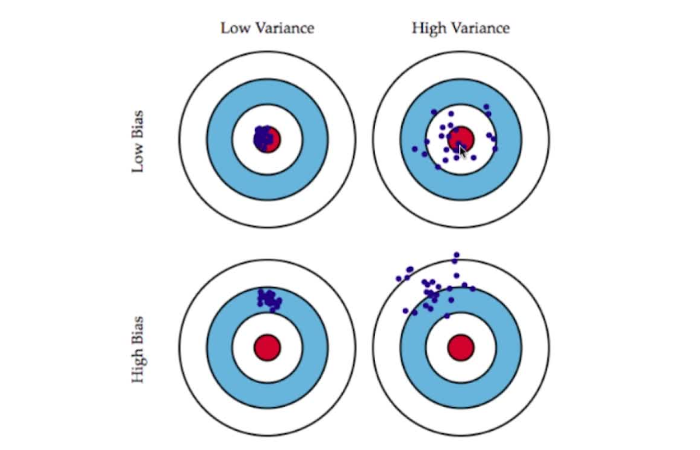

# 偏差和方差

## 偏差表示离中心的程度，方差表示所有点的分散情况
> 我们要追求的最佳模型可以认为就是下图的中心

+ 离中心越远，偏差越大
+ 点分布越分散，方差越大

## 模型误差的来源
偏差(Bias)+方差(Variance)+不可避免的误差

## 导致偏差(Bias)的主要原因

+ 对问题本身的假设不正确
  > 如：非线性数据使用线性回归
+ 要追求的目标和我们选取的特征不配套
+ 欠拟合underfitting

## 导致方差(Variance)的主要原因

+ 数据的一点点扰动都会较大地影响模型
+ 通常原因：使用地模型太复杂，如高阶多项式回归
+ 过拟合overfitting

## 不同机器学习算法的偏差与方差

+ 有一些算法天生是高方差的算法，如kNN
+ 非参数学习通常都是高方差算法，因为不对数据进行任何假设
+ 有些算法天生是高偏差算法啊，如线性回归
+ 参数学习通常都是高偏差算法，因为堆数据具有极强的假设
+ 大多数算法具有相应的参数，可以调整偏差和方差，如kNN中的k,如线性回归中使用多项式回归

## 偏差与方差的关系

+ 偏差与方差通常是矛盾的
+ 降低偏差，会提高方差
+ 降低方差，会提高偏差

## 机器学习的主要挑战来自方差，即点的离散程度

> 而不是偏差，即离中心的距离

## 解决高方差的通常手段

+ 1.降低模型复杂度
+ 2.减少数据维度(PCA),有时等同于降噪
+ 3.增加样本数
+ 4.使用验证集
+ 5.模型正则化，后面三节会终点讲解

