# 9-3 逻辑回归损失函数的梯度

## 我们的求导目标
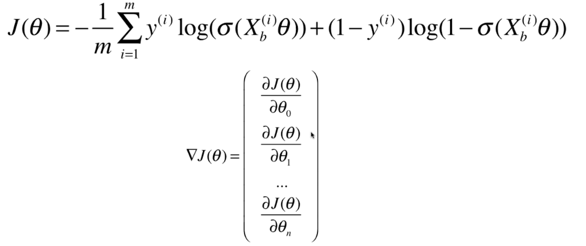

## 先对sigmoid函数求导
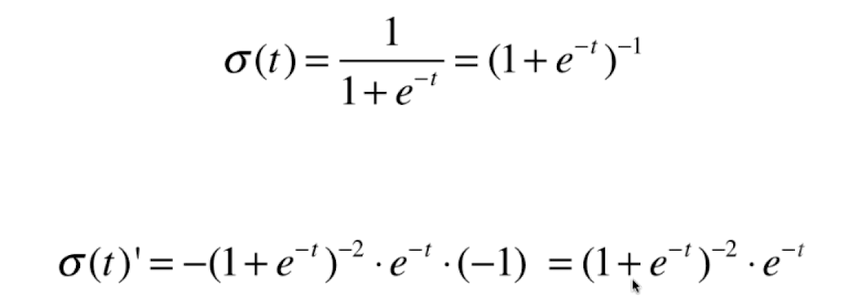

## J(θ)前半部分的导数
### 把sigmoid导数代入损失函数J(θ),然后对log内的表达式求导
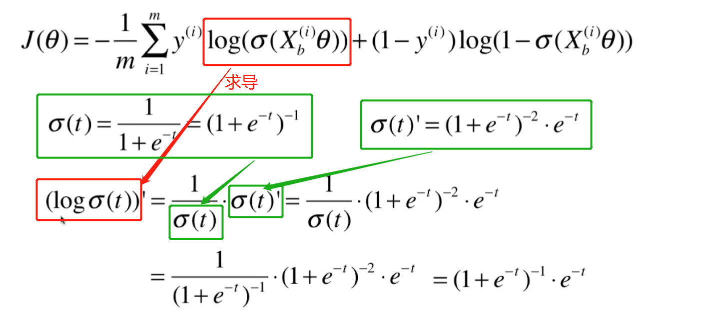

### 进一步化简
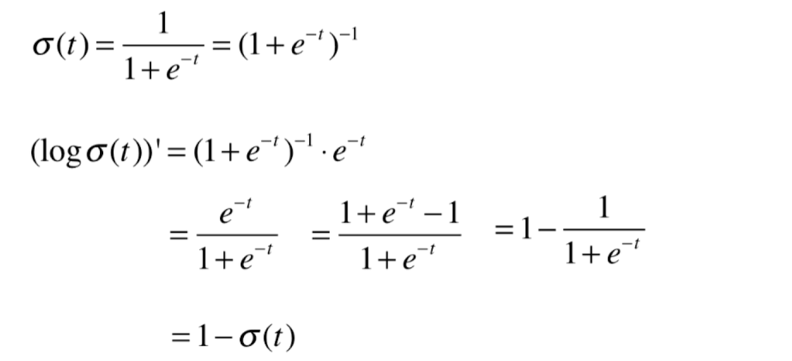

### 把上一步的求导结果代入J(θ)的求导表达式
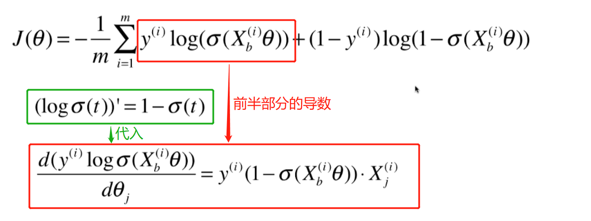

## J(θ)后半部分的导数
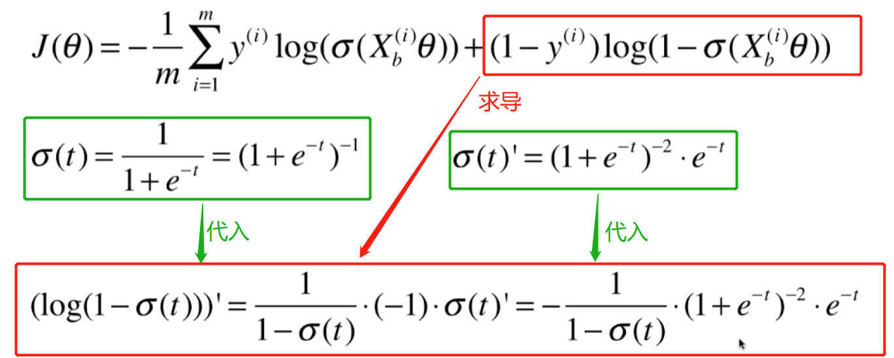

### 将下面的式子代入上一步的结果
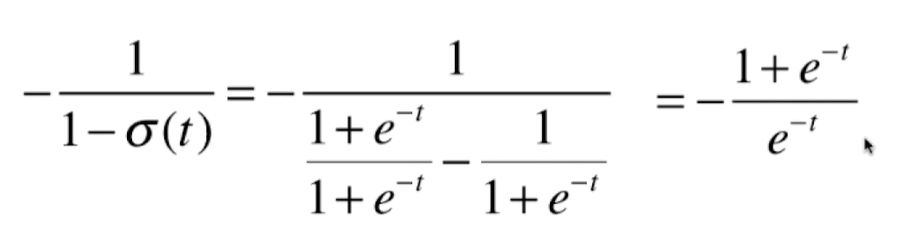

### 得到右半边非常数项的最终求导结果
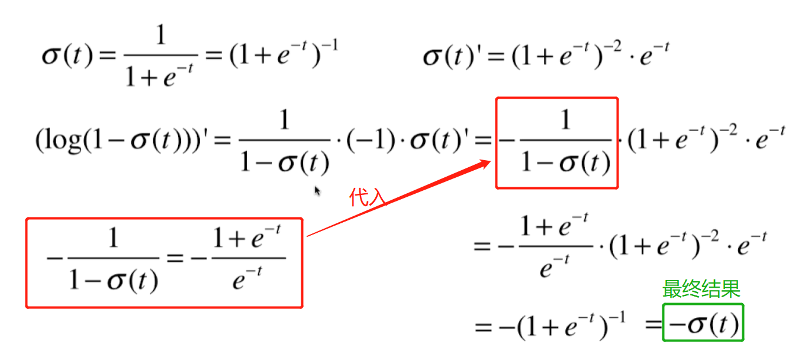

### 得到右半边的最终求导结果
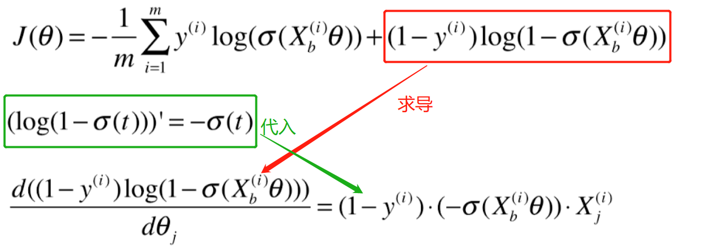

## 前后两部分的导数相加得到最终的化简结果
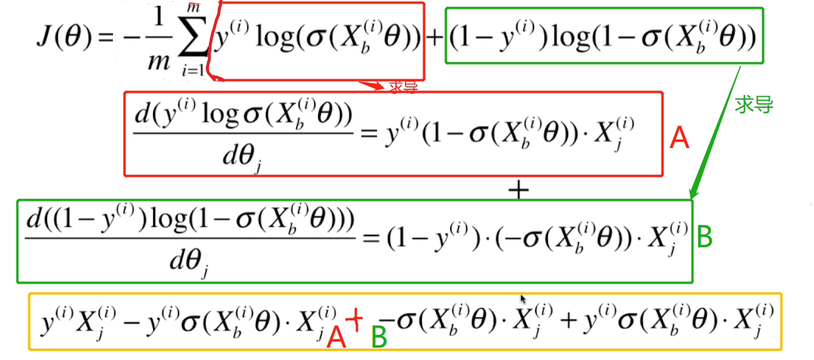

## 最终的J_Theta对θj求导的化简结果
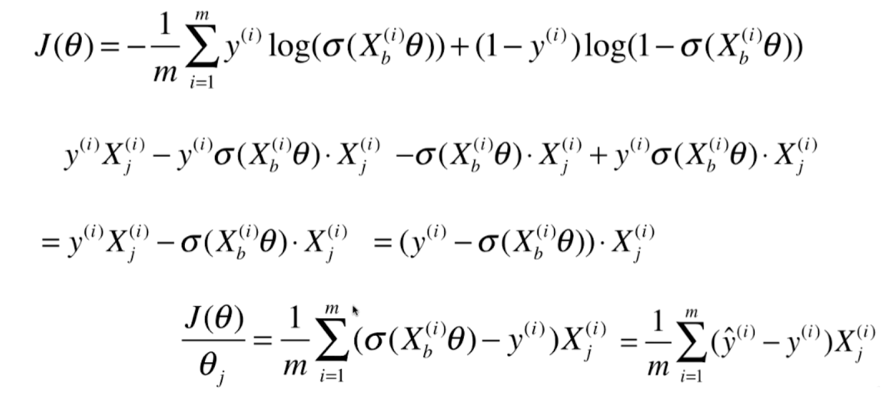

## 对每个θj(j取0~n)都求导,进行化简得到`ΔJ(θ)`
求导.png)
联想到线性回归`ΔJ(θ)`
.png)
2.png)

得到最终的`ΔJ(θ)`
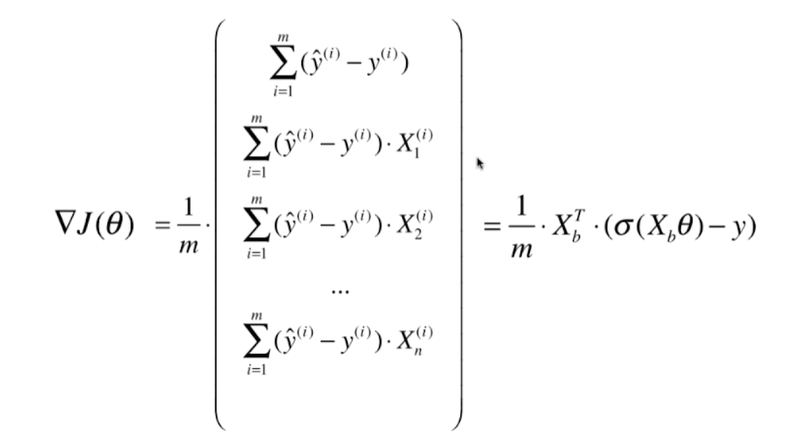