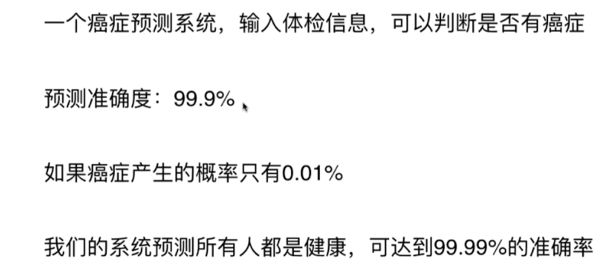
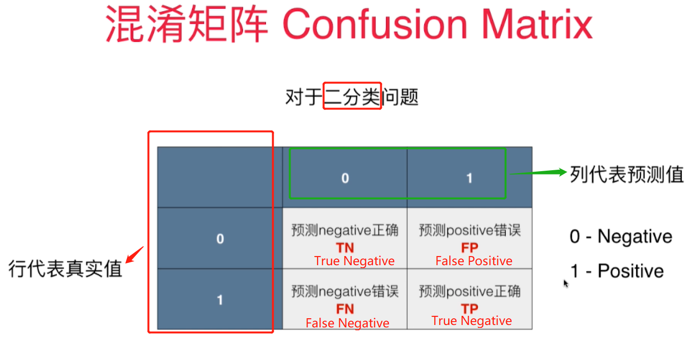
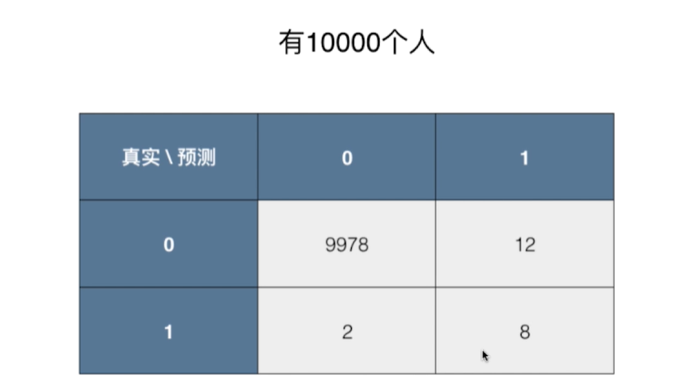

# 准确度的陷阱和混淆矩阵

## 分类准确度的问题
> 分类准确度在评价`极度偏斜(Skewed Data)`的数据的时候是有很大问题，比如下面癌症的例子

## 混淆矩阵Confusion Matrix
> 为了避免极端倾斜数据集的问题，引入了`混淆矩阵Confusion Matrix`

### 混淆矩阵在二分类中含义

### 通过对真实值和预测值的情况施加不同的权重来避免极度偏斜数据集的问题
> 还是以前面的癌症预测为例，0代表没患癌症，1代表患癌症

