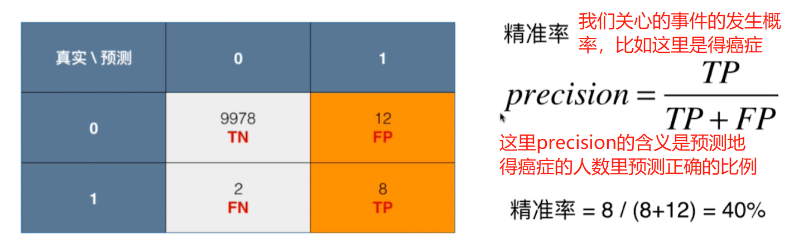
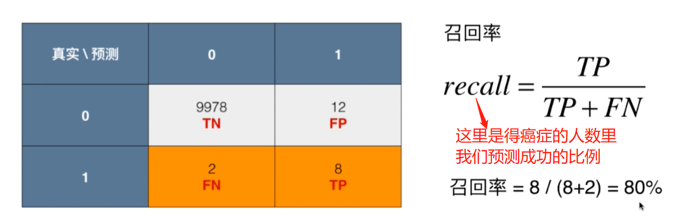
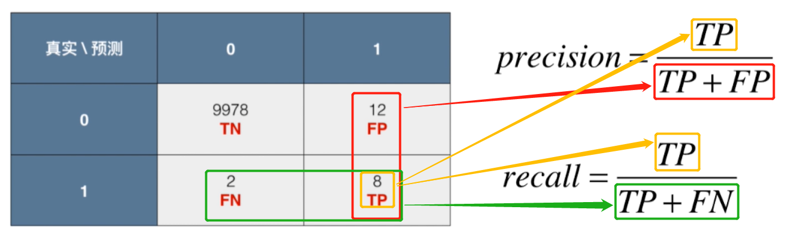
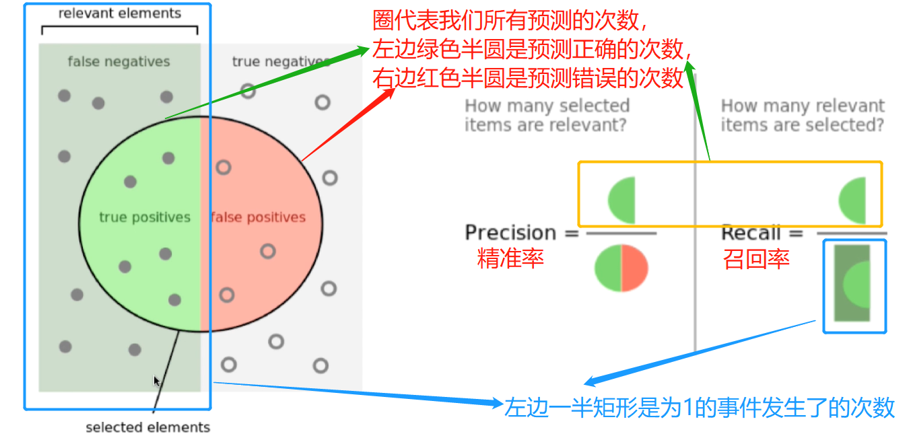
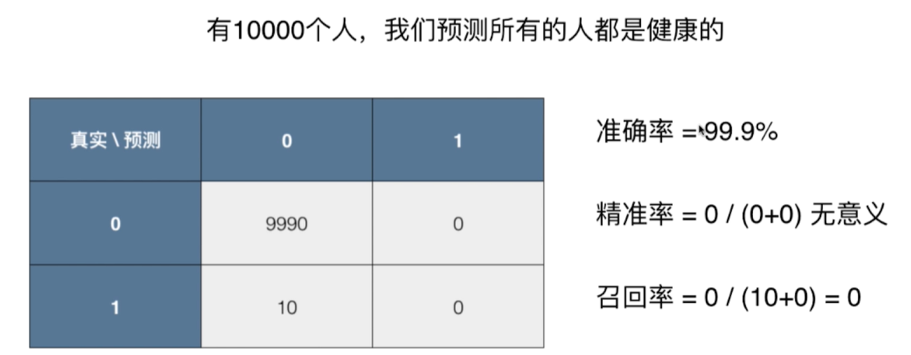

# 精准率和召回率

## 精准率
> 我们预测了`事件会发生`(预测事件状态为1时)，但是预测地数目里真正发生的比例

## 召回率
> 我们关心的`事件发生了`(事件真实状态为1)，发生地这些事件数目里我们预测成功的比例

## 精准率和召回率的总结
> 关键在于分母不同，分子都是预测且真实发生的事件的个数

### 以癌症预测为例

### 网上的例子

### 精准率和召回率在癌症预测中的应用
> 可以看到精准率没意义(可以认为是0)，召回率也是0，即我们一个也没预测对，这个模型是没啥用地

