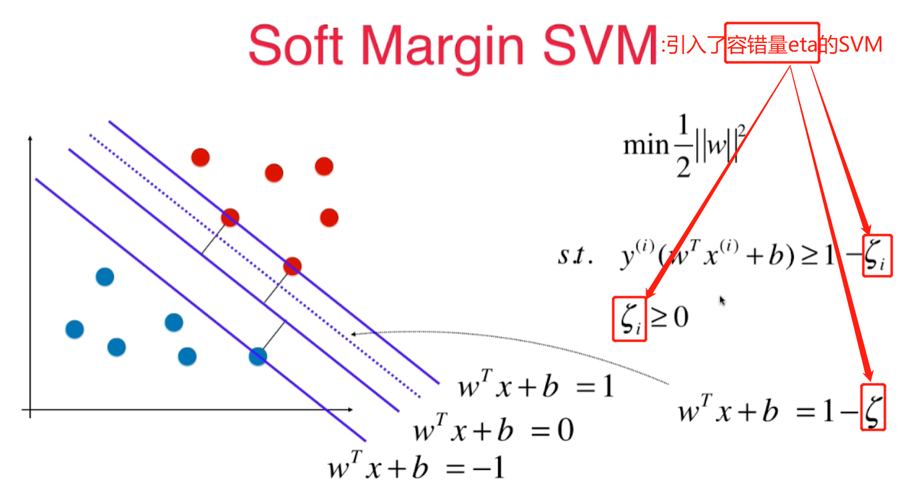
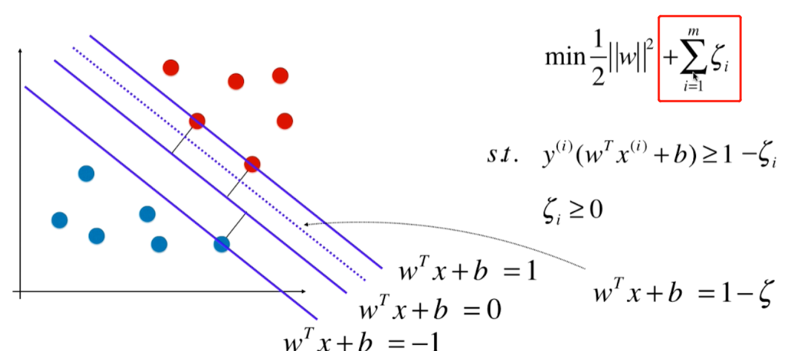
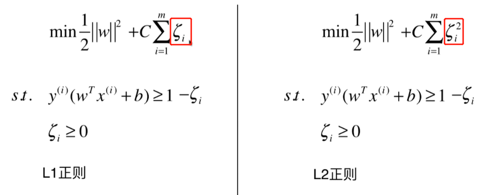

# 11.3 Soft Margin的SVM和SVM的正则化
> 拥有一定容错能力的SVM就叫`Soft Margin SVM`,能够允许少量异常的点，对比之下`Hard Margin SVM`就没有容错能力，所以基本不可用，故一般的SVM都是指Soft Margin SVM

## 引入容错量eta的svm叫Soft Margin SVM

目标表达式引入容错分量

最终的Soft Margin SVM的目标表达式如下(L1正则和L2正则)：
